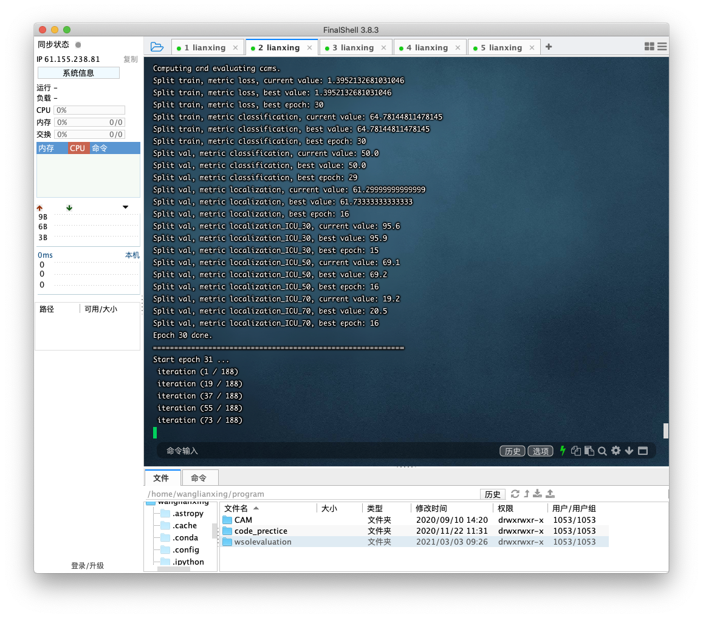

#2020.3.20

今日没做计划

##上午

早上起来的不算早，八点起床以后因为比较懒所以啥也没吃，然后就开始做了一道算法题，题目比较简单，之后就开始搜一些关于深度学习相关的文献，感觉现在做的弱监督目标定位的方向有点坑，今年CVPR一篇相关文章都木得，自从去年那篇evaluation的文章出来后这个领域就沉寂了淦！

还找到了之前看到过一个很好的一步步带你解释深度学习一些方法和网络实现源码的网站：
https://nn.labml.ai

网站属实不错，收藏夹吃灰吧您

##下午

下午去学院楼开了民主评议会，会上进行了批评与自我批评，同组的人给俺的评价时去年一年比较水，没干啥实验相关工作，今年应该充分利用好空闲时间，的确是去年对写code有一点抵触心理，很多code连看都不想看，今年开始倒是能够看懂大部分源码，但是改的时候还是有点费劲，慢慢习惯吧，多看，多练，多想，冲就完事了。

## 晚上

哦对了，还从昊星那里知道可以通过终端多个程序一起运行，充分利用GPU资源，淦以前一次运行一个程序就等一天，现在好了做实验的话一下子跑好几个，晚上就试了一下

一下子跑5个程序，真香，就是为啥我改了之后模型反而表现下降了很多，这可不行啊

以后要在研究工作上多花点时间了，至少每天3个小时了现在看来，有一说一，实验没结果是真滴痛苦。明天又是打工人，好像下周开组会？ emmmmmmmmm

