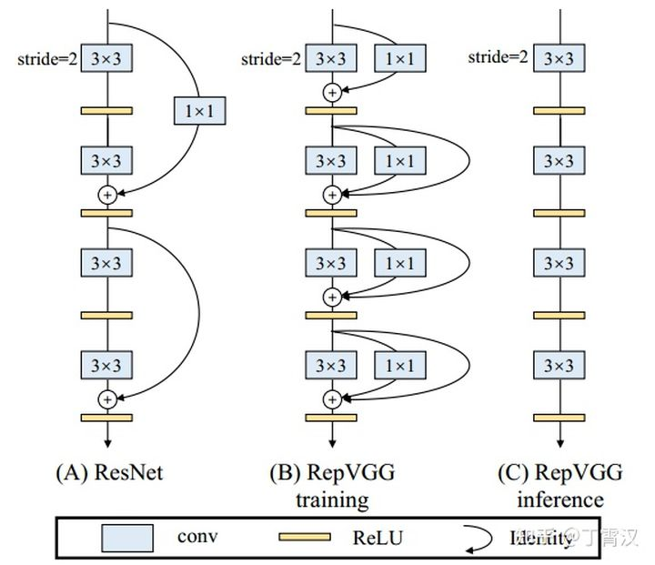

# 2021.3.17

- [x] 早起
- [x] 阅读与CV相关的论文解读
- [x] 弱监督目标定位代码debug层级解读(2/5)
- [x] 一道算法题
- [x] 运动一小时
- [ ] 英语外刊阅读

## 上午

上午在知乎看了一篇名为Generalized Focal Loss论文的解读，这篇论文的核心点在于对目标检测任务输出评价的修改，将原来的hard-code的标签信息结合了IOU的信息变为soft，同时很有意思的是将原来回归框回归单一数值改为回归一个关于边框的分布，通过这个分布可以了解到图片中目标的信息，也正是基于这个分布，该作者也提出了V2模型。

还了解了一点RepVGG网络，这种网络架构在部署的时候完全使用$3\times 3$的卷积，模型简单且便于进行硬件加速，在训练的过程中每一层卷积与下一层卷积都通过一个残差以及一个$1\times 1$卷积连接，而这些结构的参数都能被一个$3\times 3$的卷积来表示，所以在inference的时候就只需要$3\times 3$的卷积。

## 下午

稍微debug了一下wsolevaluation的代码

然后下午就去大羽毛球了，是真的爽好吧

