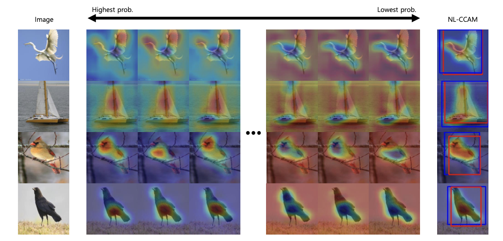

# 2021.3.30

## 上午

早上没起来好吧，七点十分才起，去食堂吃了早餐，蛋挞是真的腻，以后只能吃一点点了。

看了一下昨天跑的实验结果(VGG_Mixcam)，效果好于SOTA，但是就是这改进有点少，工作量不大够，而且在其他backbone的表现还不知道，所以上午改了一下代码重新在inception和resnet中跑一下实验。

还做了一道算法题，验证回文字符串，双指针的思想比较容易想到，比较惊艳的是正则表达式，运用正则表达式对字符串进行处理非常方便，这得好好学习一下。

## 下午

看了一下resnet中maxcam实验结果很好，但是在inception中效果较差，一开始觉得是网络过拟合比较严重使得更多关注于背景部分，后来突然想到我这个mixcam的思想好像在哪见过，淦，不翻不知道，原来是之前看过的一篇发在WACV上的一篇论文，该文章就指出使用所有类别的cam进行定位，但看文章实验部分好像都是在VGG上做的，这篇文章指出分类可能性较大的部分得到的cam能够很好定位目标部分，而分类可能性越小的部分则更关注于背景部分。

然后我就恍然大悟啊，淦，原来是在inception网络中结合所有的cam后背景部分占比较大，那很自然的想法就是选择前面几个分类较大的部分，说干就干，改了代码选择前10个分类概率最大的logits对应的cam图进行相加，截止到晚上21.03实验还在跑，现在看结果比之前那版好得多。

不过，他把文章都写了，我搞啥！不白干了？感觉再想点有什么可能的组合函数，总之搞点创新好吧。

## 晚上

今日发钱2000，出去吃了顿鸭血粉丝汤，好吃的。

晚上有点划水了，就看了一些正则表达式的部分。

加油干1

