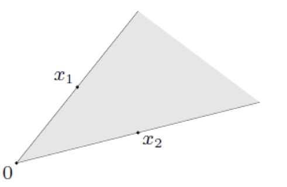

# 优化基础概念

本章节主要包括仿射集、凸集、锥和凸锥以及超平面、半平面和凸函数以及最优性条件

## 1 仿射集、凸集、锥和凸锥

这几个集合是在优化过程中经常讨论的，其中以凸集最为重要，因为我们希望优化问题转换为凸优化，这就要求对应的约束集合必须是凸集。在介绍这几个概念之前，先来了解一下直线和线段的定义：

**线段**：假设空间中存在两个点 $x_1,x_2$ 则连接这两个点的线段可以表示为 $\alpha x_1+(1-\alpha)x_2$，其中 $\alpha \in \mathbf [0,1]$。

**直线**：假设空间中存在两个点 $x_1,x_2$ 则连接这两个点的线段可以表示为 $\alpha x_1+(1-\alpha)x_2$，其中 $\alpha \in \mathbf R$。

### 1.1 仿射

> 仿射集：仿射集是指一些满足特定线性组合仍然在集合内部的点，假设集合 $\mathbf C$ 内有两个点 $x,y$，假设对这两个点做特定线性组合后得到的点 $t=\alpha x+(1-\alpha )y \in \mathbf C$，其中 $\alpha \in \mathbf R$ 则称集合 $\mathbf C$ 为仿射集。

例：假设有两个点 $x_1,x_2 \in \mathbf C$，则其组合 $\alpha x_1+(1-\alpha )x_2 \in \mathbf C$

在上图中可以看出来实际上就是要求两点连线上的所有点都在集合中。

进一步推广仿射集的概念，有仿射组合：

>仿射组合：假设集合 $\mathbf C$ 中存在点 $x_1,x_2,..,x_n$，有 $a_1x_1+a_2x_2+...+a_nx_n\in \mathbf C$ ，其中$a_1+a_2+...+a_n=1$ ，$a_i \in \mathbf R $，则称 $a_1x_1+a_2x_2+...+a_nx_n$ 为点 $x_1,x_2,..,x_n$ 的仿射组合

> 仿射包：设 $\mathbf X$ 为 $n$ 维欧式空间 $\mathbf R^n$ 的非空子集，则 $\mathbf X$ 的仿射包是指包含 $\mathbf X$ 的所有仿射集的交集，也就是包含 $\mathbf X$ 的最小仿射集，用集合 $\mathbf C$ 中所有点的仿射组合表示：
> $$
> \mathbf{aff}\, \mathbf C=\{a_1x_1+a_2x_2+...+a_nx_n|x_i\in \mathbf C,\sum_{i=1}^n a_i=1 \}
> $$

### 1.2 凸

从字面上来理解凸，可以想象出一个类似于山丘的形状，从数学角度来定义凸集，我们可以想象一个类似于山丘形状的集合，它所具有的性质是在集合中任意两点的连线构成的线段中的点仍然在集合中，用下图来直观理解：

所以转换成数学语言，我们需要定义凸集，也就是需要集合中任意两点构成的线段上的点仍然在集合内。

>**凸集**：假设集合 $\mathbf C$ 内有两个点 $x,y$，假设对这两个点做特定线性组合后得到的点 $t=\alpha x+(1-\alpha )y \in \mathbf C$，其中 $\alpha \in [0,1]$ 则称集合 $\mathbf C$ 为仿射集。
>
>注：回顾仿射集的定义，仅有 $\alpha$ 的定义域不同

在下面的这些集合中，只有第一个是凸集，第二个可以明显看出来线段中有点在集合外，第三个由于边界并不封闭，所以任取两个相邻顶点构成线段中的点也不全在集合内。

同样对凸集的概念进行推广，有凸组合的定义：

>**凸组合**：假设集合 $\mathbf C$ 中存在点 $x_1,x_2,..,x_n$，有 $a_1x_1+a_2x_2+...+a_nx_n\in \mathbf C$ ，其中$a_1+a_2+...+a_n=1$ ，$a_i \in [0,1] $，则称 $a_1x_1+a_2x_2+...+a_nx_n$ 为点 $x_1,x_2,..,x_n$ 的仿射组合
>
>注：有的地方也将 $a_i \in [0,1] $ 条件写作 $a_i \geq0$，由于存在条件 $\sum a_i=1$ 的限制，所以本质两者是等价的。

同样有凸包的概念：
> 凸包：设 $\mathbf X$ 为 $n$ 维欧式空间 $\mathbf R^n$ 的非空子集，则 $\mathbf X$ 的凸包是指包含 $\mathbf X$ 的所有凸集的交集，也就是包含 $\mathbf X$ 的最小凸集，用集合 $\mathbf C$ 中所有点的凸组合来表示：
> $$
> \mathbf{conv}\, \mathbf C=\{a_1x_1+a_2x_2+...+a_nx_n|x_i\in \mathbf C,\sum_{i=1}^n a_i=1 ,a_i\in[0,1]\}
> $$
> 注：和上面一样，这里也可以将 $a_i \in [0,1] $ 条件写作 $a_i \geq0$
>
> 
>
> 可以看出来凸包就是包含集合 $\mathbf C$ 的最小凸集

### 1.3 凸锥

在介绍凸锥的概念之前，首先来介绍锥的概念，锥这一词从几何的角度来看有圆锥、棱锥等，可以看出来这些几何体有一个共同的特点就是都有一个顶点，从这个角度我们可以帮助我们理解集合中锥的定义。

.png)

> 锥：假设有集合 $\mathbf C$ 中的元素 $x$ ，存在 $\theta x \in \mathbf C,\forall \theta \geq 0$，则称集合 $\mathbf C$ 为锥。(可以理解为一条射线或者许多射线组成的区域，锥一定要过原点)
>
> 锥组合：存在锥 $\mathbf C_1,\mathbf C_2$，有 $x_1 \in \mathbf C_1 x_2 \in \mathbf C_2$，则锥组合表示为 $x=\theta_1 x_1 +\theta_2 x_2$，其中 $\theta_1 \geq 0,\theta_2 \geq 0$ 
>
> 
>
> 用上面的图来表示一个锥组合，可以看出来锥组合是一个直线扫过的区域

凸锥实际上就是凸集和锥的一个组合，要求集合中的点既满足锥的性质，又满足凸集的性质。

> 凸锥：假设存在凸集中的两个点 $x,y\in \mathbf C$ ，有 $\alpha x+\beta y \in \mathbf C$，其中 $\alpha \geq 0,\beta \geq 0$，则称集合 $\mathbf C$ 为凸锥
>
> 凸锥组合：
> $$
> \theta_1x_1+\theta_2x_2+...+\theta_nx_n \; \theta_i \geq0
> $$
> 凸锥包：包含集合 $\mathbf C$ 的最小凸锥，假设有 $x_1,x_2,...,x_n\in \mathbf C$ ，凸锥包表示为：
> $$
> \{ \theta_1x_1+\theta_2x_2+...\theta_nx_n|\theta_i \geq0,x_i\in \mathbf C \}
> $$
> 从下面的图可以看出来，凸锥包就是包含集合 $\mathbf C$ 的最小凸锥：
>
> 

## 2.超平面、半空间与多面体

超平面总是要比其所在的空间少一维，例如在二维平面中的超平面就指的是直线，在三维空间中的超平面就指的是平面。

> 超平面：
> $$
> \{ x|a^Tx =b \}\\
> x\in R^n,b\in R,a\neq0
> $$
> 
>
> 在上面的图片中，超平面就是在三维空间中分开正负样例的平面。
>
> 
>
> 类似的，上面的超平面是二维空间中的一条直线。

超平面描述了一个比所在空间低一维度图形，它可以将所在空间分为两部分，分别在超平面的两侧，这两侧的区域可以表示为半空间。

> 半空间：
> $$
> H^+=\{ x|a^Tx \geq b \} \;a \neq0\\
> H^-=\{ x|a^Tx \leq b \} \;a \neq0\\
> $$
> 
>
> 上面的半空间分别是二维空间中超平面的两侧区域。

为了对多个超平面与半空间组合成的区域进行描述，引入多面体的概念。

> 多面体：
> $$
> P=\{ x|a_ix \leq b_i,a_jx=d_j;i=1,...,m,j=1,...,n
> \}
> $$
> 
>
> 上面的图形可以看做是多个半空间和超平面的交集，即一个多面体

## 3 凸函数

凸函数在最优化分析的过程中十分重要，因为一般函数我们可以在某个初始点附近求得局部极小值，而当这个函数为凸函数的时候，局部极小值对应的就是全局极小值。

### 凸函数的定义

> 凸函数定义
>
> **定义1**：假设定义域中存在两个点 $x,y$ 有：
> $$
> \alpha f(x)+(1-\alpha)f(y) \geq f(\alpha x +(1-\alpha)y)
> $$
> 则称函数 $f$ 为凸函数。上述的定义用图形来描述，下图中 $\alpha=0.5$，当 $\alpha$ 取不同值的时候，左面 $\alpha f(x)+(1-\alpha)f(y) $ 的取值在线段上，而右面 $f(\alpha x +(1-\alpha)y)$ 取值都在函数上，可以看到线段上的值总是大于函数上的取值。
>
> 
>
> **定义2(一阶导数)**：假设 $f(x)$ 一阶可导，若 $f(x)$ 为凸函数，则有：
> $$
> f(y) \geq f(x)+ \nabla f^T(x)(y-x)
> $$
> 用下面的图来表示一阶导数定义，可以理解为任意一个点处的切线总是在函数的下方或者与函数相等。从上面的式子也可以看出来，当 $\nabla f(x) =0$ 的时候，有 $f(y) \geq f(x)$ 代表当导数为0的时候就是全局极小值。
>
> 
>
> **定义3(二阶导数)**：假设 $f(x)$ 存在二阶导数，则当 $f(x)$ 的海森矩阵为半正定矩阵的时候有 $f(x)$ 为凸函数：
> $$
> \nabla f^2(x) \succeq 0
> $$
> 若有 $\nabla f^2(x) \succ 0$ 则函数为严格凸函数，反之若为严格凸函数不一定满足 $\nabla f^2(x) \succ 0$  (例如 $x^4$ )

同样的如果想要判断一个函数是否为凹函数，只需要将上面的 $\geq$ 全都替换为 $\leq$ 即可

### 常见的凸函数

首先从标量值函数进行介绍；

| 函数名称     | 函数表达式  | 定义域                                               |
| ------------ | ----------- | ---------------------------------------------------- |
| 指数函数     | $e^{ax}$    | $\mathbf R$                                          |
| 幂函数       | $x^a$       | $a \geq 1 \;or\;a<0$ 为凸函数； $0\leq a<1$ 为凹函数 |
| 绝对值幂函数 | $|x|^a$     | $a\geq 1$为凸                                        |
| 负对数函数   | $- \log x $ | $\mathbf R^+$                                        |
| 负熵函数     | $ \log x $  | $\mathbf R^+$                                        |

矢量凸函数：

| 函数名称            | 函数说明                           |
| ------------------- | ---------------------------------- |
| 范数                | 所有满足范数定义的函数             |
| 最大值函数          | $max\{x_1,x_2,...,x_n \}$          |
| **Log-sum-exp**函数 | $log(e^{x_1}+e^{x_2}+...+e^{x_n})$ |

