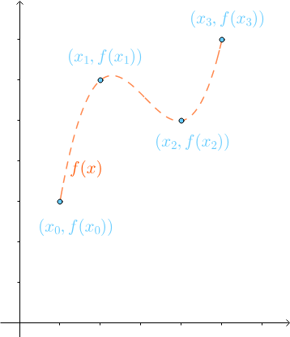
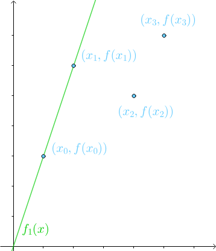
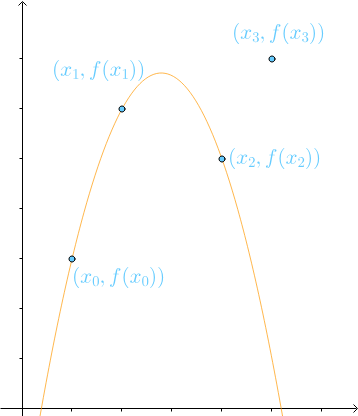
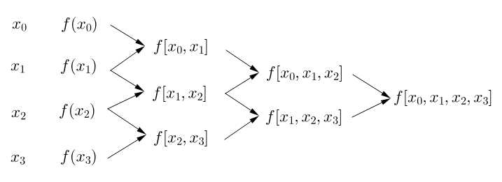
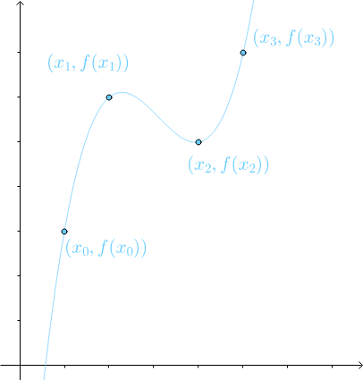
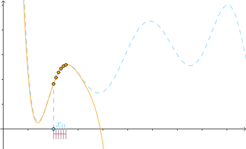
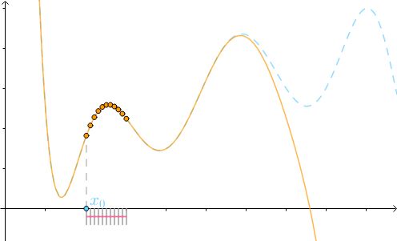

# 数学基础

数学基础部分包括：泰勒展开、雅克比矩阵、海森矩阵、链式法则、方向导数

## 1.泰勒展开

泰勒公式在本质上是用函数的多项式展开去逼近函数本身的值，因为多项式函数比较容易分析，所以一般情况下对精度要求不高的时候可以使用其展开形式对原函数进行代替。

> 泰勒展开的定义：设 $n$ 是一个正整数，如果定义在一个包含 $a$ 的区间上函数 $f$ 在 $a$ 点处 $n+1$ 次可导，那么对于这个区间上的任意 $x$ 都有：
> $$
> f(x)=\sum_{n=0}^N\frac{f^{(n)}(a)}{n!}(x-a)^n+R_n(x)
> $$
> 其中的多项式为函数在 $a$ 处的泰勒展开式，$R_n(x)$ 是泰勒公式的余项且是 $(x-a)^n$ 的高阶无穷小。
>
> 一般情况下在 $a=0$ 处展开，得到的公式是麦克劳伦公式：
> $$
> f(x)=\sum_{n=0}^N\frac{f^{(n)}(0)}{n!}x^n+R_n(x)
> $$
> 

### 1.1 如何理解泰勒公式？

通过上面的式子可以看出来，泰勒展开实际上用一个点 $a$ 的函数值和定义域中任意一点到该点的距离定义得来，为什么通过这种方式可以表示一个函数？

#### 牛顿插值法

泰勒展开的思想实际上是牛顿插值法的推广，牛顿插值法是一种用已知的点去拟合函数的方法，下面用一个例子对牛顿插值法进行理解：

对于已知的四个点 $(x_0,f(x_0)),(x_1,f(x_1)),(x_2,f(x_2)),(x_3,f(x_3))$ ,我们想要构造一个能够经过这四个点的光滑函数 $f(x)$ 。

1. 在已知第一个点的情况下，我们可以构建函数形式如下：
   $$
   f_0(x)=f(x_0)
   $$
   此时构造的函数是一条直线。

2. 在知道第一和第二个点的情况下，我们对上面的函数形式进行改变：
   $$
   f_1(x)=f(x_0)+b_1(x-x0)
   $$
   此时可以通过两个已知点将 $b_1$ 计算出来：
   $$
   b_1=\frac{f(x_1)-f(x_0)}{x-x_0}=f[x_0,x_1](差商)
   $$
   此时得到的函数图像如下图所示：

   

3. 在知道第三个点的情况下，对 $f_1(x)$ 进行修改：
   $$
   f_2(x)=f_1(x)+b_2(x-x_0)(x-x_1)=f(x_0)+b_1(x-x_0)+b_2(x-x_0)(x-x_1)
   $$
   同样的方式对 $b_2$ 进行求解：
   $$
   b_2=\frac{f[x_1,x_2]-f[x_0,x_1]}{x_2-x_0}=f[x_0,x_1,x_2]
   $$
   得到的函数图像如下：

4. 用同样的方式再次求得系数 $b_3:$
   $$
   b_3=\frac{f[x_1,x_2,x_3]-f[x_0,x_1,x_2]}{x_3-x_0}=f[x_0,x_1,x_2,x_3]
   $$
   

得到通过牛顿插值法得到的最终函数图像：

如果知道函数 $g(x)$ $n$ 个点的信息，那么就能通过牛顿插值法得到多项式函数 $f(x)$ 代替原函数：
$$
f_n(x)=f[x_0]+f[x_0,x_1](x-x_0)+...+f[x_0,x_1,...,x_n]\prod_{k=0}^{n-1}(x-x_k)
$$

#### 从牛顿插值理解泰勒展开

牛顿插值法需要知道函数的任意 $n$ 个点的值后就可以对函数 $g(x)$ 进行近似，如果该 $n$ 个点之间距离十分接近，即有 $\Delta x \rarr 0$：
$$
x_1=x_0+\Delta x,x_2=x_1+\Delta x,...,x_n=x_{n-1}+\Delta x
$$
那么牛顿插值法就变成了泰勒展开：
$$
f(x)=f(x_0)+f'(x_0)(x-x_0)+\frac{f''(x_0)}{2!}(x-x_0)^2+...+\frac{f^{(n)}(x_0)}{n!}(x-x_0)^n
$$
其中 $n$ 的数值就可以理解为插值法中的点的个数，当该值较少(即 $n$ 较小)的时候，$f(x)$ 能够拟合点 $x_0$ 附近的 $g(x)$ 的值，该值较大的时候，能够拟合更远处的 $g(x)$ 的值，当$n\rarr \infin$ 的时候，有 $f(x)$ 无限接近 $g(x)$ 。

#### 用例子来理解

在下图中蓝色虚线是原函数，黄色曲线使我们通过插值得到的函数

当有5个插值点的时候，函数的图像如下图所示：

当我们增加插值点到10个的时候，可以明显看出来 $f(x)$ 能够对距离 $x_0$ 更远处的 $g(x)$ 值进行拟合：

#### 从另一个角度理解泰勒展开项的系数

泰勒展开的过程中用多项式函数对原来的函数进行拟合，其中展开的过程中越高次数的多项式其对应的系数越小，这说明这些项在距离展开点 $x_0$ 较近的时候发挥的作用较小，随着 $x$ 的值逐渐远离展开点，这些项也逐渐发挥作用

[参考链接：如何通俗地解释泰勒公式？](https://www.matongxue.com/madocs/7/)

### 1.2 皮亚诺与拉格朗日余项

通过上面的推导我们知道用泰勒展开去近似函数的时候在展开点处附近的近似效果最好，当函数值远离展开点的时候也就存在一定的误差，这种误差用余项 $R_n(x)$ 去表示。

假设函数 $f(x)$ 在 $x=x_0$ 处有 $n$ 阶导数，则有：
$$
f(x)=\underbrace{p_n(x)}_{\text{泰勒多项式}}+\underbrace{R_n(x)}_{\text{皮亚诺余项}}
$$
其中：
$$
R_n(x)=o((x-x_0)^n)
$$
可以看出来当距离展开点 $x_0$ 越近的时候该余项的值越小。

皮亚诺余项能够虽然能够表示误差，但是无法具体表示误差的大小，可以用**拉格朗日余项**具体表示余项的大小：
$$
R_n(x)=\frac{f^{(n+1)} (\xi)}{(n+1)!}(x-x_0)^{n+1}
$$
其中 $\xi$ 是介于 $x_0$ 和 $x$ 之间的某个值。

### 1.3 一般形式的泰勒展开

对于标量形式的泰勒展开有：
$$
f(x)=f(x_0)+\frac{f'(x_0)}{1!}(x-x_0)+\frac{f''(x_0)}{2!}(x-x_0)^2+...+\frac{f^{(n)}(x_0)}{n!}(x-x_0)^n+R_n(x)
$$
如果选择方向 $p=x-x_0$ ，则有：
$$
f(x_0+p)=f(x_0)+\frac{f'(x_0)}{1!}p+\frac{f''(x_0)}{2!}p^2+...+\frac{f^{(n)}(x_0)}{n!}p^n+R_n(x)
$$
若 $x$ 为向量形式：
$$
f(x_0+p)=f(x_0)+p^T \nabla f(x_0)+p^T\nabla f^2(\xi)p
$$
其中 $\xi$ 为 $x_0$ 到 $x_0+p$ 之间的向量。

## 2.雅克比矩阵与海森矩阵

### 雅克比矩阵

雅可比矩阵是多元函数组成向量的一阶导数，该导数的表示形式是一个矩阵，称为雅克比矩阵。

例如有多元函数组成的向量形式：
$$
f(\bold{x})=
\begin{pmatrix}
x_1+2x_2-\sin x_3\\
x_1^2+3x_2+e^{x_3}\\
x_2^3+1\\
\end{pmatrix}
$$
该函数的一阶导数为：
$$
\nabla f(x)=
\begin{pmatrix}
1&2&-\cos x_3\\
2x_1&3&e^{x_3}\\
3x_2^2&0&0
\end{pmatrix}
$$
该矩阵就成为雅克比矩阵。

### 海森矩阵

海森矩阵是多元实值函数 $f(x_1,x_2,...,x_n)$ 的二阶偏导数构成的矩阵。

例如有多元实值函数：
$$
f(x_1,x_2,x_3)=x_1^2x_2+2x_2x_3^3+\sin x_3
$$
则其对应的一阶偏导数：
$$
\nabla f=
\begin{pmatrix}
2x_1x_2\\
x_1^2+2x^3_3\\
6x_2x_3^2+ \cos x_3

\end{pmatrix}
$$
对应的海森矩阵：
$$
\nabla ^2f=
\begin{pmatrix}
2x_2&2x_1&0\\
2x_1&0&6x_3^2\\
0&6x_3^2&12x_2x_3-\sin x_3

\end{pmatrix}
$$

## 3.链式法则、方向导数

### 链式法则

链式法则是用于复合函数求导的法则，对于一个复合函数进行求导有：
$$
\begin{align}
h(t)&=g(x(t))\\
\nabla h(t)&=\nabla x(t)\nabla g(x(t))
\end{align}
$$
最常见的使用链式法则的地方是神经网络进行权重更新的时候，当进行神经网络后向传播的时候，利用链式法则可以计算出每个层中系数对于最终结果的导数值，利用该导数值进行权重更新。

### 方向导数

方向导数用来表示函数沿着某一个方向的变化情况，通常其计算方式是单位方向向量与导数值的乘积：
$$
\frac{\partial f(x)}{\partial p}=\lim_{\varepsilon \rightarrow0 }\frac{f(x+\varepsilon)-f(x)}{\varepsilon}=p^T\nabla f(x)
$$
例子：求 $f(x,y)=x^2+2y^2$ 在$x=1,y=1$ 沿着 $d=[1\; 2]^T$ 的方向导数：
$$
\begin{align}
\nabla f(x,y)=
\begin{pmatrix}
2x\\
4y
\end{pmatrix}
=
\begin{pmatrix}
2\\
4
\end{pmatrix}
\\
d^T \nabla f=\frac{[1 \quad 2]^T}{\sqrt{1^2+2^2}} 
\begin{bmatrix}
2\\
4
\end{bmatrix}
=\frac{14}{\sqrt{10}}
\end{align}
$$
方向导数在后面使用优化算法寻找函数极小点的过程中十分重要，当方向导数的值大于零的时候我们认为该方向为函数的上升方向，反之则为下降方向。(实际常用负的方向导数判断，大于零则为下降方向)

