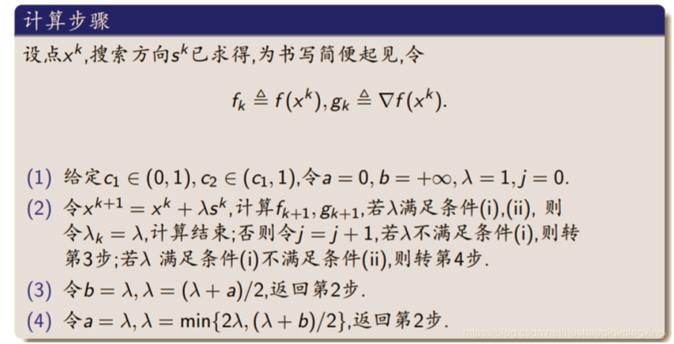
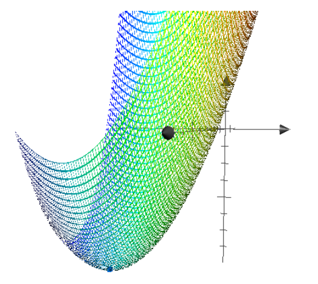
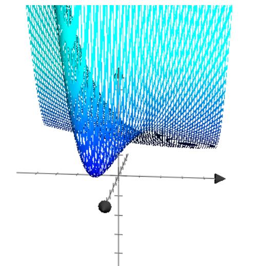

# 1.BFGS拟牛顿法

> 为什么要用拟牛顿法？
>
> 使用牛顿法对无约束优化问题进行求解时会用的海森矩阵的逆$\nabla f^2(x)^{-1}$,但是有时候由于海森矩阵并不是正定矩阵无法求出其逆，为了解决这种问题出现拟牛顿法。
>
> 

## 1.1 算法流程

考虑 $f(x)$ 在当前点 $x^k$ 处的二次近似函数：

$$
m_k(x):= f(x^k)+ \nabla f(x^k)^T(x-x^k)+\frac{1}{2}(x-x^k)^TB_k(x-x^k)
$$

其中 $B_k\succ0$, 利用 $\min m_k(x)$ 得到搜索方向$d^k = -B_k^{-1}\nabla f(x^k)$,与牛顿法计算得到的搜索方向 $d^k = -\nabla f^2(x)^{-1} \nabla f(x^k)$ 相比，拟牛顿法使用矩阵 $B_k$ 代替海森矩阵 $\nabla f^2(x)$ ，在对 $B_k$ 进行计算的时候需要其满足拟牛顿条件:

$$
\nabla f(x^{k+1})-\nabla f(x^{k})=B_{k+1}(x^{k+1}-x^{k})
$$

记 $y_k:=\nabla f(x^{k+1})-\nabla f(x)$，$s_k:=x^{k+1}-x^{k}$, 上面的式子简化为：

$$
y_k = B_{k+1}s_k
$$

满足拟牛顿条件的矩阵有很多，基于已有的信息 $(y_k,s_k,B_k)$ , BFGS通过对 $B_k$ 进行校正得到 $B_{k+1}$令$B_{k+1}=B_k+\Delta B$, BFGS方法要求 $\Delta B$ 的秩为2，看做是对矩阵 $B_k$ 进行rank-2校正：

$$
(BFGS) \quad B_{k+1}=B_k-\frac{B_ks_ks_k^TB_k}{s_k^TB_ks_k}+\frac{y_ky_k^T}{y_k^Ts_k}
$$

对整个算法框架进行总结：

**Step0：**设初始迭代点 $x^0$, 迭代终止条件 $ \varepsilon$ ，初始 $B_0=I$, $k:=0$

**Step1:** 判断是否达到终止迭代条件$||\nabla f(x_k)||\leq \varepsilon$

**Step2:** 计算下降方向 $d^k=-B_k^{-1}\nabla f(x^k)$

**Step3:** 计算步长 $\alpha_k$， 使用非精确搜索方式，步长需要满足强Wolfe条件

**Step4:** 令$x^{k+1}=x^{k}+\alpha_k d^k$， 更新$B_k$ ，令 $x^{k}=x^{k+1}$

在计算步长 $\alpha_k$ 的过程中，需要对其进行非精确线搜索，计算步骤如下图所示：



## 1.2 BFGS拟牛顿法核心代码

整个算法的核心代码如下所示：

```python
while np.linalg.norm(grad, ord=2) > 1e-10: #是否满足终止条件

\# 计算新的搜索方向

p = -1 * np.dot(np.linalg.inv(Bk), grad)

\#计算步长，需要满足强Wolfe条件

lam = compute_step(poly, vars, xk, 0.5, p, c2=0.9)

xk1 = xk + lam * p

\#更新Bk-->Bk+1

grad_k = getGrad(poly, xk, vars)

grad_k1 = getGrad(poly, xk1, vars)

sk = xk1 - xk

yk = grad_k1 - grad_k

skT_B_sk = np.dot(np.dot(sk.T,Bk),sk)

ykT_sk = np.dot(yk.T,sk)

Bk1 = Bk - np.dot(np.outer(np.dot(Bk,sk),sk.T),Bk)/skT_B_sk + np.outer(yk,yk.T)/ykT_sk

Bk =Bk1.astype(np.float)

grad = grad_k1

xk = xk1
```

## 1.3 算法示例

**例1.给定函数 $f(x)=2x_1^2+3x_2^2+8x_2-9x_1+8$, 初始点 $x^0=[0,0]^T$, 使用BFGS算法求解最小值**

解：使用BFGS算法对上述函数最小值进行求解，运行代码得到的结果如下：

```python
请输入函数的维数(整数)：2

请输入目标函数(自变量为x1-x2, 乘方为**)：2*x1**2+3*x2**2+8*x2-9*x1+8

2*x1**2 - 9*x1 + 3*x2**2 + 8*x2 + 8

========================================

迭代第1次时步长的值为:0.25

迭代第1次时方向的值为:[ 9. -8.]

迭代第1次后梯度范数值为: 4.0

迭代第1次后梯度值为:

[ 0. -4.]

迭代第1次后x的值为:

[ 2.25 -2. ]

迭代第1次后f(x)的值为:

-6.12500000000000

========================================

迭代第2次时步长的值为:

0.25

迭代第2次时方向的值为:

[1.59264579 1.86115101]

迭代第2次后梯度范数值为: 1.9991111601537106

迭代第2次后梯度值为:

[ 1.59264579 -1.20827348]

迭代第2次后x的值为:

[ 2.64816145 -1.53471225]

迭代第2次后f(x)的值为:

-7.01960785507119

========================================

······

=======================================

迭代第5次时步长的值为:

1

迭代第5次时方向的值为:

[8.53013553e-07 1.10317213e-06]

迭代第5次后梯度范数值为: 2.939738508868551e-09

迭代第5次后梯度值为:

[1.45675116e-09 2.55341703e-09]

迭代第5次后x的值为:

[ 2.25 -1.33333333]

迭代第5次后f(x)的值为:

-7.45833333333333

最终结果为：当自变量取值为[ 2.25 -1.33333333]时，函数值为-7.45833333333333

================== End =================
```

该函数的函数图像下图所示：



**例2.给定函数 $f(x)=e^{x_1}(4x_1^2+2x_2^2+4x_1x_2+2x_2+1)$, 初始点 $x^0=[0,0]^T$, 使用BFGS算法求解最小值**

```
================= Begin ================

请输入函数的维数(整数)：2

请输入目标函数(自变量为x1-x2, 乘方为**)：exp(x1)*(4*x1**2+2*x2**2+4*x1*x2+2*x2+1)

(4*x1**2 + 4*x1*x2 + 2*x2**2 + 2*x2 + 1)*exp(x1)

========================================

迭代第1次时步长的值为:

0.25

迭代第1次时方向的值为:

[-1. -2.]

迭代第1次后梯度范数值为: 2.278907364021062

迭代第1次后梯度值为:

[-2.14170215 -0.77880078]

迭代第1次后x的值为:

[-0.25 -0.5 ]

迭代第1次后f(x)的值为:

0.973500978839256

========================================

迭代第2次时步长的值为:

1

迭代第2次时方向的值为:

[ 0.74973444 -0.51483229]

迭代第2次后梯度范数值为: 0.14148218411536587

迭代第2次后梯度值为:

[-0.10054137 -0.09954216]

迭代第2次后x的值为:

[ 0.49973444 -1.01483229]

迭代第2次后f(x)的值为:

0.000751668814193529

========================================

······

========================================

迭代第9次时步长的值为:

1

迭代第9次时方向的值为:

[-2.35438842e-08 3.25975564e-08]

迭代第9次后梯度范数值为: 9.018709740740867e-10

迭代第9次后梯度值为:

[4.82214269e-10 7.62129027e-10]

迭代第9次后x的值为:

[ 0.5 -1. ]

迭代第9次后f(x)的值为:

-8.88178419700125e-16

最终结果为：当自变量取值为[ 0.5 -1. ]时，函数值为-8.88178419700125e-16

================== End =================

```

当自变量取到 $x=[0.5 -1]$ 的时候取到局部极小值，此时得到的局部极小值为0

该函数的函数图像下图所示：



