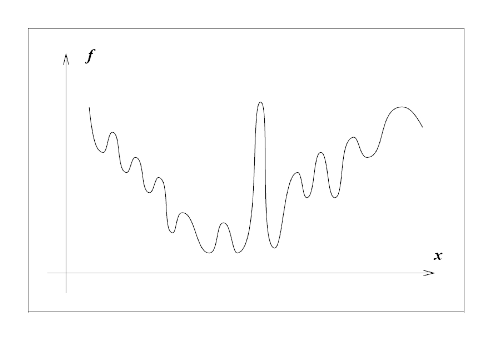

## 最优性条件

为了求解一个无约束优化问题的最优解，我们需要知道最优解满足的条件以及如何判断是否达到最优，一般的假设一个无约束优化问题可以表示成以下形式：
$$
\min_x f(x)
$$
### 全局极小解与局部极小解

> 全局极小解：假设一个点 $x^*$ 是全局最优解，那么需要满足在任意点 $x$ 处都有：
> $$
> f(x^*) \leq f(x), \; \forall x \in \mathbf R^n
> $$
> 局部极小解：假设一个点 $x^*$ 为局部最优解，那么存在一个邻域 $\mathbf N$ 中有：
> $$
> f(x^*) \leq f(x), \; \forall x \in \mathbf N
> $$
> 如果 $x^*$ 为一个严格局部极小值，那么只需要满足 $f(x^*) < f(x), \; \forall x \in \mathbf N$

在实际问题中的函数一般都是非凸函数，如下图所示，所以一般很难求出全局极小点。

### 最优性条件

那么我们退而求其次，如何求解一个函数的局部极小点呢？当一个点为局部极小值的时候，一般会满足一定的条件，我们可以利用这些条件对当前点进行判断。如果 $f$ 为二阶可导的，我们可以通过检查梯度(一阶导数)以及海森矩阵(二阶导数)判断其是否为局部极小值点。

> 一阶必要性：当一个点 $x^*$ 为局部极小点的时候，此时一定有 $\nabla f(x^*)=0$。在局部极小点的地方梯度值一定为0。
>
> 证明：假设在 $x^*$ 处局部极小，但是有 $\nabla f(x^*)\neq0$，则一定存在方向 $p=-\nabla f(x)$，有 $p^T\nabla f(x) = -||\nabla f(x)||^2<0$，又因为在 $x^*$ 附近 $\nabla f(x)$ 是连续的，所以存在 $T>0$ 有：
> $$
> p^T\nabla f(x^*+tp)<0,\forall t \in [0,T]
> $$
> 使用一阶泰勒展开公式有：
> $$
> f(x^*+tp)=f(x^*)+tp^T\nabla f(x^*+\bar tp)<f(x^*)
> $$
> 其中 $\bar t\in[0,t]$，所以 $f(x^*)$ 不是局部极小点。

一阶必要性说明局部极小点一定为驻点。

> 二阶必要性：当一个点 $x^*$ 为局部极小点的时候，此时一定有 $\nabla f(x^*)=0$，并且其海森矩阵为半正定。
> $$
> \nabla f^2(x^*) \succeq 0
> $$
> 证明：假设海森矩阵为负定矩阵，则有 $\nabla f^2(x) \prec 0$ ，假设二阶导数是连续的，则一定存在 $T>0$:
> $$
> p^T\nabla f^2(x^*+tp)p<0,\forall t\in[0,T]
> $$
> 对 $f(x)$ 进行二阶泰勒展开：
> $$
> \begin{align}
> f(x^*+tp) &= f(x^*)+tp^T \nabla f(x^*)+t^2p^T\nabla ^2f(x^*+\bar tp)p\\
> &=f(x^*)+0+t^2p^T\nabla ^2f(x^*+\bar tp)p(<0)\\
> &<f(x^*)
> \end{align}
> $$
> 其中 $\bar t \in [0,t]$，则此时 $f(x^*)$ 不是局部极小点。

一阶必要性说明局部极小点的一阶导数为0，二阶必要性则说明局部极小点海森矩阵必须为半正定矩阵，那么如果我们有一个点如何去判断它是否为局部极小点呢？这就需要充分条件，下面我们介绍二阶充分条件：

> 二阶充分条件：二阶充分条件假设二阶导数连续并且 $x^*$ 满足一阶必要条件，此时如果有海森矩阵为正定矩阵则说明此点为局部极小点。
> $$
> \nabla f^2(x) \succ0
> $$
> 证明过程类似于二阶必要条件。

有了最优性条件就可以判断一个点是否为局部极小点，如果恰好我们的问题是凸规划问题(目标函数为凸，约束集合为凸集)，则此时局部极小点就是全局极小点。

