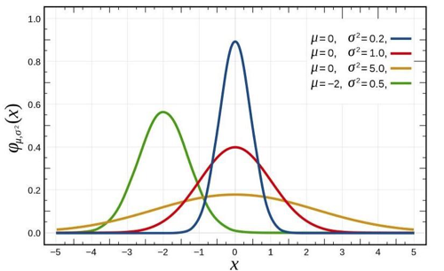
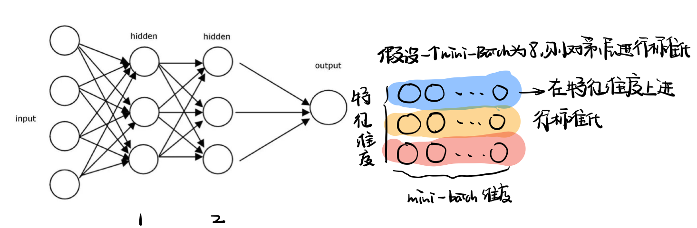
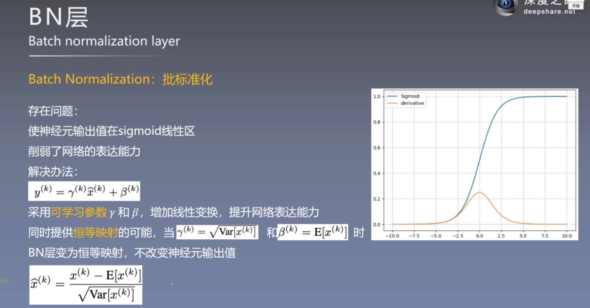
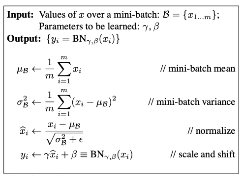
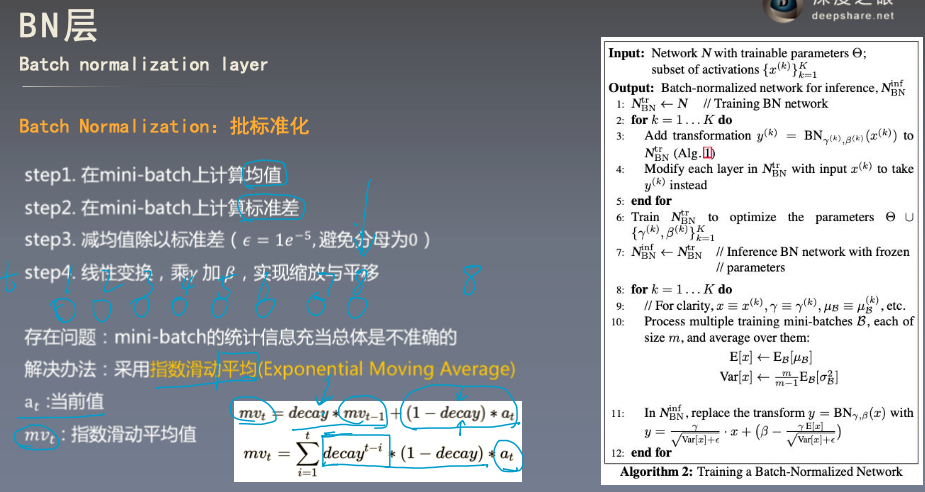
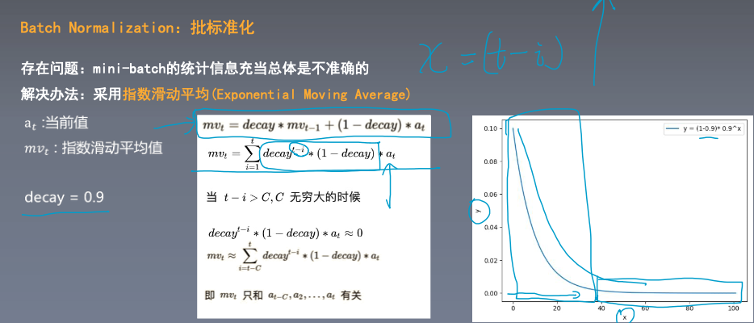
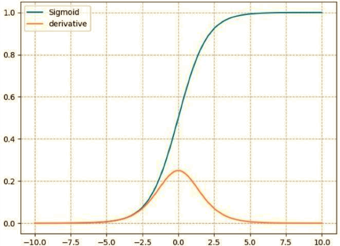

# GoogLeNet v2

问题提出：由于内部协变量偏移（ICS）的问题使得数据分布发生变化导致训练过程很慢，常用的方法是使用小的学习率和精心设计权重初始化。

> 内部协变量偏移（ICS）
>
> 开始的时候输入数据进行标准化处理能保证所有数据都符合同一分布，在经过神经网络不同层的激活后数据分布会发生变化，由于数据分布的变化会导致最终模型训练困难。
>
> 

考虑对每一层使用标准化处理以解决协变量偏移的问题

> 批标准化层（BN层）
>
> 1.对一个mini-batch的数据进行标准化，将数据变为0均值1标准差，在**mini-batch的维度**进行标准化
>
> 
>
> 在进行标准化处理后，由于此时神经网络的输出都位于sigmoid的线性区域使得网络的表达能力减弱，为了增强网络的表达能力，需要进行线性处理。
>
> 2.对输出进行线性变换（仿射变换）提高网络的表达能力，同时提供了恒等映射的可能。
>
> 
>
> 将上面的步骤总结为下面的步骤：
>
> 
>
> 使用上面的方式依旧存在问题，利用mini-batch计算出来的统计信息并不能代表所有样本，为了增强小批量样本对整体样本的表达能力，采用**指数滑动平均**的方法进行改进
>
> 
>
> **指数加权平均**利用了之前所有样本的信息，相比于只有一个mini-batch计算均值和方差使用到了更多的样本点，更能代表整体的信息。指数平均更加关注距离当前样本近的点，对于距离较远的点影响较小。
>
> 

使用BN层后有什么优点？

1. 可以使用较大学习率，由于进行了标准化使得数据分布在0附近更有助于增快训练过程。对于sigmoid激活函数当数据分布在饱和区域的时候在进行后向传播更新时梯度值较小也就越难进行训练，当处于非饱和区域的时候可以使用较大学习率进行训练。

2.充当dropout正则化的作用，加入BN层后将不同样本之间关联起来，使得样本之间互相约束。

注意事项：

使用BN层的时候不需要加偏置项，因为BN中存在的线性变换。

https://kapeli.com/dash_share?docset_file=PyTorch&docset_name=PyTorch&fallback=https://pytorch.org/docs/&path=generated/torch.nn.BatchNorm2d.html%23torch.nn.BatchNorm2d&platform=usercontribPyTorch&repo=User%20Contributed&version=1.6.0