# YOLO

两阶段方式：第一级网络生成候选区域，第二级网络对候选区域进行分类和精确的坐标回归

一阶段的方式：只是用一阶段完成分类和定位

YOLO的方式将识别和定位结合在一起，检测速度较快，实际应用较广泛

## YOLO V1

图片首先被分为很多grid，只要求物体中心位于某一个grid中即可。

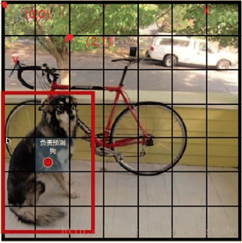

对每一个grid都会进行预测多个bounding box，每个bounding boxs包含物体中心位置以及宽和高，以及这个预测的置信度，同时还要对类别进行预测。

> 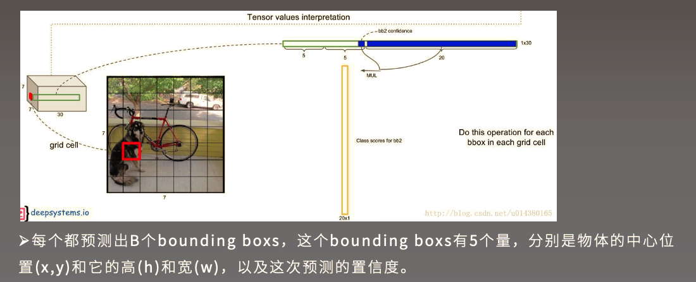
>
> 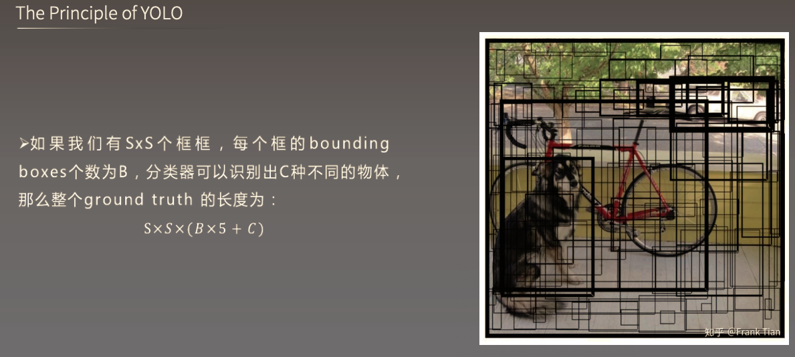
>
> 在使用Bounding Box的时候，如果使用图片坐标绝对值可能会对网络泛化能力造成影响，所以可以对图片中的位置进行rescale
>
> 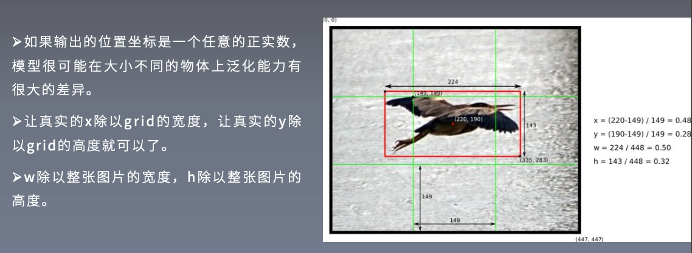
>
> 置信度的计算公式：
>
> 
>
> 以下面的图片为例：
>
> 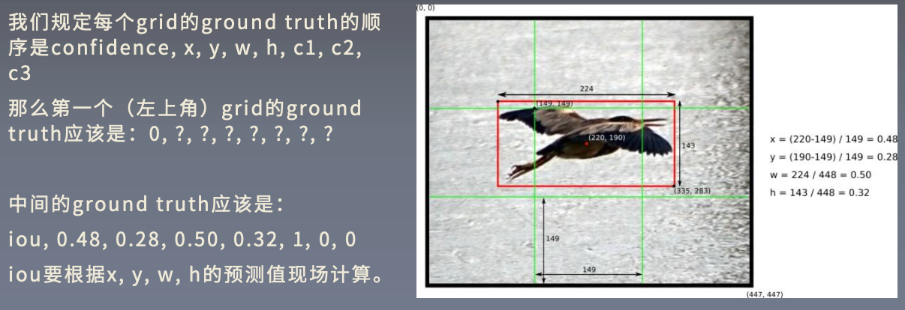

损失函数：
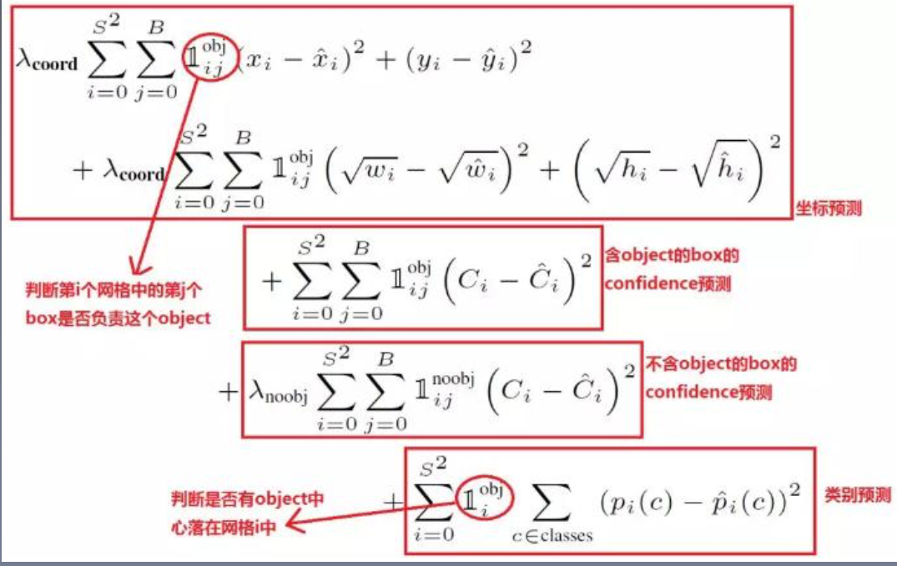

其中前两行对预测BB的位置损失进行计算，第三四行对置信度的损失进行计算，最后一行对分类误差进行计算。超参数的设置是为了平衡正负例，因为不含object的box远远大于包含object的，一般两者10倍差距。

V1的缺点：只能识别一种物体，预测准确度不高。

## YOLO V2

又称为YOLO9000，使用COCO数据集进行训练后可以识别80多种类，使用coco+ImageNet训练后可识别9000多种类。

YOLOv2的主要改进如下：

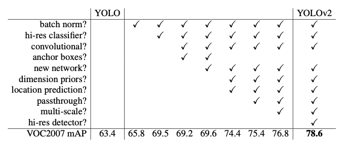

### BN

批量归一化的使用成为检测网络标配，由于BN的存在，可以去掉dropout，代替实现了正则化效果

### 高分辨率预训练

YOLOV1使用imagenet预训练，图片尺寸$224*224$，v2中使用$448*448$

### 位置预测改进，替换全连接层

不再预测绝对位置，而是预测与anchor的相对偏差，训练的时候只有最接近ground truth的产生loss，去除全连接层

### Anchor box

box的选取是通过数据集中的矩形框通过kmeans聚类得到先验框的宽和高

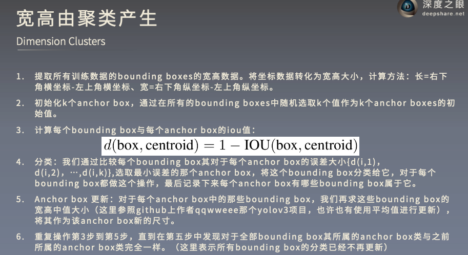

### 细粒度特征(passthrough)

将大尺度特征变为小尺度丢失了细粒度信息，此时可以通过增加小尺寸特征channel实现尽量保留细粒度信息

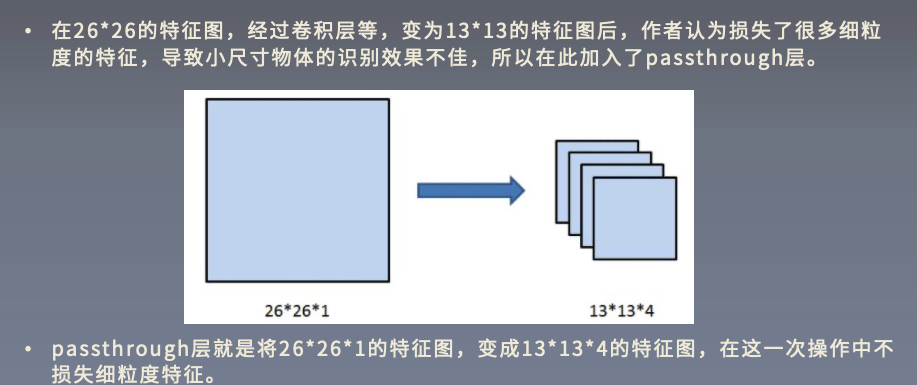

### 多尺寸训练

每训练一定的batch后就将图片resize成不同尺寸后，相当于学习了多尺度信息

### 意义

大幅度提升检测速度的同时保持了检测精度

## YOLO v3

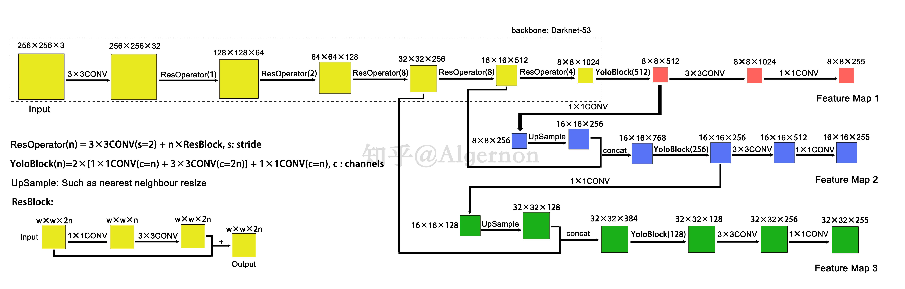

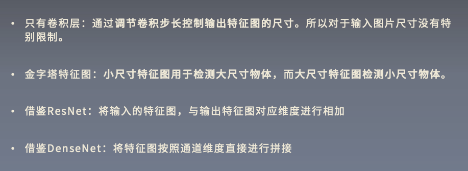

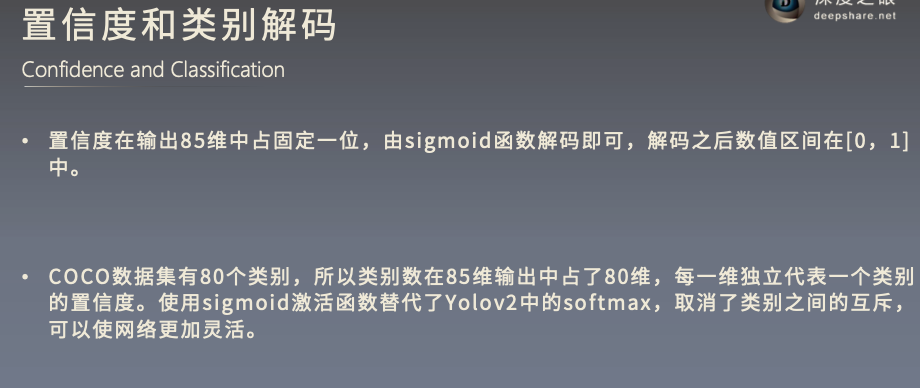

使用sigmoid函数则最终预测可能性相加不必为1(softmax)，从而可以实现多目标检测

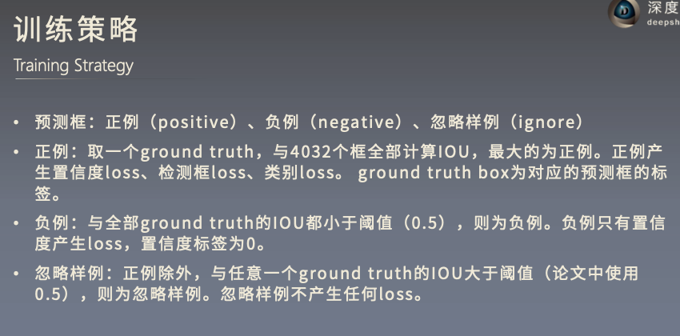

## YOLO V4

1.马赛克数据增强

2.原图扰动

3.attention方式

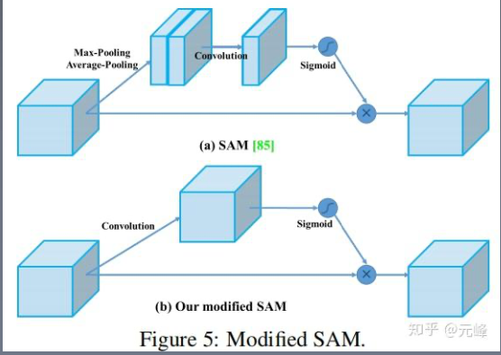

4.改进通道组合方式

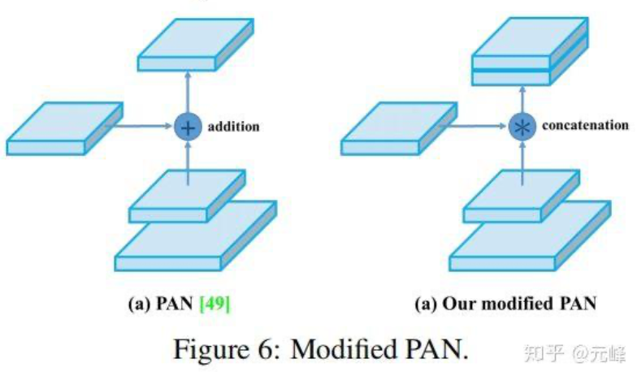

5.cross-minibatch

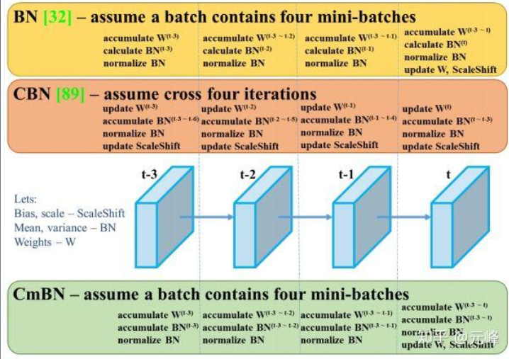

