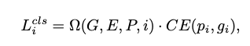

#Foreground-Background Imbalance Problem in Deep Object Detectors: A Review

本文主要探讨在目标检测任务中存在的前景背景(正负样本)不均的问题，在目标检测过程中由于一般只存在一个ground truth标签，所以在生成检测目标的时候会有很多预测框作为负例出现，过多的负例或者过多的正例都利于模型的训练，一般目标检测任务的框架中保持正负样本比例为1：3。

> 在正负样本不均的基础上还存在难易样本不均衡的问题，较难分类样本对于反向传播的时候网络梯度有较大影响，而易分类样本则梯度较小

本文主要介绍了一些解决正负样本不均的方法：

## 启发式采样的方法

采样的方式主要通过对所有样本进行选择，其中$CE()$代表交叉熵损失，$L_i^{cls},p_i,gi$分别代表分类损失，预测可能性以及真实标签， $\Omega$ 作为选择函数对于损失进行加权，其主要有两种方式分别是硬采样(和硬编码类似，取值为0或者1)和软采样(数值可以是0-1之间的数)的方式

- 硬采样

主要方法有Mini-Batch Biased Sampling、Online hard example mining (OHEM)和IoU-Balanced Sampling

- 软采样

Focal Loss、Gradient Harmonizing Mechanism (GHM)和Importance-based Sample Reweighting (ISR)

## 非采样的方式

- 基于排序的损失函数

AP loss和DR loss将原来的分类问题转换为排序问题，没懂啥意思

- 无偏学习机制

[ResObj](https://zhuanlan.zhihu.com/p/82761345) 和[Sampling-Free](https://zhuanlan.zhihu.com/p/100052168)

