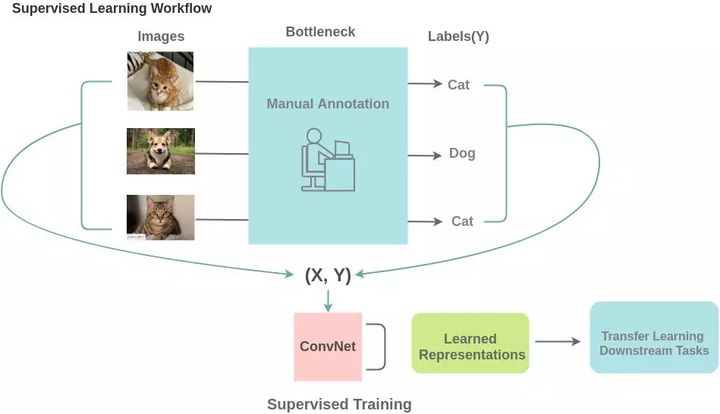
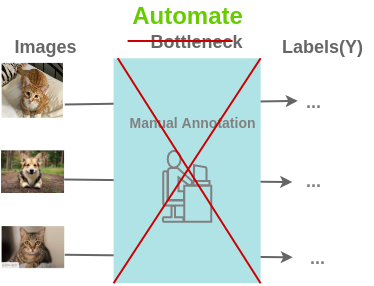
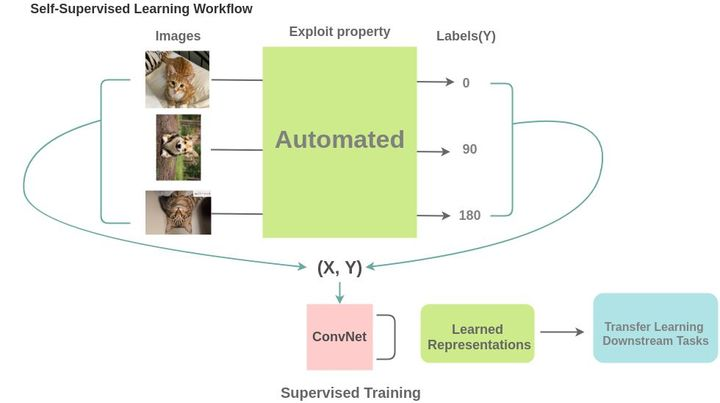
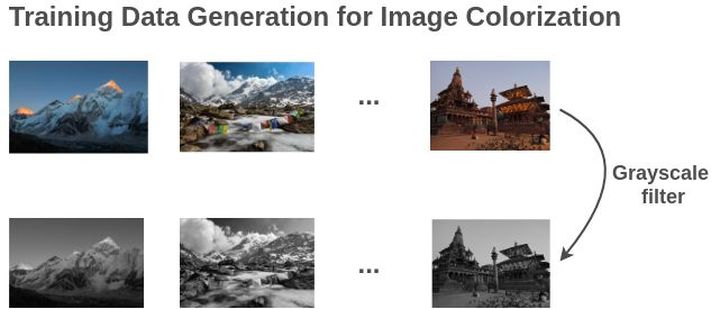

# 自监督学习

自监督学习任务主要关注于从图片自身中直接生成大量可以使用的标签而不需要人工去进行标签的标注。在下面监督学习的任务中就需要大量人工标记数据：

而自监督模型强调图片自动生成数据标签：

例如将图片的旋转一定角度之后得到的其他图片这个时候对应的标注就可以是图片的旋转角度，通过对旋转图片及其带有的角度标签进行训练我们就可以得到一个能够判别图片旋转角度的网络：

类似的任务还有对图像进行着色，图像超分辨率，图像修复，图像拼图等。

## 为什么能学习到信息？

因为在图片数据一般都存在先验的信息可以表现某些信息，例如在旋转检测问题中的先验就可能是物体的类别与其朝向之间存在相应关系；图像着色任务中的先验可能就是利用到类别与颜色分布之间的先验关系，通过这种大量存在的先验关系就可以从大量图片以及其生成的标签中进行学习。

另外图片的不同部分之间存在像素级别的连续性，在图片拼接或者图片补全的任务中可以利用类似特征进行学习

相关文章：

[自监督学习的一些思考](https://zhuanlan.zhihu.com/p/150224914)

[图解自监督学习，人工智能蛋糕中最大的一块]()

