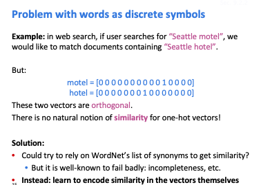

# Natural language process

## 表示单词

如何在电脑中存储一个单词的意思？

- 使用WordNet，用同义词和上位词表示，但是使用给这种方式很难实时更新词语，并且受到主观性影响比较大，需要人去标记。
- 使用one-hot向量的方式表示，传统的NLP使用这种互相正交的，仅有一个元素为1其余为0零的向量表示单词，使用这种方式当单词量增加的时候需要的存储量也会增加，同时不能表示单词之间的相关性。
- 
- 使用词向量(Word vectors)的方式表示单词，使用出现单词前后的语句定义单词的意思，根据这种语义信息提出词向量的表示方法。

## Word2vec

word2vec是一个学习词向量的框架，在这样的框架下每一个单词都有一个向量去表示，这个向量表示是通过大量的句子分析去计算，核心思想是使得在句子中相邻的单词相关性最大。

在计算相关性的过程中，需要对句子进行分析，通过中心词对其周围的词进行概率推断。

希望在一个句子中其所有词作为中心词后计算得到的可能性最大

在上面的过程中需要计算在中心词给定的情况下得到其他词的概率值，该值通过下面的式子进行计算：

该过程使用到了softmax函数，将概率值映射到0-1之间

之后就可以通过梯度下降法进行优化训练，注意在最开始的时候随机初始化各个词向量的值：

