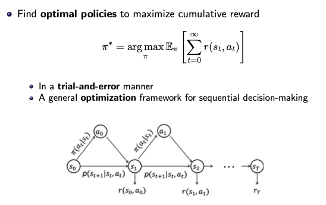

### 马尔科夫决策过程(Markov Decision Process (MDP))

一般情况下连续决策过程可以表示为马尔科夫决策过程，马尔科夫决策过程采用四元组 $M=<S,A,T,R> $ 的方式进行表示，分别代表状态、行为、转移和奖励。其中转移过程是指从一个状态以一定动作转移到下一个状态的概率(实际决策过程中一般不知道这个值)，奖励则代表以一个状态在一定动作下转移到下一个状态获得的回报值(这里的回报值往往是自己进行设计的，更直观的理解在迷宫的例子)。

因为我们需要对模型进行训练，所以我们需要有一个明确的目标，在监督学习中我们的优化目标是损失函数最小，在强化学习中由于我们并不知道真实的标签信息，所以优化的目标为最大化累计奖励值(累计奖励指的是整个过程中所有回报值之和)：
$$
\pi = \arg\max_\pi \mathbb{E}_\pi\big[\sum_{t=0}^\infin r(s_t,a_t)\big]
$$

> 这里使用期望的形式是因为在实际的训练过程中我们会有很对不同的决策过程，我们希望所有决策过程的累计奖励的均值保持最大

强化学习实际上是一个智能体与环境不断进行交互的过程，智能体不断从环境中获取当前状态信息以及奖励值并以此做出相应动作：

### 环境动态性

从一个状态转移到另一个状态有一定的转移概率，该转移概率由参数 $p$ 给出，由于马尔科夫特性，$p(S_t,R_t|S_{t-1},A_{t-1})$ 的值仅和当前状态与上一状态相关，而与上一状态之前的所有状态都没有关系

一般在model-free的模型中不考虑该转移情况，仅在model-based的情况下考虑。

