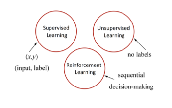
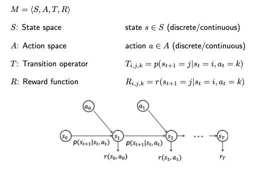
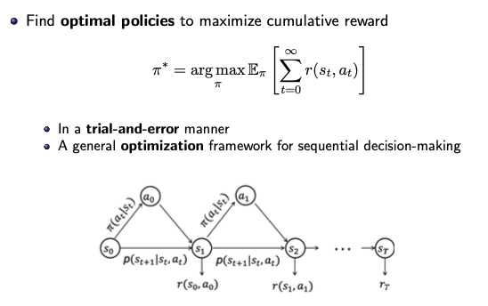
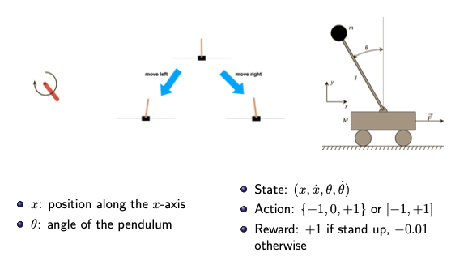
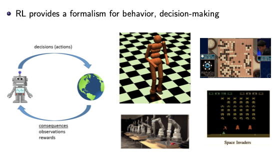
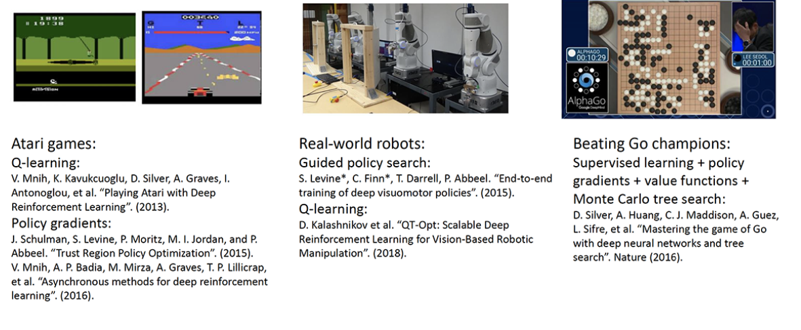

# Reinforcement Learning

## Preliminaries

机器学习主要分为三个领域：强化学习、无监督学习和有监督学习。

其中有监督学习主要通过输入数据以及数据所带的标签信息对模型进行训练，通过训练后的模型对其他来源的数据的标签进行预测；而无监督学习在训练的过程中不需要数据的标签信息，通过学习不同数据之间的特征的相似性与差异性对数据进行分类，训练后的模型同样对数据进行预测；强化学习不同于以上两种形式，他是一个优化连续决策以获得最大效益的过程，在这个过程中同样需要从环境中采样数据进行训练，训练后的模型用于指导智能体在特定的状态下执行决策。

无监督学习和有监督学习的相关内容不在本系列的涵盖范围内，详情可以参见无监督学习和有监督学习(后期整理)。

## Introduction to RL

本章节主要对强化学习的基础概念以及应用进行介绍。

### 强化学习基本概念

从根本上说强化学习是一个帮助进行连续决策的模型，它从以往的经验中学习如何决策才能取得最好的效果，例如从 A 地到 B 地可能有不同的路线a,b,c，我们通过分别走三条路线进行实验发现路线a占用时间最短，那么在以后在决策过程中就直接选择路线a，在这个例子中仅有一个初始状态A，实际的强化学习优化的决策过程可能有无数个状态(例如对连续控制模型倒立摆控制，倒立摆的状态空间就是连续的)。

强化学习与标准的监督学习的区别：

- 在监督学习中我们往往假设样本之间是i.i.d(独立同分布)的，也就是不同样本之间不会存在互相影响；并且在训练过程中我们知道样本的真实标签

- 强化学习的样本之间存在马尔科夫特性(当前样本仅和上一个样本相关，而与之前的样本无关)；在训练过程中并不知道样本的真实标签，只知道奖励值

### 马尔科夫决策过程(Markov Decision Process (MDP))

一般情况下连续决策过程可以表示为马尔科夫决策过程，马尔科夫决策过程采用四元组 $M=<S,A,T,R> $ 的方式进行表示，分别代表状态、行为、转移和奖励。其中转移过程是指从一个状态以一定动作转移到下一个状态的概率(实际决策过程中一般不知道这个值)，奖励则代表以一个状态在一定动作下转移到下一个状态获得的回报值(这里的回报值往往是自己进行设计的，更直观的理解在迷宫的例子)。

因为我们需要对模型进行训练，所以我们需要有一个明确的目标，在监督学习中我们的优化目标是损失函数最小，在强化学习中由于我们并不知道真实的标签信息，所以优化的目标为最大化累计奖励值(累计奖励指的是整个过程中所有回报值之和)：
$$
\pi = \arg\max_\pi \mathbb{E}_\pi\big[\sum_{t=0}^\infin r(s_t,a_t)\big]
$$

> 这里使用期望的形式是因为在实际的训练过程中我们会有很对不同的决策过程，我们希望所有决策过程的累计奖励的均值保持最大

下面以一个倒立摆的例子来理解马尔科夫决策过程的表示方式：

在倒立摆中，定义状态 $S$ 为 $x$ 轴方向的距离和速度以及偏离中心的角度 $\theta$ 和角速度；定义动作 $A$ 为向左和向右移动摆锤；定义奖励 $R$ 为如果直立就是 $+1$，其他情况下为 $-0.01$；在这个决策过程中我们可以看到动作空间是一个连续空间(取值为连续变量)，我们想要优化这个决策过程，就是使得倒立摆尽可能保持直立过程，从奖励的角度说就是使得奖励值尽可能大。

### 强化学习的应用

现在强化学习的模型普遍用于游戏AI领域(王者荣耀觉悟、Alpha Go)、智能机器人控制以及无人驾驶

