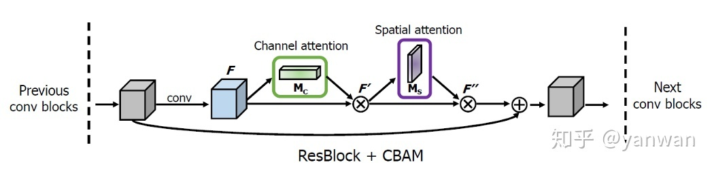
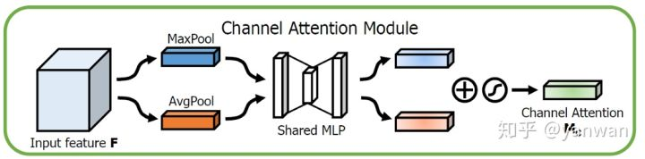
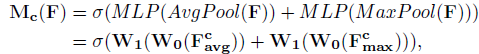
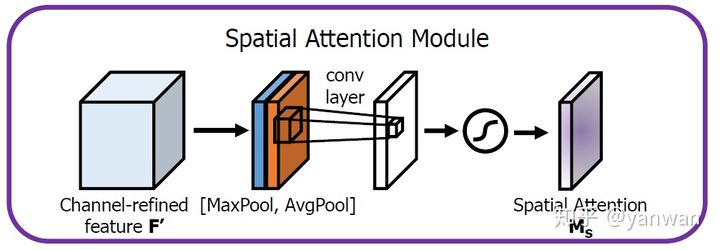
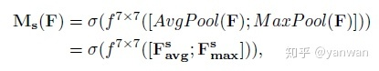
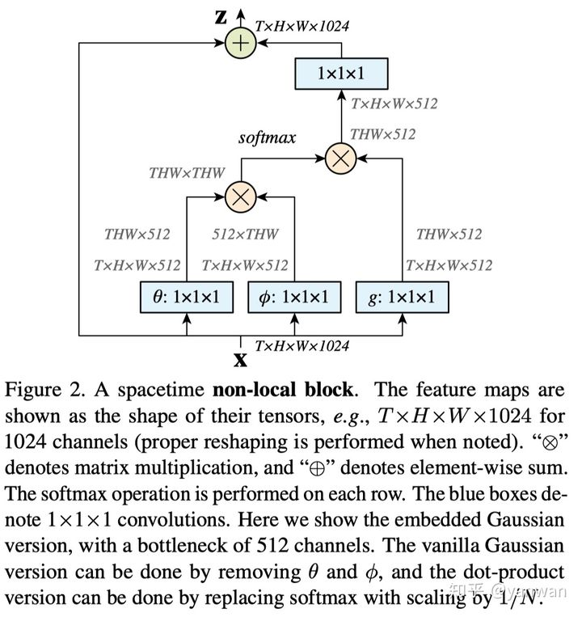
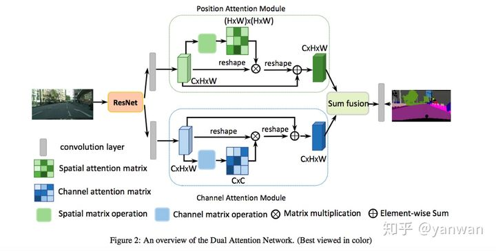
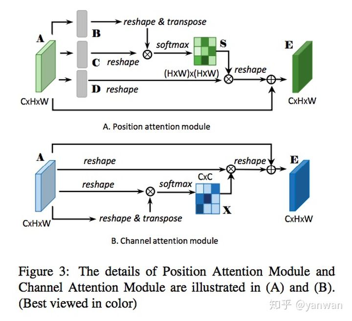

# Attention

Attention最早在NLP领域提出，其应用的主要目的就是为了更加关注文本中的上下文信息，其进行的主要工作就是对原词向量进行加权重更新，使得结果向量在我们关注的部分的值更大。

## 1 Attention的主要结构

我们以NLP任务为背景对Attention进行介绍，Attention 结构主要包括三个部分：

1. score function: 计算我们当前单词输入特征向量 Query 和所有单词输入特征向量 Key 的相似度
2. alignment function: 对得到的相似度进行归一化
3. gen context vector function: 用相似度与所有单词特征 Value 相乘得到最终输出


QKV的取值有很多方式，通过改变其取值对象我们可以使得模型关注到不同的部分，在self-attention的结构中，QKV都是输入特征向量的线性变换：
$$
\begin{align}
Query = w_Q*x_1 \\
Key = w_K*x_1 \\
Value = w_V*x_1 \\
\end{align}
$$
下面的例子说明一个词向量经过self-attention后的计算结果：


## 2 视觉Attention结构

在卷积中应用attention的主要步骤与在NLP中类似，同样存在query、key和value以及三个主要步骤：


1.第一步是利用query和key进行相似度的计算，常用的相似度计算函数：


2.第二步是使用softmax函数将权重归一化：


3.最后将归一化的权重和value加权相乘得到attention后的结果：


下面以代码的形式展现self-attention的实现过程：

```python
class Self_Attn(nn.Module):
    """ Self attention Layer"""
    def __init__(self,in_dim,activation):
        super(Self_Attn,self).__init__()
        self.chanel_in = in_dim
        self.activation = activation
 
        self.query_conv = nn.Conv2d(in_channels = in_dim , out_channels = in_dim//8 , kernel_size= 1)
        self.key_conv = nn.Conv2d(in_channels = in_dim , out_channels = in_dim//8 , kernel_size= 1)
        self.value_conv = nn.Conv2d(in_channels = in_dim , out_channels = in_dim , kernel_size= 1)
        self.gamma = nn.Parameter(torch.zeros(1))
 
        self.softmax  = nn.Softmax(dim=-1)
    def forward(self,x):
        """
            inputs :
                x : input feature maps( B * C * W * H)
            returns :
                out : self attention value + input feature
                attention: B * N * N (N is Width*Height)
        """
        m_batchsize,C,width ,height = x.size()
        proj_query  = self.query_conv(x).view(m_batchsize,-1,width*height).permute(0,2,1) # B*N*C/8
        proj_key =  self.key_conv(x).view(m_batchsize,-1,width*height) # B*C*N/8
        energy =  torch.bmm(proj_query,proj_key) # batch的matmul B*N*N
        attention = self.softmax(energy) # B * (N) * (N)
        proj_value = self.value_conv(x).view(m_batchsize,-1, width*height) # B * C * N
 
        out = torch.bmm(proj_value,attention.permute(0,2,1) ) # B*C*N
        out = out.view(m_batchsize,C,width,height) # B*C*H*W
 
        out = self.gamma*out + x
        return out,attention
```

### [SENet](https://arxiv.org/abs/1709.01507)

早期使用Attention的网络，该网路用到了channel层级的注意力，首先对三维feature map进行channel层级的maxpooling然后将这些值输入到一个神经网络中学习权重，学习后就对之前feature map进行加权，该网络能够更好的学习全局特征。


该实现的代码非常简洁：

```python
class SELayer(nn.Module):
    def __init__(self, channel, reduction=16):
        super(SELayer, self).__init__()
        self.avg_pool = nn.AdaptiveAvgPool2d(1) # 压缩空间
        self.fc = nn.Sequential(
            nn.Linear(channel, channel // reduction, bias=False),
            nn.ReLU(inplace=True),
            nn.Linear(channel // reduction, channel, bias=False),
            nn.Sigmoid()
        )

    def forward(self, x):
        b, c, _, _ = x.size()
        y = self.avg_pool(x).view(b, c)
        y = self.fc(y).view(b, c, 1, 1)
        return x * y.expand_as(x)
```

### [CBAM](https://link.zhihu.com/?target=https%3A//arxiv.org/abs/1807.06521)

CBAM使用两种Attention，一个是channel层级的(沿着channel进行pooling) **Channel Attention Module**，一个是spatial层级的(沿着$H \times W$进行)**Spatial Attention Module**。



在上图中可以看出在进行attention之前还有一步conv的过程，然后依次进行channel和spatial层级的attention。

#### Channel Attention Module



对channel层级进行两种pooling操作后通过一个多层感知机(可以用1*1conv实现)，然后将两者相加后进行sigmoid操作



#### Sptial Attention Module



在 $H\times W$ 维度进行两种pooling操作将两个输出concat变为channel层数为2的Feature map，最后通过一个卷积层将其变为channel层级为1的空间注意力输出。



以代码的形式对上面的过程进行理解：

```python
def conv3x3(in_planes, out_planes, stride=1):
    "3x3 convolution with padding"
    return nn.Conv2d(in_planes, out_planes, kernel_size=3, stride=stride,
                     padding=1, bias=False)

class ChannelAttention(nn.Module):
    def __init__(self, in_planes, ratio=16):
        super(ChannelAttention, self).__init__()
        self.avg_pool = nn.AdaptiveAvgPool2d(1) # 压缩空间
        self.max_pool = nn.AdaptiveMaxPool2d(1)

        self.fc1   = nn.Conv2d(in_planes, in_planes // 16, 1, bias=False)
        self.relu1 = nn.ReLU()
        self.fc2   = nn.Conv2d(in_planes // 16, in_planes, 1, bias=False)

        self.sigmoid = nn.Sigmoid()

    def forward(self, x):
        avg_out = self.fc2(self.relu1(self.fc1(self.avg_pool(x))))
        max_out = self.fc2(self.relu1(self.fc1(self.max_pool(x))))
        out = avg_out + max_out  # [b, C, 1, 1]
        return self.sigmoid(out)

class SpatialAttention(nn.Module):
    def __init__(self, kernel_size=7):
        super(SpatialAttention, self).__init__()

        assert kernel_size in (3, 7), 'kernel size must be 3 or 7'
        padding = 3 if kernel_size == 7 else 1

        self.conv1 = nn.Conv2d(2, 1, kernel_size, padding=padding, bias=False)
        self.sigmoid = nn.Sigmoid()

    def forward(self, x):
        avg_out = torch.mean(x, dim=1, keepdim=True)  # 压缩通道
        max_out, _ = torch.max(x, dim=1, keepdim=True)   # 压缩通道
        x = torch.cat([avg_out, max_out], dim=1)  # [b, 1, h, w]
        x = self.conv1(x)
        return self.sigmoid(x)

class BasicBlock(nn.Module):
    expansion = 1

    def __init__(self, inplanes, planes, stride=1, downsample=None):
        super(BasicBlock, self).__init__()
        self.conv1 = conv3x3(inplanes, planes, stride)
        self.bn1 = nn.BatchNorm2d(planes)
        self.relu = nn.ReLU(inplace=True)
        self.conv2 = conv3x3(planes, planes)
        self.bn2 = nn.BatchNorm2d(planes)

        self.ca = ChannelAttention(planes)
        self.sa = SpatialAttention()

        self.downsample = downsample
        self.stride = stride

    def forward(self, x):
        residual = x

        out = self.conv1(x)
        out = self.bn1(out)
        out = self.relu(out)

        out = self.conv2(out)
        out = self.bn2(out)

        out = self.ca(out) * out
        out = self.sa(out) * out

        if self.downsample is not None:
            residual = self.downsample(x)

        out += residual
        out = self.relu(out)

        return out

```

### [Non-local](https://arxiv.org/abs/1711.07971)

Non-local的实现完全按照self-attention的方式进行，首先根据输入生成Query、Key和Value三个值，然后根据Query和Key建立计算得到对Value的加权值，最后对Value进行加权后与原来输入相加。



因为原文是处理视频数据所以会有T为时间维度，如果处理图片就不需要这个维度

```python
class _NonLocalBlockND(nn.Module):
    """
    调用过程
    NONLocalBlock2D(in_channels=32),
    super(NONLocalBlock2D, self).__init__(in_channels,
            inter_channels=inter_channels,
            dimension=2, sub_sample=sub_sample,
            bn_layer=bn_layer)
    """
    def __init__(self,
                 in_channels,
                 inter_channels=None,
                 dimension=3,
                 sub_sample=True,
                 bn_layer=True):
        super(_NonLocalBlockND, self).__init__()

        assert dimension in [1, 2, 3]

        self.dimension = dimension
        self.sub_sample = sub_sample

        self.in_channels = in_channels
        self.inter_channels = inter_channels

        if self.inter_channels is None:
            self.inter_channels = in_channels // 2
            # 进行压缩得到channel个数
            if self.inter_channels == 0:
                self.inter_channels = 1

        if dimension == 3:
            conv_nd = nn.Conv3d
            max_pool_layer = nn.MaxPool3d(kernel_size=(1, 2, 2))
            bn = nn.BatchNorm3d
        elif dimension == 2:
            conv_nd = nn.Conv2d
            max_pool_layer = nn.MaxPool2d(kernel_size=(2, 2))
            bn = nn.BatchNorm2d
        else:
            conv_nd = nn.Conv1d
            max_pool_layer = nn.MaxPool1d(kernel_size=(2))
            bn = nn.BatchNorm1d

        self.g = conv_nd(in_channels=self.in_channels,
                         out_channels=self.inter_channels,
                         kernel_size=1,
                         stride=1,
                         padding=0)

        if bn_layer:
            self.W = nn.Sequential(
                conv_nd(in_channels=self.inter_channels,
                        out_channels=self.in_channels,
                        kernel_size=1,
                        stride=1,
                        padding=0), bn(self.in_channels))
            nn.init.constant_(self.W[1].weight, 0)
            nn.init.constant_(self.W[1].bias, 0)
        else:
            self.W = conv_nd(in_channels=self.inter_channels,
                             out_channels=self.in_channels,
                             kernel_size=1,
                             stride=1,
                             padding=0)
            nn.init.constant_(self.W.weight, 0)
            nn.init.constant_(self.W.bias, 0)

        self.theta = conv_nd(in_channels=self.in_channels,
                             out_channels=self.inter_channels,
                             kernel_size=1,
                             stride=1,
                             padding=0)
        self.phi = conv_nd(in_channels=self.in_channels,
                           out_channels=self.inter_channels,
                           kernel_size=1,
                           stride=1,
                           padding=0)

        if sub_sample:
            self.g = nn.Sequential(self.g, max_pool_layer)
            self.phi = nn.Sequential(self.phi, max_pool_layer)

    def forward(self, x):
        '''
        :param x: (b, c,  h, w)
        :return:
        '''

        batch_size = x.size(0)

        g_x = self.g(x).view(batch_size, self.inter_channels, -1)#[bs, c, w*h]
        g_x = g_x.permute(0, 2, 1)

        theta_x = self.theta(x).view(batch_size, self.inter_channels, -1)
        theta_x = theta_x.permute(0, 2, 1)

        phi_x = self.phi(x).view(batch_size, self.inter_channels, -1)
        
        f = torch.matmul(theta_x, phi_x)

        print(f.shape)

        f_div_C = F.softmax(f, dim=-1)

        y = torch.matmul(f_div_C, g_x)
        y = y.permute(0, 2, 1).contiguous()
        y = y.view(batch_size, self.inter_channels, *x.size()[2:])
        W_y = self.W(y)
        z = W_y + x
        return z
```

### DANet

DANet也运用了self-attention的思想并将其应用的channel维度以及sptial维度上：



进一步研究上面的两种结构，其实都是self-attention中QVK的形式对原来的feature map进行加权，只不过一个注意力在sptial，一个注意力在channel。



```python
class PAM_Module(Module):
    """ Position attention module"""
    #Ref from SAGAN
    def __init__(self, in_dim):
        super(PAM_Module, self).__init__()
        self.chanel_in = in_dim
 
        # 先经过3个卷积层生成3个新特征图B C D （尺寸不变）
        self.query_conv = Conv2d(in_channels=in_dim, out_channels=in_dim//8, kernel_size=1)
        self.key_conv = Conv2d(in_channels=in_dim, out_channels=in_dim//8, kernel_size=1)
        self.value_conv = Conv2d(in_channels=in_dim, out_channels=in_dim, kernel_size=1)
        self.gamma = Parameter(torch.zeros(1))  # α尺度系数初始化为0，并逐渐地学习分配到更大的权重
 
        self.softmax = Softmax(dim=-1)  # 对每一行进行softmax
    def forward(self, x):
        """
            inputs :
                x : input feature maps( B × C × H × W)
            returns :
                out : attention value + input feature
                attention: B × (H×W) × (H×W)
        """
        m_batchsize, C, height, width = x.size()
        # B -> (N,C,HW) -> (N,HW,C)
        proj_query = self.query_conv(x).view(m_batchsize, -1, width*height).permute(0, 2, 1)
        # C -> (N,C,HW)
        proj_key = self.key_conv(x).view(m_batchsize, -1, width*height)
        # BC，空间注意图 -> (N,HW,HW)
        energy = torch.bmm(proj_query, proj_key)
        # S = softmax(BC) -> (N,HW,HW)
        attention = self.softmax(energy)
        # D -> (N,C,HW)
        proj_value = self.value_conv(x).view(m_batchsize, -1, width*height)
        # DS -> (N,C,HW)
        out = torch.bmm(proj_value, attention.permute(0, 2, 1))  # torch.bmm表示批次矩阵乘法
        # output -> (N,C,H,W)
        out = out.view(m_batchsize, C, height, width)
 
        out = self.gamma*out + x
        return out
 
 
class CAM_Module(Module):
    """ Channel attention module"""
    def __init__(self, in_dim):
        super(CAM_Module, self).__init__()
        self.chanel_in = in_dim
 
 
        self.gamma = Parameter(torch.zeros(1))  # β尺度系数初始化为0，并逐渐地学习分配到更大的权重
        self.softmax  = Softmax(dim=-1)  # 对每一行进行softmax
    def forward(self,x):
        """
            inputs :
                x : input feature maps( B × C × H × W)
            returns :
                out : attention value + input feature
                attention: B × C × C
        """
        m_batchsize, C, height, width = x.size()
        # A -> (N,C,HW)
        proj_query = x.view(m_batchsize, C, -1)
        # A -> (N,HW,C)
        proj_key = x.view(m_batchsize, C, -1).permute(0, 2, 1)
        # 矩阵乘积，通道注意图：X -> (N,C,C)
        energy = torch.bmm(proj_query, proj_key)
        # 这里实现了softmax用最后一维的最大值减去了原始数据，获得了一个不是太大的值
        # 沿着最后一维的C选择最大值，keepdim保证输出和输入形状一致，除了指定的dim维度大小为1
        # expand_as表示以复制的形式扩展到energy的尺寸
        energy_new = torch.max(energy, -1, keepdim=True)[0].expand_as(energy)-energy
        
        attention = self.softmax(energy_new)
        # A -> (N,C,HW)
        proj_value = x.view(m_batchsize, C, -1)
        # XA -> （N,C,HW）
        out = torch.bmm(attention, proj_value)
        # output -> (N,C,H,W)
        out = out.view(m_batchsize, C, height, width)
        
        out = self.gamma*out + x
        return out


class DANetHead(nn.Module):
    def __init__(self, in_channels, out_channels, norm_layer):
        super(DANetHead, self).__init__()
        inter_channels = in_channels // 4  # in_channels=2018，通道数缩减为512
        
        self.conv5a = nn.Sequential(nn.Conv2d(in_channels, inter_channels, 3, padding=1, bias=False), norm_layer(inter_channels), nn.ReLU())       
        self.conv5c = nn.Sequential(nn.Conv2d(in_channels, inter_channels, 3, padding=1, bias=False), norm_layer(inter_channels), nn.ReLU())
 
        self.sa = PAM_Module(inter_channels)  # 空间注意力模块
        self.sc = CAM_Module(inter_channels)  # 通道注意力模块
        
        self.conv51 = nn.Sequential(nn.Conv2d(inter_channels, inter_channels, 3, padding=1, bias=False), norm_layer(inter_channels), nn.ReLU())
        self.conv52 = nn.Sequential(nn.Conv2d(inter_channels, inter_channels, 3, padding=1, bias=False), norm_layer(inter_channels), nn.ReLU())
        
        # nn.Dropout2d(p,inplace)：p表示将元素置0的概率；inplace若设置为True，会在原地执行操作。
        self.conv6 = nn.Sequential(nn.Dropout2d(0.1, False), nn.Conv2d(512, out_channels, 1))  # 输出通道数为类别的数目
        self.conv7 = nn.Sequential(nn.Dropout2d(0.1, False), nn.Conv2d(512, out_channels, 1))
        self.conv8 = nn.Sequential(nn.Dropout2d(0.1, False), nn.Conv2d(512, out_channels, 1))
 
    def forward(self, x):
        # 经过一个1×1卷积降维后，再送入空间注意力模块
        feat1 = self.conv5a(x)
        sa_feat = self.sa(feat1)  
        # 先经过一个卷积后，再使用有dropout的1×1卷积输出指定的通道数
        sa_conv = self.conv51(sa_feat)
        sa_output = self.conv6(sa_conv)  
 
        # 经过一个1×1卷积降维后，再送入通道注意力模块
        feat2 = self.conv5c(x)
        sc_feat = self.sc(feat2)
        # 先经过一个卷积后，再使用有dropout的1×1卷积输出指定的通道数
        sc_conv = self.conv52(sc_feat)
        sc_output = self.conv7(sc_conv)
 
        feat_sum = sa_conv+sc_conv  # 两个注意力模块结果相加       
        sasc_output = self.conv8(feat_sum)  # 最后再送入1个有dropout的1×1卷积中
 
        output = [sasc_output]
        output.append(sa_output)
        output.append(sc_output)
        return tuple(output)  # 输出模块融合后的结果，以及两个模块各自的结果

```


本文参考文章：

[遍地开花的 Attention，你真的懂吗？](https://zhuanlan.zhihu.com/p/77307258)

[详解Transformer （Attention Is All You Need）](https://zhuanlan.zhihu.com/p/48508221)

 [CV中的Attention和Self-Attention](https://zhuanlan.zhihu.com/p/283125663)