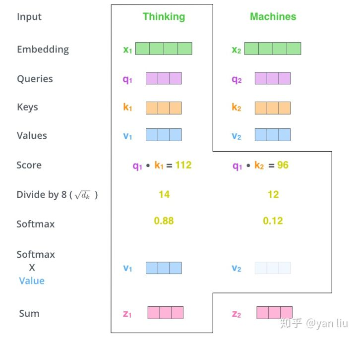

# Attention

Attention最早在NLP领域提出，其应用的主要目的就是为了更加关注文本中的上下文信息，其进行的主要工作就是对原词向量进行加权重更新，使得结果向量在我们关注的部分的值更大。

## 1 Attention的主要结构

我们以NLP任务为背景对Attention进行介绍，Attention 结构主要包括三个部分：

1. score function: 计算我们当前单词输入特征向量 Query 和所有单词输入特征向量 Key 的相似度
2. alignment function: 对得到的相似度进行归一化
3. gen context vector function: 用相似度与所有单词特征 Value 相乘得到最终输出


QKV的取值有很多方式，通过改变其取值对象我们可以使得模型关注到不同的部分，在self-attention的结构中，QKV都是输入特征向量的线性变换：
$$
\begin{align}
Query = w_Q*x_1 \\
Key = w_K*x_1 \\
Value = w_V*x_1 \\
\end{align}
$$
下面的例子说明一个词向量经过self-attention后的计算结果：



## 2 视觉Attention结构

在卷积中应用attention的主要步骤与在NLP中类似，同样存在query、key和value以及三个主要步骤：


1.第一步是利用query和key进行相似度的计算，常用的相似度计算函数：


2.第二步是使用softmax函数将权重归一化：


3.最后将归一化的权重和value加权相乘得到attention后的结果：


下面以代码的形式展现self-attention的实现过程：

```python
class Self_Attn(nn.Module):
    """ Self attention Layer"""
    def __init__(self,in_dim,activation):
        super(Self_Attn,self).__init__()
        self.chanel_in = in_dim
        self.activation = activation
 
        self.query_conv = nn.Conv2d(in_channels = in_dim , out_channels = in_dim//8 , kernel_size= 1)
        self.key_conv = nn.Conv2d(in_channels = in_dim , out_channels = in_dim//8 , kernel_size= 1)
        self.value_conv = nn.Conv2d(in_channels = in_dim , out_channels = in_dim , kernel_size= 1)
        self.gamma = nn.Parameter(torch.zeros(1))
 
        self.softmax  = nn.Softmax(dim=-1)
    def forward(self,x):
        """
            inputs :
                x : input feature maps( B * C * W * H)
            returns :
                out : self attention value + input feature
                attention: B * N * N (N is Width*Height)
        """
        m_batchsize,C,width ,height = x.size()
        proj_query  = self.query_conv(x).view(m_batchsize,-1,width*height).permute(0,2,1) # B*N*C/8
        proj_key =  self.key_conv(x).view(m_batchsize,-1,width*height) # B*C*N/8
        energy =  torch.bmm(proj_query,proj_key) # batch的matmul B*N*N
        attention = self.softmax(energy) # B * (N) * (N)
        proj_value = self.value_conv(x).view(m_batchsize,-1, width*height) # B * C * N
 
        out = torch.bmm(proj_value,attention.permute(0,2,1) ) # B*C*N
        out = out.view(m_batchsize,C,width,height) # B*C*H*W
 
        out = self.gamma*out + x
        return out,attention
```

### SENet

早期使用attention的网络，该网路用到了channel层级的注意力，首先对三为卷积进行


本文参考文章：

[遍地开花的 Attention，你真的懂吗？](https://zhuanlan.zhihu.com/p/77307258)

[详解Transformer （Attention Is All You Need）](https://zhuanlan.zhihu.com/p/48508221)