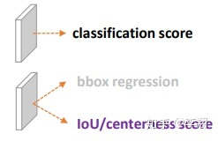
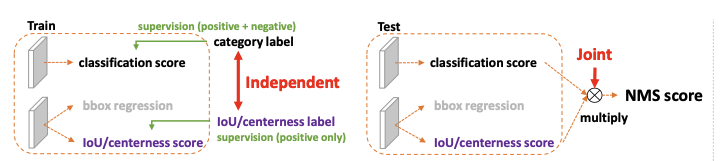
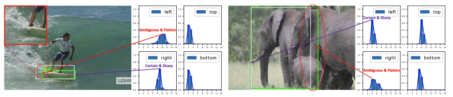
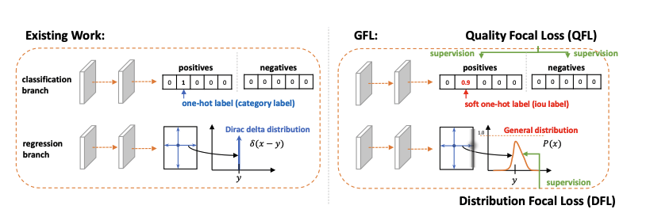

# Generalized Focal Loss

论文地址：[Generalized Focal Loss]( https://link.zhihu.com/?target=https%3A//arxiv.org/pdf/2006.04388.pdf)

源码和预训练模型：[Generalized Focal Loss](https://link.zhihu.com/?target=https%3A//github.com/implus/GFocal)

作者讲解：https://zhuanlan.zhihu.com/p/147691786

本文是在one-stage检测器上的输出表示的改进，在原来的检测任务中的输出主要包三个部分：

分类分数，回归的检测框以及IOU或者中心检测的分数。

1.在本文中作者观察到目标检测任务中分类以及IOU两项指标之间的存在训练与测试过程中的不一致性，具体表现在训练中各自优化两个指标，测试的时候却使用两者相乘作为最终结果，于是提出一种新的指标作为监督信号，在原来hard code的分类监督上加入质量预测的信息形成soft的监督信息。这里实际上形成了一种endtoend的结构，及最终测试的表现结果就是我们训练的目标。

2.bbox regression采用的表示很不灵活，只能唯一输出一个边框的位置，非常不灵活，文中提出的将边框预测的输出改为一个分布，这样输出的就是一个可以变化的边框，同时从分布中也能读出很多预测出来的信息

如果边框预测较好的话输出的分布整体比较尖锐，而如果预测出来的界限比较模糊的话输出的分布就会比较平坦，从这种分布信息中也能学习到标签信息。

像上面对伞进行定位的时候下方边框的预测分布是双峰的，这两个峰就分别表示图片中显式的伞的部分以及被遮挡的伞的下半部分，对于具有遮挡物体的定位具有很好的启发性。

GFL的v2版本实际上就对这个分布进行了利用，将分布情况加入到最终的指标评价系统中去取得了很好的效果。

https://zhuanlan.zhihu.com/p/313684358

