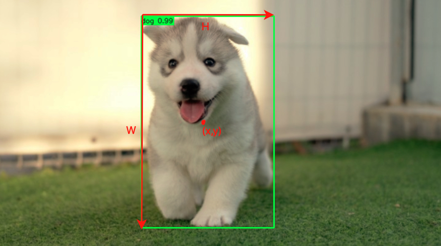
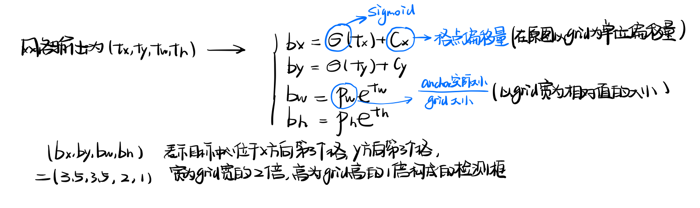
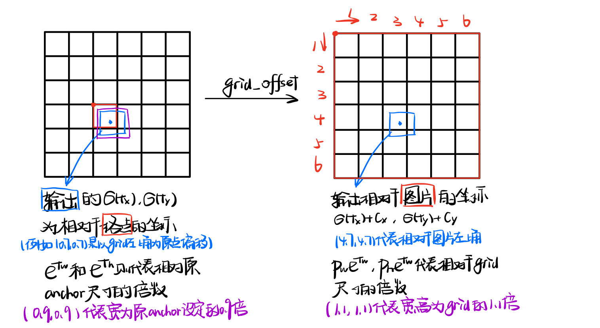
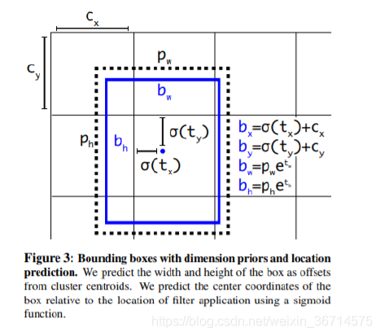
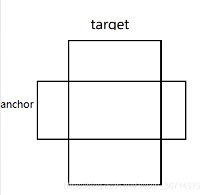
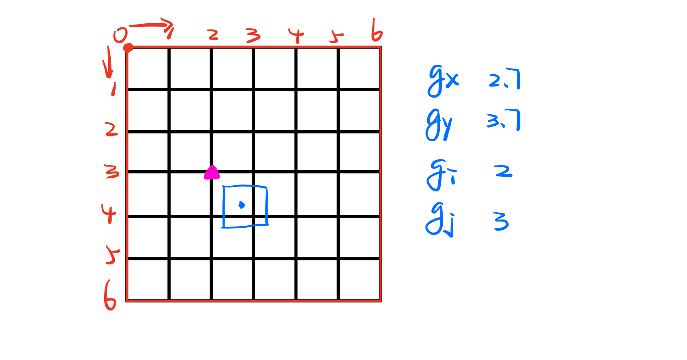
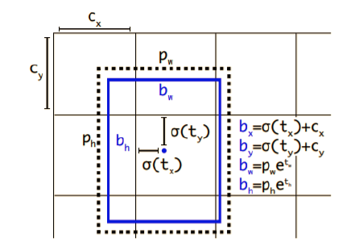

# Yolov3模型构建解析

yolov3的源码采用[Pytorch-Yolov3](https://github.com/eriklindernoren/PyTorch-YOLOv3)，该源码可在github上找到

## 0 前期准备

为了方便分析数据tensor的在整个网络中的流动过程，采用debug的方式观察中间变量的维度信息，原文件中采用coco数据集，为了方便调试，可以在 ``train.py`` 文件中对数据集进行修改(原github代码中含有一个便于进行debug的数据集 `custom.data` ):

```python
parser.add_argument("--data_config", type=str, default="config/custom.data", help="path to data config file")
```

为了更好地观测以及理解不同tensor的含义，这里我们在原来自带数据集中再添加了一张图片，同时对label文件进行更改，添加了一个新的对应于新图片的label文件。

## 1 网络模型构建

首先需要关注 yolov3 所使用的 Darknet 模型是如何进行构建的，我们在 `model.py ` 中找到 `Darknet `类：

```python
class Darknet(nn.Module):
    """YOLOv3 object detection model"""

    def __init__(self, config_path, img_size=416):
        super(Darknet, self).__init__()
        self.module_defs = parse_model_config(config_path)
        self.hyperparams, self.module_list = create_modules(self.module_defs)
        self.yolo_layers = [layer[0] for layer in self.module_list if hasattr(layer[0], "metrics")]
        self.img_size = img_size
        self.seen = 0
        self.header_info = np.array([0, 0, 0, self.seen, 0], dtype=np.int32)
        
    def forward(self, x, targets=None):
    		...
		def load_darknet_weights(self, weights_path):
				...
    def save_darknet_weights(self, path, cutoff=-1):
        ...

```

首先关注 `_init_` 函数，传入参数为网络配置文件的地址 `config_path` 和图片的尺寸 `img_size`，之后的部分我们拆分为：

1. 配置文件的解析 `parse_model_config(config_path)` 
2. 网络模型构建 `create_modules(self.module_defs)`
3. 前向传播过程 `def forward(self, x, targets=None)`

### 1.1 配置文件解析

需要构建的网络结构以及每一层的具体参数都已经由配置文件 `*/config/yolov3.cfg` 给出，在这个配置文件中各个部分的含义如下：

**[net] ：**初始化网络的基本参数以及学习策略参数

```python
[net]
# Testing
#batch=1
#subdivisions=1
# Training
batch=16
width=416
height=416
channels=3
learning_rate=0.001
...
```

**[convolution]：**卷积层，参数指定了常见的有卷积核的kernel size、padding、stride之类的。以及是否跟随BN层，是否跟随激活层。可以注意到默认的激活函数是leaky-relu。

```
[convolutional]
batch_normalize=1
filters=32
size=3
stride=1
pad=1
activation=leaky
```

**[shortcut]:** 残差结构，其中from参数代表从哪当前层向前回溯的层数

```
[shortcut]
from=-3
activation=linear
```

**[yolo]：**检测层，yolo对应的是一个模型的最终输出，因为yolov3采用的类似FPN结构的输出，所以有3个yolo layer，其中用参数`mask` 区分三个layer分别选择不同的 anchor 值(代表检测框的宽和高)

```
[yolo]
mask = 6,7,8
anchors = 10,13,  16,30,  33,23,  30,61,  62,45,  59,119,  116,90,  156,198,  373,326
classes=80
num=9
jitter=.3
ignore_thresh = .7
truth_thresh = 1
random=1
```

**[route]:** 来自不同层的特征融合，是tensor在channel维度的叠加。因为存在FPN结构，所以yolov3 在多个地方进行了上采样+特征融合。

```
[route]
layers = -4
```

**[upsample]:**  两倍上采样，从较小的尺寸变为较大尺寸的feature map，默认通过双线性插值的方式

```
[upsample]
stride=2
```

在了解了配置文件中各个层的参数以及作用后，我们来看一下具体如何读取配置文件的：

```python
def parse_model_config(path):
    """Parses the yolo-v3 layer configuration file and returns module definitions"""
    file = open(path, 'r')
    lines = file.read().split('\n')
    lines = [x for x in lines if x and not x.startswith('#')]
    lines = [x.rstrip().lstrip() for x in lines] # get rid of fringe whitespaces
    module_defs = []
    for line in lines:
        if line.startswith('['): # This marks the start of a new block
            module_defs.append({})
            module_defs[-1]['type'] = line[1:-1].rstrip()
            if module_defs[-1]['type'] == 'convolutional':
                module_defs[-1]['batch_normalize'] = 0
        else:
            key, value = line.split("=")
            value = value.strip()
            module_defs[-1][key.rstrip()] = value.strip()

    return module_defs
```

该函数传入参数为配置文件的地址，在打开文件读取每一行并用 `[` 对不同层进行区分，每一层都是list中一个dict形式进行存储，最终的返回的是一个列表，其中每一个元素都是一个字典：


根据上面得到的配置信息，我们可以画出来下面这样的模型结构图


可以看到最终的featuremap的channel数量都是255，这是因为一共有80个类别

### 1.2 网络模型构建

在得到配置文件的信息后，我们需要根据这个信息构建相应的modules以实现网络模型的搭建，在pytorch中构建网络的方式有很多种，在这里使用nn.Sequential()的方式进行构建：

```python
def create_modules(module_defs):
    """
    Constructs module list of layer blocks from module configuration in module_defs
    """
    hyperparams = module_defs.pop(0)
    output_filters = [int(hyperparams["channels"])]
    module_list = nn.ModuleList()
    for module_i, module_def in enumerate(module_defs):
        modules = nn.Sequential()
        
        if module_def["type"] == "convolutional":
            bn = int(module_def["batch_normalize"])
            filters = int(module_def["filters"])
            kernel_size = int(module_def["size"])
            pad = (kernel_size - 1) // 2
            modules.add_module(
                f"conv_{module_i}",
                nn.Conv2d(
                    in_channels=output_filters[-1],
                    out_channels=filters,
                    kernel_size=kernel_size,
                    stride=int(module_def["stride"]),
                    padding=pad,
                    bias=not bn,
                ),
            )
            if bn:
                modules.add_module(f"batch_norm_{module_i}", nn.BatchNorm2d(filters, momentum=0.9, eps=1e-5))
            if module_def["activation"] == "leaky":
                modules.add_module(f"leaky_{module_i}", nn.LeakyReLU(0.1))

        elif module_def["type"] == "maxpool":
            kernel_size = int(module_def["size"])
            stride = int(module_def["stride"])
            if kernel_size == 2 and stride == 1:
                modules.add_module(f"_debug_padding_{module_i}", nn.ZeroPad2d((0, 1, 0, 1)))
            maxpool = nn.MaxPool2d(kernel_size=kernel_size, stride=stride, padding=int((kernel_size - 1) // 2))
            modules.add_module(f"maxpool_{module_i}", maxpool)

        elif module_def["type"] == "upsample":
            upsample = Upsample(scale_factor=int(module_def["stride"]), mode="nearest")
            modules.add_module(f"upsample_{module_i}", upsample)

        elif module_def["type"] == "route":
            layers = [int(x) for x in module_def["layers"].split(",")]
            filters = sum([output_filters[1:][i] for i in layers])
            modules.add_module(f"route_{module_i}", EmptyLayer())

        elif module_def["type"] == "shortcut":
            filters = output_filters[1:][int(module_def["from"])]
            modules.add_module(f"shortcut_{module_i}", EmptyLayer())

        elif module_def["type"] == "yolo":
            anchor_idxs = [int(x) for x in module_def["mask"].split(",")]
            # Extract anchors
            anchors = [int(x) for x in module_def["anchors"].split(",")]
            anchors = [(anchors[i], anchors[i + 1]) for i in range(0, len(anchors), 2)]
            anchors = [anchors[i] for i in anchor_idxs]
            num_classes = int(module_def["classes"])
            img_size = int(hyperparams["height"])
            # Define detection layer
            yolo_layer = YOLOLayer(anchors, num_classes, img_size)
            modules.add_module(f"yolo_{module_i}", yolo_layer)
        # Register module list and number of output filters
        module_list.append(modules)
        output_filters.append(filters)

    return hyperparams, module_list
```

在该构建函数中首先将参数部分与模型部分分离 `hyperparams = module_defs.pop(0)`，然后模型部分通过 `nn.Sequential()` 函数堆叠而成，下面具体介绍各个层的构建：

#### 普通卷积层

```python
    if module_def["type"] == "convolutional":
        bn = int(module_def["batch_normalize"])
        filters = int(module_def["filters"])
        kernel_size = int(module_def["size"])
        pad = (kernel_size - 1) // 2
        modules.add_module(
            f"conv_{module_i}",
            nn.Conv2d(
                in_channels=output_filters[-1],
                out_channels=filters,
                kernel_size=kernel_size,
                stride=int(module_def["stride"]),
                padding=pad,
                bias=not bn,
            ),
        )
        if bn:
            modules.add_module(f"batch_norm_{module_i}", nn.BatchNorm2d(filters, momentum=0.9, eps=1e-5))
        if module_def["activation"] == "leaky":
            modules.add_module(f"leaky_{module_i}", nn.LeakyReLU(0.1))
```

卷积层需要声明是否需要批处理化，输入以及输出的channel数量以及卷积核的尺寸，pad的方式是same-padding，即保证输入和输出的feature map尺寸相同，当stride=2的时候相当于下采样的过程，激活函数使用LeakRelu。

#### 最大池化层(下采样)

```python
    elif module_def["type"] == "maxpool":
        kernel_size = int(module_def["size"])
        stride = int(module_def["stride"])
        if kernel_size == 2 and stride == 1:
            modules.add_module(f"_debug_padding_{module_i}", nn.ZeroPad2d((0, 1, 0, 1)))
        maxpool = nn.MaxPool2d(kernel_size=kernel_size, stride=stride, padding=int((kernel_size - 1) // 2))
        modules.add_module(f"maxpool_{module_i}", maxpool)
```
最大池化测过需要传入池化区域的尺寸以及步长，用于进行下采样，但实际上yolov3中并没有使用池化层，是通过3*3卷积层进行下采样。

#### 上采样

```python
  elif module_def["type"] == "upsample":
        upsample = Upsample(scale_factor=int(module_def["stride"]), mode="nearest")
        modules.add_module(f"upsample_{module_i}", upsample)
```
使用Upsample类进行上采样，插值方式是双线性插值

```python
class Upsample(nn.Module):
    """ nn.Upsample is deprecated """

    def __init__(self, scale_factor, mode="nearest"):
        super(Upsample, self).__init__()
        self.scale_factor = scale_factor
        self.mode = mode

    def forward(self, x):
        x = F.interpolate(x, scale_factor=self.scale_factor, mode=self.mode)
        return x
```

#### 残差结构

```python
 elif module_def["type"] == "shortcut":
        filters = output_filters[1:][int(module_def["from"])]
        modules.add_module(f"shortcut_{module_i}", EmptyLayer())
```
其中EmptyLayer是一个空层什么也不做，该过程在Darknet()的forward中实现

```python
class EmptyLayer(nn.Module):
    """Placeholder for 'route' and 'shortcut' layers"""

    def __init__(self):
        super(EmptyLayer, self).__init__()
```

#### 特征融合

```python
  elif module_def["type"] == "route":
            layers = [int(x) for x in module_def["layers"].split(",")]
            filters = sum([output_filters[1:][i] for i in layers])
            modules.add_module(f"route_{module_i}", EmptyLayer())
```
同样该过程在Darknet()的forward中实现，其中filters的数量就是各个层的channel数量之和。

shortcut和route的操作都是tensor的拼接，不同的是shortcut的拼接是在element-wise进行的，而route的形式是channel的拼接(concat)

#### 检测层

```python
elif module_def["type"] == "yolo":
            anchor_idxs = [int(x) for x in module_def["mask"].split(",")]
            # Extract anchors
            anchors = [int(x) for x in module_def["anchors"].split(",")]
            anchors = [(anchors[i], anchors[i + 1]) for i in range(0, len(anchors), 2)]
            anchors = [anchors[i] for i in anchor_idxs]
            num_classes = int(module_def["classes"])
            img_size = int(hyperparams["height"])
            # Define detection layer
            yolo_layer = YOLOLayer(anchors, num_classes, img_size)
            modules.add_module(f"yolo_{module_i}", yolo_layer)
```

构建检测层yolo_layer需要有我们预先设定的anchor信息(anchors)以及类别的信息(num_classes)，该层通过接受anchor的定义值完成对检测框以及类别的预测。我们再来回顾一下配置文件中改层的定义：

```
[yolo]
mask = 0,1,2
anchors = 10,13,  16,30,  33,23,  30,61,  62,45,  59,119,  116,90,  156,198,  373,326
classes=80
num=9
jitter=.3
ignore_thresh = .7
truth_thresh = 1
random=1
```

其中mask用来选择不同的anchors，由于在yolov3中共有三个检测层(FPN的结构)，每一个检测层对应的feature map尺寸不同，则检测需要的anchor大小也不同，小的feature map用来检测较大的物体，使用的anchor为数值较小的三个(0,1,2)，对应的anchors的尺寸为((10,13), (16,30),(33,23))。具体YOLOLayer的构建过程在下部分进行介绍。

### 1.3 前向传播过程 

回到Darknet这个类中去，我们继续看起初始化函数:

```python
def __init__(self, config_path, img_size=416):
    super(Darknet, self).__init__()
    self.module_defs = parse_model_config(config_path)
    self.hyperparams, self.module_list = create_modules(self.module_defs)
    self.yolo_layers = [layer[0] for layer in self.module_list if hasattr(layer[0], "metrics")]
    self.img_size = img_size
    self.seen = 0
    self.header_info = np.array([0, 0, 0, self.seen, 0], dtype=np.int32)
```

我们来具体看一下他的forward函数：

```python
def forward(self, x, targets=None):
    img_dim = x.shape[2]
    loss = 0
    layer_outputs, yolo_outputs = [], []
    for i, (module_def, module) in enumerate(zip(self.module_defs, self.module_list)):
        if module_def["type"] in ["convolutional", "upsample", "maxpool"]:
            x = module(x)
        elif module_def["type"] == "route":
            x = torch.cat([layer_outputs[int(layer_i)] for layer_i in module_def["layers"].split(",")], 1)
        elif module_def["type"] == "shortcut":
            layer_i = int(module_def["from"])
            x = layer_outputs[-1] + layer_outputs[layer_i]
        elif module_def["type"] == "yolo":
            x, layer_loss = module[0](x, targets, img_dim)
            loss += layer_loss
            yolo_outputs.append(x)
        layer_outputs.append(x)
    yolo_outputs = to_cpu(torch.cat(yolo_outputs, 1))
    return yolo_outputs if targets is None else (loss, yolo_outputs)
```

该函数通过我们之前构建的模型执行相应的操作，如果是route部分则进行channel层级的相加，如果是shortcut部分就是进行element-wise的加法。其中layer_output按照顺序记录了每个层的输出，当需要进行shortcut/route操作的时候只需要从这个list中取出之前输出的数据进行操作即可

## 2 检测过程(YoloLayer源码）

yolo网络的最终目的是为了进行目标分类和检测，说起分类过程，其网络的输出一个类别长度的tensor，每一个值都代表对应类别的可能性，我们只要在类别的维度上取最大值就能得到网络预测的类别，那么如何对目标进行定位呢？一般进行目标定位过程是能够框柱物体的矩形，该矩形的确定可以通过中心点(x,y)以及宽w和高h来唯一确定，所以对应网络的输出值就是(x,y,w,h)。



YOLOLayer()这个类就是来检测目标位置以及进行分类的，该类主要包含几个主要函数：

- `__init__` 初始化函数，用来初始化传入参数
- `compute_grid_offsets` 计算格点偏移函数，用于为输出的各个格点的坐标(相对于格点的)加上格点的所在图片的位置从而得到在全局图片下的位置坐标 

- `forward`前向传播函数，用于计算所有输出值以及loss和各种指标

该类的源码如下：

```python
class YOLOLayer(nn.Module):
    """Detection layer"""

    def __init__(self, anchors, num_classes, img_dim=416):
        super(YOLOLayer, self).__init__()
        self.anchors = anchors
        self.num_anchors = len(anchors)
        self.num_classes = num_classes
        self.ignore_thres = 0.5
        self.mse_loss = nn.MSELoss()
        self.bce_loss = nn.BCELoss()
        self.obj_scale = 1
        self.noobj_scale = 100
        self.metrics = {}
        self.img_dim = img_dim
        self.grid_size = 0  # grid size

    def compute_grid_offsets(self, grid_size, cuda=True):
        self.grid_size = grid_size
        g = self.grid_size
        FloatTensor = torch.cuda.FloatTensor if cuda else torch.FloatTensor
        self.stride = self.img_dim / self.grid_size
        # Calculate offsets for each grid
        self.grid_x = torch.arange(g).repeat(g, 1).view([1, 1, g, g]).type(FloatTensor)
        self.grid_y = torch.arange(g).repeat(g, 1).t().view([1, 1, g, g]).type(FloatTensor)
        self.scaled_anchors = FloatTensor([(a_w / self.stride, a_h / self.stride) for a_w, a_h in self.anchors]) #对于一个grid而言anchor的相对值
        self.anchor_w = self.scaled_anchors[:, 0:1].view((1, self.num_anchors, 1, 1))
        self.anchor_h = self.scaled_anchors[:, 1:2].view((1, self.num_anchors, 1, 1))

    def forward(self, x, targets=None, img_dim=None):

        # Tensors for cuda support
        FloatTensor = torch.cuda.FloatTensor if x.is_cuda else torch.FloatTensor
        LongTensor = torch.cuda.LongTensor if x.is_cuda else torch.LongTensor
        ByteTensor = torch.cuda.ByteTensor if x.is_cuda else torch.ByteTensor

        self.img_dim = img_dim
        num_samples = x.size(0)
        grid_size = x.size(2)

        prediction = (
            x.view(num_samples, self.num_anchors, self.num_classes + 5, grid_size, grid_size)
            .permute(0, 1, 3, 4, 2)
            .contiguous()
        )

        # Get outputs
        x = torch.sigmoid(prediction[..., 0])  # Center x
        y = torch.sigmoid(prediction[..., 1])  # Center y
        w = prediction[..., 2]  # Width
        h = prediction[..., 3]  # Height
        pred_conf = torch.sigmoid(prediction[..., 4])  # Conf
        pred_cls = torch.sigmoid(prediction[..., 5:])  # Cls pred.

        # If grid size does not match current we compute new offsets
        if grid_size != self.grid_size:
            self.compute_grid_offsets(grid_size, cuda=x.is_cuda)

        # Add offset and scale with anchors
        pred_boxes = FloatTensor(prediction[..., :4].shape)
        pred_boxes[..., 0] = x.data + self.grid_x  #相对于一个grid值而言在原图上的坐标，该值为2.5则代表在第三列某个grid中间位置
        pred_boxes[..., 1] = y.data + self.grid_y
        pred_boxes[..., 2] = torch.exp(w.data) * self.anchor_w #相对于一个grid的宽度而言的宽度，该值为1.2代表宽度为grid宽度1.2倍
        pred_boxes[..., 3] = torch.exp(h.data) * self.anchor_h

        output = torch.cat(
            (
                pred_boxes.view(num_samples, -1, 4) * self.stride,
                pred_conf.view(num_samples, -1, 1),
                pred_cls.view(num_samples, -1, self.num_classes),
            ),
            -1,
        )

        if targets is None:
            return output, 0
        else:
            iou_scores, class_mask, obj_mask, noobj_mask, tx, ty, tw, th, tcls, tconf = build_targets(
                pred_boxes=pred_boxes,
                pred_cls=pred_cls,
                target=targets,
                anchors=self.scaled_anchors,
                ignore_thres=self.ignore_thres,
            )
            #iou_scores B*A*G*G 预测框与目标框的iou值
            #class_mask B*A*G*G 预测类别掩膜，只有预测正确的为1
            #obj_mask B*A*G*G 标记哪一个grid含有物体，选择具有最大IOU的anchor为1，其余为0
            #noobj_mask B*A*G*G 标记不含有物体的grid
            #tx,ty,tw,th B*A*G*G 描述GT的坐标信息，相对于单个grid的值
            #tcl B*A*G*G*C 对每个grid中anchor的预测类别
            #tconf B*A*G*G 目标置信度(含有目标为1，没有为0)与obj_mask相同，不过数据类型为float


            #计算损失
            # Loss : Mask outputs to ignore non-existing objects (except with conf. loss)
            #计算回归坐标的损失，其中loss仅计算有最大iou的anchor部分的
            loss_x = self.mse_loss(x[obj_mask], tx[obj_mask])
            loss_y = self.mse_loss(y[obj_mask], ty[obj_mask])
            loss_w = self.mse_loss(w[obj_mask], tw[obj_mask])
            loss_h = self.mse_loss(h[obj_mask], th[obj_mask])
            #计算前景和背景置信度的损失
            loss_conf_obj = self.bce_loss(pred_conf[obj_mask], tconf[obj_mask]) #当前grid含有物体的置信度的loss
            loss_conf_noobj = self.bce_loss(pred_conf[noobj_mask], tconf[noobj_mask])#当前grid不含有物体的置信的的loss
            loss_conf = self.obj_scale * loss_conf_obj + self.noobj_scale * loss_conf_noobj
            #计算分类损失
            loss_cls = self.bce_loss(pred_cls[obj_mask], tcls[obj_mask])
            total_loss = loss_x + loss_y + loss_w + loss_h + loss_conf + loss_cls

            # 分类和回归指标计算 Metrics
            cls_acc = 100 * class_mask[obj_mask].mean()
            conf_obj = pred_conf[obj_mask].mean()
            conf_noobj = pred_conf[noobj_mask].mean()
            conf50 = (pred_conf > 0.5).float() #BAGG 找出所有置信度大于50%
            iou50 = (iou_scores > 0.5).float() # BAGG 找出所有iou大于50%
            iou75 = (iou_scores > 0.75).float()
            detected_mask = conf50 * class_mask * tconf #BAGG 置信度大于50%+预测类别+确实有目标
            precision = torch.sum(iou50 * detected_mask) / (conf50.sum() + 1e-16) #准确率 预测物体类别正确IOU50/预测有物体部分
            recall50 = torch.sum(iou50 * detected_mask) / (obj_mask.sum() + 1e-16)#召回率 预测物体类别正确IOU50/真实有物体部分
            recall75 = torch.sum(iou75 * detected_mask) / (obj_mask.sum() + 1e-16)

            self.metrics = {
                "loss": to_cpu(total_loss).item(),
                "x": to_cpu(loss_x).item(),
                "y": to_cpu(loss_y).item(),
                "w": to_cpu(loss_w).item(),
                "h": to_cpu(loss_h).item(),
                "conf": to_cpu(loss_conf).item(),
                "cls": to_cpu(loss_cls).item(),
                "cls_acc": to_cpu(cls_acc).item(),
                "recall50": to_cpu(recall50).item(),
                "recall75": to_cpu(recall75).item(),
                "precision": to_cpu(precision).item(),
                "conf_obj": to_cpu(conf_obj).item(),
                "conf_noobj": to_cpu(conf_noobj).item(),
                "grid_size": grid_size,
            }

            return output, total_loss
```

下面分别对这几个函数进行讲解：

### 2.1 初始化函数`__init__`

```python
def __init__(self, anchors, num_classes, img_dim=416):
    super(YOLOLayer, self).__init__()
    self.anchors = anchors #anchors:[(116,90),(156,198),(373,326]
    self.num_anchors = len(anchors) #num anchors: 3
    self.num_classes = num_classes #num_ classes:80
    self.ignore_thres = 0.5
    self.mse_loss = nn.MSELoss()
    self.bce_loss = nn.BCELoss()
    self.obj_scale = 1
    self.noobj_scale = 100
    self.metrics = {}
    self.img_dim = img_dim # img_dim: 512
    self.grid_size = 0  # grid size
```

初始化函数用于各个参数的初始化，在这个创建YOLOLayer的示例中需要初始化的参数有anchors的大小，因为留在yolov3中一共有三个检测部分，每个部分使用的anchor大小不同，这一点也在之前的网络模型构建中提到过，另外需要初始化的参数有类别的数量以及图像尺寸的大小。

### 2.2 计算格点偏移函数`comput_grid_offset`

```python
def compute_grid_offsets(self, grid_size, cuda=True):
    self.grid_size = grid_size
    g = self.grid_size
    FloatTensor = torch.cuda.FloatTensor if cuda else torch.FloatTensor
    self.stride = self.img_dim / self.grid_size
    # Calculate offsets for each grid
    self.grid_x = torch.arange(g).repeat(g, 1).view([1, 1, g, g]).type(FloatTensor)
    self.grid_y = torch.arange(g).repeat(g, 1).t().view([1, 1, g, g]).type(FloatTensor)
    self.scaled_anchors = FloatTensor([(a_w / self.stride, a_h / self.stride) for a_w, a_h in self.anchors]) #对于一个grid而言anchor的相对值
    self.anchor_w = self.scaled_anchors[:, 0:1].view((1, self.num_anchors, 1, 1))
    self.anchor_h = self.scaled_anchors[:, 1:2].view((1, self.num_anchors, 1, 1))
```

我们通过网络直接输出的位置坐标 $(t_x,t_y,t_w,t_h) $ 需要经过一系列的转换才能变成我们希望的输出格式：



                 

我们在这个函数中所计算的就是上图所代表的的 $c_x,c_y,p_w,p_h $的数值大小。

我们对上面出现的tensor的维度信息进行总结以便更好地理解：

| 变量名         | shape     |
| -------------- | --------- |
| grid_x         | [1 1 G G] |
| grid_y         | [1 1 G G] |
| scaled_anchors | [A 2]     |
| anchor_w       | [1 A 1 1] |
| anchor_w       | [1 A 1 1] |


### 2.3 前向传播函数`forword`

该函数主要用来对网络的输出进行解析得到预测检测框的具体数值以及对各项相关指标进行计算，尤其需要注意的是各个tensor的维度信息。

```python
def forward(self, x, targets=None, img_dim=None):
     """
        :param x: B C H W 比如[2 255 32 32]
        :param targets:  B*T 6 (batch*target的数量)*（类别+置信度+位置）
        :param img_dim: 512
        :return:
     """
    # Tensors for cuda support
    FloatTensor = torch.cuda.FloatTensor if x.is_cuda else torch.FloatTensor
    LongTensor = torch.cuda.LongTensor if x.is_cuda else torch.LongTensor
    ByteTensor = torch.cuda.ByteTensor if x.is_cuda else torch.ByteTensor

    self.img_dim = img_dim
    num_samples = x.size(0)
    grid_size = x.size(2)
```

首先是声明一些使用GPU的时候的变量转换，然后就是获取一些输出的基本信息，这里使用debug的时候图像的尺寸为512，在这个yolo检测层输入为 $(2\times255\times32\times32)$ ，则表示grid大小的32，说明是16倍下采样，其他两个层分别对应32倍和8倍下采样。

```python
  prediction = (
            x.view(num_samples, self.num_anchors, self.num_classes + 5, grid_size, grid_size)
            .permute(0, 1, 3, 4, 2)
            .contiguous()
        )

        # Get outputs
        x = torch.sigmoid(prediction[..., 0])  # Center x
        y = torch.sigmoid(prediction[..., 1])  # Center y
        w = prediction[..., 2]  # Width
        h = prediction[..., 3]  # Height
        pred_conf = torch.sigmoid(prediction[..., 4])  # Conf
        pred_cls = torch.sigmoid(prediction[..., 5:])  # Cls pred.

```

在得到网络的输出后要对其进行解析，首先按照 $[B,A, (5+C) ,G , G] $ 的大小对输出进行转换，然后使用`permute()`将位置调换为$[B,A ,G , G, (5+C)] $ 的形式，其中 $B$ 代表 batchsize 的大小，我们这里使用两张图片则其数值为2；$A$ 是 anchors 的数量，我们预设的数量为3；$5+C$ 是代表位置坐标、置信度 $(x,y,w,h,conf)$ 和对应的类别信息 class；$G$ 是 grid 的尺寸大小，这里为32，代表将整个图片分为 $32\times 32$ 个grid进行检测。但要注意的是这里输出的位置坐标就是我们之前介绍过的 $(t_x,t_y,t_w,t_h) $ ，还需要进行进一步处理才能表示出目标的值的和长宽信息。

```python
# If grid size does not match current we compute new offsets
if grid_size != self.grid_size:
    self.compute_grid_offsets(grid_size, cuda=x.is_cuda)

# Add offset and scale with anchors
pred_boxes = FloatTensor(prediction[..., :4].shape)
pred_boxes[..., 0] = x.data + self.grid_x  #相对于一个grid值而言在原图上的坐标，该值为2.5则代表在第三列某个grid中间位置
pred_boxes[..., 1] = y.data + self.grid_y
pred_boxes[..., 2] = torch.exp(w.data) * self.anchor_w #相对于一个grid的宽度而言的宽度，该值为1.2代表宽度为grid宽度1.2倍
pred_boxes[..., 3] = torch.exp(h.data) * self.anchor_h

output = torch.cat(
    (
        pred_boxes.view(num_samples, -1, 4) * self.stride,
        pred_conf.view(num_samples, -1, 1),
        pred_cls.view(num_samples, -1, self.num_classes),
    ),
    -1,
)
```

这里用到我们之前讲过的计算格点偏移的函数，我们说之前的输出为 $(t_x,t_y,t_w,t_h) $ ，通过`compute_grid_offsets`这个函数可以计算出 $c_x,c_y,p_w,p_h $ 的数值大小，其中`self.grid_x,self_grid_y` 分别代表 $c_x,c_y$ 的值，`self.anchor_w,self.anchor_h` 分别代表 $p_w,p_h$ 的值，由此就能计算出来相对于格点的位置坐标 $(b_x,b_y,b_w,b_h)$ 的数值，这个值的中心点是相对于图片左上角以grid为宽度的偏移，长宽是相对于grid宽度的大小。



为了更好地理解各个tensor的作用，我们来分别看一下他们的shape：


| 变量名   | shape     |
| -------- | --------- |
| x        | [B A G G] |
| y        | [B A G G] |
| grid_x   | [1 1 G G] |
| grid_y   | [1 1 G G] |
| w        | [B A G G] |
| h        | [B A G G] |
| anchor_w | [1 A 1 1] |
| anchor_w | [1 A 1 1] |

当 `x+grid_x` 的时候会有广播发生从而使得最终的结果的 shape 是 $[B,A,G,G]$ ,同理`torch.exp(w.data) * self.anchor_w ` 的过程也有广播现象发生从而使得输出也是 $[B,A,G,G]$。

在进行输出的过程中：

```python
output = torch.cat(
    (
        pred_boxes.view(num_samples, -1, 4) * self.stride,
        pred_conf.view(num_samples, -1, 1),
        pred_cls.view(num_samples, -1, self.num_classes),
    ),
    -1,
)
```

在进行output的过程中对pred_boxes进行了维度的改变 view 使得其变成 $[B,A\times G\times G,4]$ 的 shape，然后乘以 stride 的大小使得其恢复成像素形式，同样的置信度的 shape 为 $[B,A\times G\times G,1]$ ，然后预测类的 shape 为 $[B,A\times G\times G,C]$ ，最后使用 cat 函数在最后一个维度拼接变为 output 的 shape 为$[B,A\times G\times G,(4+1+C)]$，同时注意此时的位置信息已经恢复到原图尺寸，这就是最终 inference 的输出。

```python
if targets is None:
    return output, 0
else:
    iou_scores, class_mask, obj_mask, noobj_mask, tx, ty, tw, th, tcls, tconf = build_targets(
        pred_boxes=pred_boxes,
        pred_cls=pred_cls,
        target=targets,
        anchors=self.scaled_anchors, #anchor/grid
        ignore_thres=self.ignore_thres,
    )
```

如果还需要对网络进行训练，那么还需要有 groundtruth 的标签信息，这里我们传入的参数为 targets 和刚才得到预测位置 pred_boxes 和类别信息 pred_cls，首先来看一下输入各个 tensor 的维度：

| 输入       | 维度         |
| ---------- | ------------ |
| pred_boxes | [B A G G 4]  |
| pred_cls   | [B A G G 80] |
| targets    | [B*T 6]      |
| anchors    | [A 2]        |

需要注意的是，target 的 shape 是 $[B*T,6]$ ，代表一个 batch 中所有的标记数据，其中6是代表 sample_index, class, x_center, y_center, H, W，其中 sample_index 是 DataSet 构建里 collate_fn() 的结果，增加了一个维度，代表这个 target 信息是从 batch 中哪一个样本中取出来的。target 中的数据是针对原图的比例。

anchors 是代表每个 anchor的长宽相对与 grid 长的比值，也就是将 anchor 的长宽变到以 grid 的长度为单位。

#### build_targets

接下来我们一下 `build_targets` 函数如何处理GT与预测框：

```python
def build_targets(pred_boxes, pred_cls, target, anchors, ignore_thres):
    """
        1.通过target的中心点判断标记哪个grid负责预测target
        计算每个grid的3个anchor与target的iou， 标记哪些anchor是正样本 哪些是负样本
    :param pred_boxes:  [B A G G 4]  grid为单位的相对值
    :param pred_cls:  [B A G G 80]
    :param target: [T ,6]    6代表：index, class, x_center, y_center, w, h
            target原始文件里类似 [0 0.515 0.5 0.21694873 0.18286777] 是针对原图的比例 通过collate_fn()增加sample_index维度
    :param anchors: [3, 2]  scaled
    :param ignore_thres:
    :return:
    """

    BoolTensor = torch.cuda.BoolTensor if pred_boxes.is_cuda else torch.BoolTensor
    FloatTensor = torch.cuda.FloatTensor if pred_boxes.is_cuda else torch.FloatTensor
    # pred_boxes B A H W 4
    nB = pred_boxes.size(0) #batch的数量
    nA = pred_boxes.size(1) #anchor的数量
    nC = pred_cls.size(-1)  #类别数
    nG = pred_boxes.size(2) #grid的个数

    # Output tensors
    obj_mask = BoolTensor(nB, nA, nG, nG).fill_(0)  # [B A G G]  G:13, 26, 52...  布尔值
    noobj_mask = BoolTensor(nB, nA, nG, nG).fill_(1) # [B A G G]  G:13, 26, 52...  布尔值
    class_mask = FloatTensor(nB, nA, nG, nG).fill_(0) # [B A G G]  G:13, 26, 52...  float
    iou_scores = FloatTensor(nB, nA, nG, nG).fill_(0) # [B A G G]  G:13, 26, 52...  float
    tx = FloatTensor(nB, nA, nG, nG).fill_(0) # [B A G G]  G:13, 26, 52...  float
    ty = FloatTensor(nB, nA, nG, nG).fill_(0) # [B A G G]  G:13, 26, 52...  float
    tw = FloatTensor(nB, nA, nG, nG).fill_(0) # [B A G G]  G:13, 26, 52...  float
    th = FloatTensor(nB, nA, nG, nG).fill_(0) # [B A G G]  G:13, 26, 52...  float
    tcls = FloatTensor(nB, nA, nG, nG, nC).fill_(0) # [B A G G C]  G:13, 26, 52...  float

    # Convert to position relative to box
    target_boxes = target[:, 2:6] * nG  #从针对原图的比例转换为针对格点的比例  x_center, y_center, h, w 例如h=1.2则代表宽度是grid宽度的1.2倍
    gxy = target_boxes[:, :2]  # T 2  grid level
    gwh = target_boxes[:, 2:]  # T 2  grid level
    # Get anchors with best iou
    # 这里传入的都是相对格点的数值
    ious = torch.stack([bbox_wh_iou(anchor, gwh) for anchor in anchors]) # [A, T] A代表anchor T代表与所有target的iou
    best_ious, best_n = ious.max(0)  # best_ious 最大的iou  best_n最大iou对应的anchor编号
    # Separate target values
    b, target_labels = target[:, :2].long().t() # b是sample index  target_labels是标签
    gx, gy = gxy.t()
    gw, gh = gwh.t()
    gi, gj = gxy.long().t()  # .long()相当于向下取整， target 中心点（x,y）落在的格点位置，标记了哪个格点有target
    # Set masks
    # 这里可以这样理解：需要做的是把所有target定位到grid上面，定位每个点需要四个坐标
    # [sample编号b(对应batchsize B), anchor编号(best_n 对应anchors A), grid坐标 x,y] 所以先对每个anchor求b, best_n,
    # 相对偏移量gj gi ，这样把四个坐标放进obj_mask就可以了。这四个坐标长度都是T的索引
    obj_mask[b, best_n, gj, gi] = 1 # B A G G  因为为HW所有gj在前面 中标记命中target的位置（有前景）  标记正样本位置
    noobj_mask[b, best_n, gj, gi] = 0 # B A G G 有前景的标为0 其余的就是背景 标为1

    # Set noobj mask to zero where iou exceeds ignore threshold
    # 负样本iou超过阈值的部分不再标记为负样本，也就是这部分不参与loss计算
    #在第i张图片找出不需要计算loss的anchor
    for i, anchor_ious in enumerate(ious.t()):   #ious.t()  [T A]  每行代表每个target与A个anchor的iou
        noobj_mask[b[i], anchor_ious > ignore_thres, gj[i], gi[i]] = 0

    # Coordinates  相对值 可以直接做loss回归的
    tx[b, best_n, gj, gi] = gx - gx.floor() #gt 相对于左上角格点的水平偏移量  [B A G G]
    ty[b, best_n, gj, gi] = gy - gy.floor() #gt 相对于左上角格点的垂直偏移量  [B A G G]
    # Width and height
    tw[b, best_n, gj, gi] = torch.log(gw / anchors[best_n][:, 0] + 1e-16) # target相对于对应的anchor的比例 [B A G G]
    th[b, best_n, gj, gi] = torch.log(gh / anchors[best_n][:, 1] + 1e-16) # [B A G G]
    # One-hot encoding of label
    tcls[b, best_n, gj, gi, target_labels] = 1
    # Compute label correctness and iou at best anchor
    class_mask[b, best_n, gj, gi] = (pred_cls[b, best_n, gj, gi].argmax(-1) == target_labels).float()
    iou_scores[b, best_n, gj, gi] = bbox_iou(pred_boxes[b, best_n, gj, gi], target_boxes, x1y1x2y2=False)
    tconf = obj_mask.float()
    return iou_scores, class_mask, obj_mask, noobj_mask, tx, ty, tw, th, tcls, tconf
```

首先会生成一系列mask和索引以备后面使用：

```python
BoolTensor = torch.cuda.BoolTensor if pred_boxes.is_cuda else torch.BoolTensor
FloatTensor = torch.cuda.FloatTensor if pred_boxes.is_cuda else torch.FloatTensor
# pred_boxes B A H W 4
nB = pred_boxes.size(0) #batch的数量
nA = pred_boxes.size(1) #anchor的数量
nC = pred_cls.size(-1)  #类别数
nG = pred_boxes.size(2) #在原图中以grid为单位的边长

# Output tensors
obj_mask = BoolTensor(nB, nA, nG, nG).fill_(0)  # [B A G G]  G:13, 26, 52...  布尔值
noobj_mask = BoolTensor(nB, nA, nG, nG).fill_(1) # [B A G G]  G:13, 26, 52...  布尔值
class_mask = FloatTensor(nB, nA, nG, nG).fill_(0) # [B A G G]  G:13, 26, 52...  float
iou_scores = FloatTensor(nB, nA, nG, nG).fill_(0) # [B A G G]  G:13, 26, 52...  float
tx = FloatTensor(nB, nA, nG, nG).fill_(0) # [B A G G]  G:13, 26, 52...  float
ty = FloatTensor(nB, nA, nG, nG).fill_(0) # [B A G G]  G:13, 26, 52...  float
tw = FloatTensor(nB, nA, nG, nG).fill_(0) # [B A G G]  G:13, 26, 52...  float
th = FloatTensor(nB, nA, nG, nG).fill_(0) # [B A G G]  G:13, 26, 52...  float
tcls = FloatTensor(nB, nA, nG, nG, nC).fill_(0) # [B A G G C]  G:13, 26, 52...  float
```

具体的 shape 已经在上面标注清楚。

```python
# Convert to position relative to box
target_boxes = target[:, 2:6] * nG  #从针对原图的比例转换为针对格点的比例  x_center, y_center, h, w 例如h=1.2则代表宽度是grid宽度的1.2倍
gxy = target_boxes[:, :2]  # B*T 2  grid level
gwh = target_boxes[:, 2:]  # B*T 2  grid level
```

由于 target 中的数据是针对原图的比例，我们想要得到针对一个 grid 的宽为单位的位置信息，所以需要对 target 中的位置信息乘以原图以 grid 为单位的边长($n_G$)。

```python
ious = torch.stack([bbox_wh_iou(anchor, gwh) for anchor in anchors]) # [A, B*T] A代表anchor T代表与所有target的iou
```

这里涉及到新的函数`bbox_with_iou` 是用来计算我们设置的 anchor 与实际 label 之间的 iou 数值，这个 iou 数值与中心点的位置无关，假设两者中心的位置相同，只是根据宽和高的值来得到 iou 的数值。

##### 不考虑中心点计算IOU`bbox_with_iou`

```python
def bbox_wh_iou(wh1, wh2):
    """
        用于scaled target和scaled anchor 进行IOU计算
        每个scaled anchor分别与所有的scaled target做iou计算
        计算iou与中心点无关，只需要计算w,h
    :param wh1: scaled anchor size [2]
    :param wh2: scaled target WH : [B*T 2]
    :return: 所有target与某个anchor的iou  B*T
    """
    wh2 = wh2.t()  #[2 B*T] 转置
    w1, h1 = wh1[0], wh1[1] # W H
    w2, h2 = wh2[0], wh2[1]
    inter_area = torch.min(w1, w2) * torch.min(h1, h2)
    union_area = (w1 * h1 + 1e-16) + w2 * h2 - inter_area
    return inter_area / union_area
```

首先确定两个输入的维度，wh1 代表的是一个 anchor 的数据，维度为 $[2]$，wh2代表的所有 target 的数据，维度为 $[B*T ,2]$，首先对 wh2 进行转置，使其维度变为 $[2,B*T]$ 这样就能通过索引0，1直接获取所有宽和长。在计算 iou 的时候需要得到两者相交的面积 inter_area 和两者相并的面积 union_area ，并最终返回两者的比值。



每次返回的数据是shape 是 $[B*T]$，然后通过 stack 函数将每次返回值连接在一起，最终得到的 ious 的 shape 是 $[A,B*T]$，由于我们取 anchor 的数目为3，一共有两张图片，每张图片有两个目标，则得到的输出为 $[3,4]$


```python
best_ious, best_n = ious.max(0)  # best_ious 最大的iou  best_n最大iou对应的anchor编号
# Separate target values
b, target_labels = target[:, :2].long().t() # b是sample index  target_labels是标签
gx, gy = gxy.t()
gw, gh = gwh.t()
gi, gj = gxy.long().t()  # .long()相当于向下取整， target 中心点（x,y）落在的格点位置，标记了哪个格点有target
# Set masks
```

在得到 ious 的数值后，我们需要选择出具有最大 iou 的 anchor的尺寸用于最终的评估，这里直接使用 max 函数在第0维度上取最大值返回两个值分别是最大的 iou 和对应的序号，此时的返回值 best_iou 的 shape 应该为 $[B*T]$ ，每一个 target 都对应有一个具有最大 iou 的 anchor。

之后取 target 数据中前两个(之前介绍每一个target具有6个数据)分别为 target 在 batch 中对应的图片序号 b，其shape 为 $[B*T]$，在本例的 debug 中其值为 [0,0,1,1] 和类别信息 target_labels，gx,gy 是目标的中心点坐标(相对于grid长度)，gw,gh是目标的宽度和高度信息，为了确定目标的中心点位于具体哪一个 grid 中，我们需要对 gxy 的值进行向下取整后得到 gi,gj 的值。



```python
obj_mask[b, best_n, gj, gi] = 1 # B A H W  因为为HW所有gj在前面 中标记命中target的位置（有前景）  标记正样本位置
noobj_mask[b, best_n, gj, gi] = 0 # B A H W 有前景的标为0 其余的就是背景 标为1
```

之前已经定义过 obj_mask 为全0的 tensor，我们用这个 tensor 来指明在当使用具有最佳 iou 的 anchor 时哪一个 grid 中含有物体，同样的之前定义的全1的 noobj_mask 指明那些背景所在的地方，当存在目标的时候也就不是背景所以置0。

```python
# 负样本iou超过阈值的部分不再标记为负样本，也就是这部分不参与loss计算
#在第i张图片找出不需要计算loss的anchor
for i, anchor_ious in enumerate(ious.t()):   #ious.t()  [B*T A]  每行代表每个target与A个anchor的iou
    noobj_mask[b[i], anchor_ious > ignore_thres, gj[i], gi[i]] = 0
```

由于含有目标的格点很少，大部分格点都是背景所以对应的负样本过多会影响训练过程，为了减少负样本的数量，我们将那些 iou 超过一定阈值的格点不标记为背景，也就是不参与背景loss的计算。

```python
# Coordinates  相对值 可以直接做loss回归的
tx[b, best_n, gj, gi] = gx - gx.floor() #gt 相对于左上角格点的水平偏移量  [B A G G]
ty[b, best_n, gj, gi] = gy - gy.floor() #gt 相对于左上角格点的垂直偏移量  [B A G G]
# Width and height
tw[b, best_n, gj, gi] = torch.log(gw / anchors[best_n][:, 0] + 1e-16) # target相对于对应的anchor的比例 [B A G G]
th[b, best_n, gj, gi] = torch.log(gh / anchors[best_n][:, 1] + 1e-16) # [B A G G]
# One-hot encoding of label
tcls[b, best_n, gj, gi, target_labels] = 1 #[B A G G C]
# Compute label correctness and iou at best anchor
class_mask[b, best_n, gj, gi] = (pred_cls[b, best_n, gj, gi].argmax(-1) == target_labels).float()
iou_scores[b, best_n, gj, gi] = bbox_iou(pred_boxes[b, best_n, gj, gi], target_boxes, x1y1x2y2=False)
tconf = obj_mask.float()
return iou_scores, class_mask, obj_mask, noobj_mask, tx, ty, tw, th, tcls, tconf
```

为了进行最终loss的计算，需要把 target 的输出变成和网络输出 $(x,y,w,h)$ 一样的标准下，回顾网络输出的原始形式：

```python
# Get outputs
x = torch.sigmoid(prediction[..., 0])  # Center x
y = torch.sigmoid(prediction[..., 1])  # Center y
w = prediction[..., 2]  # Width
h = prediction[..., 3]  # Height
pred_conf = torch.sigmoid(prediction[..., 4])  # Conf
pred_cls = torch.sigmoid(prediction[..., 5:])  # Cls pred.
```

其中x和y分别是在一个格点为基础下的偏移量，这样只需要将tx和ty减去其相对于整张图片的偏移量即可；而对于w和h，则需要首先除以 anchor_scale 对应的pw和ph，然后再取log函数。



tcl是标记前景位置类别的mask，而class_mask则是标记预测值=GT类别标签位置的mask。

```python
iou_scores[b, best_n, gj, gi] = bbox_iou(pred_boxes[b, best_n, gj, gi], target_boxes, x1y1x2y2=False)
```

这里计算预测的box和目标box之间的iou，用到的函数为 `bbox_iou`，该函数用于计算两个box之间的iou。

##### 考虑中心点计算IOU `iou_scores`

```python
def bbox_iou(box1, box2, x1y1x2y2=False):
    """
    Returns the IoU of two bounding boxes
    """
    if not x1y1x2y2:
        # Transform from center and width to exact coordinates
        b1_x1, b1_x2 = box1[:, 0] - box1[:, 2] / 2, box1[:, 0] + box1[:, 2] / 2
        b1_y1, b1_y2 = box1[:, 1] - box1[:, 3] / 2, box1[:, 1] + box1[:, 3] / 2
        b2_x1, b2_x2 = box2[:, 0] - box2[:, 2] / 2, box2[:, 0] + box2[:, 2] / 2
        b2_y1, b2_y2 = box2[:, 1] - box2[:, 3] / 2, box2[:, 1] + box2[:, 3] / 2
    else:
        # Get the coordinates of bounding boxes
        b1_x1, b1_y1, b1_x2, b1_y2 = box1[:, 0], box1[:, 1], box1[:, 2], box1[:, 3]
        b2_x1, b2_y1, b2_x2, b2_y2 = box2[:, 0], box2[:, 1], box2[:, 2], box2[:, 3]

    # get the corrdinates of the intersection rectangle
    inter_rect_x1 = torch.max(b1_x1, b2_x1)
    inter_rect_y1 = torch.max(b1_y1, b2_y1)
    inter_rect_x2 = torch.min(b1_x2, b2_x2)
    inter_rect_y2 = torch.min(b1_y2, b2_y2)
    # Intersection area  #疑问：不知道为什么+1？
    inter_area = torch.clamp(inter_rect_x2 - inter_rect_x1 + 1, min=0) * torch.clamp(
        inter_rect_y2 - inter_rect_y1 + 1, min=0
    )
    # Union Area
    b1_area = (b1_x2 - b1_x1 + 1) * (b1_y2 - b1_y1 + 1)
    b2_area = (b2_x2 - b2_x1 + 1) * (b2_y2 - b2_y1 + 1)

    iou = inter_area / (b1_area + b2_area - inter_area + 1e-16)

    return iou
```

这个函数类似之前的iou公式，是计算预测值与GT的IOU的。pred_boxes[b, best_n, gj, gi]拿到的是所有的预测坐标中被标记为前景的，target_boxes是所有的GT boxes的坐标。这里的pred box和target box都是一一对应的了。所以这里返回的iou是B*T个，也就是被标记为前景的anchor位置有了iou的数值。

```python
tconf = obj_mask.float()
```

tconf是有前景的概率，因为是GT，所以直接标记为1。

build_targets 函数的主要作用就是将 target 的标签数据变得和预测值网络输出数据格式相同，将置信度、类别信息等放在对应的网格上便于进行loss的计算。我们来最后分析一下这个函数的输出：

| 输出        | 维度        | 含义                                                         |
| ----------- | ----------- | ------------------------------------------------------------ |
| iou_scores  | [B,A,G,G]   | 计算出预测box和GTbox的iou                                    |
| class_mask  | [B,A,G,G]   | 预测类别和真实类别相同的格点的mask，当预测正确为1.错误为0    |
| obj_mask    | [B,A,G,G]   | 含有物体格点的mask，含有为1，没有为0                         |
| noobj_mask  | [B,A,G,G]   | 不含有物体的格点mask，不含有为1，含有为0，其中IOU大于一定数值的也被标记为0不参与loss计算 |
| tx,ty,tw,th | [B,A,G,G]   | target的位置信息                                             |
| tcls        | [B,A,G,G,C] | target对应格点的类别                                         |
| tconf       | [B,A,G,G]   | 对应格点含有物体的置信度                                     |

------

分析完build_targets这个函数后就开始计算损失：

```python
#计算损失
# Loss : Mask outputs to ignore non-existing objects (except with conf. loss)
#计算回归坐标的损失，其中loss仅计算有最大iou的anchor部分的
loss_x = self.mse_loss(x[obj_mask], tx[obj_mask])
loss_y = self.mse_loss(y[obj_mask], ty[obj_mask])
loss_w = self.mse_loss(w[obj_mask], tw[obj_mask])
loss_h = self.mse_loss(h[obj_mask], th[obj_mask])
#计算前景和背景置信度的损失
loss_conf_obj = self.bce_loss(pred_conf[obj_mask], tconf[obj_mask]) #当前grid含有物体的置信度的loss
loss_conf_noobj = self.bce_loss(pred_conf[noobj_mask], tconf[noobj_mask])#当前grid不含有物体的置信的的loss
loss_conf = self.obj_scale * loss_conf_obj + self.noobj_scale * loss_conf_noobj
#计算分类损失
loss_cls = self.bce_loss(pred_cls[obj_mask], tcls[obj_mask])
total_loss = loss_x + loss_y + loss_w + loss_h + loss_conf + loss_cls
```

首先是坐标框的回归损失，这部分损失使用均方误差，分别取 x 和 tx 中具有目标部分的坐标值进行计算。前景和背景置信度的损失采用二值交叉熵损失函数进行计算，在计算完两者的损失后按照比例相加。这里比例的具体数值在初始化的过程中有声明：

```python
self.obj_scale = 1
self.noobj_scale = 100
```

分类损失的计算同样是计算那些还有目标部分的分类情况。

最后就是各种指标的计算：

```python
# 分类和回归指标计算 Metrics
cls_acc = 100 * class_mask[obj_mask].mean()
conf_obj = pred_conf[obj_mask].mean()
conf_noobj = pred_conf[noobj_mask].mean()
conf50 = (pred_conf > 0.5).float() #BAGG 找出所有置信度大于50%
iou50 = (iou_scores > 0.5).float() # BAGG 找出所有iou大于50%
iou75 = (iou_scores > 0.75).float()
detected_mask = conf50 * class_mask * tconf #BAGG 置信度大于50%+预测类别+确实有目标
precision = torch.sum(iou50 * detected_mask) / (conf50.sum() + 1e-16) #准确率 预测物体类别正确IOU50/预测有物体部分
recall50 = torch.sum(iou50 * detected_mask) / (obj_mask.sum() + 1e-16)#召回率 预测物体类别正确IOU50/真实有物体部分
recall75 = torch.sum(iou75 * detected_mask) / (obj_mask.sum() + 1e-16)

self.metrics = {
    "loss": to_cpu(total_loss).item(),
    "x": to_cpu(loss_x).item(),
    "y": to_cpu(loss_y).item(),
    "w": to_cpu(loss_w).item(),
    "h": to_cpu(loss_h).item(),
    "conf": to_cpu(loss_conf).item(),
    "cls": to_cpu(loss_cls).item(),
    "cls_acc": to_cpu(cls_acc).item(),
    "recall50": to_cpu(recall50).item(),
    "recall75": to_cpu(recall75).item(),
    "precision": to_cpu(precision).item(),
    "conf_obj": to_cpu(conf_obj).item(),
    "conf_noobj": to_cpu(conf_noobj).item(),
    "grid_size": grid_size,
}

return output, total_loss
```

| 指标       | 含义              |
| ---------- | ----------------- |
| cls_acc    | 前景的分类精度    |
| conf_obj   | 前景的平均置信度  |
| conf_noobj | 背景的平均置信度  |
| precision  | iou50的前景精度   |
| recall50   | iou50的前景召回率 |
| recall75   | iou75的前景召回率 |


## 3 训练过程

下面对训练过程进行debug级别的介绍，训练过程的文件是`train.py`。

```
parser = argparse.ArgumentParser()
parser.add_argument("--epochs", type=int, default=100, help="number of epochs")
parser.add_argument("--batch_size", type=int, default=4, help="size of each image batch")  # original = 8
parser.add_argument("--gradient_accumulations", type=int, default=2, help="number of gradient accums before step")
parser.add_argument("--model_def", type=str, default="config/yolov3.cfg", help="path to model definition file")
# parser.add_argument("--data_config", type=str, default="config/coco.data", help="path to data config file")
parser.add_argument("--data_config", type=str, default="config/custom.data", help="path to data config file")
parser.add_argument("--pretrained_weights", type=str, help="if specified starts from checkpoint model")
parser.add_argument("--n_cpu", type=int, default=8, help="number of cpu threads to use during batch generation")
parser.add_argument("--img_size", type=int, default=416, help="size of each image dimension")
parser.add_argument("--checkpoint_interval", type=int, default=1, help="interval between saving model weights")
parser.add_argument("--evaluation_interval", type=int, default=1, help="interval evaluations on validation set")
parser.add_argument("--compute_map", default=False, help="if True computes mAP every tenth batch")
parser.add_argument("--multiscale_training", default=True, help="allow for multi-scale training")
opt = parser.parse_args()
print(opt)
```

