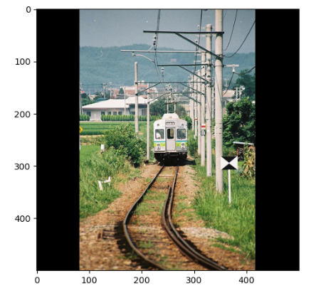
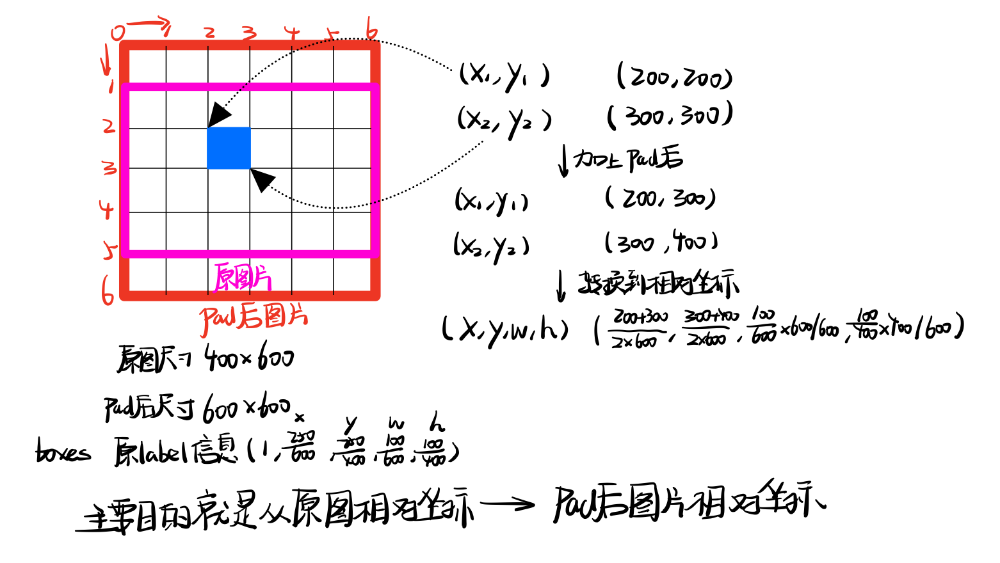
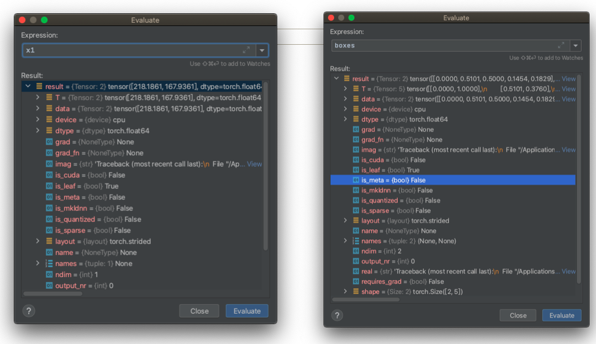

## 3 训练过程

下面对训练过程进行debug级别的介绍，训练过程的文件是`train.py`。

###  3.1 参数配置

```python
parser = argparse.ArgumentParser()
parser.add_argument("--epochs", type=int, default=100, help="number of epochs")
parser.add_argument("--batch_size", type=int, default=4, help="size of each image batch")  # original = 8
parser.add_argument("--gradient_accumulations", type=int, default=2, help="number of gradient accums before step")
parser.add_argument("--model_def", type=str, default="config/yolov3.cfg", help="path to model definition file")
# parser.add_argument("--data_config", type=str, default="config/coco.data", help="path to data config file")
parser.add_argument("--data_config", type=str, default="config/custom.data", help="path to data config file")
parser.add_argument("--pretrained_weights", type=str, help="if specified starts from checkpoint model")
parser.add_argument("--n_cpu", type=int, default=8, help="number of cpu threads to use during batch generation")
parser.add_argument("--img_size", type=int, default=416, help="size of each image dimension")
parser.add_argument("--checkpoint_interval", type=int, default=1, help="interval between saving model weights")
parser.add_argument("--evaluation_interval", type=int, default=1, help="interval evaluations on validation set")
parser.add_argument("--compute_map", default=False, help="if True computes mAP every tenth batch")
parser.add_argument("--multiscale_training", default=True, help="allow for multi-scale training")
opt = parser.parse_args()
print(opt)
```

首先需要对参数进行配置，`argparse`这个包可以实现直接在命令行中对参数进行配置，这里首先将`ArgumentParser()`对象实例化为 `parse`，然后就可以调用`add_argument()` 函数添加相应的参数，以下面的配置为例：

```python
parser.add_argument("--img_size", type=int, default=416, help="size of each image dimension")
```

首先使用`“--img_size”`这里指明参数名称，然后可以对其数据进行设置`type=int` 以及默认初始值`default=416`，`help`选项用于对参数的作用进行解释。

```python
opt = parser.parse_args()
print(opt)
#Namespace(batch_size=4, checkpoint_interval=1, compute_map=False, data_config='config/custom.data', epochs=100, evaluation_interval=1, gradient_accumulations=2, img_size=416, model_def='config/yolov3.cfg', multiscale_training=True, n_cpu=8, pretrained_weights=None)
print(opt.img_size)
#416
```

在所有参数设置完成后，通过函数`parse_args()` 函数解析添加的参数，之后我们就可以通过`.+参数名`

的方式对我们设置的参数进行调取。

当使用命令行对文件进行执行的时候，可以通过下面的方式直接对相应的参数进行赋值：

```shell
python train.py --epochs 20 --batch_size 16 ...
```

需要查看各个参数的含义时：

```sh
python train.py -h
```

### 3.2 数据初始化

这部分主要进行一些相关文件以及模型的配置：

```python
logger = Logger("logs")

device = torch.device("cuda" if torch.cuda.is_available() else "cpu")

os.makedirs("output", exist_ok=True)
os.makedirs("checkpoints", exist_ok=True)

# Get data configuration
data_config = parse_data_config(opt.data_config)
train_path = data_config["train"]
valid_path = data_config["valid"]
class_names = load_classes(data_config["names"])

# Initiate model
model = Darknet(opt.model_def).to(device)
model.apply(weights_init_normal)

# If specified we start from checkpoint
if opt.pretrained_weights:
    if opt.pretrained_weights.endswith(".pth"):
        model.load_state_dict(torch.load(opt.pretrained_weights))
    else:
        model.load_darknet_weights(opt.pretrained_weights)
```

`logger` 用来记录训练过程中的loss，`device` 选择cpu或者gpu用于训练，`os.makedirs`创建文件夹保存训练过程中的输出以及进行存档，之后就是数据文件地址的读取和模型的初始化。

```python
# Get data configuration
data_config = parse_data_config(opt.data_config)
train_path = data_config["train"]
valid_path = data_config["valid"]
class_names = load_classes(data_config["names"])

#in utils.py
def load_classes(path):
    """
    Loads class labels at 'path'
    """
    fp = open(path, "r")
    names = fp.read().split("\n")[:-1]
    return names
```

`parse_data_config` 对`.data`配置文件进行解析后获取训练和验证数据集的地址，通过`load_classes` 获取类别信息

```python
# Initiate model
model = Darknet(opt.model_def).to(device)
model.apply(weights_init_normal)

#in utils.py
def weights_init_normal(m):
    classname = m.__class__.__name__
    if classname.find("Conv") != -1:
        torch.nn.init.normal_(m.weight.data, 0.0, 0.02)
    elif classname.find("BatchNorm2d") != -1:
        torch.nn.init.normal_(m.weight.data, 1.0, 0.02)
        torch.nn.init.constant_(m.bias.data, 0.0)
#######################
#function in utils
def weights_init_normal(m):
    classname = m.__class__.__name__
    if classname.find("Conv") != -1:
        torch.nn.init.normal_(m.weight.data, 0.0, 0.02)
    elif classname.find("BatchNorm2d") != -1:
        torch.nn.init.normal_(m.weight.data, 1.0, 0.02)
        torch.nn.init.constant_(m.bias.data, 0.0)
```

创建model示例，其中模型配置文件传入类`Darknet`用于构建模型，通过`.to(devide)`将模型转移到CPU/GPU上去；`apply(fuc)`函数对模型中的module应用`fuc()`函数，其中`weights_init_normal`用高斯函数进行初始化。

```python
# If specified we start from checkpoint
if opt.pretrained_weights:
    if opt.pretrained_weights.endswith(".pth"):
        model.load_state_dict(torch.load(opt.pretrained_weights))
    else:
        model.load_darknet_weights(opt.pretrained_weights)
```

如果有之前预训练的模型文件就进行读取，否则直接加载官方的预训练权重。

### 3.3 数据读取与优化器设置

```python
# Get dataloader
dataset = ListDataset(train_path, augment=True, multiscale=opt.multiscale_training)
dataloader = torch.utils.data.DataLoader(
    dataset,
    batch_size=opt.batch_size,
    shuffle=True,
    num_workers=opt.n_cpu,
    pin_memory=True,
    collate_fn=dataset.collate_fn,
)

optimizer = torch.optim.Adam(model.parameters())
```

 构建dataset对象，其中类ListDataset用来对数据进行提取以及预处理，下面来详细介绍ListDataset的构建：

```python
class ListDataset(Dataset):
    def __init__(self, list_path, img_size=416, augment=True, multiscale=True, normalized_labels=True):
        with open(list_path, "r") as file:
            self.img_files = file.readlines()

        self.label_files = [
            path.replace("images", "labels").replace(".png", ".txt").replace(".jpg", ".txt")
            for path in self.img_files
        ]
        self.img_size = img_size
        self.max_objects = 100
        self.augment = augment
        self.multiscale = multiscale
        self.normalized_labels = normalized_labels
        self.min_size = self.img_size - 3 * 32
        self.max_size = self.img_size + 3 * 32
        self.batch_count = 0

    def __getitem__(self, index):

        # ---------
        #  Image
        # ---------

        img_path = self.img_files[index % len(self.img_files)].rstrip()

        # Extract image as PyTorch tensor
        img = transforms.ToTensor()(Image.open(img_path).convert('RGB'))

        # Handle images with less than three channels
        if len(img.shape) != 3:
            img = img.unsqueeze(0)
            img = img.expand((3, img.shape[1:]))

        _, h, w = img.shape
        h_factor, w_factor = (h, w) if self.normalized_labels else (1, 1)
        # Pad to square resolution
        img, pad = pad_to_square(img, 0)
        _, padded_h, padded_w = img.shape

        # ---------
        #  Label
        # ---------

        label_path = self.label_files[index % len(self.img_files)].rstrip()

        targets = None
        if os.path.exists(label_path):
            boxes = torch.from_numpy(np.loadtxt(label_path).reshape(-1, 5))
            # Extract coordinates for unpadded + unscaled image
            x1 = w_factor * (boxes[:, 1] - boxes[:, 3] / 2)
            y1 = h_factor * (boxes[:, 2] - boxes[:, 4] / 2)
            x2 = w_factor * (boxes[:, 1] + boxes[:, 3] / 2)
            y2 = h_factor * (boxes[:, 2] + boxes[:, 4] / 2)
            # Adjust for added padding
            x1 += pad[0]
            y1 += pad[2]
            x2 += pad[1]
            y2 += pad[3]
            # Returns (x, y, w, h)
            boxes[:, 1] = ((x1 + x2) / 2) / padded_w
            boxes[:, 2] = ((y1 + y2) / 2) / padded_h
            boxes[:, 3] *= w_factor / padded_w
            boxes[:, 4] *= h_factor / padded_h

            targets = torch.zeros((len(boxes), 6))
            targets[:, 1:] = boxes

        # Apply augmentations
        if self.augment:
            if np.random.random() < 0.5:
                img, targets = horisontal_flip(img, targets)

        return img_path, img, targets

    def collate_fn(self, batch):
        paths, imgs, targets = list(zip(*batch))
        # Remove empty placeholder targets
        targets = [boxes for boxes in targets if boxes is not None]
        # Add sample index to targets
        for i, boxes in enumerate(targets):
            boxes[:, 0] = i
        targets = torch.cat(targets, 0)
        # Selects new image size every tenth batch
        if self.multiscale and self.batch_count % 10 == 0:
            self.img_size = random.choice(range(self.min_size, self.max_size + 1, 32))
        # Resize images to input shape
        imgs = torch.stack([resize(img, self.img_size) for img in imgs])
        self.batch_count += 1
        return paths, imgs, targets

    def __len__(self):
        return len(self.img_files)
```

关于dataset类的构建结构可以参见[Dataset类的构建](/Users/lianxing/Library/Mobile Documents/iCloud~com~lhy~iMarkdown/Documents/笔记/3 工作需求/程序语言/python/pytorch/数据预处理/构建Dataset类.md)，首先就是`__init__`函数用于参数的初始化：

```python
def __init__(self, list_path, img_size=416, augment=True, multiscale=True, normalized_labels=True):
    with open(list_path, "r") as file:
        self.img_files = file.readlines() #list 存储每一张图片的存储地址

    self.label_files = [ 
        path.replace("images", "labels").replace(".png", ".txt").replace(".jpg", ".txt")
        for path in self.img_files
    ]
    self.img_size = img_size #图像尺寸
    self.max_objects = 100 #感觉没用到？
    self.augment = augment  #进行图像扩充
    self.multiscale = multiscale #每10个batch就选取多种尺寸
    self.normalized_labels = normalized_labels #是否将位置标签信息归一化
    self.min_size = self.img_size - 3 * 32 #对应mutiscale 选取多个尺寸
    self.max_size = self.img_size + 3 * 32
    self.batch_count = 0 #用于统计当前处于的batch
```

获取图像文件地址`list_path`，其中列表`self.img_files`每一行代表每一张图片的具体地址，之后通过将其中的部分文字进行替换得到对应的存储label地址的列表`self.label_files`。

```python
def __getitem__(self, index):

    # ---------
    #  Image
    # ---------

    img_path = self.img_files[index % len(self.img_files)].rstrip()

    # Extract image as PyTorch tensor
    img = transforms.ToTensor()(Image.open(img_path).convert('RGB'))

    # Handle images with less than three channels
    if len(img.shape) != 3:
        img = img.unsqueeze(0)
        img = img.expand((3, img.shape[1:]))

    _, h, w = img.shape
    h_factor, w_factor = (h, w) if self.normalized_labels else (1, 1)
    # Pad to square resolution
    img, pad = pad_to_square(img, 0)
    _, padded_h, padded_w = img.shape

    # ---------
    #  Label
    # ---------

    label_path = self.label_files[index % len(self.img_files)].rstrip()

    targets = None
    if os.path.exists(label_path):
        boxes = torch.from_numpy(np.loadtxt(label_path).reshape(-1, 5))
        # Extract coordinates for unpadded + unscaled image
        x1 = w_factor * (boxes[:, 1] - boxes[:, 3] / 2)
        y1 = h_factor * (boxes[:, 2] - boxes[:, 4] / 2)
        x2 = w_factor * (boxes[:, 1] + boxes[:, 3] / 2)
        y2 = h_factor * (boxes[:, 2] + boxes[:, 4] / 2)
        # Adjust for added padding
        x1 += pad[0]
        y1 += pad[2]
        x2 += pad[1]
        y2 += pad[3]
        # Returns (x, y, w, h)
        boxes[:, 1] = ((x1 + x2) / 2) / padded_w
        boxes[:, 2] = ((y1 + y2) / 2) / padded_h
        boxes[:, 3] *= w_factor / padded_w
        boxes[:, 4] *= h_factor / padded_h

        targets = torch.zeros((len(boxes), 6))
        targets[:, 1:] = boxes

    # Apply augmentations
    if self.augment:
        if np.random.random() < 0.5:
            img, targets = horisontal_flip(img, targets)

    return img_path, img, targets
```

`__getitem__`函数通过索引来获取图像的路径以及目标GT的信息

```python
# ---------
    #  Image
    # ---------

    img_path = self.img_files[index % len(self.img_files)].rstrip()

    # Extract image as PyTorch tensor
    img = transforms.ToTensor()(Image.open(img_path).convert('RGB'))

    # Handle images with less than three channels
    if len(img.shape) != 3:
        img = img.unsqueeze(0)
        img = img.expand((3, img.shape[1:])) #其他通道通过复制得到，变为3*H*W

    _, h, w = img.shape
    h_factor, w_factor = (h, w) if self.normalized_labels else (1, 1)
    # Pad to square resolution
    img, pad = pad_to_square(img, 0)
    _, padded_h, padded_w = img.shape
    
#################
#fuction in dataset.py
#将图片填充变成正方形
def pad_to_square(img,pad_value=0):
    '''
    使得图片变成正方形
    :param img: 输入为图片张量 c*h*w
    :param pad_value: 需要填充的值
    :return: 返回正方形图片
    '''
    c,h,w = img.shape
    dim_diff = np.abs(h-w)
    pad_value1,pad_value2 = dim_diff//2,dim_diff-dim_diff//2
    pad = (pad_value1,pad_value2,0,0) if h>w else (0,0,pad_value1,pad_value2)
    img = F.pad(img,pad,"constant",pad_value)
    # img = F.pad(image,(pad_value1,pad_value2),"reflect") 利用镜面映射填充
    return img,pad
```

首选获取图片的信息，用`Image.open(img_path).convert('RGB')`对图片进行读取后在将其转换为tensor的格式，当图片的channel为小于3的时候需要进行维度的扩充将其变为$[3,H,W]$的形式。

```python
    _, h, w = img.shape
    h_factor, w_factor = (h, w) if self.normalized_labels else (1, 1)
```

如果需要进行pad后图像标签的归一化则需要将原图像的宽和高提取出来(标签中为相对值坐标)

```python
  # Pad to square resolution
    img, pad = pad_to_square(img, 0)
    _, padded_h, padded_w = img.shape
```

将图像进行padding使其变为正方形，padding的值为0，也就是进行黑色填充




```python
label_path = self.label_files[index % len(self.img_files)].rstrip()

targets = None
if os.path.exists(label_path):
    boxes = torch.from_numpy(np.loadtxt(label_path).reshape(-1, 5))
    #[1.        , 0.315     , 0.3       , 0.11694873, 0.28286777]
    # Extract coordinates for unpadded + unscaled image
    x1 = w_factor * (boxes[:, 1] - boxes[:, 3] / 2)
    y1 = h_factor * (boxes[:, 2] - boxes[:, 4] / 2)
    x2 = w_factor * (boxes[:, 1] + boxes[:, 3] / 2)
    y2 = h_factor * (boxes[:, 2] + boxes[:, 4] / 2)
    # Adjust for added padding
    x1 += pad[0]
    y1 += pad[2]
    x2 += pad[1]
    y2 += pad[3]
    # Returns (x, y, w, h)
    boxes[:, 1] = ((x1 + x2) / 2) / padded_w
    boxes[:, 2] = ((y1 + y2) / 2) / padded_h
    boxes[:, 3] *= w_factor / padded_w
    boxes[:, 4] *= h_factor / padded_h

    targets = torch.zeros((len(boxes), 6))
    targets[:, 1:] = boxes
```

获取label的信息，从`label_path`中读取label的信息后，由于label的主要内容是类别、XYHW一共5个信息，所以将其`reshape(-1,5)`，最后将其转化为tensor的数据格式。





这里对label的主要作用就是将其从原文件中的相对坐标转换到pad之后图片的相对坐标

```python
  targets = torch.zeros((len(boxes), 6))
    targets[:, 1:] = boxes
#figure0 target0  targets[0,0] = 1
#figure0 target1  targets[1,0] = 1
```

最后建立target变量用于存储所有的GTbox信息，其中第一维度为样本数量，第二个维度中第0维度用来对不同target属于哪个样本进行标记，例如如果有两个bbox的标记属于图1，则这两个bbox的标记都应该对应图1.

```python
      if self.augment:
                if np.random.random() < 0.5:
                    img, targets = horisontal_flip(img, targets)

            return img_path, img, targets
#fuction horizontal_flip in utils/argumentations
def horisontal_flip(images, targets):
    images = torch.flip(images, [-1]) #将图片沿着w方向翻转
    targets[:, 2] = 1 - targets[:, 2]  #只有横坐标变了
    return images, targets
```

这里是图像扩充的策略，使用水平镜像来扩充图像。

```python
def collate_fn(self,batch):
    paths,imgs,targets = list(zip(*batch))
    #去除掉空标记
    targets = [boxes for boxes in targets if boxes is not None]
    #为每一个boxes建立索引
    for i,boxes in enumerate(targets): #建立target与图片的索引
        boxes[:,0] = i
    targets = torch.cat(targets, 0) 

    # Selects new image size every tenth batch
    if self.multiscale and self.batch_count % 10 == 0:
        self.img_size = random.choice(range(self.min_size, self.max_size + 1, 32))
    # Resize images to input shape
    imgs = torch.stack([resize(img, self.img_size) for img in imgs])
    self.batch_count += 1
    return paths, imgs, targets
```

`collact_fn`函数用来对一个batch中的数据做处理，首先去除那些空标记，然后针对targets中的数据标记上每一个target属于哪一张图片。每10个batch后就选择新的图像尺寸然后将相应图片变到固定尺寸后返回。

```python
def __len__(self):
    return len(self.img_files)
```

在DataSet类中`__len__`函数用来返回dataset的长度。

在构建完dataset之后就需要dataloader对图像进行读取

```python
dataloader = torch.utils.data.DataLoader(
    dataset,
    batch_size=opt.batch_size,
    shuffle=True,
    num_workers=opt.n_cpu,
    pin_memory=True,
    collate_fn=dataset.collate_fn,
)
```

在构建该类的时候需要传入dataset实例，其中参数有batch_size，是否对在读取的对数据集进行打乱，使用的cpu线程数，pin_memory就是锁页内存，创建DataLoader时，设置pin_memory=True，则意味着生成的Tensor数据最开始是属于内存中的锁页内存，这样将内存的Tensor转义到GPU的显存就会更快一些，以及对数据进行整理的函数`collate_fn`。

```python
optimizer = torch.optim.Adam(model.parameters())
```

优化器的设置选用Adam


