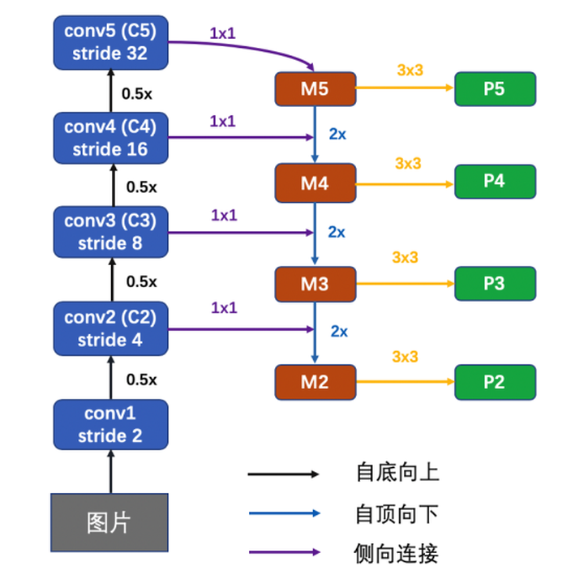
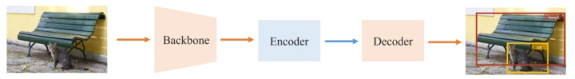
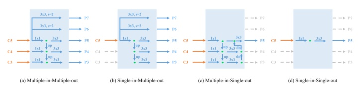
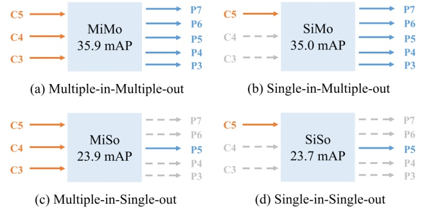
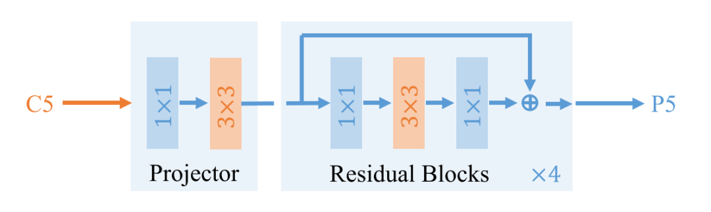
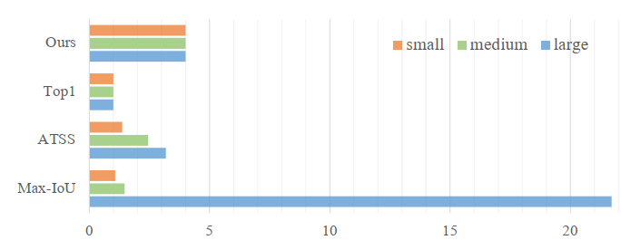
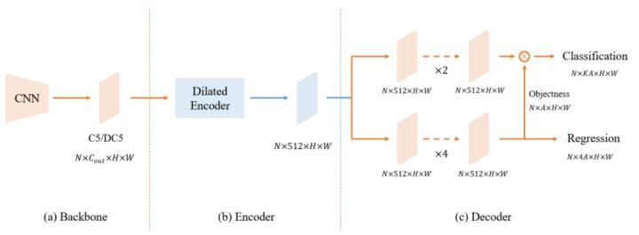

# You Only Look One-level Feature

CVPR 2021 接收的目标检测论文 **You Only Look One-level Feature**

原来目标检测任务中经常存在网络使用多尺度特征融合的过程，像FPN网络使用不同的尺度的Feature map输入到网络中进行预测，给人的直观印象就是高层特征与底层特征进行融合的过程增强了原来图像的特征表达，同时不同的检测输出代表能够更好的覆盖不同大小目标物体的检测，在不同尺度的特征下进行检测任务。

YOLOF这篇文章将FPN网络存在的效果归纳为两类：

1.多尺度融合提高特征的丰富程度

2.使用分治法（divide-and-conquer），将目标检测任务按照目标尺寸不同，分成若干个检测子任务。

其指出C5的特征中就已经包含了很多可用信息，已经能够很好地胜任目标检测任务，FPN中真正起到效果的是后面的多个检测分支使得能够对不同大小物体进行检测也就是分治法，本文将原来的多输入特征融合替换为一个特征C5输入，并使用**Dilated Encoder**模块从C5中提取到多尺度的信息，将后面多检测分支变为一个分支，使用**Uniform Matching**的方法解决在单个检测器情况下存在尺寸小正样本较小的情况。

## FPN的特点

作者将检测器抽象成上面的三个组成，其中Encoder部分可以由下面不同的结构

在使用不同结构进行实验后作者发现SiMo和MiMo的结构表现效果较好：

这说明在FPN中真正起作用的是分治结构而不是多尺寸特征融合

## 使用**Dilated Encoder模块代替FPN**

作者提出只使用C5的特征，如果直接使用的话其包含物体的尺寸信息有限，可以通过一系列的空洞卷积来增加其中的尺寸信息

从上图中可以看出，Dilated Encoder将Backbone输出的C5特征作为输入，使用1x1卷积减少通道数目，接着使用3x3卷积精炼语义信息，紧接着是4个连续的空洞残差单元（Dilated Residual Block），这4个空洞残差单元中3x3卷积的dilation rate不一定相等。

## 解决positive anchor不均匀问题

使用C5特征直接进行检测的结果是网络很容易关注到尺寸大的物体，而对较小物体的关注度不高，也就是在存在positive anchor分布不均匀的情况：

很容易检测到大的物体，而对较小目标关注较少，为了解决这个问题，作者提出Uniform Matching方法：从每一个Ground Truth附近选取里的最近的k个anchor作为目标的positive anchor，这样就是使得不同大小的物体都能有相同数量的anchor进行训练。

## 网络结构

参考文章：[目标检测算法YOLOF：You Only Look One-level Feature](https://zhuanlan.zhihu.com/p/359315730)

