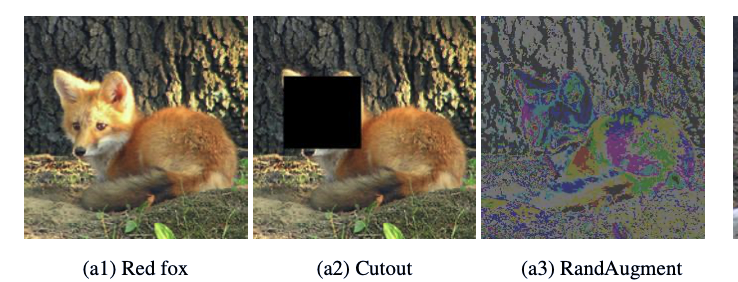
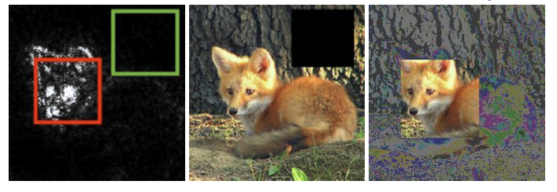
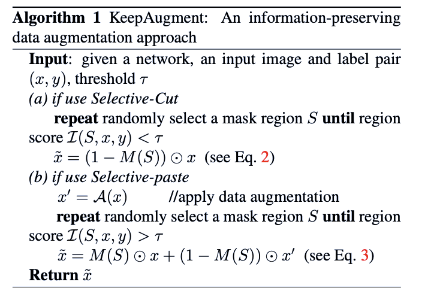

#数据增强的方法
## KeepAugment: A Simple Information-Preserving Data Augmentation Approach

传统的数据增强的方法可能会遮挡图片中的目标区域，本文在进行图像增强之前首先用saliency-map识别出来目标所在的大致区域并对这部分进行保留。

对于数据标签不变的数据增强方法主要主要有两种，第一种是对图片中的部分区域进行遮挡，第二种是对图像中的像素值进行扰动，

这些方法存在的问题在于可能将图像中的目标区域遮挡住或者使得目标区域不明显，为了保留目标部分，本文提出的方法首先使用saliency-map的方式提取有利于分类的部分然后将这部分进行保留：

