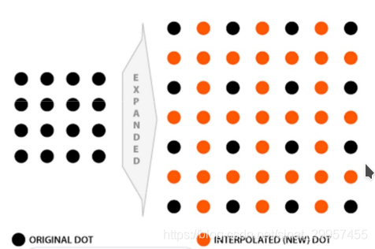
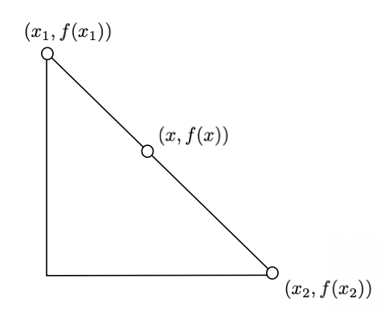
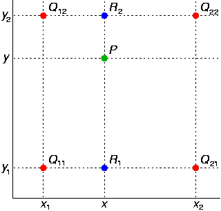

本文主要介绍线性插值与双线性插值

在图像缩放过程中会存在有些像素值不知道的情况，这个时候可以用插值的方式对相应的像素值进行求解

线性插值是根据像素点位置以及像素点处的值进行线性组合获得位置像素点值的过程。

## 线性插值

一维线性插值中点的位置坐标仅用 $x$ 去表示，$f(x)$ 表示在这个坐标位置的值

在已经知道三个点的坐标 $x_1,x_2,x$ 以及$f(x_1),f(x_2)$的值后，我们需要求得$f(x)$ 的值：
$$
\frac{x-x_2}{x_1-x_2}=\frac{f(x)-f(x_2)}{f(x_1)-f(x_2)}
$$

## 二维线性插值

二维线性插值中坐标信息用 $(x,y)$ 去表示，对应点位置处的值用 $f(x)$ 表示，进行二维插值的过程需要四个点：

二维线性插值的过程相当于两次一维线性插值，首先在 $x$ 方向上做插值得到点 $R_1,R_2$,然后在 $y$ 方向上对其做插值得到点 $P$ 点处的值

