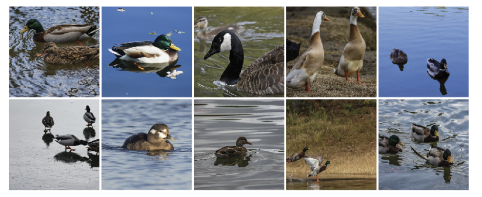
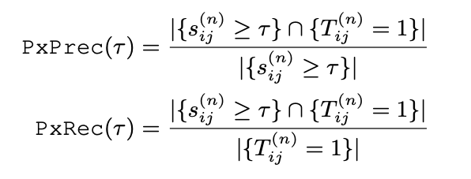
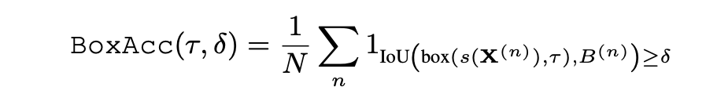

## WSOL存在的问题

- 由于数据集中图片的问题，弱监督目标定位可能是一种病态问题：当一个物体的相关图片中背景出现的概率更大的时候，此时由于只有图像标签信息，所以不能排除背景部分的干扰，导致模型更容易将背景部分辨识成物体从而导致错误定位。例如下面的图片中显然水出现的概率更大，但是标签信息是鸭子，模型就会倾向于将出现更多的水辨认成鸭子。

可能的解决方法：随机遮挡图片的大部分使其标记为背景，由于背景往往占有图像的四周，可以考虑将中心位置部分进行遮挡，然后用四周的图片对中间部分进行填充。

## 指标

之前的WSOL任务的指标是localization accuracy定位精度，这要求分类和定位都正确

WSOL的模型生成的是一个图片中所有像素位置的得分，一般情况取一定的阈值对图像进行区域分割后找到包围区域的最大矩形作为bbox，使用bbox进行评估，当然如果有mask级的标注，也可以用来作为评估。

### PxAP

使用mask进行评估，其中$s_{ij}\ \geq \tau$代表图像在像素 $ij$ 处的score值大于阈值 $\tau$，$T_{ij}=1$代表 $ij$ 处含有target

使用精确度会召回率构成曲线下的面积作为最终评估的metric。

### MaxBoxAcc v1

使用检测框来评估，其中 $box(s(X^{(n)}),\tau)$ 是大于阈值区域组成的最大框，$B^{n}$ 是GTbox，当两者的IOU数值大于一定数值的时候设为1，这里阈值 $\tau$ 的选择是选择使得这个MaxBoxAcc达到最大的值，这里IOU数值选择的是0.5

### MaxBoxAcc v1

v2版本使用三个IOU数值的平均作为最终结果，分别取 $\delta=0.3,0.5,0.7 $，在v2中选择检测框的时候考虑了所有的框中最匹配的作为最终结果

## 数据集划分与参数选择

使用三个数据集分别进行训练：

- `train-weaksup`数据集用来训练，其中包含弱监督标签，图像级别标签

- `train-fullup`数据集用来进行参数选择，其中有BBox和二值掩膜

- `test`数据集中有全监督的标签，只能用来

- 

  

