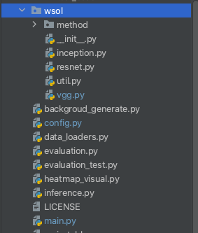

# WSOL 弱监督目标定位源码解读

采用的代码是[Evaluating Weakly Supervised Object Localization Methods Right (CVPR 2020)](https://github.com/clovaai/wsolevaluation)，本文主要对该代码进行解析学习。

## 代码结构


如上图，

- dasaset文件夹就是用来存放数据集的，将下载好的数据放在这个文件中，具体存放的格式可以在readme文件中找到；
- metadata用来存放数据集的元数据，包括一些标注信息；
- test_data中数据便于用户进行代码的调试；
- wsol文件中存放的就是作者复现的弱监督目标定位的常用方法以及网络架构；外面的文件中config是配置文件，在这里进行各种参数的配置；
- data_loders文件创建data_loader类用来对数据集中的图片进行预处理以及获取图片的元数据等；
- evaluation文件是用来存放对结果进行评价的函数(计算cam，计算IOU等)；
- evaluation_test对evaluation中的函数进行测试；
- inference是用来推断的文件；
- main文件是主文件，主函数在这里执行；
- util中存放一些会用到的函数

下面就从主函数进行切入对所有用到的函数进行分析与介绍：

```python
def main():
    trainer = Trainer()

    print("===========================================================")
    print("Start epoch 0 ...")
    trainer.evaluate(epoch=0, split='val')
    trainer.print_performances()
    trainer.report(epoch=0, split='val')
    trainer.save_checkpoint(epoch=0, split='val')
    print("Epoch 0 done.")

    for epoch in range(trainer.args.epochs):
        print("===========================================================")
        print("Start epoch {} ...".format(epoch + 1))
        trainer.adjust_learning_rate(epoch + 1)
        train_performance = trainer.train(split='train')
        trainer.report_train(train_performance, epoch + 1, split='train')
        trainer.evaluate(epoch + 1, split='val')
        trainer.print_performances()
        trainer.report(epoch + 1, split='val')
        trainer.save_checkpoint(epoch + 1, split='val')
        print("Epoch {} done.".format(epoch + 1))

    print("===========================================================")
    print("Final epoch evaluation on test set ...")

    trainer.load_checkpoint(checkpoint_type=trainer.args.eval_checkpoint_type)
    # trainer.load_checkpoint('best')
    trainer.evaluate(trainer.args.epochs, split='test')
    trainer.print_performances()
    trainer.report(trainer.args.epochs, split='test')
    trainer.save_performances()
```

主函数非常简洁：

- 首先创建了一个名为 trainer 的对象，然后就直接调用其中的函数进行了一次评价的过程，评价之后输出各项指标表现，然后通过调用report函数对结果进行记录，最后对model进行存储；
- 在进行一次评价之后就开始对模型进行训练，整个训练的次数由config文件中epoch来指定，训练的过程中需要对学习率进行调整，对训练后模型的表现进行评价以及保存model
- 训练过后就需要在测试集上查看表现并对模型表现结果进行输出

## Trainer()类的构建

在设置好数据集后，我们对该模型进行debug调试。

首先进入到主函数中，第一行就是这个类，进入到这个类中对其进行查看。


```python

class Trainer(object):
    _CHECKPOINT_NAME_TEMPLATE = '{}_checkpoint.pth.tar'
    _SPLITS = ('train', 'val', 'test')
    _EVAL_METRICS = ['loss', 'classification', 'localization']
    _BEST_CRITERION_METRIC = 'localization'
    _NUM_CLASSES_MAPPING = {
        "CUB": 200,
        "ILSVRC": 1000,
        "OpenImages": 100,
    }
    _FEATURE_PARAM_LAYER_PATTERNS = {
        'vgg': ['features.'],
        'resnet': ['layer4.', 'fc.'],
        'inception': ['Mixed', 'Conv2d_1', 'Conv2d_2',
                      'Conv2d_3', 'Conv2d_4'],
    }

    def __init__(self):
        self.args = get_configs()
        set_random_seed(self.args.seed)
        print(self.args)
        self.performance_meters = self._set_performance_meters()
        self.reporter = self.args.reporter
        self.model = self._set_model()
        self.cross_entropy_loss = nn.CrossEntropyLoss().cuda()
        self.optimizer = self._set_optimizer() #设置优化方式
        self.loaders = get_data_loader(
            data_roots=self.args.data_paths,
            metadata_root=self.args.metadata_root,
            batch_size=self.args.batch_size,
            workers=self.args.workers,
            resize_size=self.args.resize_size,
            crop_size=self.args.crop_size,
            proxy_training_set=self.args.proxy_training_set,
            num_val_sample_per_class=self.args.num_val_sample_per_class)

    def _set_performance_meters(self):
    def _set_model(self):
    def _set_optimizer(self):
    def _wsol_training(self, images, target):
    def train(self, split):
    def print_performances(self):
    def save_performances(self):
    def _compute_accuracy(self, loader):
    def evaluate(self, epoch, split):
    def _torch_save_model(self, filename, epoch):
    def save_checkpoint(self, epoch, split):    
    def report_train(self, train_performance, epoch, split='train'):
    def report(self, epoch, split):
    def adjust_learning_rate(self, epoch):
    def load_checkpoint(self, checkpoint_type):
```

Trainer这个类中含有的函数较多，我们一个个慢慢解读：

首先创建了一些变量以及字典：

```python
  _CHECKPOINT_NAME_TEMPLATE = '{}_checkpoint.pth.tar'
    _SPLITS = ('train', 'val', 'test')
    _EVAL_METRICS = ['loss', 'classification', 'localization']
    _BEST_CRITERION_METRIC = 'localization'
    _NUM_CLASSES_MAPPING = {
        "CUB": 200,
        "ILSVRC": 1000,
        "OpenImages": 100,
    }
    _FEATURE_PARAM_LAYER_PATTERNS = {
        'vgg': ['features.'],
        'resnet': ['layer4.', 'fc.'],
        'inception': ['Mixed', 'Conv2d_1', 'Conv2d_2',
                      'Conv2d_3', 'Conv2d_4'],
    }
```

这些带有单个下划线的变量仅供内部使用

之后进行了类中变量的初始化：

```python
  def __init__(self):
        self.args = get_configs()
        set_random_seed(self.args.seed)
        print(self.args)
        self.performance_meters = self._set_performance_meters()
        self.reporter = self.args.reporter
        self.model = self._set_model()
        self.cross_entropy_loss = nn.CrossEntropyLoss().cuda()
        self.optimizer = self._set_optimizer() #设置优化方式
        self.loaders = get_data_loader(
            data_roots=self.args.data_paths,
            metadata_root=self.args.metadata_root,
            batch_size=self.args.batch_size,
            workers=self.args.workers,
            resize_size=self.args.resize_size,
            crop_size=self.args.crop_size,
            proxy_training_set=self.args.proxy_training_set,
            num_val_sample_per_class=self.args.num_val_sample_per_class)
```

其中 `self.args` 从config文件中调用函数得到所有的参数，该变量是一个`argparse.Namespace`对象，主要用于对参数存储，关于argparse的详细介绍可以查看[`argparse`](https://docs.python.org/zh-cn/3/library/argparse.html#module-argparse) --- 命令行选项、参数和子命令解析器。


然后分别设置了一个随机数，对评价指标进行设置，对模型进行初始化

### 模型初始化

```python
 self.model = self._set_model()
```

在模型初始化这里看似函数比较简单，实际上包含了对于模型的选择以及预训练模型的加载等，进一步的，我们直接看`_set_model()`这个函数：

```python
 def _set_model(self):
        num_classes = self._NUM_CLASSES_MAPPING[self.args.dataset_name]
        print("Loading model {}".format(self.args.architecture))
        model = wsol.__dict__[self.args.architecture](
            dataset_name=self.args.dataset_name,
            architecture_type=self.args.architecture_type,
            pretrained=self.args.pretrained,
            num_classes=num_classes,
            large_feature_map=self.args.large_feature_map,
            pretrained_path=self.args.pretrained_path,
            adl_drop_rate=self.args.adl_drop_rate,
            adl_drop_threshold=self.args.adl_threshold,
            acol_drop_threshold=self.args.acol_threshold)
        model = model.cuda()
        print(model)
        return model
```

在这个函数中首先要得到我们需要预测目标的类别数，这里和我们选择的数据集有关，`self.args.dataset_name`是我们在参数中选择的数据集，`self._NUM_CLASSES_MAPPING`使我们在类开始的时候定义的字典：

```python
  _NUM_CLASSES_MAPPING = {
        "CUB": 200,
        "ILSVRC": 1000,
        "OpenImages": 100,
    }
```

可以看到当选择不同的数据集的时候，预测的类别数也不同，这里我们选用的是CUB所以对应的`num_classes = 200`。之后就需要对模型架构进行选择：

```python
model = wsol.__dict__[self.args.architecture](
            dataset_name=self.args.dataset_name, #数据集
            architecture_type=self.args.architecture_type, #模型架构类型 VGG/Inception/Resnet
            pretrained=self.args.pretrained, #加载预训练参数
            num_classes=num_classes,#类别
            large_feature_map=self.args.large_feature_map,#是否使用大的特征图
            pretrained_path=self.args.pretrained_path,#预训练参数地址
            adl_drop_rate=self.args.adl_drop_rate,#adl方法参数
            adl_drop_threshold=self.args.adl_threshold,
            acol_drop_threshold=self.args.acol_threshold)#acol方法参数
```

其中wsol使我们从开始引入到文件中的module

```python
import wsol
import wsol.method
```



`wsol.__dict__[self.args.architecture]` 是以字典的形式返回类wsol中的属性名以及属性值


这里的参数都是我们在`config`中进行配置的，进入到这个函数，由于这里我们使用`self.args.architecture=‘vgg16’`，所以会跳转到`vgg.py`中：

```python
def vgg16(architecture_type, pretrained=False, pretrained_path=None,
          **kwargs):
    config_key = '28x28' if kwargs['large_feature_map'] else '14x14'
    layers = make_layers(configs_dict[architecture_type][config_key], **kwargs)
    model = {'cam': VggCam,
             'acol': VggAcol,
             'spg': VggSpg,
             'adl': VggCam,
             'bg':VggCam}[architecture_type](layers, **kwargs)
    if pretrained:
        model = load_pretrained_model(model, architecture_type,
                                      path=pretrained_path)
    return model
```

首先根据我们在参数中选择的使用大的特征图还是小的特征图定义一个变量`config_key`，接下来就要搭建各个层成一个名为layer的module：

```python
layers = make_layers(configs_dict[architecture_type][config_key], **kwargs)
```

通过我们选择的架构类型(architecture_type=bg)和特征图大小(config_key=28x28)在 configs_dict 这个字典中进行选择：

```python
configs_dict = {
    'cam': {
        '14x14': [64, 64, 'M', 128, 128, 'M', 256, 256, 256, 'M', 512, 512,
                  512, 'M', 512, 512, 512],
        '28x28': [64, 64, 'M', 128, 128, 'M', 256, 256, 256, 'M', 512, 512,
                  512, 512, 512, 512],
    },
    'bg': {
        '14x14': [64, 64, 'M', 128, 128, 'M', 256, 256, 256, 'M', 512, 512,
                  512, 'M', 512, 512, 512],
        '28x28': [64, 64, 'M', 128, 128, 'M', 256, 256, 256, 'M', 512, 512,
                  512, 512, 512, 512],
    },

    'acol': {
        '14x14': [64, 64, 'M1', 128, 128, 'M1', 256, 256, 256, 'M1', 512, 512,
                  512, 'M1', 512, 512, 512, 'M2'],
        '28x28': [64, 64, 'M1', 128, 128, 'M1', 256, 256, 256, 'M1', 512, 512,
                  512, 'M2', 512, 512, 512, 'M2'],
    },
    'spg': {
        '14x14': [64, 64, 'M', 128, 128, 'M', 256, 256, 256, 'M'],
        '28x28': [64, 64, 'M', 128, 128, 'M', 256, 256, 256, 'M'],
    },
    'adl': {
        '14x14': [64, 64, 'M', 128, 128, 'M', 256, 256, 256, 'M', 'A', 512,
                  512, 512, 'A', 'M', 512, 512, 512, 'A'],
        '28x28': [64, 64, 'M', 128, 128, 'M', 256, 256, 256, 'M', 'A', 512,
                  512, 512, 'A', 512, 512, 512, 'A'],
    }
}
```

这里我们选择的是：

```python
 'bg': {
        '28x28': [64, 64, 'M', 128, 128, 'M', 256, 256, 256, 'M', 512, 512,
                  512, 512, 512, 512],
    },
```

选择完配置参数后，使用`make_layers`函数构建模型：

```python
def make_layers(cfg, **kwargs):
    layers = []
    in_channels = 3
    for v in cfg:
        if v == 'M1':
            layers += [nn.MaxPool2d(kernel_size=3, stride=2, padding=1)]
        elif v == 'M2':
            layers += [nn.MaxPool2d(kernel_size=3, stride=1, padding=1)]
        elif v == 'M':
            layers += [nn.MaxPool2d(kernel_size=2, stride=2)]
        elif v == 'A':
            layers += [
                ADL(kwargs['adl_drop_rate'], kwargs['adl_drop_threshold'])]
        else:
            conv2d = nn.Conv2d(in_channels, v, kernel_size=3, padding=1)
            layers += [conv2d, nn.ReLU(inplace=True)]
            in_channels = v
    return nn.Sequential(*layers)
```

根据我们配置文件中的数字和字母选择相应的层进行堆叠，搭建完的模型layers结构如下：


这里搭建的layers只是前面进行特征提取的部分，在得到特征后还需要添加分类器进行分类

```python
    model = {'cam': VggCam,
             'acol': VggAcol,
             'spg': VggSpg,
             'adl': VggCam,
             'bg':VggCam}[architecture_type](layers, **kwargs)

```

根据不同的architecture_type选择不同的模型，这里选用的是VggCam，传入的layers作为其特征提取器，下面转到VggCam这个类查看其具体如何对模型进行构建：

```python
class VggCam(nn.Module):
    def __init__(self, features, num_classes=1000, **kwargs):
        super(VggCam, self).__init__()
        self.features = features #特征提取层
        self.conv6 = nn.Conv2d(512, 1024, kernel_size=3, padding=1)#卷积层
        self.relu = nn.ReLU(inplace=False)#relu函数
        self.avgpool = nn.AdaptiveAvgPool2d(1)#均值pooling，在channel维度进行
        self.fc = nn.Linear(1024, num_classes)#全连接层
        initialize_weights(self.modules(), init_mode='he')#采用何凯明初始化方式初始化参数

    def forward(self, x, labels=None, return_cam=False):
        x = self.features(x)
        x = self.conv6(x)
        x = self.relu(x)
        pre_logit = self.avgpool(x)
        pre_logit = pre_logit.view(pre_logit.size(0), -1)
        logits = self.fc(pre_logit)

        if return_cam:
            feature_map = x.detach().clone()
            cam_weights = self.fc.weight[labels]
            cams = (cam_weights.view(*feature_map.shape[:2], 1, 1) *
                    feature_map).mean(1, keepdim=False)
            return cams
        return {'logits': logits}
```

上面传入的参数`layers`就是这个类中features即特征提取的部分，每一个卷积神经网络模型类都需要继承`nn.module`这个类，在`__init__`函数中主要进行一些变量的构建，在该类创建的对象被使用的时候就会自动调用`forward`函数，在调用这个函数中传入的参数实际上就是图片的tensor形式


然后分别进行特征提取，提取后的特征通过一个卷积后经relu激活就直接进行跨channel维度的平均池化，池化的结果就是各个类别的可能性:

```
  x = self.features(x)
  x = self.conv6(x)
  x = self.relu(x)
  pre_logit = self.avgpool(x)
  pre_logit = pre_logit.view(pre_logit.size(0), -1)
  logits = self.fc(pre_logit)
```


每一次`forward`的过程都完成一个batch的计算，计算结构为这个batch各个图片在每一个类别的可能性。如果模型处于评价阶段就需要返回cam图用于对bbox进行计算，这时参数`return_cap=True`

，执行下面的函数计算cam图并进行返回。

```python
if return_cam:
  feature_map = x.detach().clone()
  cam_weights = self.fc.weight[labels]
  cams = (cam_weights.view(*feature_map.shape[:2], 1, 1) *
  feature_map).mean(1, keepdim=False)
	return cams
```

> CAM的计算
>
> 在上面的例子中，x是进行平均池化之前的feature map。维度为[8,1024,28,28]，其中8为batch_size，要想获取CAM，我们需要对feature map的每个channel进行加权求平均，由于我们得到的全连接层的权重的维度是[200,1024]，我们只需要知道对应正确类别的1024个权重进行加权即可，所以下面的函数就是为了获取对应正确类别的1024个权重，所以这里的维数为[batch_size,1024]：
>
> ```python
> cam_weights = self.fc.weight[labels]
> ```
>
> 
>
> 在获取了权重的数值后要将其维度变为[8,1024,1,1]然后和feature map进行点乘，此时得到的结果维度是[8,1024,28,28]，然后跨channel维度取平均值最终得到维度为[8,28,28]的CAM：
>
> 

回到之前构造模型的函：数

```python
def vgg16(architecture_type, pretrained=False, pretrained_path=None,
          **kwargs):
    config_key = '28x28' if kwargs['large_feature_map'] else '14x14'
    layers = make_layers(configs_dict[architecture_type][config_key], **kwargs)
    model = {'cam': VggCam,
             'acol': VggAcol,
             'spg': VggSpg,
             'adl': VggCam,
             'bg':VggCam}[architecture_type](layers, **kwargs)
    if pretrained:
        model = load_pretrained_model(model, architecture_type,
                                      path=pretrained_path)
    return model
```

现在 `model`  已经构建完成，接下来就是导入预训练模型的参数：

```python
model = load_pretrained_model(model, architecture_type,
                                      path=pretrained_path)
```

> `load_pretrained`函数根据模型的架构导入相应的预训练参数，这个函数的的构成如下：
>
> ```python
> def load_pretrained_model(model, architecture_type, path=None):
>     if path is not None:
>         state_dict = torch.load(os.path.join(path, 'vgg16.pth'))
>     else:
>         state_dict = load_url(model_urls['vgg16'], progress=True)
> 
>     if architecture_type == 'spg':
>         state_dict = batch_replace_layer(state_dict)
>     state_dict = remove_layer(state_dict, 'classifier.')
>     state_dict = adjust_pretrained_model(state_dict, model)
> 
>     model.load_state_dict(state_dict, strict=False)
>     return model
>   
> def remove_layer(state_dict, keyword):
>     keys = [key for key in state_dict.keys()]
>     for key in keys:
>         if keyword in key:
>             state_dict.pop(key)
>     return state_dict
> 
>   
> ```
>
> 需要从存放参数文件的地址导入相关的参数，如果本地没有预训练模型就下载导入，同时在导入的时候会去掉分类层的参数以及对于参数进行调整以让其适应当前的模型。

这样整个模型就构建完成了：

```python
def _set_model(self):
    num_classes = self._NUM_CLASSES_MAPPING[self.args.dataset_name]
    print("Loading model {}".format(self.args.architecture))
    model = wsol.__dict__[self.args.architecture](
        dataset_name=self.args.dataset_name,
        architecture_type=self.args.architecture_type,
        pretrained=self.args.pretrained,
        num_classes=num_classes,
        large_feature_map=self.args.large_feature_map,
        pretrained_path=self.args.pretrained_path,
        adl_drop_rate=self.args.adl_drop_rate,
        adl_drop_threshold=self.args.adl_threshold,
        acol_drop_threshold=self.args.acol_threshold)
    model = model.cuda()
    print(model)
    return model
```

最后将构建好的模型转换成cuda形式便于使用GPU运算。


Images: 输入图片维度 $batch\_size*3*224*224$

Taget:输入图片的标签 $batch\_size$


在forward的过程中：

Feature:提取特征部分 $batch\_size*512*28*28$

Feature_map:经过分类后$batch\_size*classes(200)*28*28$

Logits:输出分类$batch\_size*classes(200)$


Attention:（对应于正确类别的feature_map$batch\_size*class(1)*28*28$

pos：找到大于一定值的部分，代表feature中受到关注的部分 $batch\_size*class(1)*28*28$

```
pos = torch.ge(attention, drop_threshold)
```

数据形式是false和true

## 参数配置


Feature: