# 弱监督目标定位论文整理

## 1.Unveiling the Potential of Structure Preserving for Weakly Supervised Object Localization

### 1简介

这篇是CVPR2021的文章，这篇文章提出的方法主要运用了热力图的空间相关性，利用feature map的自相关性以及热力图获得的目标最具判别力的区域得到目标整体。

### 2主要方法

作者将其命名为Structure-Preserving Activation，主要包括两个模块，分别是Restricted Activation Module和Self-correlation Map，前一个模块直接使用热力图中的信息通过阈值限制生成背景无物体部分，后一个模块利用热力图的自相关性学习空间相关性的信息再次得到背景和目标部分。

#### 2-1 Restricted Activation Module

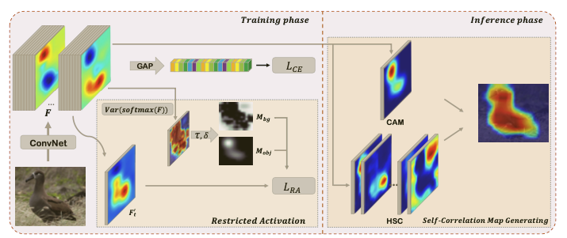

在获得热力图CAM之后通过阈值选取得到背景$M_{bg}$和目标区域$M_{obj}$

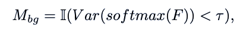

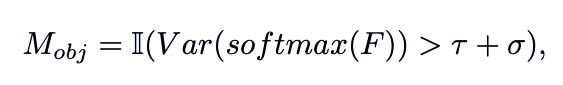

然后和原始的CAM图做像素级别的loss：

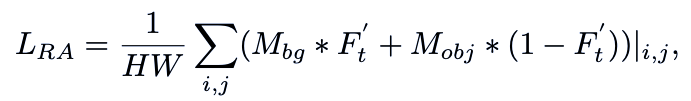

这部分能够使得热力图更多的关注于目标部分。

#### 2-2 Self-correlation Map Generating

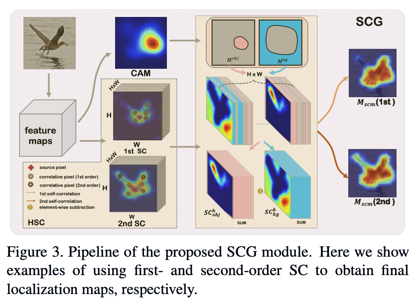

这部分使用CAM的自相关图学习与目标区域以及背景区域在空间上相似的部分。

- 生成自相关图

一阶自相关：首先需要生成自相关图，自相关图是衡量feature map像素级别的相似度，其中$f\in R^{HW\times C}$就是生成的feature map，然后单位化后与其转置相再经过ReLU激活后得到的相关性$SC(f)\in R^{HW\times HW}$，这里得到的就是每一个像素和其他像素的相似程度：

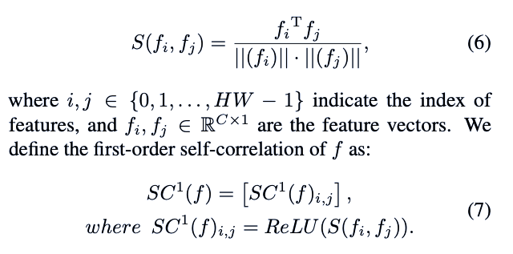

二阶自相关：二阶是在一阶像素相乘计算基础上再次相乘得到的，实际上衡量的是一阶自相关图的自相关性

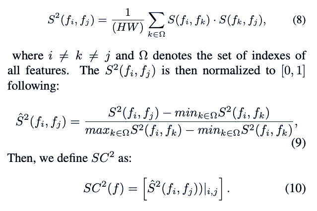

在一阶和二阶自相关之后将两者结合就得到高阶自相关图（high-order self-correlation (HSC) ）

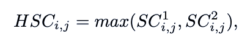

- 得到关注区域，生成特定相关图

通过CAM得到关注区域后就可以将之结合自相关图得到与关注部分像素级别相关的区域，结合之前得到的自相关图以及像素区域得到在HSC下的目标区域：

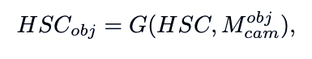

由于该目标区域的像素值不是唯一的，所以这个时候对所有该区域像素的相关图取平均值得到物体部分的mask：

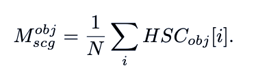

同样的道理也可以获得背景区域的自相关图以及对应的mask，然后通过作差得到最终的关注部分：

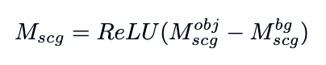

### 3主要创新

利用阈值探索背景以及目标区域的手段在SPG中已经有所体现，该论文的主要创新之处在于结合CAM使用的自相关图获取到空间像素级别的相关信息。

### 4 想法

- 这种像素级别相关性的获取是在最后一层feature map上面，能否在结合原图的像素相关性
- 像素级别的空间相关性显然对于具有同一颜色或者纹理的物体十分适用，但当物体的部分具有明显的不连续区域以及较大差别的时候这种方法适用效果可能较差，如何获取这部分物体的相关特征呢？
- 这里只是使用了一张图片中自身的feature map自相关性，能否结合同类图片的进行相关性分析

- [ ] 论文方法复现

## 2. In-sample Contrastive Learning and Consistent Attention for Weakly Supervised Object Localization

### 1 简介

ACCV2020的文章，有点坑的是现在代码都没有放出来。

这篇文章主要用到了四个部分

1. non-local attention block，实际上就是一种self-attention的机制
2. contrastive attention loss，模仿对比学习生成的attention的loss，这部分主要用于对背景部分进行学习以及加强已学习到的目标区域
3. foreground consistency loss，用于对不同阶段学习到的feature map进行统一，保持其在特征提取上的一致性
4. random selection，随机选取重要的掩膜与原来的feature map进行点乘，这部分思想有点借鉴ADL

###2 主要方法

按照上面说的对四个部分进行简要介绍：

#### 2.1 non-local attention block

这部分实际上就是自注意力机制的运用，详情可以借鉴深度学习-常用Trick-Attention机制部分的讲解，这里贴一张Non-local这篇文章中的图片来更好理解其主要结构

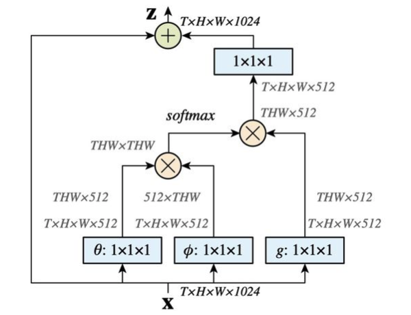

该文模仿上面的结构运用的non-local block如下：

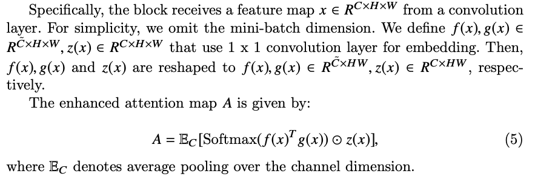

#### 2.2 contrastive attention loss

发现作者很会起名，或者说很会借鉴别的文章。借鉴对比学习，文中对attention map按照阈值分为背景图、前景图以及去除最明显特征的前景图，将这几部分作为掩膜与原来的feature map进行点乘后映射到特征空间，最后通过contrastive attention loss使得前景图部分在隐空间接近而前景和背景部分分离。下面这张图总结的很不错：

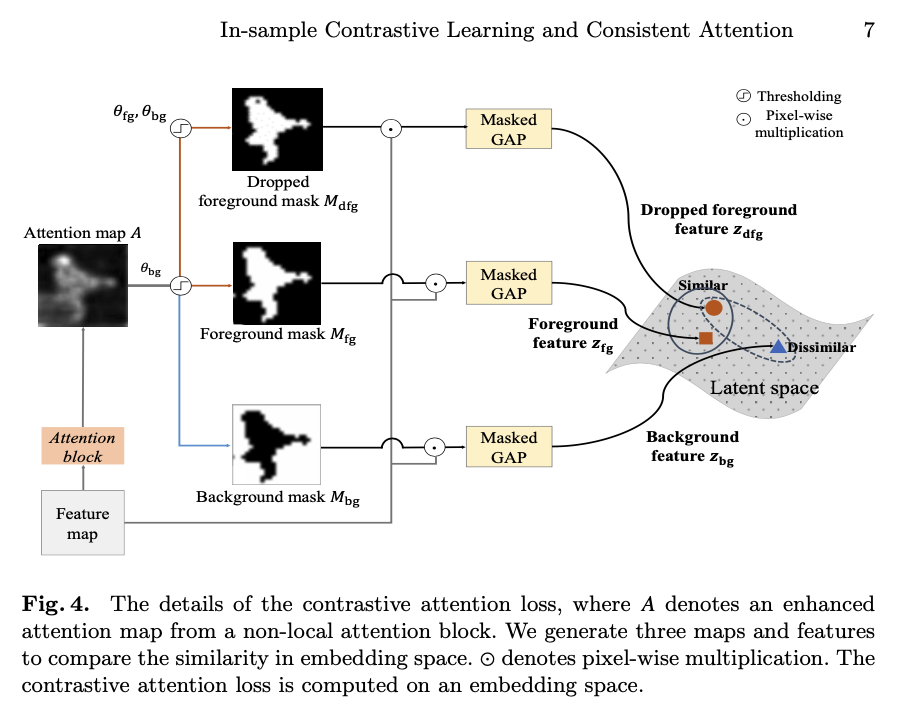

具体的生成部分公式如下：

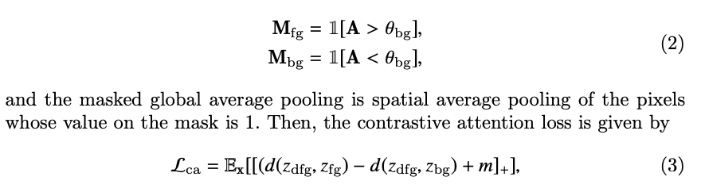

映射到隐空间后使用L2距离衡量相似度。

####2.3 foreground consistency loss

这部分主要是为了保证前后提取特征的一致性，对前后feature map直接用L2距离衡量相似度

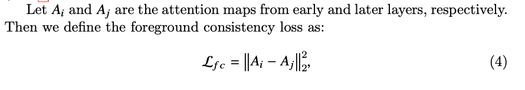

####2.4 random selection

这部分显示就是借鉴了ADL的方法，对于feature map进行随机增强，实际上有点正则化的意味在里面。

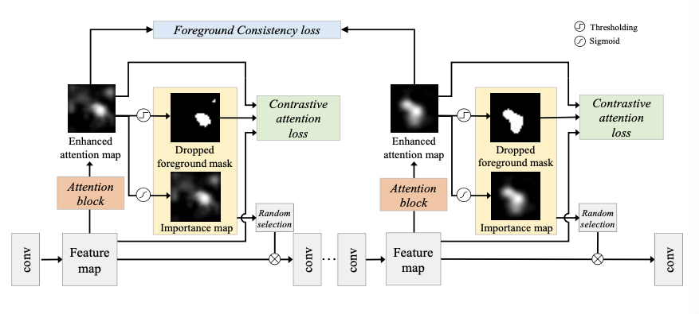

### 3 主要创新

这篇文章作者可以说是读了很多相关文献，方法很多都是借鉴来修改得到的，但是这两个loss的设置的确很有说服力，但是看文章提供的实验结果实际上并没有多么惊艳，在新的指标MaxBoxAccV2上提升并不大，而且文章还没有给出代码复现，总感觉实验结果不是上面说的那样。

### 相关文章

- [ ] 对比学习（contrastive learning）

1. He,K.,Fan,H.,Wu,Y.,Xie,S.,Girshick,R.:Momentumcontrastforunsupervised visual representation learning. In: Proceedings of the IEEE/CVF Conference on Computer Vision and Pattern Recognition. (2020) 9729–9738
2. Chen, T., Kornblith, S., Norouzi, M., Hinton, G.: A simple framework for con- trastive learning of visual representations. arXiv preprint arXiv:2002.05709 (2020)

- [ ] Non-local结构

1. Wang, X., Girshick, R., Gupta, A., He, K.: Non-local neural networks. In: Proceed- ings of the IEEE conference on computer vision and pattern recognition. (2018)

   7794–7803

## 3. Inter-Image Communication for Weakly Supervised Localization

### 1.简介

这篇文章主要对同类图片中的信息进行获取，在获取的图片的热力图CAM后对关键的部分的特征进行提取，然后保证同类图片之间关键部分的特征保持一致，同类之间一致性的保证主要体现在共同训练的两张图片以及图片与同类特征之间。为此文章主要定义了两种loss，分别是Stochastic Consistency Loss用来保证共同训练的两张同类图片之间的一致性，以及Global Consistency Loss用来保证每张图片都与其类特征保持一致性。

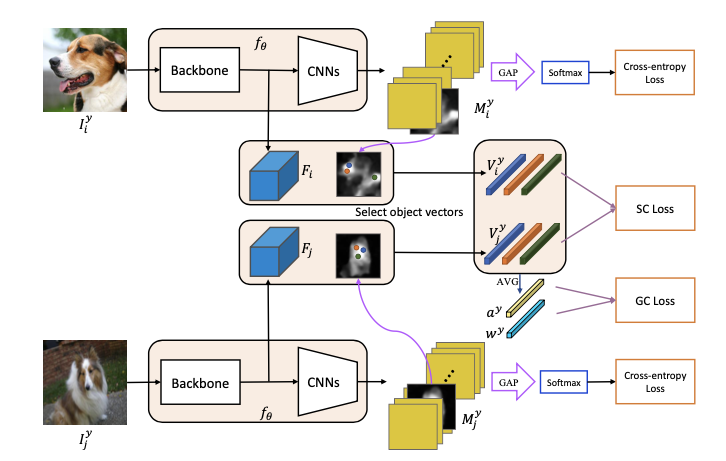

### 2.主要方法

下面分别对两种一致性的具体实现进行：

####2.1 Stochastic Consistency

为了比较两张图片之间的一致性，首先需要提取一些相关的向量对图片的特征进行表示，在文中使用的是CAM热力图之后超过阈值部分作为Object Seed Vectors。对共同训练的同类两张图片提取Object Seed Vectors然后使用L2距离衡量：

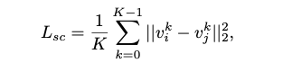

#### 2.2 Global Consistency

为了提取到一个类图片中的整体表示向量，该文使用移动平均的方法，首先在每一个mini-batch中计算类表示向量，实际上就是所有同类图片Object Seed Vectors的平均值：

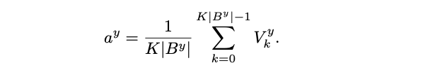

全局表示使用移动平均的方式在每一个minibatch后都进行更新：

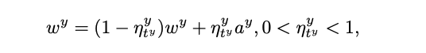

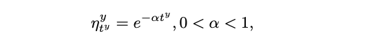

最后还是通过L2距离计算一个minibatch中特征表示与整个类特征表示之间的偏差作为损失：

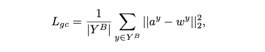

所有的损失函数表示如下：

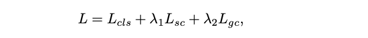

### 3.主要创新

充分运用了同一个类图片中的特征表示，之前的文章中从来没有将图片之间的共性引入。

### 4.想法

在CUB数据集中这种方法得到的表现效果并不一定好，因为数据集中都是鸟类而定位的时候其实并不在意鸟类具体类别特征。可以定义一个属性向量，该属性向量用来衡量图片之间的属性一致性而不是类一致性，具有相似属性的图片我们认为其应该同属一个大类在定位的时候将两者的定位图都进行考虑。


## 4.DANet: Divergent Activation for Weakly Supervised Object Localization

### 1.简介

这篇文章主要将之前的精细具体的类别信息重整为几个大类，然后提出分类问题由于训练的是具体的类所以只能关注到物体的一部分，而定位问题更多的是关注与这一大类物体的属性信息。在下面的图片中也可以看出来，当细分每一个鸟类的时候，由于网络要进行分类，所以关注的更多是具有判别力的局部信息，而将不同相似类别合并以后就能更好关注与整体信息。

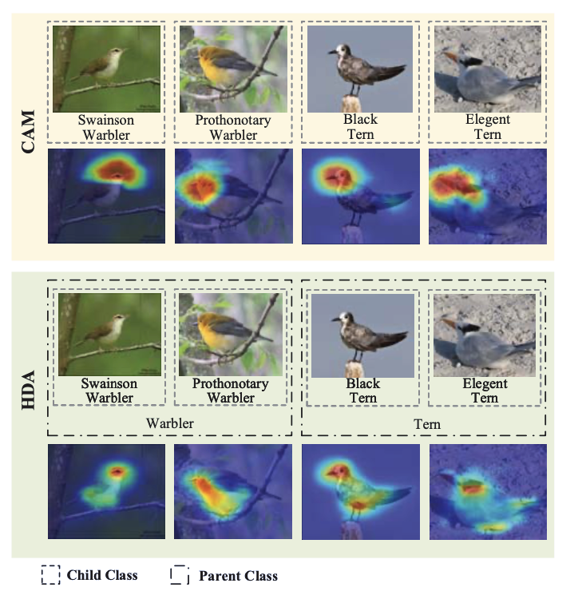

基于这样的思想，文章首先对之前的类别信息进行了合并，对于CUB数据集划分了一个三层的结构，而对于ILSVRC数据集则直接使用wordnet进行划分。

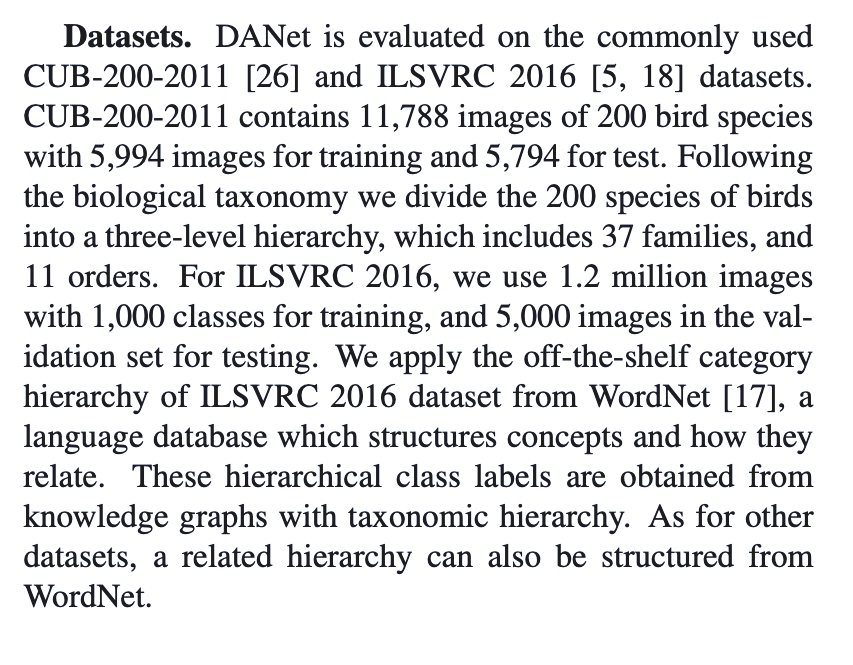

划分完大类之后对之前的网络结构也进行了改变，将之前的单个分支网络变为多个分支，每个分支输出相对应的大类，最后将每个分支得到的CAM图进行像素级别的平均得到最后的定位图。

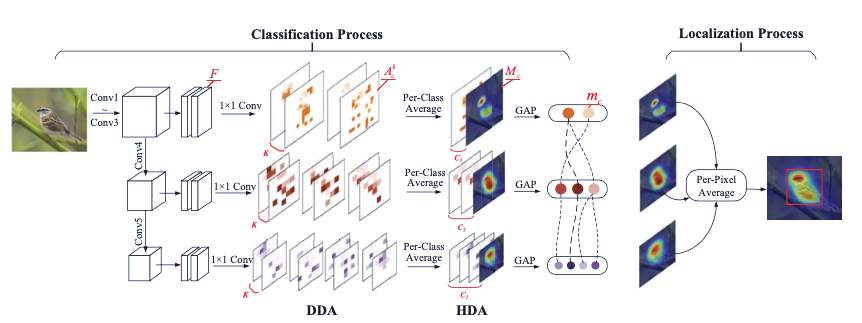

### 2.主要方法

本文主要提出两种结构，分别称为discrepant divergent activation (DDA)和hierarchical divergent activation (HDA)，DDA通过余弦距离对使得每一个类中的K个feature map差异最大，而HDA则是指这种层次分类结构，在每一个大类中都生成CAM。

#### 2.1 DDA

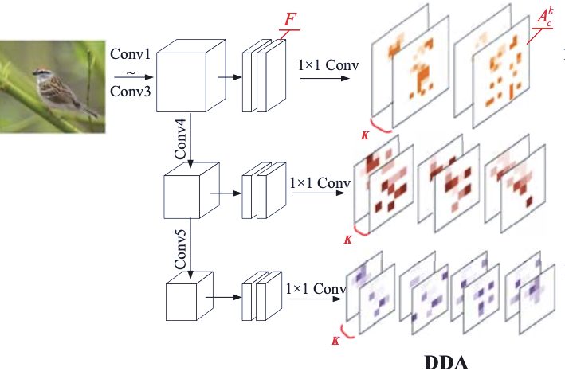

在经过backbone对特征进行提取后，使用$1\times 1$卷积将feature map变为 $[batch,k,num\_classes,h,w]$ 的尺寸，每一个类都对应着K个feature map：

```python
self.cls5 = nn.Conv2d(1024, num_classes*self.num_maps, kernel_size=1, padding=0) 
childResult_multimaps = self.cls5(childResult).view(batch_size, self.num_classes, self.num_maps, 14, 14)
```

然后对GT类对应的K个feature map取余弦距离，使得余弦距离的值最小，也就是其特征相距最大：

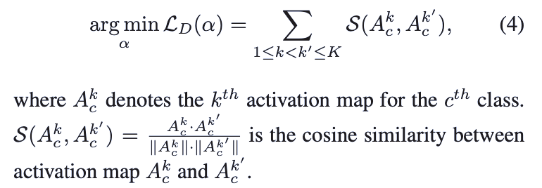

#### 2.2 HDA

HDA的部分主要关注与不同的类别网络输出的定位图，将各个定位图进行汇总相加

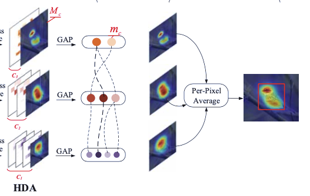

这部分的损失函数就是多个分类网络loss之和：

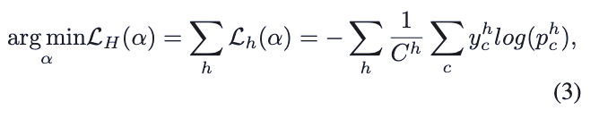

### 3.主要创新

将类别划分为不同层次，同时对粗略的大类别以及精细的小类别进行学习，使定位部分能够学习到更多同一大类别物体的相关特征。

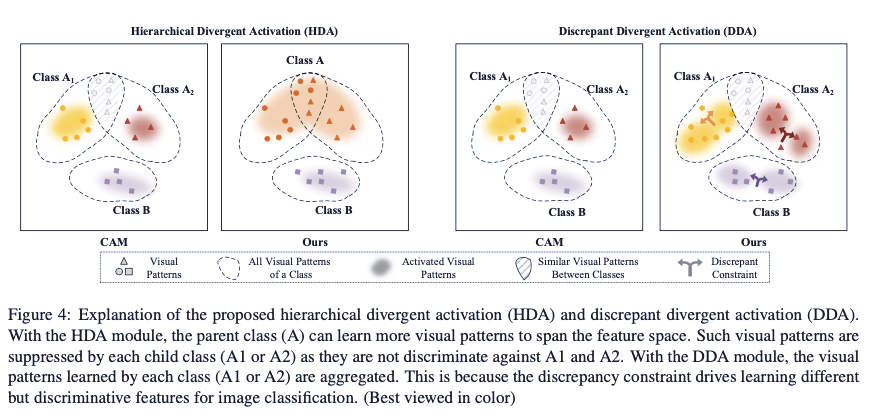


