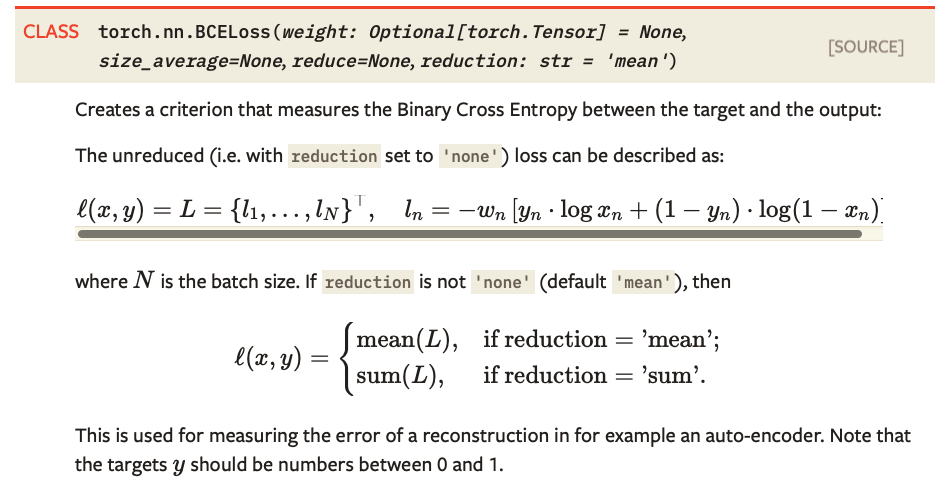

#损失函数loss function
## nn.MSELoss()

*CLASS* `torch.nn. MSELoss`(*size_average=None*, *reduce=None*, *reduction: str = 'mean'*)

均方误差损失函数，又称L2损失函数，返回两个向量中每个对应元素计算后的误差平方和或者平均，常用于回归问题的损失函数

- reduction 参数取值为``sum``或者``mean``，分别表示对求得损失向量进行求和或者求平均


```python
loss = nn.MSELoss()
>>> input = torch.randn(3, 5, requires_grad=True)
>>> target = torch.randn(3, 5)
>>> output = loss(input, target)
>>> output.backward()
```

## nn.BCELoss()

用于二分类过程损失的计算，计算二值交叉熵(Binary Cross Entropy )，二值交叉熵的计算如下：



```python
>>> m = nn.Sigmoid()
>>> loss = nn.BCELoss()
>>> input = torch.randn(3, requires_grad=True)
>>> target = torch.empty(3).random_(2)
>>> output = loss(m(input), target)
>>> output.backward()
```