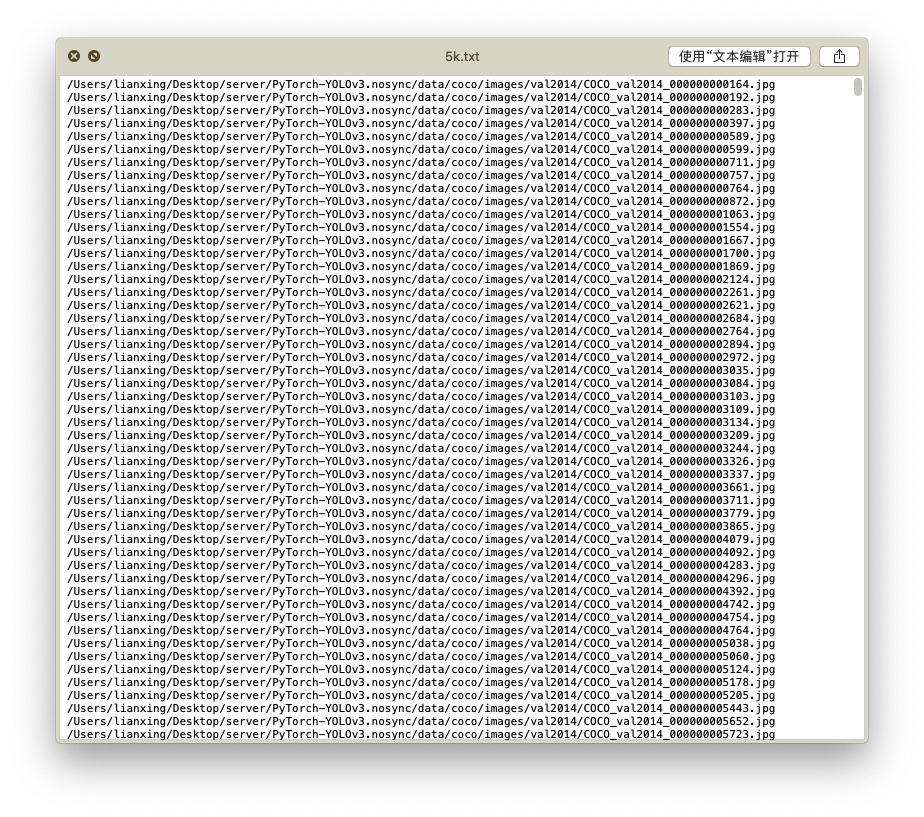

# 数据集读取

通过dataset类和dataloader类对数据进行读取和预处理。

## COCO数据集

COCO API - http://cocodataset.org/

COCO is a large image dataset designed for object detection, segmentation, person keypoints detection, stuff segmentation, and caption generation. This package provides Matlab, Python, and Lua APIs that assists in loading, parsing, and visualizing the annotations in COCO. Please visit http://cocodataset.org/ for more information on COCO, including for the data, paper, and tutorials. The exact format of the annotations is also described on the COCO website. The Matlab and Python APIs are complete, the Lua API provides only basic functionality.

In addition to this API, please download both the COCO images and annotations in order to run the demos and use the API. Both are available on the project website.
-Please download, unzip, and place the images in: coco/images/
-Please download and place the annotations in: coco/annotations/
For substantially more details on the API please see http://cocodataset.org/#download.

After downloading the images and annotations, run the Matlab, Python, or Lua demos for example usage.

To install:
-For Matlab, add coco/MatlabApi to the Matlab path (OSX/Linux binaries provided)
-For Python, run "make" under coco/PythonAPI
-For Lua, run “luarocks make LuaAPI/rocks/coco-scm-1.rockspec” under coco/

COCO数据集的具体下载方式：

```shell
#!/bin/bash

# CREDIT: https://github.com/pjreddie/darknet/tree/master/scripts/get_coco_dataset.sh

# Clone COCO API
git clone https://github.com/pdollar/coco
cd coco

mkdir images
cd images

# Download Images
aria2c --file-allocation=none -c -x 16 -s 16 https://pjreddie.com/media/files/train2014.zip
aria2c --file-allocation=none -c -x 16 -s 16 https://pjreddie.com/media/files/val2014.zip

# Unzip
unzip -q train2014.zip
unzip -q val2014.zip

cd ..

# Download COCO Metadata
aria2c --file-allocation=none -c -x 16 -s 16 https://pjreddie.com/media/files/instances_train-val2014.zip
aria2c --file-allocation=none -c -x 16 -s 16 https://pjreddie.com/media/files/coco/5k.part
aria2c --file-allocation=none -c -x 16 -s 16 https://pjreddie.com/media/files/coco/trainvalno5k.part
aria2c --file-allocation=none -c -x 16 -s 16 https://pjreddie.com/media/files/coco/labels.tgz
tar xzf labels.tgz
unzip -q instances_train-val2014.zip

# Set Up Image Lists
paste <(awk "{print \"$PWD\"}" <5k.part) 5k.part | tr -d '\t' > 5k.txt
paste <(awk "{print \"$PWD\"}" <trainvalno5k.part) trainvalno5k.part | tr -d '\t' > trainvalno5k.txt

```


## 图片索引

数据集中的图片索引以txt的形式存储，具体形式如下：



需要对该文件中的每一行进行读取，整个过程的代码如下

```python
list_path = "/Users/lianxing/Desktop/server/PyTorch-YOLOv3.nosync/data/coco/trainvalno5k.txt" #读取存储图片位置的txt文件
with open(list_path, "r") as file: #打开文件并读取每一行组成一个list返回
    img_files = file.readlines()  # 读取图片位置
#得到img_files是一个list，其中每一个元素都代表这一个图片的位置
    
 #在__getitem__中读取图片
img_path = self.img_files[item % len(self.img_files)].rstrip()
img = transforms.ToTensor()(Image.open(img_path).convert('RGB'))
```

## 标记读取

标记文件索引可以沿用上面图片的索引，只需要将文件夹名称```images```更换为```labels```，并且将图片形式的后缀```.jpg/.png```更换为```.txt```

```python
label_files = [
    path.replace("images", "labels").replace("png", "txt").replace("jpg", "txt")
    for path in img_files
]

#在__getitem__函数中读取标签
label_path = self.label_files[item % len(self.img_files)].rstrip()
boxes = torch.from_numpy(np.loadtxt(label_path).reshape(-1, 5))
```


