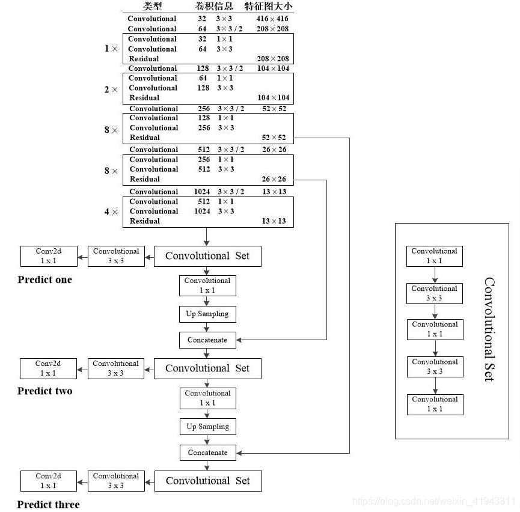

# Darknet-53

1. 模型的Backend结构
    - 模型的backend为DarkNet-53；
    - 这52个卷积层是这样组成的：(1)1个Filters为32的卷积结构；(2)5组重复的Blocks(包括1个单独的卷积结构，加上1个或几个重复的Residual Block结构)；
    - 如此计算层数为`52 = 1 + (1 + 1 * 2) + (1 + 2 * 2) + (1 + 8 * 2) + (1 + 8* 2) + (1 + 4 * 2)`
    - 再加上最后的全连接层，总共为53层。
    - 图中总共做了5次padding，使得图片的大小最后缩小了2^5=32倍，即输入为256x256，最后模型的输出为8x8。(而Yolo-V3常见的图片输入大小还有416x416，用相同的方式计算可以得到输入为416x416，最后模型的输出为13x13)。

2. 模型的结构全貌
    - 其中下图中虚线框的部分对应了上图中Backend部分，它舍去了最后的Avgpool、Connected和Softmax的部分；
    - 下图里，**Convolutional Set**等于**YoloBlock**，它不改变特征图的长宽，但是改变特征图的层数。(例如，YoloBlock(n)，由1x1Conv(c=n)、3x3Conv(c=2n)、1x1Conv(c=n)、3x3Conv(c=2n)、1x1Conv(c=n)组成，其中c代表通道数。)
    - Yolov3借鉴了金字塔特征图思想，小尺寸特征图用于检测大尺寸物体，而大尺寸特征图检测小尺寸物体。特征图的输出维度为$N*N*[3*(4+1+80))$，$N*N$为输出特征图格点数，一共3个Anchor框，每个框有4维预测框数值 $t_x, t_y, t_w, t_h$，1维预测框置信度，80维物体类别数。所以第一层特征图的输出维度为`8 x 8 x 255`;
    - Yolov3总共输出3个特征图，第一个特征图下采样32倍，第二个特征图下采样16倍，第三个下采样8倍。输入图像经过Darknet-53（无全连接层），再经过Yoloblock生成的特征图被当作两用，第一用为经过$3*3$卷积层、$1*1$卷积之后生成特征图一，第二用为经过$1*1$卷积层(降低特征图层数)加上采样层，与Darnet-53网络的中间层输出结果进行拼接，产生特征图二。同样的循环之后产生特征图三。
    - 教程中的模型结构对应于`config/yolov3.cfg`

