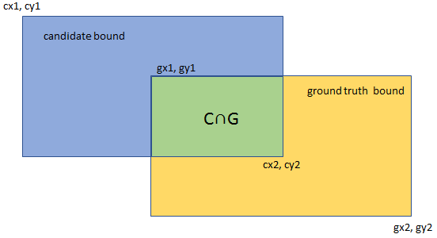

# Utils

utils文件一般用于存放各种有用的函数，相当于一个工具库

## IOU计算

IOU是 intersection over union 的缩写，用于评估检测框与真实框之间的差距，该指标用两个框相交的面积除以两个框相并的总面积：
$$
IOU= \frac{Area \ of\  A\cap B}{Area \ of\ A\cup B}
$$


IOU的计算过程中需要得到交集部分的左上角以及右下角坐标，通过观察可以知道左上角x为两个box左上角x的较大值，y为两个box左上角y坐标的较小值，同理也可以得到右下角的坐标，

```python
def bbox_iou(box1, box2, x1y1x2y2=False):
    """
    其中x1y1为左上角点，x2y2为右下角的点
    #box1: 第一个box的位置信息，一般以xyhw的形式存储
    #box2: 第二个box的位置信息，一般以xyhw的形式存储
    #x1y1x2y2：box的位置信息是否是以两个点的方式传入
    Returns the IoU of two bounding boxes
    """
    #如果box的表示为xyhw的形式/坐标的形式
    if not x1y1x2y2:
        # Transform from center and width to exact coordinates
        b1_x1, b1_x2 = box1[:, 0] - box1[:, 2] / 2, box1[:, 0] + box1[:, 2] / 2
        b1_y1, b1_y2 = box1[:, 1] + box1[:, 3] / 2, box1[:, 1] - box1[:, 3] / 2
        b2_x1, b2_x2 = box2[:, 0] - box2[:, 2] / 2, box2[:, 0] + box2[:, 2] / 2
        b2_y1, b2_y2 = box2[:, 1] + box2[:, 3] / 2, box2[:, 1] - box2[:, 3] / 2
    else:
        # Get the coordinates of bounding boxes
        b1_x1, b1_y1, b1_x2, b1_y2 = box1[:, 0], box1[:, 1], box1[:, 2], box1[:, 3]
        b2_x1, b2_y1, b2_x2, b2_y2 = box2[:, 0], box2[:, 1], box2[:, 2], box2[:, 3]
		
    # 相交区域的xy值get the corrdinates of the intersection rectangle
    inter_rect_x1 = torch.max(b1_x1, b2_x1)
    inter_rect_y1 = torch.min(b1_y1, b2_y1)
    inter_rect_x2 = torch.min(b1_x2, b2_x2)
    inter_rect_y2 = torch.max(b1_y2, b2_y2)
    # Intersection area clamp函数保证不相交的时候面积为0  #疑问：不知道为什么+1？
    inter_area = torch.clamp(inter_rect_x2 - inter_rect_x1 + 1, min=0) * torch.clamp(
        inter_rect_y1 - inter_rect_y2 + 1, min=0
    )
    # Union Area
    b1_area = (b1_x2 - b1_x1 + 1) * (b1_y1 - b1_y2 + 1)
    b2_area = (b2_x2 - b2_x1 + 1) * (b2_y1 - b2_y2 + 1)

    iou = inter_area / (b1_area + b2_area - inter_area + 1e-16)

    return iou
```

## build_targets函数

1.计算target在grid下(单位相对位置，相对于一个grid的宽)的位置 ``tx, ty, tw, th, tcls, tconf``

2.得到正预测框、负预测框以及类预测值用于后期loss计算``class_mask, obj_mask, noobj_mask`

3.返回最大IOU值

```python
def build_targets(pred_boxes, pred_cls, target, anchors, ignore_thres):
    """
        1.通过target的中心点判断标记哪个grid负责预测target
        计算每个grid的3个anchor与target的iou， 标记哪些anchor是正样本 哪些是负样本
    :param pred_boxes:  [B A H W 4]  grid为单位的相对值
    :param pred_cls:  [B A H W 80]
    :param target: [T ,6]    6代表：index, class, x_center, y_center, w, h
            target原始文件里类似 [0 0.515 0.5 0.21694873 0.18286777] 是针对原图的比例 通过collate_fn()增加sample_index维度
    :param anchors: [3, 2]  scaled
    :param ignore_thres:
    :return:
    """

    BoolTensor = torch.cuda.BoolTensor if pred_boxes.is_cuda else torch.BoolTensor
    FloatTensor = torch.cuda.FloatTensor if pred_boxes.is_cuda else torch.FloatTensor
    # pred_boxes B A H W 4
    nB = pred_boxes.size(0) #batch的数量
    nA = pred_boxes.size(1) #anchor的数量
    nC = pred_cls.size(-1)  #类别数
    nG = pred_boxes.size(2) #grid的个数

    # Output tensors
    obj_mask = BoolTensor(nB, nA, nG, nG).fill_(0)  # [B A G G]  G:13, 26, 52...  布尔值
    noobj_mask = BoolTensor(nB, nA, nG, nG).fill_(1) # [B A G G]  G:13, 26, 52...  布尔值
    class_mask = FloatTensor(nB, nA, nG, nG).fill_(0) # [B A G G]  G:13, 26, 52...  float
    iou_scores = FloatTensor(nB, nA, nG, nG).fill_(0) # [B A G G]  G:13, 26, 52...  float
    tx = FloatTensor(nB, nA, nG, nG).fill_(0) # [B A G G]  G:13, 26, 52...  float
    ty = FloatTensor(nB, nA, nG, nG).fill_(0) # [B A G G]  G:13, 26, 52...  float
    tw = FloatTensor(nB, nA, nG, nG).fill_(0) # [B A G G]  G:13, 26, 52...  float
    th = FloatTensor(nB, nA, nG, nG).fill_(0) # [B A G G]  G:13, 26, 52...  float
    tcls = FloatTensor(nB, nA, nG, nG, nC).fill_(0) # [B A G G C]  G:13, 26, 52...  float

    # Convert to position relative to box
    target_boxes = target[:, 2:6] * nG  #从针对原图的比例转换为针对格点的比例  x_center, y_center, h, w 例如h=1.2则代表宽度是grid宽度的1.2倍
    gxy = target_boxes[:, :2]  # T 2  grid level
    gwh = target_boxes[:, 2:]  # T 2  grid level
    # Get anchors with best iou
    # 这里传入的都是相对格点的数值
    ious = torch.stack([bbox_wh_iou(anchor, gwh) for anchor in anchors]) # [A, T] A代表anchor T代表与所有target的iou
    best_ious, best_n = ious.max(0)  # best_ious 最大的iou  best_n最大iou对应的anchor编号
    # Separate target values
    b, target_labels = target[:, :2].long().t() # b是sample index  target_labels是标签
    gx, gy = gxy.t()
    gw, gh = gwh.t()
    gi, gj = gxy.long().t()  # .long()相当于向下取整， target 中心点（x,y）落在的格点位置，标记了哪个格点有target
    # Set masks
    # 这里可以这样理解：需要做的是把所有target定位到grid上面，定位每个点需要四个坐标
    # [sample编号b(对应batchsize B), anchor编号(best_n 对应anchors A), grid坐标 x,y] 所以先对每个anchor求b, best_n,
    # 相对偏移量gj gi ，这样把四个坐标放进obj_mask就可以了。这四个坐标长度都是T的索引
    obj_mask[b, best_n, gj, gi] = 1 # B A H W  因为为HW所有gj在前面 中标记命中target的位置（有前景）  标记正样本位置
    noobj_mask[b, best_n, gj, gi] = 0 # B A H W 有前景的标为0 其余的就是背景 标为1

    # Set noobj mask to zero where iou exceeds ignore threshold
    # 负样本iou超过阈值的部分不再标记为负样本，也就是这部分不参与loss计算
    #在第i张图片找出不需要计算loss的anchor
    for i, anchor_ious in enumerate(ious.t()):   #ious.t()  [T A]  每行代表每个target与A个anchor的iou
        noobj_mask[b[i], anchor_ious > ignore_thres, gj[i], gi[i]] = 0

    # Coordinates  相对值 可以直接做loss回归的
    tx[b, best_n, gj, gi] = gx - gx.floor() #gt 相对于左上角格点的水平偏移量  [B A G G]
    ty[b, best_n, gj, gi] = gy - gy.floor() #gt 相对于左上角格点的垂直偏移量  [B A G G]
    # Width and height
    tw[b, best_n, gj, gi] = torch.log(gw / anchors[best_n][:, 0] + 1e-16) # target相对于对应的anchor的比例 [B A G G]
    th[b, best_n, gj, gi] = torch.log(gh / anchors[best_n][:, 1] + 1e-16) # [B A G G]
    # One-hot encoding of label
    tcls[b, best_n, gj, gi, target_labels] = 1
    # Compute label correctness and iou at best anchor
    class_mask[b, best_n, gj, gi] = (pred_cls[b, best_n, gj, gi].argmax(-1) == target_labels).float()
    iou_scores[b, best_n, gj, gi] = bbox_iou(pred_boxes[b, best_n, gj, gi], target_boxes, x1y1x2y2=False)
    tconf = obj_mask.float()
    return iou_scores, class_mask, obj_mask, noobj_mask, tx, ty, tw, th, tcls, tconf
```

