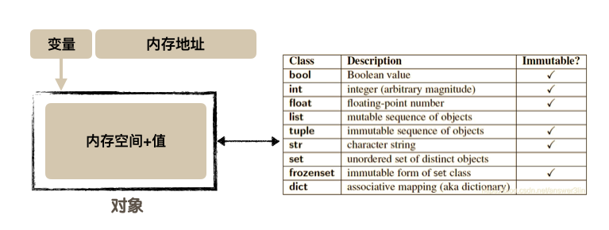
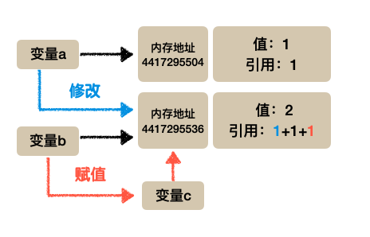
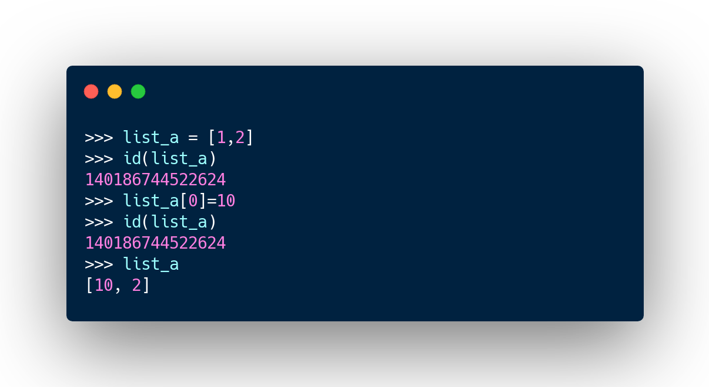
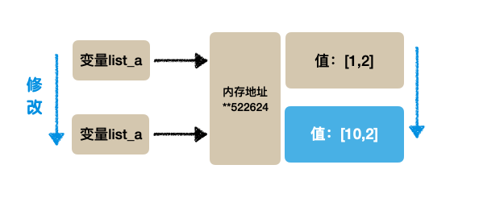
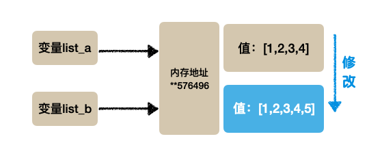
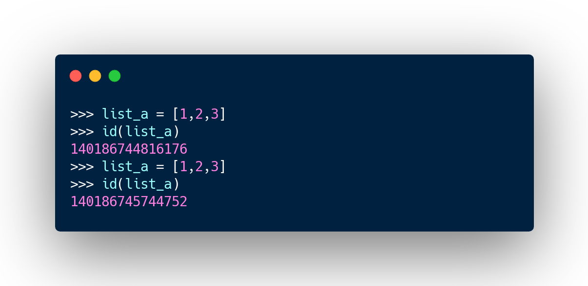
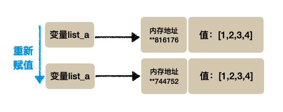
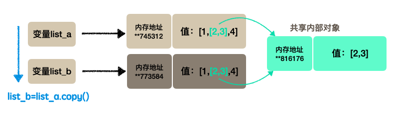
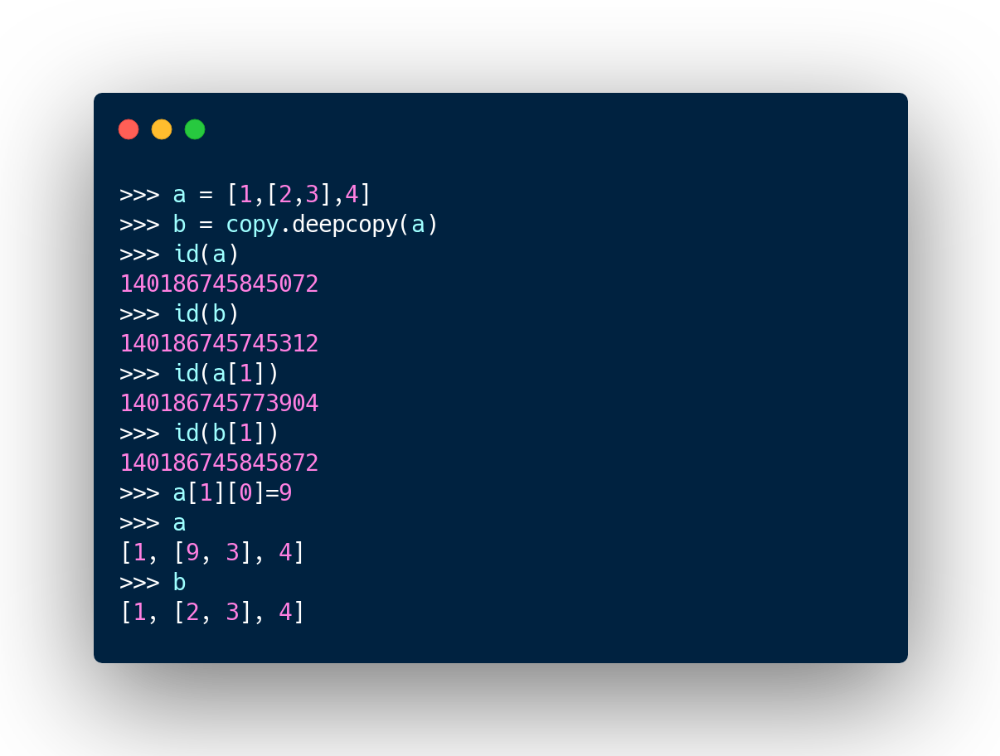
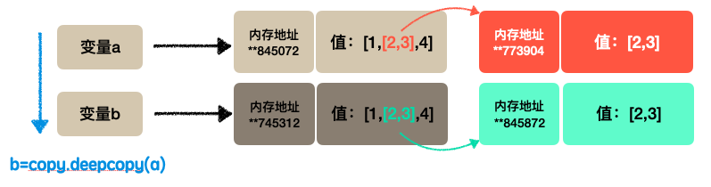

# 浅拷贝与深拷贝

在介绍浅拷贝与深拷贝之前首先来理解一下python中的值类型和引用类型：

## 1.值类型和引用类型

- 变量：在python中所有的变量都是指针，这个指针可以指向任意对象
- 对象：对象是内存空间+存储在内存空间的值，对象分为两类，一类是不可修改的称为值类型，一类是可修改的称为引用类型

Python中数值、字符串、布尔型和元组都是值类型，本身不允许被修改（不可变类型），对这些数值的修改实际上是让其指向一个新的对象，所以不会发生共享内存的现象；而列表、集合和字典是引用类型，本身允许修改。

### 1.1值类型

对于值类型的修改实际上是将变量赋予一个新的内存地址指向一个新的对象，而原来的对象不会被改变。

在下面的例子中当修改a的值之后我们发现其指向的内存地址也发生了改变，这说明其已经指向了一个新的内存地址也即一个新的对象；当我们创建一个新的变量b的时候，它的值与a相同，查看它的内存地址发现与a相同，这再次说明我们的变量存储的是内存地址；在进行赋值操作的时候同样是将内存地址赋予新的变量使其指向原来的对象。

之所以称为不可修改的数据类型，可以理解为内存中的对象不会被改变，即变量引用的地址处的值是固定不变的，当改变值的时候实际是将变量指向新的对象而原来对象依旧存在（若没有被回收的话），为了优化存储空间，每一个对象处还会记录当前引用数（即指向对象的变量个数），当引用数为0的时候内存就会被释放。

- 优点：多个变量可以指向同一个对象，这样就可以节省存储空间
- 缺点：当需要改变对象中的值的时候只能创建一个新的对象，这样每一次改变都需要创建新的对象，当然在这个过程中不再使用的对象也会被垃圾回收

### 1.2引用类型

在Python中列表、字典、集合都是引用类型，其本身可以被修改，也就是可以直接对其对象中的值进行修改。

**数据修改：**当我们修改引用类型的数据时会直接对原来对象中的值进行操作，这个过程不会生成新的对象（在值类型数据中就会生成新的对象）。这里数据修改指的是类似于append/+/-/...操作，不包括新的赋值操作（下面会提到）

**变量间的赋值：**两个变量之间的赋值过程操作的也是对象的地址，赋值后两个变量会指向同一个对象，对任意一个变量指向对象的修改都会体现在另一变量中。

**直接赋值：**每次对于变量的直接赋值都会使得变量指向一个新的对象，即便对象的值相同也会重新在内存中创建对象

这就出现了值相同但却有两个不同对象的情况，这和我们上面提到过在值类型的数据中值相同对象也相同不同。注意这里的直接赋值不属于我们提到的对可变类型的修改，修改的过程不会创建一个新的对象而是对原对象值进行修改，而赋值就会创建新的对象。

- 优点：可以对变量指向对象的值进行修改，这样就避免每次都需要创建新的对象。
- 缺点：即便两个对象中的值相同其地址也不同，所以其属于两个不同的对象，这样会占用更多的存储空间

文章参考：[Python学习系列之值类型与引用类型](https://blog.csdn.net/answer3lin/article/details/86430074)

## 2.浅拷贝与深拷贝

- 赋值：对于值类型和引用类型来说，变量赋值操作不会创建新的对象而都是指向同一个对象，但是最对其进行修改的时候，修改值类型的数据会创建新的对象而修改引用类型数据则不会。

- 浅拷贝：浅拷贝会拷贝父对象生成一个新的对象，但是对于对象中的元素依旧保持原来的引用也就是使用浅拷贝的时候python会拷贝外层对象的数据生成一个新的对象，并且会把原来对象中的内部数据（包括内部对象）也传递过来且保持内部对象的引用不变。

由于内部对象是共享的而只对外部对象中的值进行了拷贝所以这种过程称为浅拷贝，也就是值拷贝了浅的外层而内层依旧共享。

使用下面的操作时会产生浅拷贝的效果：

1. 切片操作[:]
2. copy()方法或者copy模块中的copy()函数

- 深拷贝：深拷贝能够实现对外部对象和内部对象的完全拷贝，在拷贝过程中不仅建立了新的外部对象同时对于内部对象也都进行重新创建。

## 3.总结

1. 两种拷贝方式仅在具有复杂对象的时候有区别，这里复杂对象就是指对象中含有其他对象
2. 对于不可变类型和简单的可变类型(可变类型中包含的对象都是不可变类型)，浅拷贝和深拷贝没有区别
3. `copy.copy `浅拷贝只拷贝父对象，不会拷贝对象的内部的子对象。`copy.deepcopy `深拷贝拷贝对象及其子对象。

文章参考：[Python学习系列之浅拷贝和深拷贝](https://blog.csdn.net/answer3lin/article/details/86428099?ops_request_misc=%257B%2522request%255Fid%2522%253A%2522161949092216780271578685%2522%252C%2522scm%2522%253A%252220140713.130102334.pc%255Fblog.%2522%257D&request_id=161949092216780271578685&biz_id=0&utm_medium=distribute.pc_search_result.none-task-blog-2~blog~first_rank_v2~rank_v29-1-86428099.pc_v2_rank_blog_default&utm_term=拷贝&spm=1018.2226.3001.4450)