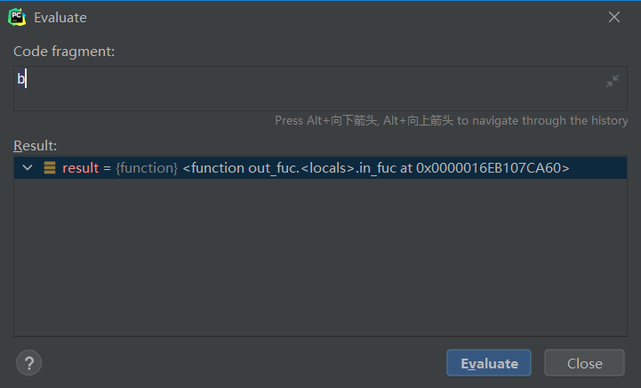
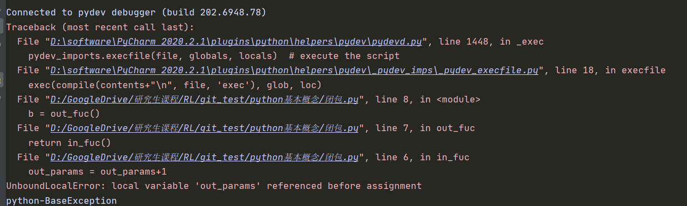

# 闭包

在介绍闭包的概念之前首先引入外函数和内函数的概念，如果我们在一个函数1中定义了另外一个函数2，那么函数1称为外函数，函数2称为内函数。

闭包就是指在内函数中使用到了外函数的临时变量并且外函数返回内函数的引用。这里主要理解两个概念：

1.外函数的临时变量：就是指定义在外函数的变量

2.外函数返回内函数的引用

> 具体如何理解引用的概念呢？
>
> 从简单的赋值操作说起，`a=2`这个赋值操作实际是在内存中开辟一个空间用来存储2这个值，然后用一个变量`a`去指向这个地址，可以理解`a`是一个指向变量所在地址的指针，这里`a`存储了一个对数值2的引用。同样的道理，当定义函数`def fuc()`的时候，其中`fuc`就是一个对函数所在位置的引用，当我们使用`x=fuc`，这个时候`x`中存储的就是一个对函数的引用。

## 1 外函数返回内函数的引用

我们通过一个具体的例子来看：

```python
#外函数返回内函数的引用
def out_fuc():
    out_params = 1
    def in_fuc():
        print(out_params)
        return True
    return in_fuc
b = out_fuc()
```

上面的例子中外函数就返回对内函数的引用，我们来看一下变量b，可以看出它是一个函数：



我们可以使用`b()`去执行这个函数

```python
b()
>> 1
```

## 2.外函数把临时变量绑定给内函数

在上面的例子中可以看到在外函数中定义了一个参数`out_params = 1`，然后在内函数中可以对其进行调用。在一般情况下函数中的变量为临时变量，在函数执行结束后就会将其内存释放，之后变量就不存在了。但是在闭包中由于内函数对外函数的临时变量进行了调用，所以在自己结束之后会把外函数的临时变量与内函数绑定在一起以便内函数可以调用。

```python
def out_fuc():
    out_params = 1
    def in_fuc():
        print(out_params)
        return True
    return in_fuc
b = out_fuc()
b()
>> 1
```

虽然内函数对外函数的临时变量可以调用，但是却不能对其进行修改。

```python
def out_fuc():
    out_params = 1
    def in_fuc():
        out_params = out_params+1
    return in_fuc()
b = out_fuc()
```



运行上面的程序产生如上错误，错误显示局部变量在赋值之前就被调用，但是显然我们在`out_fuc`中对该变量进行了定义，为啥在`in_fuc`进行调用的时候就显示错误呢？

> 在基本的python语法当中，一个函数可以随意读取全局数据，但是要修改全局数据的时候有两种方法:
>
> 1 global 声明全局变量 
>
> 2 全局变量是可变类型数据的时候可以修改

闭包的情况也是类似，如果想要在内函数内对闭包传入的变量进行修改，那就要对该变量进行声明：

1. 在python3中，可以用nonlocal 关键字声明 一个变量， 表示这个变量不是局部变量空间的变量，需要向上一层变量空间找这个变量。

 　2. 在python2中，没有nonlocal这个关键字，我们可以把闭包变量改成可变类型数据进行修改，比如列表。 

```python
def out_fuc():
    out_params_1 = 1
    out_params_2 = [1] #将外函数变量变为可变类型数据
    def in_fuc():
        nonlocal out_params_1  #对临时变量进行声明
        out_params_1 = out_params_1+1
        out_params_2[0] = out_params_2[0]+1 
        print(out_params_1)
        print(out_params_2[0])
        return True
    return in_fuc()
b = out_fuc()
```

文章参考：https://www.cnblogs.com/s-1314-521/p/9763376.html