# Github的使用

## 在Pycharm中使用版本控制

### 创建版本控制文件

在pycharm中使用github进行版本控制，首先需要再设置中登录github

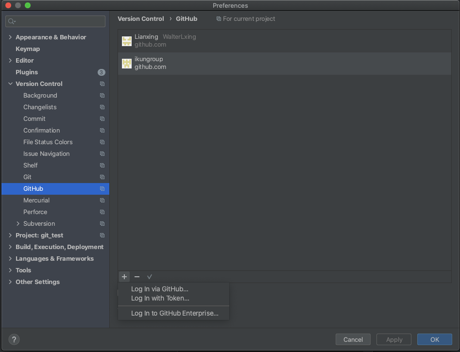

在登录成功之后在VSC中找到Import into Version Control(导入版本控制)的的选项，然后选择 Create Git Repository 就可以创建一个git项目

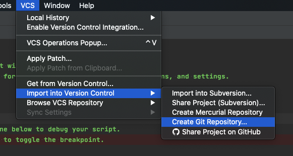

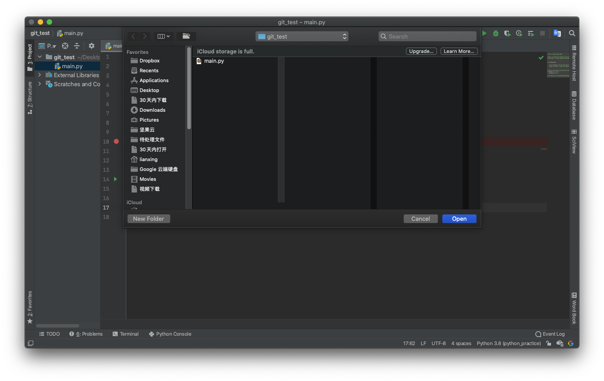

创建结束后生成的文件如下，可以看到左面栏中多了一个commit主要用来查看修改后代码的提交，右上角分别出现个git需要的几个按键，作用分别是云端更新到本地、提交修改与上传到云端

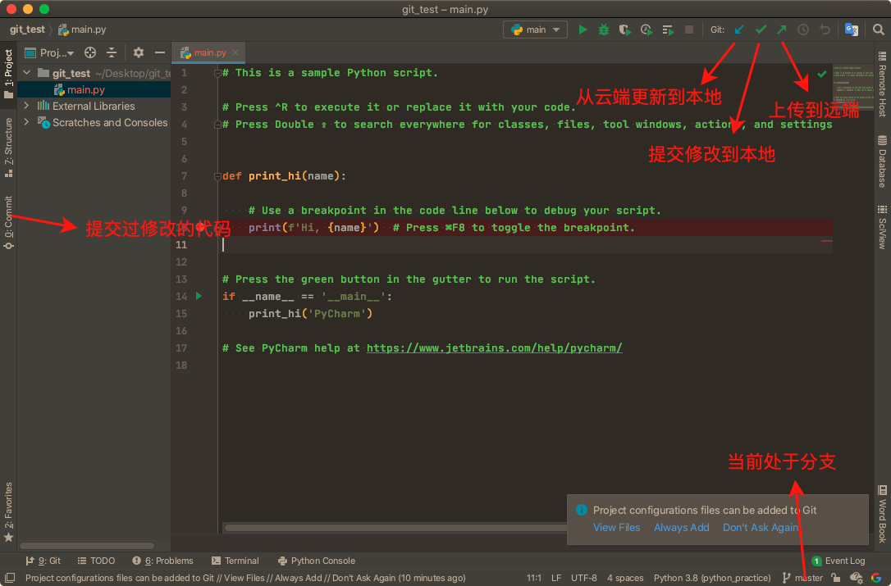

接下来需要将对应的文件上传到github上进行托管，按照下面的方式创建一个 Repository

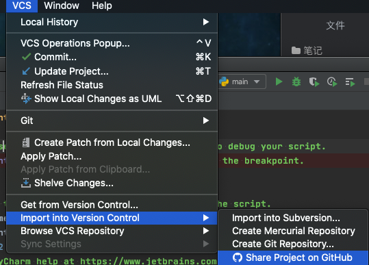

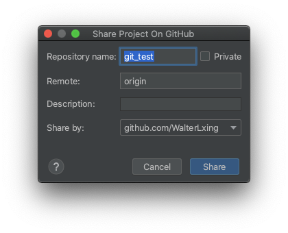

接下来需要登录到github，填写相应的用户名和密码即可，注意如果有多个账户的话要选择好对应的

### 1 文件的修改、提交、上传和下载

文件修改：文件的创建，修改和删除都会有相应的提示出现

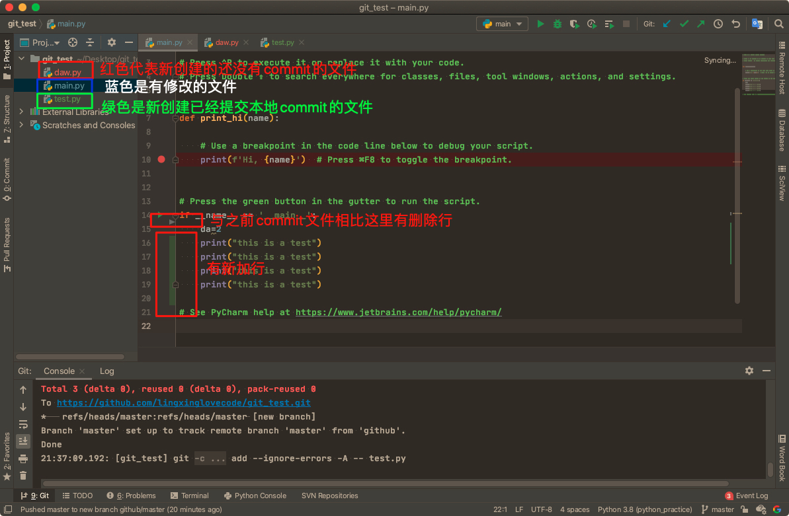

文件提交(Commit)：当修改完文件之后，可以在commit中对修改进行查看，可以看到和之前版本的对比

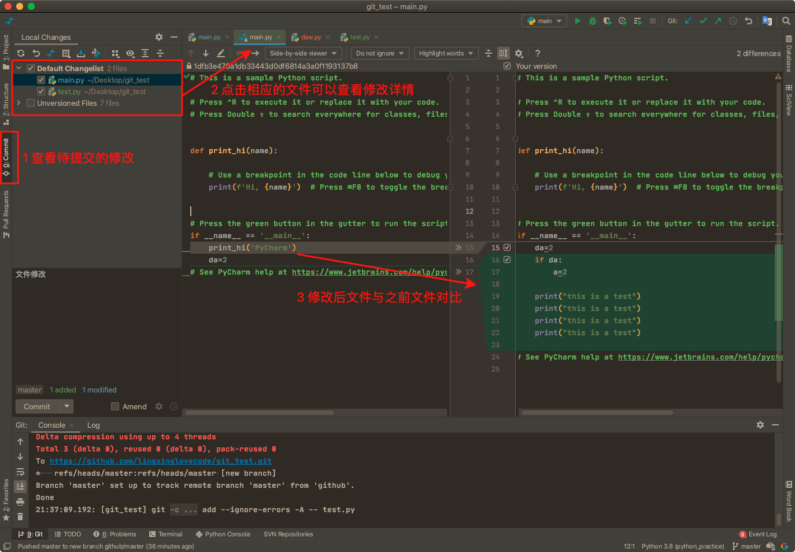

确认无误后就可以进行提交，注意提交的时候一定要写备注信息才能提交

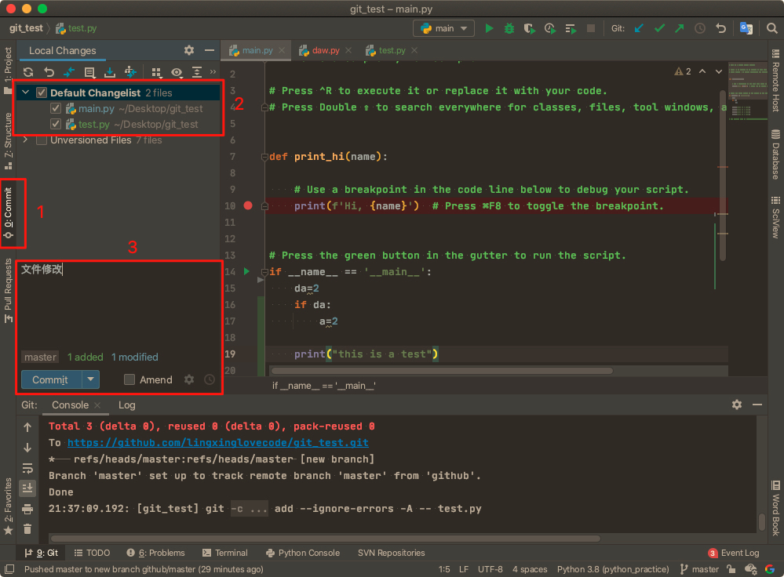

文件上传(Push)：在提交完文件之后实际上并没上传到github端，如果想要上传所有修改需要进行push操作，push的就是右上角的绿色箭头

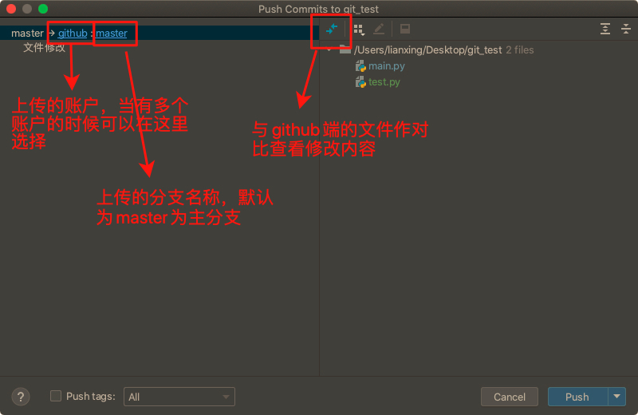

当点击push后相应的修改就会出现在github上，可以在代码区右键选择在github中打开就可以看到相应的文件

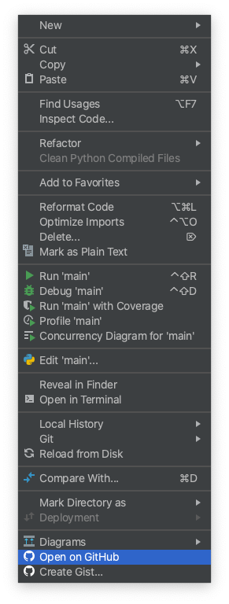

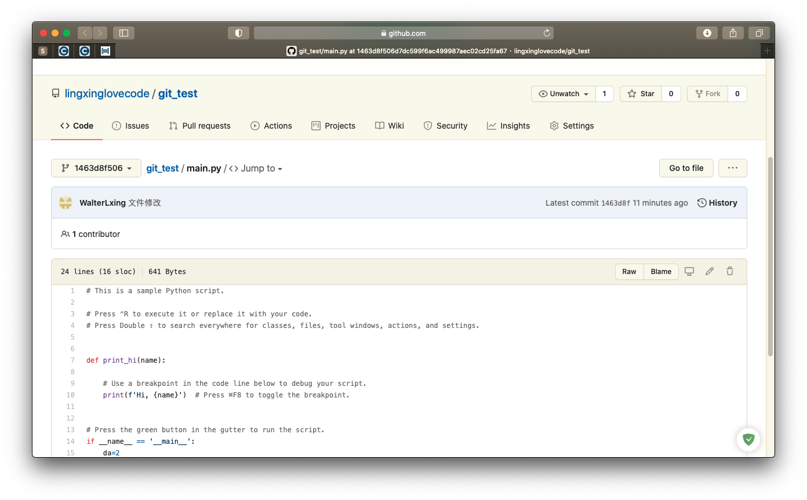

文件下载(Pull)：也可以在github端对文件进行创建和修改，然后在pycharm中通过pull操作获取云端的修改并同步到本地，下面在github上创建一个pull_test文件：

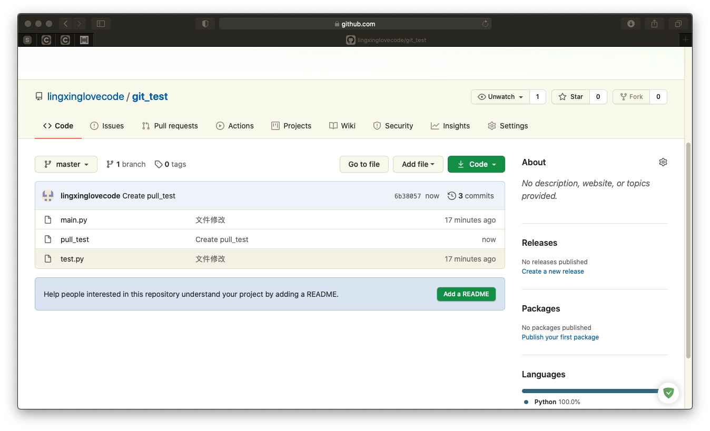

在pycharm上选择更新项目(Update Project)或者通过右键(pull)对本地文件进行更新

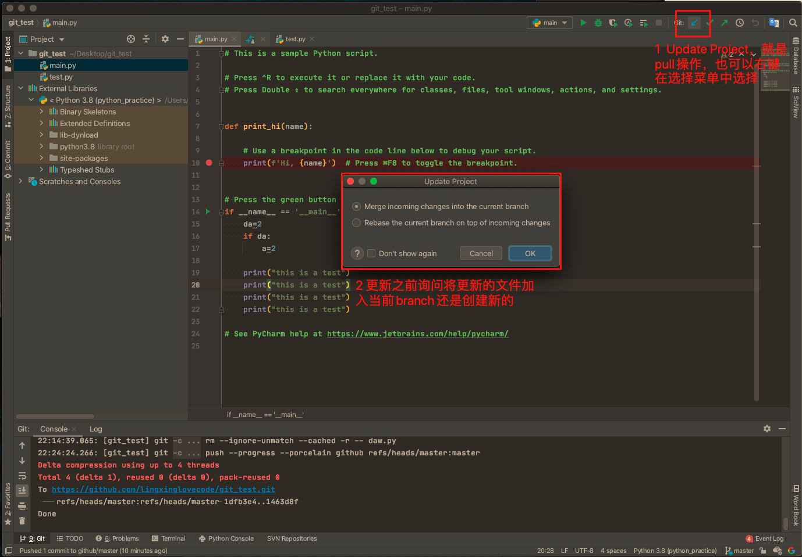

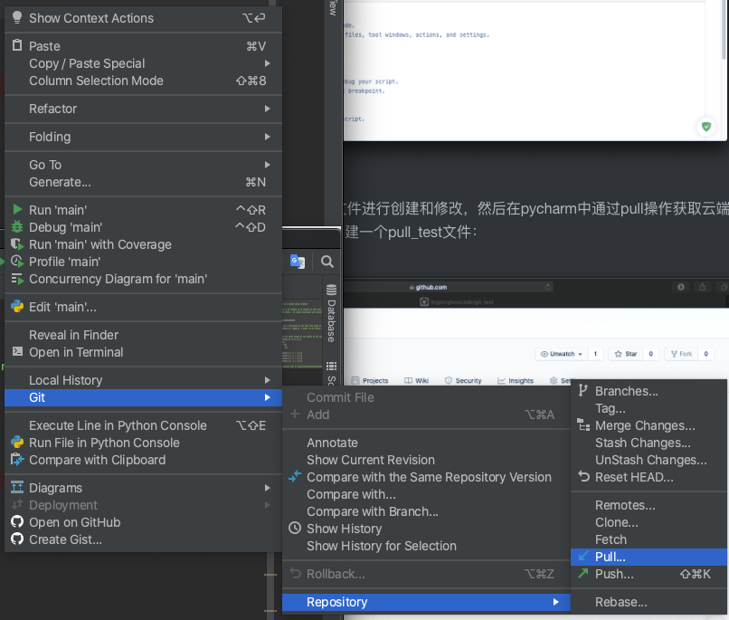

在更新之后本地就会出现相应的文件(pull_test)：

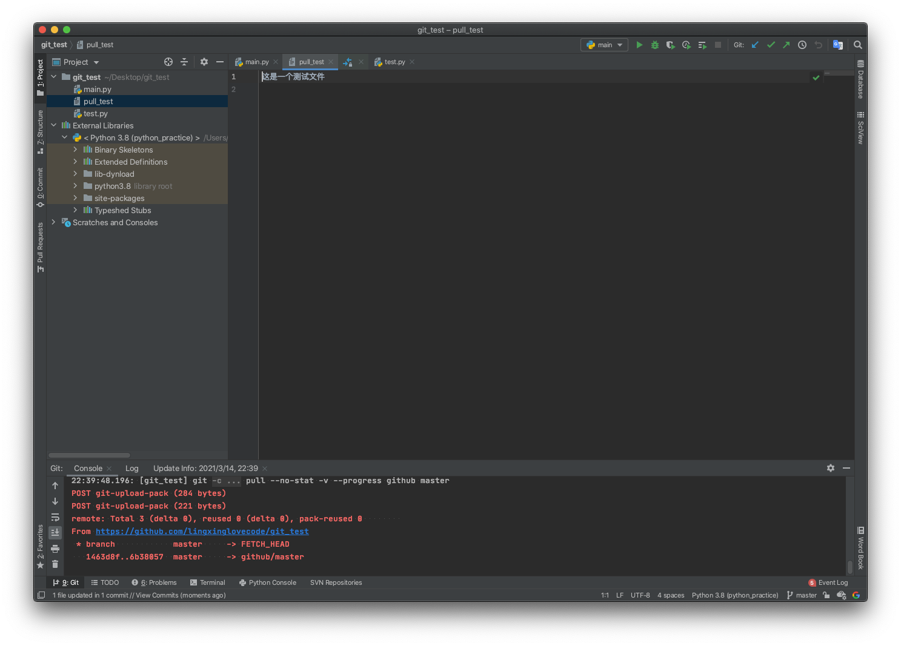