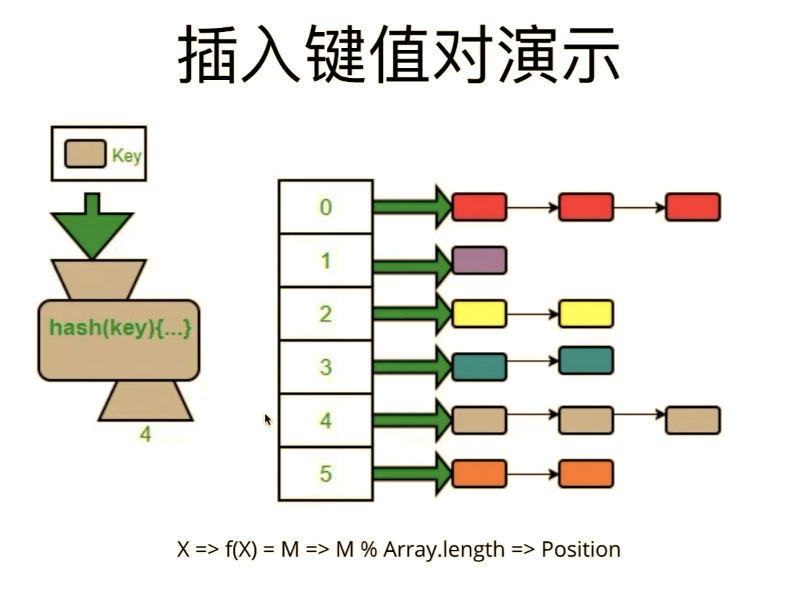

# 数据结构

本文对常见的数据结构进行总结：

- [ ] 链表
- [ ] 栈
- [ ] 树
- [x] 哈希表
- [ ] ...

## 哈希表HashMap

在数据结构中，数组寻址比较容易，但是删除和插入的过程较难，但是对与链表而言则恰恰相反，寻找的时候从头节点开始找。哈希表是数组+链表的结构，左面是数组，右面是一个链表：

### 哈希表支持的操作

通过哈希函数建立索引位置，再输入一个key后讲过哈希函数计算出来一个值，然后这个值与数组的长度取余得到的数就是对应的索引，通过索引确定其在哈希表中的位置。当然有可能不同的key的哈希值相同，这个时候将需要将数据存储在链表的不同位置作为区分。

> 哈希函数：
>
> 若经过哈希函数后得到的哈希值不同，则原来的输入一定不同；但是不同的输入可能得到相同的哈希值(哈希冲突)。

哈希表的构建实际上加快了对于相应元素的寻找，在寻找特定元素的过程中哈希表的时间复杂度仅为 $O(1)$，在python中字典就是使用的哈希表的数据结构。

