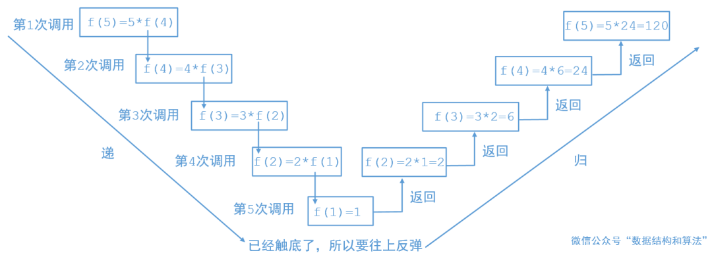

# 算法思想

本文主要对常用的算法思想进行总结：

- [ ] 双指针
- [ ] 动态规划
- [ ] 贪心策略
- [ ] 递归
- [ ] 分治


## 1.递归

递归的思想主要是将大的问题拆解为在已知子问题结果下的问题，通过一次次拆解最终得到容易解决的小问题，对小问题求解得到结果后进行回溯就实现解决大问题的目的。


### 1.1递归模板

在使用递归的过程一定要注意两点，一个是调用自己，一个是终止条件，终止条件一定要写在前面，然后才是对自己的调用，想下面这样：

```python
def recursion(params):
  if 终止条件：
      return
  recursion(params)
```

终止条件的部分一定要在前面否则就会陷入重复递归的过程，出现堆栈溢出异常(StackOverflowError)

### 1.2递归的例子

在使用递归的时候假设n-1时候的结果已经得到，只需要考虑如何根据当前参数以及n-1时候的结果求出来最终的结果即可。

####1.2.1 阶乘

运用递归实现阶乘的思想是在求n的阶乘的时候假设已经知道了n-1时候的阶乘为factorial(n-1)，这个时候求n的阶乘只需要$n\times factorial(n-1)$即可，递归的终止条件是n=1的时候，此时阶乘结果为1。

```python
#1.用递归的思想实现阶乘
    def factorial(self,n):
        if n == 1:
            return 1
        return n * self.factorial(n-1)
```

当n=5的时候调用过程如下:



#### 1.2.2 斐波那契数列

斐波那契数列的形式是$[1,1,2,3,5,8,13,...]$其中当n=1和n=2的时候值为1，其他时候为前两个元素的和，使用递归实现求解n的时候的斐波那契数列：

```python
#2.斐波那契数列
def fibonacci(self,n):
    if n==1 or n==2:
        return 1
    return self.fibonacci(n-1)+self.fibonacci(n-2)
```

#### 1.2.3 哈诺塔问题

哈诺塔问题指的是有三个柱子A,B,C，其中A上面堆满了盘子，盘子从上到下尺寸依次增大，要求将A中的盘子全都移动到C上去，并且在移动过程中需要保证小尺寸的盘子在上。首先需要考虑终止条件，显然当A柱子上的盘子个数为1的时候，我们只需要将其借助B柱子移动到C上就可以结束了，下面考虑在n的时候如何处理，我们在前面的递归问题中说过，假设n-1这个子问题已经被解决，那么我们就可以调用函数实现n-1个盘子的移动，首先需要借助C将其移动到B（hanoi(n-1,A,C,B)）,然后将A柱上的一个盘子移动到C，最后借助A柱将B上的n-1个盘子移动到C（hanoi(n-1,B,A,C)）。

```python
#3.哈诺塔
    def hanoi(self,n,A,B,C):
        if n ==1 :
            print("从"+A+"移动到"+C)
        else:
            self.hanoi(n-1,A,C,B)
            print("从"+A+"移动到"+C)
            self.hanoi(n-1,B,A,C)
```


参考文章[什么是递归，通过这篇文章，让你彻底搞懂递归](https://mp.weixin.qq.com/s?__biz=MzU0ODMyNDk0Mw==&mid=2247487910&idx=1&sn=2670aec7139c6b98e83ff66114ac1cf7&chksm=fb418286cc360b90741ed54fecd62fd45571b2caba3e41473a7ea0934f918d4b31537689c664&token=910002910&lang=zh_CN#rd)


dwdwaddw


