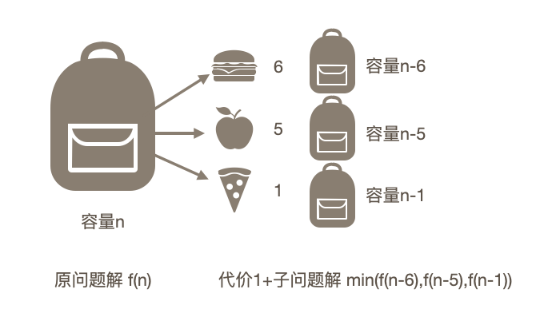
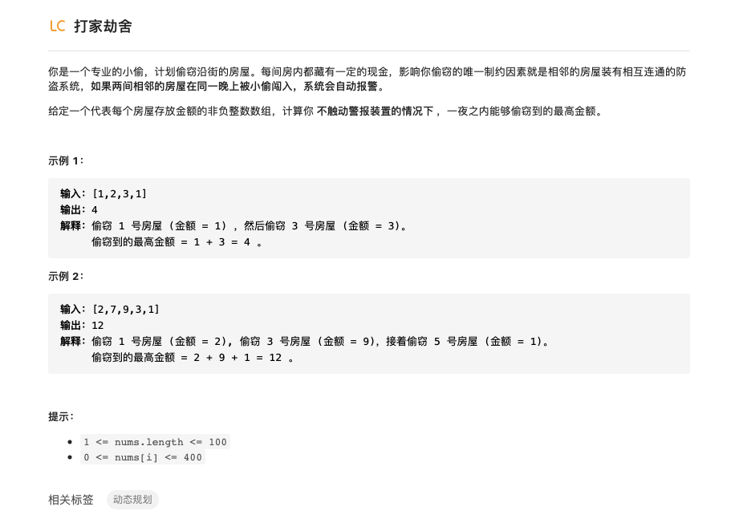
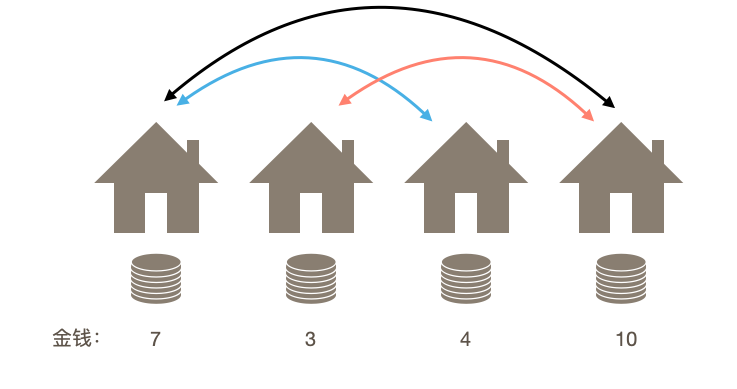
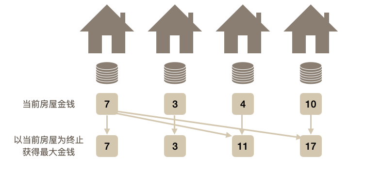

# 算法思想

本文主要对常用的算法思想进行总结：

- [ ] 双指针
- [x] 动态规划
- [ ] 贪心策略
- [x] 递归
- [ ] 分治


## 1.递归

递归的思想主要是将大的问题拆解为在已知子问题结果下的问题，通过一次次拆解最终得到容易解决的小问题，对小问题求解得到结果后进行回溯就实现解决大问题的目的。


### 1.1递归模板

在使用递归的过程一定要注意两点，一个是调用自己，一个是终止条件，终止条件一定要写在前面，然后才是对自己的调用，想下面这样：

```python
def recursion(params):
  if 终止条件：
      return
  recursion(params)
```

终止条件的部分一定要在前面否则就会陷入重复递归的过程，出现堆栈溢出异常(StackOverflowError)

### 1.2递归的例子

在使用递归的时候假设n-1时候的结果已经得到，只需要考虑如何根据当前参数以及n-1时候的结果求出来最终的结果即可。

####1.2.1 阶乘

运用递归实现阶乘的思想是在求n的阶乘的时候假设已经知道了n-1时候的阶乘为factorial(n-1)，这个时候求n的阶乘只需要$n\times factorial(n-1)$即可，递归的终止条件是n=1的时候，此时阶乘结果为1。

```python
#1.用递归的思想实现阶乘
    def factorial(self,n):
        if n == 1:
            return 1
        return n * self.factorial(n-1)
```

当n=5的时候调用过程如下:


#### 1.2.2 斐波那契数列

斐波那契数列的形式是$[1,1,2,3,5,8,13,...]$其中当n=1和n=2的时候值为1，其他时候为前两个元素的和，使用递归实现求解n的时候的斐波那契数列：

```python
#2.斐波那契数列
def fibonacci(self,n):
    if n==1 or n==2:
        return 1
    return self.fibonacci(n-1)+self.fibonacci(n-2)
```

#### 1.2.3 哈诺塔问题

哈诺塔问题指的是有三个柱子A,B,C，其中A上面堆满了盘子，盘子从上到下尺寸依次增大，要求将A中的盘子全都移动到C上去，并且在移动过程中需要保证小尺寸的盘子在上。首先需要考虑终止条件，显然当A柱子上的盘子个数为1的时候，我们只需要将其借助B柱子移动到C上就可以结束了，下面考虑在n的时候如何处理，我们在前面的递归问题中说过，假设n-1这个子问题已经被解决，那么我们就可以调用函数实现n-1个盘子的移动，首先需要借助C将其移动到B（hanoi(n-1,A,C,B)）,然后将A柱上的一个盘子移动到C，最后借助A柱将B上的n-1个盘子移动到C（hanoi(n-1,B,A,C)）。

```python
#3.哈诺塔
    def hanoi(self,n,A,B,C):
        if n ==1 :
            print("从"+A+"移动到"+C)
        else:
            self.hanoi(n-1,A,C,B)
            print("从"+A+"移动到"+C)
            self.hanoi(n-1,B,A,C)
```


参考文章[什么是递归，通过这篇文章，让你彻底搞懂递归](https://mp.weixin.qq.com/s?__biz=MzU0ODMyNDk0Mw==&mid=2247487910&idx=1&sn=2670aec7139c6b98e83ff66114ac1cf7&chksm=fb418286cc360b90741ed54fecd62fd45571b2caba3e41473a7ea0934f918d4b31537689c664&token=910002910&lang=zh_CN#rd)

## 2.动态规划

**从顺序递推理解动态规划：**

这个词可以拆分为两部分：动态+规划，动态的思想就是指整个求解过程是动态在变的，而规划我们可以理解为优化，这样看来动态规划就是动态优化，不断进行优化求解。举一个例子来说明，假如我们要在一个能乘体积为10的背包中装物品，物品有三种体积分别是5，3和1，怎么装才能使得装入的物品最少？


由于这个题很简单，所以一眼就能看出答案是装两个体积为5的物品，写成算法的形式我们可以列举所有的可能性然后从中取出来物品最少的选择，或者另外一种很直观的方法就是我们可以从体积大的装起，使得每一次剩余的容量最小，这样就能实现装的物品最少，这称为贪心策略，大多数情况下这种策略都有效，但是考虑这样的例子：


此时按照贪心策略，我们首先装入的食品是体积为6的，此时剩余容量为4只能装4个体积为1的物品，所以物品列表为[6,1,1,1,1]，但实际上最优的策略应该是[5,5]，这说明只是使用贪心策略并不一定能取得最优解。这是由于贪心策略只是考虑当前情况下的最优即使得在一次装物品后使得背包容量最小，但是我们想要的是整体情况下的最优解。

我们可以换种思路求解，假设装入一个物品的代价为1（指此时背包中已经有1个物体），我们希望$f(10)$代表体积为10背包装的物品数作为总代价，我们可以首先先装一个物体，这个时候有三种情况：
$$
f(10) = f(4)+1\\
f(10) = f(5)+1\\
f(10) = f(9)+1
$$
分别代表第一次装入三种不同的物品，由于三者已使用代价都是1，接下来我们的优化目标就变成$f(4)、f(5)、f(9)$这三个值，我们只要求解到这三个子问题的最优解就能得到原问题最优解，同样的求解这三个问题的时候我们也能使用类似的策略进行分解后求解，这启发我们求解的大问题可以划分为小的问题进行解决，且通过求解小问题的解我们就能得到大问题的解，上面的递推过程可以写成如下公式：
$$
f(n)=min\{f(n-6),f(n-5),f(n-9)\}+1
$$
在对上面的式子解释一下，求解容量为n的背包装的最少物品值$f(n)$这一问题等价于求解首先装入三种不同物品后得到的最优解+1。



只有递推公式当然不能求解出来具体的值，我们还需要初始条件，根据题目提供的三种容量我们可以很容易得知有：
$$
f(1)=1\\
f(5)=1\\
f(6)=1
$$
其他的解够可以通过这些初始条件递推得到。例如我们求解$f(7)$：
$$
f(7)=min\{f(1),f(2),f(6)\}+1=1+1=2
$$
更一般的，当容量为n的时候我们通过下面的程序求解物品最小数量：

```python
pydef dynamic_programing(n):
		'''
		n为背包容量
		'''
    f = (n+1)*[0]
    for i in range(1,n):
        cost = float('inf')
        if i>=1: cost = min(cost,f[i-1]+1)
        if i>=4: cost = min(cost,f[i-4]+1)
        if i>=6: cost = min(cost,f[i-6]+1)
        f[i] = cost
    return cost
```

求解过程实际就是从n=1开始对所有$f(n)$进行求解，在求解后面的最优解的时候使用到了前面的值。动态规划的过程就是每一次都将原问题变为一系列子问题进行求解，分别求出来这些子问题就能够推断出原问题的解。我们不需要关注子问题的具体求解只需要知道其值即可。在使用动态规划求解的时候一定要确定好递推关系。

> 输出上面求解出最优解的装包方案：
>
> ```python
> def dynamic_programing(self,n):
>     n=n+1 #序号0不存储信息
>     f = n*[0]
>     g = n*[""]
>     for i in range(1,n):
>         cost = float('inf')
>         if i>=1:
>             flag='1'
>             cost = min(cost,f[i-1]+1)
>         if i>=4:
>             if f[i-4]+1<cost:
>                 flag ='4'
>             cost = min(cost,f[i-4]+1)
>         if i>=6:
>             if f[i-6]+1<cost:
>                 flag='6'
>             cost = min(cost,f[i-6]+1)
>         f[i] = cost
>         g[i] = g[i-int(flag)]+flag
>     return cost
> ```

参考文章：[什么是动态规划（Dynamic Programming）？动态规划的意义是什么？](https://www.zhihu.com/question/23995189/answer/613096905)

**从递归理解动态规划：**

动态规划的思想中一般包含了递归过程，要想理解动态规划的概念首先需要要了解重复递归现象。

- 重复递归运算：在进行递归求解的过程中我们可能会重复计算同一个递归值，例如在递归求解斐波那契数列的时候，其递归求解的代码如下：

```python
def fibonacci(self,n):
    if n==1 or n==2:
        return 1
    return self.fibonacci(n-1)+self.fibonacci(n-2)
```

当我们需要计算 $f(5)$ 的时候需要对 $f(4)$ 和 $f(3)$ 进行递归计算，在计算$f(4)$的时候又需要计算$f(3)$和$f(2)$，这里$f(3)$就被计算了两遍，出现了重复计算。


- 记忆化递归（记忆化搜索）：我们希望能够简化计算过程，即对每一个递归值只计算一次，然后将计算后的结果存储起来，下一次只需要从之前存储的值中取出来使用即可，这种方式称为记忆化递归法。
- 动态规划：记忆化递归的过程实际就很好诠释了动态规划的核心思想，即每一次计算的时候都利用之前已经计算好的数据而不需要进行重复运算。说到这里想到马尔科夫链，这种结构每一个状态的值都只和前一个状态有关而与再之前的状态都无关，这种结构就可以使用动态规划的思想来解决，每一次存储前一个状态的值而下一次直接对存储值进行取出应用即可。


### 2.1动态规划的思想过程

**从顺序递推：**

设计DP算法的时候要考虑三点：

1. 我是谁？（如何设计状态？）

2. 我从哪里来？（从上一个状态到当前状态推导）
3. 我要到那里去？（从当前状态向下一个状态的转移）

其中2和3两个步骤只需要思考一个就行。

**从记忆化递归：**

动态规划在本质上含有递归的过程，所以在求解这类题目的时候首先可以考虑递归过程，然后在递归过程中发现重复运算部分，使用记忆化递归对原求解进行优化。

### 2.2 动态规划题目

#### 2.2.1 爬楼梯


第一眼看到这个题思路就是递归，在求解n阶台阶问题的时候首先第一步肯定是爬一个或者两个台阶，然后只需要考虑n-1阶问题和n-2阶问题就行，即$f(n)=f(n-1)+f(n-2)$，同时考虑递归结束条件，当n为0的时候为0，n为1的时候只有一种方法为1，n为2的时候有两种方法为2，也就是当$n<3$的时候问题的解就是n，接下来就可以写代码了：

```python
#递归求解
def climbStairs(self, n: int):
    if n < 3:
        return n
    return self.climbStairs(n-1)+self.climbStairs(n-2)
```

递归的方式很容易理解，但是这种解法存在我们上面提到的重复递归运算，我们可以通过对递归结果的存储避免重复运算的发生，具体的方法是建立一个列表用来对之前计算的结果进行存储。

```python
#优化后递归 具有记忆功能的递归
#对递归结果进行存储避免重复运算
def climbStairs(self , n):
    a_list = n*[0]
    def help(n):
        if n<=2:
            return n
        if a_list[n-2]!=0 and a_list[n-3]!=0:
            return a_list[n-2]+a_list[n-3]
    for i in range(n):
        a_list[i] = help(i+1)
    return a_list[n-1]
```

在上面的运算过程中我们可以看到在求解第n步的时候只用到了第n-1和n-2的信息，所以再之前的信息实际上是没有用的，进一步简化，我们只要两个变量对前两次的结果进行存储即可：

```python
#再找到递归公式后进行简化，只用两个变量存储之前两个状态即可
def climbStairs(self, n):
    q = 0
    r = 1
    for i in range(n):
        p = q
        q = r
        r = p+q
    return r
```

q和p两个变量分别存储前两个状态，通过前两个状态对当前状态r进行计算。

> 如果对斐波那契数列熟悉的话通过上面的递推公式就可以看出这个爬台阶的问题其实就是菲波那切数列，由于斐波那契数列存在公式
>
> 
>
> 所以可以直接用公式来计算：
>
> ```python
> import math
> sqrt_5 = math.sqrt(5)
> return int(1/sqrt_5*(((1+sqrt_5)/2)**(n+1)-((1-sqrt_5)/2)**(n+1)))
> ```
>
> 这个题遵循的数列是1,2,3,5...相比于斐波那契数列少一项，所以上面的递推公式中为n+1。


####2.2.2 买卖股票的最佳时机


显然看到这个题最简单的思路就是暴力求解，两个循环算出来所有利润的值然后从其中选出来最大的就好，外循环从数组起始开始，内循环从外循环的起始+1开始，遍历的时间复杂度$O(n^2)$。第二种想法只需要遍历一遍即可，从头开始记录当前遇到的最小值，然后拿当前值与最小值做差比较这个值与最大利润的大小。

- 方法1：暴力求解

暴力求解的方法计算所有可能的利润值然后找出来最大的，这种方法需要使用两个循环，外循环遍历所有所有元素，内循环遍历从外循环当前元素开始遍历到最后，计算两个循环遍历元素的差值作为利润值，如果比最大值要大就进行存储。

```python
#方法1：暴力求解（超时）
def maxProfit(self,prices):
    max = 0
    for i in range(len(prices)):
        for j in range(i+1,len(prices)):
            temp = prices[j] - prices[i]
            if temp > max:
                max = temp
    return max
```

时间复杂度：$O(n^2)$

空间复杂度：$O(1)$

- 方法2：双指针，动态规划

初始化两个变量`min`和`max`分别用来存储当前遍历到的元素最小值以及当前情况下的最大利润，从头开始遍历记录当前遍历到的最小值，然后拿当前值与其作差将这个差值与最大利润作比较，如果大于就更新最大利润。

```python
#方法2：双指针，动态规划
def maxProfit(self,prices):
    min = float('inf')
    max = 0
    for i in range(len(prices)):
        if prices[i]<min:
            min = prices[i]
        if prices[i]-min>max:
            max = prices[i]-min
```

时间复杂度：$O(n)$

空间复杂度：$O(1)$

- 方法3：递归

之前我们说过动态规划的题目中一般会含有一个递归过程，同样的这个题也可以用递归的思想解决，使用递归的过程同样需要记录两个值：当前遇到最小值与目前的最大利润。使用递归需要两个基本要素：1.递归的终止条件是当数组中只有一个值的时候此时最小值为该值而最大利润为0，2.递归调用是每次都调用当前数组长度-1的数组`help(prices_list[:n-1])`。

```python
#方法3：递归求解（超时）
def maxProfit(self,prices):
    def help(prices_list):
        if len(prices_list)==1:
            min_p = prices_list[0]
            profit = 0
            return min_p,profit
        n = len(prices_list)
        min_p,profit = help(prices_list[:n-1])
        if prices_list[n-1]<min_p:
            min_p = prices_list[n-1]
        if prices_list[n-1]-min_p>profit:
            profit = prices_list[n-1]-min_p
        return min_p,profit
    min_p,profit = help(prices)
    return profit
```

**时间复杂度**：$O(n)$

**空间复杂度**：$O(n)$

#### 2.2.3 最大子序和


这个题我自己想了半天也没想出来怎么求解，只好去看了答案，官方答案给出两种比较容易理解的解法，一是贪心策略，二是动态规划的思想，下面分别介绍：

- 方法1：贪心策略

我们从数组的起始开始遍历，每加入一个新的元素时候就计算累加值并与当前最大值进行比较决定是否更新，在这个过程中如果遍历元素之前的累加值小于0的时候我们就丢弃它如果大于0就继续累加。

```python
#方法2：贪心算法
def maxSubArray(self,nums):
    if len(nums)==1:
        return nums[0]
    max_sum = nums[0]
    cur_sum = nums[0]
    for i in range(1,len(nums)):
        if cur_sum<0:
            cur_sum = nums[i]
        else:
            cur_sum = cur_sum+nums[i]
        if cur_sum>max_sum:
            max_sum=cur_sum
    return max_sum
```

我们以下面的数组为例分别求出当前和与最大和的数值，当前和小于0的时候我们就舍弃之并将当前值设为当前和，因为小于0的数总是会越加越小。


- 方法2：动态规划

我们可以将原来的问题分解为求解以标号为i元素结尾的最大子序列和，其中i从0到n-1取值，这样我们就可以从开始进行遍历，每一次求出以元素i为结尾的子序列的最大值即这个解为$f(i)$，那么$f(i+1)=max(f(i)+num[i+1],nums[i+1])$，实际就是说当$f(i)<0$的时候我们就另起炉灶以当前值作为最大值。

```python
#@方法1：动态规划
def maxSubArray(self, nums):
    if len(nums)==1:
        return nums[0]
    for i in range(1,len(nums)):
        if nums[i-1]>0:
            nums[i]=nums[i]+nums[i-1]
    return max(nums)
```

上面的代码对原来的数组进行修改，使得数组中的每一个值都表示以当前元素为结尾的子序列的最大值，所以只需要对这个数组求最大值就能得到最终解。


#### 2.2.4 打家劫舍



一开始想法是间隔相加，初始无非就是第一家和第二家，然后间隔一家依次相加，加出来两个和进行比较，但是测试的时候一个测试用例[7,3,4,10]说明这种方法并不适用，这个测试用例的最佳情况是第一家和第四家，显然间隔相加的代码没有考虑这种情况。



后来从动态规划的角度想，第一是就是要定义状态，假设状态为以当前家为终止时能够打劫到的最大金额，那么我们从第一家开始考虑，如果以第一家为终止打劫到最大钱数就是第一家中的钱数，有$f(1)=a_1$；同样的如果以第二家为终止最大钱数为$f(2)=a_2$；考虑第三家的情况，由于题目有限制不能打劫相邻的房子，所以当以第三家为终止时候只有以第一家为起点，最大钱数为$f(3)=f(1)+a_3$；再考虑以第四家为终止的情况，则其可以选择打劫的上一家为第一或者第二，我们需要选择两者中金钱最多的一家，则有$f(4)=max\{f(1),f(2)\}+a_4$。



依次这样递推，我们可以得到当以第n家为终止时候能够打劫到最大金额：
$$
f(n)=max\{f(1),f(2),...,f(n-2)\}+a_n
$$
可以看到$f(n)$的值仅与前面$n-2$项有关且需要取其中最优的一项，这满足动态规划所具有的最优子结构性质（即大问题的最优解可以由小问题最优解得出），接下来我们只需要求出来所有$f(n)$的值然后从中取最大的即可，实现代码如下：

```python
#问题四：打家劫舍
def rob(self,nums):
    if len(nums)==1:
        return nums[0]
    n = len(nums)
    f = (n+1)*[0]
    for i in range(0,n):
        if i<2:
            f[i+1]=nums[i]
            continue
        max_num = max(f[:i])
        f[i+1] = max_num+nums[i]
    return max(f)
```

其数组$f$用来存储以当前家为终止时候能够打劫最大钱数，其从1开始取值一直到n（$f[0]$无意义）。

当然我们也可以对传进来的`nums`数组进行直接修改使之变为`f`，这样做空间复杂度就变成了$O(1)$:

```python
#进一步优化-->直接原地修改
def rob(self,nums):
    if len(nums)==1:
        return nums[0]
    n = len(nums)
    for i in range(2,n):
        nums[i] = max(nums[:i-1])+nums[i]
    return max(nums)
```

> 拓展：输出以当前抢劫户为终止时候其抢劫金钱的列表
>
> ```python
> #拓展，输出抢劫的所有户对应的金钱
> def rod_2(self,nums):
>     if len(nums)==1:
>         return nums[0],[str(nums[0])]
>     n = len(nums)
>     houses = [[] for i in range(n)]
>     for i in range(n):
>         temp = nums[i]
>         if i>=2:
>             max_idx = nums.index(max(nums[:i - 1]))
>             for house in houses[max_idx]:
>                 houses[i].append(house)
>             nums[i] = nums[max_idx] + nums[i]
>         houses[i].append(temp)
>     return nums,houses
> ```


