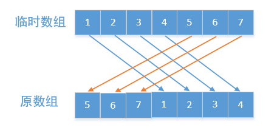
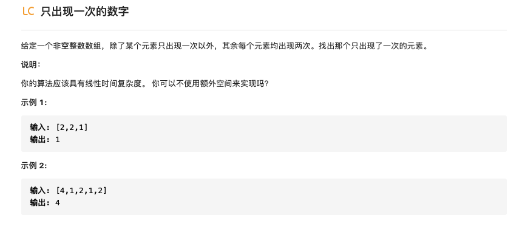
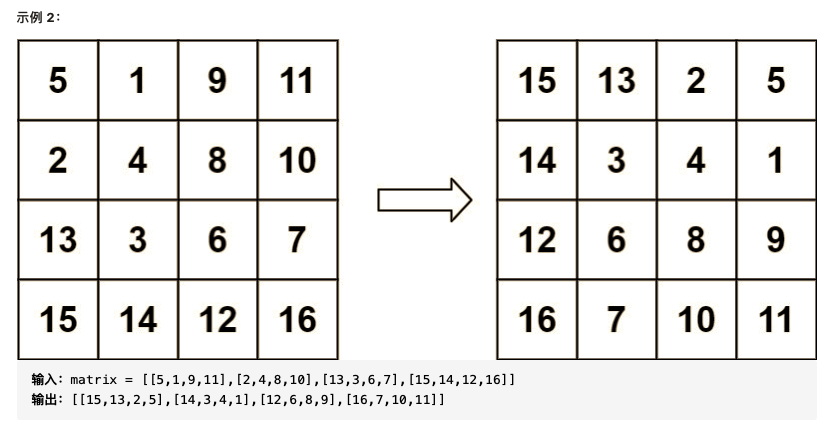

# 数组-初级算法

## [1 删除排序数组中的重复项](https://leetcode-cn.com/leetbook/read/top-interview-questions-easy/x2gy9m/)


懒得抄题了，直接粘上来

我的解法：

```python
def function(nums):
    if len(nums) == 1:
        return 1
    for i in range(len(nums)):
        for j in range(i+1,len(nums)):
            if (j == len(nums) - 1) and (nums[i] == nums[j]):
                n = i
                return n+1
            if nums[j] == nums[i]:
                continue

            elif nums[j] > nums[i]:
                nums[i+1] = nums[j]
                break
```

主要思想是设置两个索引，一个`i`从数组开始遍历，一个`j=i+1`处开始遍历，当有`nums[j]>num[i]`的时候就把后面的值赋到前面来，如此反复就能使得前面存在一个不重复的数组，这个数组的结束条件是 `(j == len(nums) - 1) and (nums[i] == nums[j])`.。提交上去提示超时间，淦！

网友解法：

```python
def removeDuplicates(nums) :
    for i in range(len(nums) - 1, 0, -1):
        if nums[i] == nums[i - 1]:
            del nums[i]
    return len(nums)
```

直接逆序索引，从后往前看，后一个与前一个相等就删除后一个，这也太简单了趴，我这个菜鸡搞了半小时还超时，惭愧...

## [2 买卖股票的最佳时机 II](https://leetcode-cn.com/leetbook/read/top-interview-questions-easy/x2zsx1/)

懒得抄题好吧：


我的解法：

```python
class Solution:
    def maxProfit(self, prices: List[int]) -> int:
        sum = 0
        for i in range(len(prices)-1):
            if prices[i] < prices[i+1]:
                money=prices[i+1] - prices[i]
                sum = sum+money
            else:
                continue
        return sum
```

使用贪心策略，每一次都考虑当前天和第二天，如果第二天股票大于第一天那就记录这个差值到`sum`，然后移动当前指针将第二天作为当前天重复这个策略记录，直到第二天的股票小于等于第一天就停止记录。一直记录到最后一天就返回`sum`的值就是卖股票的最佳收益。

## 3 旋转数组

懒得抄题选手再得一分！


方法一：这题一开始想的是一个一个的移动，从第一个开始找到他所需要移动到的位置进行替换，然后将该位置的数暂存在一个变量，在依次找到下一个位置的数，这样重复找的次数就是数组的长度，在有些情况下上运行良好，但是当数组长度为偶数的且移动位置k也是偶数的时候就会出现卡在一个位置的情况，进一步思考，当数组的长度只要是移动位置k的倍数的时候就会发生原地打转的情况，解决的方法是每次进行移动操作后都对移动后位置的索引进行记录，当下一次发现当前位置的索引被记录的时候就对当前位置加1，这样就避免了每次都重复在一个地方。

下面是代码：

```python
def rotate( nums, k):
    """
    Do not return anything, modify nums in-place instead.
    """
    index = 0
    temp_1 = nums[index]
    l_nums = len(nums)
    index_visted = []
    for i in range(l_nums):
        next_id = (index + k) % l_nums
        if next_id in index_visted: %如果下一个位置已经被访问过
            index = index + 1
            temp_1 = nums[index]
            next_id = (index + k) % l_nums
        temp_2 = nums[next_id]
        nums[next_id] = temp_1
        temp_1 = temp_2
        index = next_id
        index_visted.append(index)
```

正好代码讲解里面有这个思想的讲解，废话不多说，直接偷图：


如果`nums.length%k=0`，也就是数组长度为k的倍数，这个会原地打转，如下图所示


方法二：

建立一个临时数组，在这个数组内装已经向后移动过的数组：

偷图选手再次出现：




```python
def rotate(nums,k):
    list_nums  = nums.copy()
    for i in range(len(nums)):
        list_nums[(i+k)%len(nums)] = nums[i]
    nums[:] = list_nums[:]
```

方法三：

对原来的数组进行逆序翻转，然后只需要对前k%len(nums)个元素以及后面的元素进行翻转即可：


没错，又是偷的图。这种思想非常的amazing啊！

```python
def reverse(nums, start, end):
    for i in range((end - start + 1) // 2):
        nums[i + start], nums[end - i] = nums[end - i], nums[i + start]
    return nums


def rotate(nums, k):
    """
        Do not return anything, modify nums in-place instead.
        """
    reverse(nums, 0, len(nums)-1)
    reverse(nums, 0, k % len(nums)-1)
    reverse(nums, k % len(nums) , len(nums)-1)

```


## 4 存在重复元素

https://leetcode-cn.com/leetbook/read/top-interview-questions-easy/x248f5/


偷懒第一名，题目描述如上，爱看不看。

这题比较简单，思路也比较容易想，就是首先将数组排序，然后一个个检查就行：

```python
def containsDuplicate(nums):
    nums.sort()
    for i in range(len(nums)-1):
        if nums[i] == nums[i+1]:
            return True
    return False
```

在下面的题解中看到另一种方法就是使用set函数，set函数能够创建一个无序不重复的元素集，如果对list使用set函数就会返回一个不重复的数组，那么只要统计这个数组元素个数与原来数组个数进行比较即可：

```python
def containsDuplicate(nums):
		return len(nums)!=len(set(nums))
```


## 5 只出现一次的数字



- 解法1：这个题要是用正常思维很容易想到直接从前往后进行遍历，首先对数组进行排序，然后对于第一个和最后一个数，只要看看和他们相邻的数是否一样，对于中间的数就看他和两边的数是否一样就行：

```python
def singleNumber(self,nums):
    nums.sort()
    if nums[0] != nums[1]:
        return nums[0]
    if nums[len(nums)-1] != nums[len(nums) - 2]:
        return nums[len(nums)-1]
    for i in range(1,len(nums)-1):
        if (nums[i]!=nums[i-1]) and (nums[i]!=nums[i+1]):
            return nums[i]
```

- 解法2：使用位运算异或可以很巧妙找到那个出现一次的数字，对于位运算异或有下面的运算法则:
  $$
  \begin{align}
  1\oplus  1=0 \\
  1\oplus 0=1 \\
  0\oplus1=1\\
  0\oplus 0 =0
  
  \end{align}
  $$
  当我们有任意的数 $a、b、c$  的时候，也就是异或满足交换律：
  $$
  \begin{align}
  0\oplus a&=a\\
  a\oplus a&=0\\
  a\oplus b\oplus c&=a \oplus c\oplus b 
  
  \end{align}
  $$
  通过上面的性质有下面的算法：

```python
def singleNumber(self,nums):
	result = 0
	for i in range(len(nums)):
		result = result^nums[i]
	return result
```

# 6 两个数组的交集 II


- 方法一：这个题可以使用双指针的思想解决，首先将两个数组排序，然后初始化两个指针分别指向两个数组的起始，等对应的数相等的时候就存储这个数并移动指针，当一个数组的值较小的时候，移动该数组对应指针，直到指针到达其中一个数组的最后，talk is cheap，show me the code:

```python
def intersect(nums1,nums2):
    nums1.sort()
    nums2.sort()
    stop = 0
    i, j = 0, 0
    inter = []
    while not ((i == len(nums1)) or (j == len(nums2))):
        if nums1[i] == nums2[j]:
            inter.append(nums1[i])
            i = i + 1
            j = j + 1
        elif nums1[i] > nums2[j]:
            j = j + 1
        elif nums1[i] < nums2[j]:
            i = i + 1
    return inter
```

- 方法二：使用哈希表解决这个题

通过collection中的Counter对象来对计数，其中Counter是字典的一个子类，他可以计数数字或者字符等，我们通过其对nums1中出现的数字进行计数并存储到m中去，其中num1是数据较多的那个数组，然后对num2中的每一个元素进行遍历，只要该元素在m中出现过就将其加入到新的存储交集的列表，然后对m中该元素的次数减一，重复这个过程。**散列表**（**Hash table**，也叫**哈希表**），是根据[键](https://zh.wikipedia.org/wiki/鍵)（Key）而直接访问在内存储存位置的[数据结构](https://zh.wikipedia.org/wiki/数据结构)。


```python
def intersect(nums1,nums2):
    if len(nums1)<len(nums2):
        return self.intersect(nums2,nums1)

    m = collections.Counter()
    inter = []
    for num in nums1:
        m[num] = m[num] +1
    for num in nums2:
        if (num in m) and (m[num]!=0):
            inter.append(num)
            m[num] = m[num]-1
    return inter
```

# 7.加一


- 方法一：将数组转换为数进行加一，然后再将数转换为数组，想法十分简单了可以说就是需要用到两个循环：

```python
def plusOne(digits):
    num = 0
    for i in range(len(digits)):
        num = num+digits[i] * 10**(len(digits)-i-1)
    num_plus = num+1
    result = []
    while num_plus >0:
        i =num_plus%10
        result.append(i)
        num_plus =  num_plus // 10
    result.reverse()
    return result
```

- 方法二：利用加法运算的性质对数组进行运算，想法是如果不是9的话就直接加1，如果是9也就是加一后变成10的话就进行向高位进位本位置零，重复数组长度次数的这个过程，如果一直进位，那就创建一个新的长度比原来加1的数组使得最高位为1：

```python
def plusOne(self,digits):
	for i in range(len(digits) - 1, -1, -1):
		digits[i] = digits[i] + 1
		if digits[i] != 10:
			return digits
		digits[i] = 0
	digits = [0] * (len(digits) + 1)
	digits[0] = 1
	return digits
```

# 8 移动零


拿到这个题的第一个想法就是从头开始遍历，如果是零就删除然后在结尾添加一个0，这样做的问题是在删除和添加操作后原来的数组索引会被改变。于是想到可以再加一个数组，然后对原数组进行遍历，将所有非零元素放在这个数组里，其他元素置零放在最后就行，但是原题说明不能拷贝额外数组，所以这种方法也不可行。

- 双指针，我小脑袋灵机一动，只要将所有的0元素替换到后面就行，于是新生一计，一个指针用来找0元素，当找到的时候就在当前索引基础上在找非零元素，然后两个元素互换，这样一直找到元素末尾，最终所有的0元素就会放在最后面，代码如下：

```
def moveZeroes(self,nums):
	i=0
	while i<len(nums)-1:
		if nums[i]!=0:
			i = i+1
			continue
		j = i
		while j!=len(nums)-1:
			if nums[j] != 0:
					break
		j = j+1
		nums[i],nums[j] = nums[j],nums[i]
		i = i+1
	return nums
```

同样是双指针的思想，网友的代码就简洁太多：

```python
    def moveZeroes(self,nums):
        fast = 0
        slow = 0
        while fast<len(nums):
            if nums[fast]!=0:
                nums[fast],nums[slow] = nums[slow],nums[fast]
                slow = slow + 1
            fast = fast + 1
        return nums
```

在上面的代码中slow指针用来指向零元素，fast指针用来指向非零元素。

## 9 两数之和


- 方法1：看到这个题的第一眼那必是暴力破解，直接两个循环搞起来对所有组合遍历一遍就完事了，但是这样的时间成本为 $O(n^2)$ ，先不管了，代码先搞出来：

```python
def twoSum(self,nums,target):
    result = []
    for i in range(len(nums)):
        for j in range(i+1,len(nums)):
            if nums[i]+nums[j] == target:
                result.append(i)
                result.append(j)
                return result
```

- 方法2：使用哈希表，哈希表的详细内容可以看算法-数据结构部分。上面暴力破解的方式再查寻元素的过程中用到一个循环，而是用哈希表查找元素的时间复杂度为 $O(1)$，这样就简化了查找过程。具体原理哈希表的键用来存储对应数组的值，其值用来存储对应数组的索引，然后遍历每一个元素，计算其余目标target的查找并在哈希表中进行查找。

  ```python
  def twoSum(self,nums,target):
      hashtable = dict()
      for i in range(len(nums)):
          if (target - nums[i]) in hashtable:
              return [hashtable[target-nums[i]],i]
          hashtable[nums[i]] = i
  ```

  

## 10 有效的数独


看到这个题的第一个想法就是循环遍历三次，分别对行列和块进行遍历检查有无重复元素，于是开始着手编写代码：

```python
    def row_test(row):
        hashtable = dict()
        for i in range(1,10,1):
            hashtable[i] = 0
        for num in range(len(row)):
            if row[num].isalnum():
                if hashtable[int(row[num])] == 1:
                    return False
                hashtable[int(row[num])] = 1
        return True
```

首先编写了一个行检测重复的代码，想着列是不是转置一下变成行也能套过去，结果自带数组类型不能够，于是懒得在编写列的以及块的检查函数，直接看大佬们怎么做的。

- 使用哈希表记录次数，一次遍历，对每一个行列以及块都生成一个哈希表用来存储其中元素出现的次数，当出现次数大于1的时候就返回False，否则就是True：

```python
    def isValidSudoku(self,board):
        row = [{} for i in range(9)]
        col = [{} for i in range(9)]
        block = [{} for i in range(9)]
        for i in range(9):
            for j in range(9):
                if board[i][j] == '.':
                    continue
                else:
                    num = int(board[i][j])
                    block_idx = (i//3)*3 +j//3
                    block[block_idx][num] = block[block_idx].get(num,0)+1
                    row[i][num] = row[i].get(num,0)+1
                    col[j][num] = col[j].get(num,0)+1
                    if block[block_idx][num]>1 or row[i][num]>1 or col[j][num]>1:
                        return False
        return True
```

精髓在于index的计算以及相当使用哈希表来进行重复检测。

参考解题思路：https://leetcode-cn.com/problems/valid-sudoku/solution/you-xiao-de-shu-du-by-leetcode/

## 11.旋转图像




自己想了半天没搞明白咋整，一碰上这种坐标的就稀里糊涂的，然后偷偷看了一下答案，发现这种顺时针旋转90°的操作相当于对于数组水平翻转后然后再进行对折。于是乎第一种方法代码就出炉了：

- 方法1：上下颠倒+沿对角线翻转

  

```python
def rotate(self, matrix) :
    n = len(matrix)
    # 上下颠倒
    for row in range(n // 2):
        for col in range(n):
            matrix[row][col], matrix[n - row - 1][col] = matrix[n - row - 1][col], matrix[row][col]
    # 沿着对角线互换元素
    for row in range(n):
        for col in range(row):
            matrix[row][col], matrix[col][row] = matrix[col][row], matrix[row][col]
    return matrix
```

知道这个规律以后代码就比较好写，的确像是一道找规律的题。

- 方法2：转圈圈，顺时针旋转90°的操作相当于从内到外的元素都进行顺时针旋转90°，向下面的图所示，就是从内到外以此遍历圈，然后对圈里的元素进行翻转。


废话不多说，直接上代码：

```python
#方法二：
def rotate(self, matrix) :
    n = len(matrix)
    for layer in range(n//2):
        for num in range(layer,n-layer-1):
            temp = matrix[num][n-layer-1]
            matrix[num][n-layer-1] = matrix[layer][num]
            temp,matrix[n-layer-1][n-num-1] = matrix[n-layer-1][n-num-1],temp
            temp,matrix[n-num-1][layer] = matrix[n-num-1][layer],temp
            matrix[layer][num] = temp
    return matrix
```

中间找各个元素的对应关系的时候就很麻烦，远远不如第一种方法来的简单。

------

到这里初级算法部分中数组部分的内容就已经全部结束，总结一下，收获比较大的就是简单题写起来确实有思路，主要学会两种方法吧，一种是双指针，还有就是哈希表。


test


