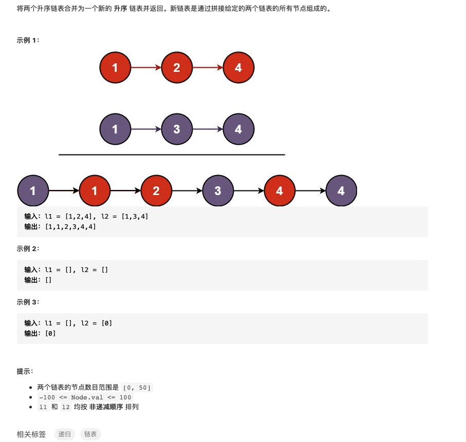

# 链表

链表这种数据结构中的每一个元素都有两个属性，分别是指向下一个节点的指针和当前节点的值（双向链表还有指向前一个节点的指针）。


与数组这一数据结构不同，链表不能通过索引直接访问，而只能从头开始找到需要访问的节点，所以其访问时间是 $O(N)$，而数组可以通过索引直接访问所以其访问时间是 $O(1)$；但是对于链表来说其插入和删除操作非常方便，在已经知道前一节点的情况下插入与删除操作的时间复杂度为 $O(1)$，相比之下，数组在执行插入和删除操作后后面所有元素的索引值都需要改变，所以时间复杂度为 $O(N)$

下面是插入操作的示意：


下面是删除操作的示意图：


## 0 设计一个链表

### 0-1 设计一个单向链表


```python
class ListNode:
    def __init__(self,x):
        self.val = x
        self.next = None

class MyLinkedList:

    def __init__(self):
        """
        Initialize your data structure here.
        """
        self.size = 0
        self.head = ListNode(0)


    def get(self, index: int) -> int:
        """
        Get the value of the index-th node in the linked list. If the index is invalid, return -1.
        """
        if index<0 or index>=self.size:
            return -1
        cur = self.head
        for _ in range(index+1):
            cur = cur.next
        return cur.val

    def addAtIndex(self, index: int, val: int) -> None:
        """
        Add a node of value val before the index-th node in the linked list. If index equals to the length of linked list, the node will be appended to the end of linked list. If index is greater than the length, the node will not be inserted.
        """
        if index < 0:
            index = 0
        if index > self.size:
            return
        pred = self.head
        for _ in range(index):
            pred = pred.next
        to_add = ListNode(val)
        to_add.next = pred.next
        pred.next = to_add
        self.size += 1

    def addAtHead(self, val: int) -> None:
        """
        Add a node of value val before the first element of the linked list. After the insertion, the new node will be the first node of the linked list.
        """
        self.addAtIndex(0,val)

    def addAtTail(self, val: int) -> None:
        """
        Append a node of value val to the last element of the linked list.
        """
        self.addAtIndex(self.size,val)

    def deleteAtIndex(self, index: int) -> None:
        """
        Delete the index-th node in the linked list, if the index is valid.
        """
        if index<0 or index>=self.size:
            return
        if index==self.size-1:
            pred_to_del = self.head
            for _ in range(index):
                pred_to_del = pred_to_del.next
            pred_to_del.next = None
        else:
            to_del = self.head
            for _ in range(index+1):
                to_del = to_del.next
            to_del.val = to_del.next.val
            to_del.next = to_del.next.next
        self.size -= 1
```

上面的设计中删除操作有一些麻烦，删除操作也可以这样写：

```python
    def deleteAtIndex(self,index):
        if index < 0 or index >= self.size:
            return
        pred = self.head
        for _ in range(index):
            pred = pred.next
        pred.next = pred.next.next
        self.size -= 1
```


##1 删除链表的倒数第N个节点

### 

- 假设已经定义了MyLinkedList类

在有了MyLinkedList定义的基础上这个题就变得非常简单，首先需要得到链表长度，然后通过其长度以及倒数的位数确定需要删除的节点索引进行删除即可。

```python
#解法1：如果传入的是自定义的mylistnode，可以直接调用其中size属性和deleteAtIndex方法
def removeNthFromEnd(self,head,n):
    index = head.size - n
    head.deleteAtIndex(index)
    return head
```

- 直接传入listnode的形式，没有那些定义好的方法可以调用

**方法1：**当然这个题默认没有MyLinkedList的定义，这个时候就需要首先手动计算出链表的长度，然后根据长度以及倒数位数索引，就是把上面的函数方法展开：

```python
#解法2：传入的是listnode的形式，需要获取其数量以及索引位置
def removeNthFromEnd(self,head,n):
    last = head
    num = 0
    while last:
        num += 1
        last = last.next
    temp = ListNode(0,next=head)
    index = num - n
    pred = temp
    for _ in range(index):
        pred = pred.next
    pred.next = pred.next.next
    return temp.next
```

**方法2：**使用双指针的思想，快指针比慢指针时钟快n个位置（n为倒数删除的位数），这个时候实际上慢指针指向的就是待删除节点的前驱节点，只要改变该前驱节点的指向就能实现对下一个节点的删除操作。

```python
#解法3：双指针
    def removeNthFromEnd(self,head,n):

        temp = ListNode(0,head)
        fast,slow = temp,temp
        num = 0
        while num != n and fast.next:
            fast = fast.next
            num += 1#解法4：栈，先依次进栈，然后再出栈
    def removeNthFromEnd(self,head,n):
        temp = ListNode(0,head)
        stack = list()
        cur = temp
        while cur:
            stack.append(cur)
            cur = cur.next
        for i in range(n):
            stack.pop()
        prev = stack[-1]
        prev.next = prev.next.next
        return temp.next
        while fast.next:
            fast = fast.next
            slow = slow.next
        slow.next = slow.next.next
        return temp.next
```

**方法3：**栈的思想，首先将各个节点存储到列表中，然后再从后面删除n个元素，这个时候列表中最后一个节点就是待删除节点的前驱节点，修改它的指向就完成了删除操作。

```python
#解法4：栈，先依次进栈，然后再出栈
def removeNthFromEnd(self,head,n):
    temp = ListNode(0,head)
    stack = list()
    cur = temp
    while cur:
        stack.append(cur)
        cur = cur.next
    for i in range(n):
        stack.pop()
    prev = stack[-1]
    prev.next = prev.next.next
    return temp.next
```

## 2.反转链表中的元素


刚看到这个题的第一种思路就是使用栈，现将所有链表元素入栈然后依次出栈重新组合成一个链表就行，这也是最符合直觉的想法；第二种想法是依次对链表中的元素进行处理，从头开始遍历，使得遍历到的链表元素放在链表的开头。

- 方法1：栈，先进栈然后依次出栈就行，进栈和出栈操作通过list的append和pop实现，看到下面解答有画图的直接拿来用了


```python
#方法1：栈的思想。先把链表中元素存储，然后再重新排序。
def reverseList(self,head):
    if not head:
        return head
    stack = list()
    cur = head
    while cur:
        stack.append(ListNode(cur.val))
        cur = cur.next
    rev_head = stack.pop()
    rev_last = rev_head
    while len(stack) != 0:
        rev_last.next = stack.pop()
        rev_last = rev_last.next
    return rev_head
```

- 方法2：依次对元素进行遍历将其设置为头节点


```python
#方法2：依次遍历并将每一个元素移动位置至开头
def reverseList(self,head):
    if not head:
        return head
    cur = head
    while cur.next:
        temp = ListNode(cur.next.val)
        cur.next = cur.next.next
        temp.next = head
        head = temp
    return head
```

- 方法3：递归的思想，感觉递归的思想比较费脑子，我反正现在都不怎么能绕过弯来，简单解释一下就是，就是我也解释不清楚，算了还是强行解释一下。递归就是每一次都利用上一次输出的结果进行操作，将大的问题经过一次次溯源变成容易解决的小问题，然后将小问题的结果回溯作为较大问题的输入。在上面的例子中，我们想要对一个长度为n的链表进行反转，那么假设就是我们已经得到了一个长度为n-1的反转之后的链表，这个时候只需要考虑将一个头节点的元素插入到这个长度为n-1的链表就实现了对长度为n的链表的翻转。

我们原来的链表如下所示：


假设我们已经对长度为n-1的链表实现了反转


这个时候就需要考虑如何把当前头节点head插入进去：

```python
new_head = self.reverseList(head.next)
head.next.next = head
head.next = None
```


这样的回溯思想需要一个终止条件，当头节点为空或者头节点的下一个节点为空的时候就说明已经回溯到最简单的问题：

```python
if head == None or head.next == None:
            return head
```

整合上面的过程得到下面的代码：

```python
#方法3：递归的思想
    def reverseList(self,head):
        if head == None or head.next == None:
            return head
        new_head = self.reverseList(head.next)
        head.next.next = head
        head.next = None
        return new_head
```


怕你以后看的时候看不懂，找了一个解释比较详细的[动画演示+多种解法 206. 反转链表](https://leetcode-cn.com/problems/reverse-linked-list/solution/dong-hua-yan-shi-206-fan-zhuan-lian-biao-by-user74/)


## 3. 合并两个有序列表

将两个升序链表合并为一个新的 **升序** 链表并返回。新链表是通过拼接给定的两个链表的所有节点组成的。 



看到底下标签写的有递归，自己想了一下没想出来，还是按照比较常规的方法求解，利用双指针的思想从两个链表开始遍历，遇到值小的就加入到新的链表中去直到两个指针都指向空节点。

- 方法1：双指针

两个指针分别指向两个链表的起始然后对值进行比较，将较小的节点添加到新的链表中去直到两者都到空节点。直接看程序：

```python
def mergeTwoLists(self, l1, l2):
    one = l1
    two = l2
    new_list_head = ListNode(0)
    new_node = new_list_head
    while one or two:
        if one and (not two or one.val <= two.val):
            value = one.val
            one = one.next
        elif two:
            value = two.val
            two = two.next
        new_node.next = ListNode(value)
        new_node = new_node.next
    return new_list_head.next
```

- **方法2：递归**

再回顾一下，递归主要包括两个部分，一是终止条件，二是调用自己。递归假设我们已经知道子问题的解直接进行调用，在这个问题中的子问题就是除了当前节点以外其他节点合并为一个链表，假设当前节点为`l1`，则子问题就是`mergeTwoLists(11.next,l2)`，将当前节点与子问题合并就得到当前问题的解

`l1.next = self.mergeTwoLists(l1.next,l2)`；递归的终止条件是当前链表对应节点为空，此时应该返回另一个链表。

```python
def mergeTwoLists(self,l1,l2):
    if not l1:
        return l2
    if not l2:
        return l1
    if l1.val <= l2.val:
        l1.next = self.mergeTwoLists(l1.next,l2)
        return l1
    else:
        l2.next = self.mergeTwoLists(l1,l2.next)
        return l2
```


## 4. 回文链表

判断一个链表是否为回文链表


刚看到这个题就想到双指针，快指针放在链表最后，慢指针在开头，但这样存在一个问题就是这是单向链表没办法从后面向前遍历，想了一会这种方案暂时搁置。第二个想法就是栈，由于栈遵循先进后出的规则，所以可以先把前半部分放在栈中存储，然后依次从栈中取出和链表后半部分比较即可。

- 方法1：使用栈

用列表的append和pop方法实现栈的push和pop操作。

1. 将链表前半部分推入栈
2. 指针指向链表中间部分
3. 依次判断栈推出与指针指向值是否相等

```python
#方法1：栈
def isPalindrome(self,head):
    # 判断长度
    len_list = 0
    len_head = head
    while len_head:
        len_list += 1
        len_head = len_head.next

    stack = list()
    start = head
    mid = len_list // 2
    for _ in range(mid):
        stack.append(start.val)
        start = start.next
    mid_node = start.next if len_list%2 != 0 else start
    for _ in range(mid):
        if stack.pop() != mid_node.val:
            return False
        mid_node = mid_node.next
    return True
```

为了找到链表的中间位置，上面的代码中还对链表的长度进行了求解，其实也可以用快慢指针的思想得到链表中心，详细操作看下面的双指针中函数`first_half_end()`。

- 方法2：双指针

使用两个指针分别指向开头和中间，然后对链表的后半部分进行反转，最后再依次遍历是否相等。

代码中还含有两个函数，`first_half_end()`用于返回前半部分的结尾，而`reverse_list()`用来对后半部分的链表进行反转。

```python
#方法2：双指针
def isPalindrome(self,head):
    def first_half_end(head):
        slow = head
        fast = head
        while fast.next and fast.next.next:
            slow = slow.next
            fast = fast.next.next
        return slow

    def reverse_List(head):
        cur = head
        while cur.next:
            temp = ListNode(cur.next.val)
            cur.next = cur.next.next
            temp.next = head
            head = temp
        return head

    if head == None or head.next == None:
        return True
    first_half_end = first_half_end(head)
    second_half_start = reverse_List(first_half_end.next)

    flag = True
    first = head
    second = second_half_start
    while second:
        if first.val != second.val:
            flag = False
            break
        first = first.next
        second = second.next
    first_half_end.next = reverse_List(second_half_start)
    return flag
```

- 方法3：递归

看官方的解答没看明白，找了[大佬的帖子](https://leetcode-cn.com/problems/palindrome-linked-list/solution/di-gui-zhan-deng-3chong-jie-jue-fang-shi-zui-hao-d/)，写的很明白。

首先从一个链表逆序打印的例子说起，我们知道单向链表只能顺序遍历，但如果想要逆序遍历就可以通过递归的方式实现：

```python
#递归的应用：逆序输出链表中的值
def printList_reverse(self,head):
    if head == None:
        return
    self.printList_reverse(head.next)
    print(head.val)
```

通过上面的例子就可以大体有了使用递归思想实现回文链表判断的思路，即只要使用递归逆序遍历链表并与顺序遍历链表的值比较，两者相等那就是回文链表。

```python
#方法3：递归
def isPalindrome(self,head):
    self.temp = head
    def Checkfrombottom(head):
        if head == None:
            return True
        result = Checkfrombottom(head.next) and head.val == self.temp.val
        self.temp = self.temp.next
        return result
    return Checkfrombottom(head)
```

- 其他方法：

将链表中的值全部存储在列表中，然后比较列表和其逆序列表是否相等即可。


