# 树

树是一种基本的数据结构，树里的每一个节点包含当前节点的值和所有子节点的列表。本节主要介绍最基本的树状结构——二叉树，在二叉树的定义中，每一个节点仅有左右两个子树。下图就是一种典型的二叉树结构。

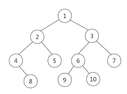

## 0 二叉树构建

二叉树中每一个节点包含当前节点的值和指向的左右两个子树，默认情况下指向的是`None`节点

```python
class TreeNode:
    def __init__(self,val=0,left=None,right=None):
        self.val = val
        self.left = left
        self.right = right
tree1_node2 = TreeNode(3)
tree1_node1 = TreeNode(2)
tree1_root1 = TreeNode(1,left=tree_node2,right=tree1_node1)
```

这样就构建了一个最基本的树结构：

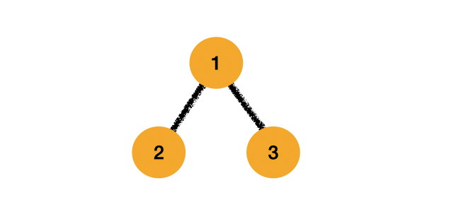

在力扣中往往给出列表表示的数结构，为了方便在自己的IDE中进行调试，将列表转换为树的代码写出来：

基本思路就是建立一个队列，队列中用来存储每一个节点，同时创建一个指针，指针指向的是弹出队列元素中的左右节点，在指派左右节点的时候再次存储进队列，重复过程直到指针指向最后。

```
def list_to_tree(tree_list):
    if len(tree_list) == 0:
        return None
    queue = collections.deque()
    length = len(tree_list)
    root = TreeNode(tree_list[0])
    queue.append(root)
    i = 1
    while i < length:
        node = queue.popleft()
        if node:
            node.left = TreeNode(tree_list[i]) if tree_list[i] else None
            queue.append(node.left)
            i = i+1
            if i < length:
                node.right = TreeNode(tree_list[i]) if tree_list[i] else None
                queue.append(node.right)
                i = i+1
    return root
```

## 1 二叉树的遍历

二叉树的遍历主要分为前序、中序、后序和层序遍历，不同的遍历方式得到的数值顺序也会有所不同。前中后的区分方式是根据遍历根节点的顺序，前序遍历就是根节点首先遍历，中序遍历就是根节点在中间遍历，而后序遍历就是最后遍历根节点。

### 1.1 前序遍历

假设我们具有如下图所示的二叉树结构，二叉树的前序遍历规则是根节点-遍历左子树-遍历右子树。

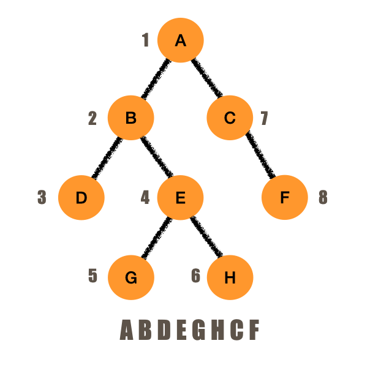

前序遍历的过程很好理解，下面我们来具体实现前序遍历的，前序遍历的实现这里主要介绍三种方法：递归法、栈以及Morris方法。

- 方法1：递归法

使用递归可以很方便实现对于树结构的遍历，应用递归的时候我们需要考虑两点：结束条件和递归调用，在初始节点为根节点的情况下，我们只需要考虑输出根节点的值，其左右子树都可以通过递归函数输出，在不断进行的递归的过程中终止条件就是最终会到达叶子节点，这个时候其左右子节点都为`None`只需要返回空值即可。

```python
def preorderTraversal(self,root):
    if root == None:
        return []
    return [root.val]+self.preorderTraversal(root.left)+self.preorderTraversal(root.right)
```

- 方法2：栈

前序遍历这种方式首先输出的是左面节点的值，所以我们可以首先遍历左面节点并对左面的节点进行存储，存储的过程就是进栈，当左面节点遍历结束后就依次出栈遍历这些节点的右面节点即可。

```python
#方法2：栈
def preorderTraversal(self,root):
    node = root
    stack = list()
    result =list()
    if not root:
        return []
    while stack or node:
        while node:
            result.append(node.val)
            stack.append(node)
            node = node.left
        node = stack.pop()
        node = node.right
    return result
```

[官方题解](https://leetcode-cn.com/problems/binary-tree-preorder-traversal/solution/er-cha-shu-de-qian-xu-bian-li-by-leetcode-solution/)这里有PPT可以参考着看很直观

- 方法3：Morris 遍历

Morris遍历使用二叉树节点中大量指向空的指针，其时间复杂度为 $O(n)$，但是空间复杂度相比与上面两种算法要少得多为 $O(1)$。使用Morris遍历的通用过程如下：

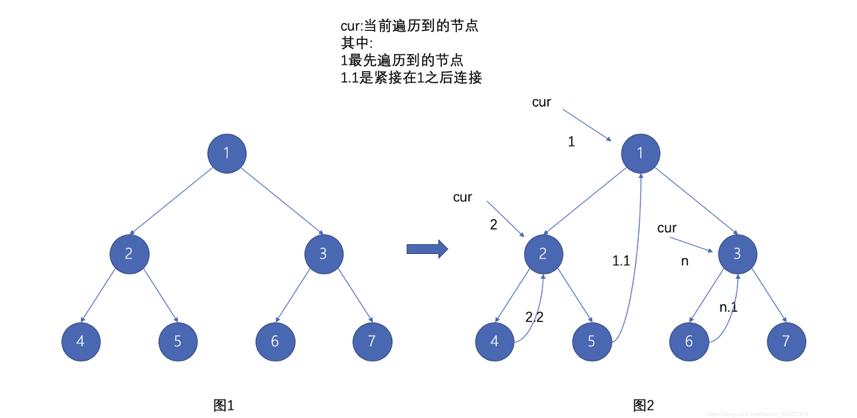

其整体思路是从根节点开始。每一次都找到其左子树对应的最右侧节点与这个根节点连接，在建立完整个连接之后就能根据这个连接对所有节点进行遍历。下面是使用morris遍历的具体过程：

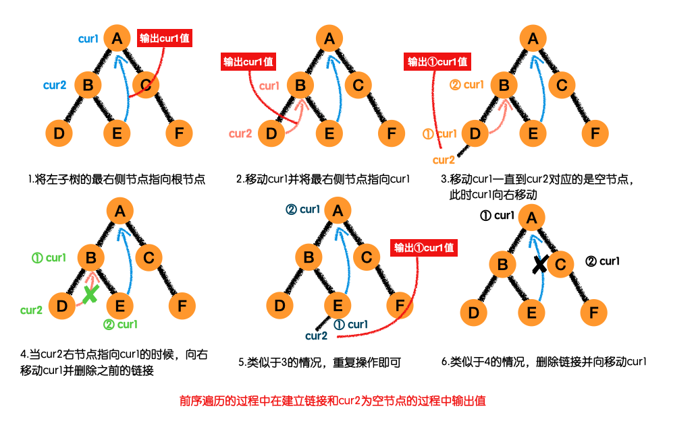

具体的代码流程：

```python
#方法3：Morris 遍历
def preorderTraversal(self,root):
    if root == None:
        return []
    list = []
    cur1 = root
    cur2 = None

    while cur1:
        cur2 = cur1.left
        if cur2:
            while (cur2.right != None) and (cur2.right != cur1):
                cur2 = cur2.right
            if cur2.right == None:
                cur2.right = cur1
                list.append(cur1.val)
                cur1 = cur1.left
                continue
            elif cur2.right == cur1:
                cur2.right = None
        else:
            list.append(cur1.val)
        cur1 = cur1.right
    return list
```

### 1.2 中序遍历

 中序遍历的过程是首先遍历左子树，然后是根节点最后是右子树。

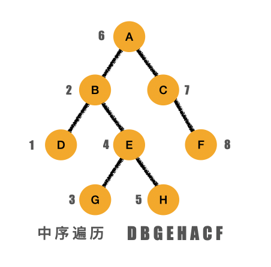

有了前面前序遍历的基础，中序遍历的程序也就很好写了，同样是有三种方法，具体的原理就不再赘述，直接看三种方法的代码：

- 方法1：递归

递归的方法非常简单，在之前的程序基础上只需要做一点变动即可

```python
#方法1：递归
def inorderTraversal(self, root):
    if root == None:
        return []
    return self.inorderTraversal(root.left) + [root.val] + self.inorderTraversal(root.right)
```

复杂度分析：

1. 时间复杂度：$O(n)$，二叉树中每一个节点都被访问一次
2. 空间复杂度：$O(n)$，空间复杂度取决于栈的深度，当二叉树为一条链的时候会达到$O(n)$时间复杂度

- 方法2：栈

栈的思想非常简单，其实就是将递归过程中的隐式栈显式的表现出来，首先对所有的左节点都进行压栈操作，然后出栈的时候输出节点值并处理当前节点的右子树。

```python
#方法2：栈
def inorderTraversal(self,root):
    if root == None:
        return []
    node = root
    stack = list()
    tree_list = list()

    while node or stack:
        cur = node
        while cur:
            stack.append(cur)
            cur = cur.left
        out = stack.pop()
        tree_list.append(out.val)
        node = out.right
    return tree_list
```

复杂度分析：

1. 时间复杂度：$O(n)$，二叉树中每一个节点都被访问一次
2. 空间复杂度：$O(n)$，空间复杂度取决于栈的深度，当二叉树为一条链的时候会达到$O(n)$时间复杂度

- 方法3：Morris遍历

具体的遍历方式看前序遍历中的讲解，简单的说就是对利用二叉树中的一些空节点进行了利用从而保证能够对所有节点进行遍历。

```python
#方法3：Morris遍历
def inorderTraversal(self,root):
    if root == None:
        return []
    cur1 = root
    tree_list = list()


    while cur1:
        cur2 = cur1.left
        if cur2 != None:

            #移动到左子树的最后侧节点并建立连接
            while cur2.right and cur2.right != cur1:
                    cur2 = cur2.right
            if cur2.right == None:#没有连接的话建立连接
                cur2.right = cur1
                cur1 = cur1.left
            elif cur2.right == cur1: #如果已有连接就删除
                tree_list.append(cur1.val)
                cur1 = cur1.right
                cur2.right = None

        else:
            tree_list.append(cur1.val)
            cur1 = cur1.right
    return tree_list
```

[力扣官方给的解答](https://leetcode-cn.com/problems/binary-tree-inorder-traversal/solution/er-cha-shu-de-zhong-xu-bian-li-by-leetcode-solutio/)中有PPT很直观，可以一看

复杂度分析：

1. 时间复杂度：$O(n)$，二叉树中每一个节点都被访问两次，总的时间复杂度为$O(2n)=O(n)$
2. 空间复杂度：$O(1)$，没有使用额外的空间

### 1.3 后序遍历

二叉树的后序遍历先遍历左子树，然后是右子树，最后是根节点。跟上面两种遍历方式类似，后序遍历同样可以通过三种方式解决，只不过由于遍历顺序的不同需要对其中输出节点的顺序进行改变。

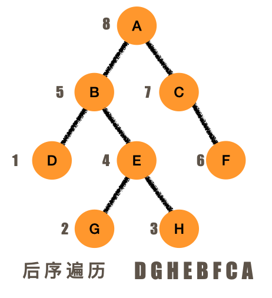

- 方法1：递归

递归的方法非常简单，也很容易理解

```python
#方法1：递归
def postorderTraversal(self,root):
    if root == None:
        return []
    return   self.postorderTraversal(root.left) + self.postorderTraversal(root.right) + [root.val]
```

- 方法2：栈

对当前根节点左面的节点进行入栈操作，然后出栈的时候将出栈的节点的右子树作为根节点同样进行入栈操作，如此重复就能实现对整个树的遍历，在这个过程中最重要的是如何判断什么时候输出值，

```python
#方法2：栈
def postorderTravelsal(self,root):
    if root == None:
        return []
    stack = list()
    result = list()

    node = root
    prec = None
    while node or stack:
        while node != None:
            stack.append(node)
            node = node.left
        node = stack.pop()
        #当右侧没有节点或者当前节点已经被遍历过时输出值
        if (not node.right) or (node.right == prec):
            result.append(node.val)
            prec = node
            node = None
        else:
            stack.append(node)
            node = node.right
    return result
```

- 方法3：Morris遍历

和上面两种遍历方式类似，Morris遍历的方式就是通过利用空的右节点建立连接实现对整个树的遍历过程，但与之前两种方式不同的时候，在后序遍历中输出值的顺序和这种遍历方式的顺序并不是完全符合，所以需要考虑在遍历过程中如何输出值的问题，在下面的题解中在去除连接的时候输出值.

```python
def postorderTravelsal(self, root):

    def save_list( node,result):
        temp_list = list()
        while node:
            temp_list.append(node.val)
            node = node.right
        temp_list.reverse()
        result = result + temp_list
        return result
    if root == None:
        return []
    cur1 = root
    result = list()

    while cur1:
        cur2 = cur1.left
        if cur2:
            while cur2.right and cur2.right != cur1: 
                cur2 = cur2.right
            if cur2.right == None:
                cur2.right = cur1
                cur1 = cur1.left
                continue
            else: #去除连接并输出值
                cur2.right = None 
                result = save_list(cur1.left,result)
        cur1 = cur1.right
    result = save_list(root,result)
    return result
```

上面的写法每次都要建立一个新的列表，可以直接对添加的数据进行倒序操作：

```python
def postorderTravelsal(self, root):

    def addPath(node):
        count = 0
        while node:
            result.append(node.val)
            node = node.right
            count = count + 1
        i = len(result)-count
        j = len(result)-1
        while i<j:
            result[i],result[j] = result[j],result[i]
            i += 1
            j -= 1

    if root == None:
        return []
    cur1 = root
    result = list()

    while cur1:
        cur2 = cur1.left
        if cur2:
            while cur2.right and cur2.right != cur1:
                cur2 = cur2.right
            if cur2.right == None:
                cur2.right = cur1
                cur1 = cur1.left
                continue
            else:
                cur2.right = None
                addPath(cur1.left)
        cur1 = cur1.right
    addPath(root)
    return result
```

### 1.4 层序遍历

二叉树的层序遍历顾名思义就是按照层来进行遍历，每一次都按照从左到右的顺序对每一层的元素进行输出，下面是一个二叉树层序遍历的输出示意：

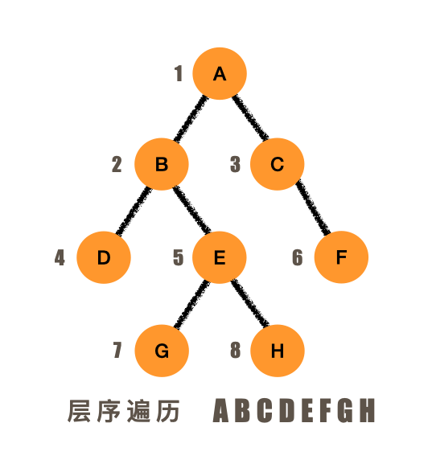

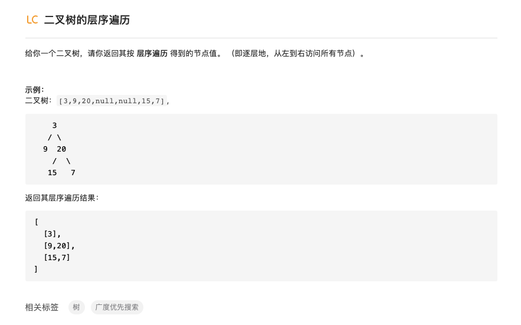

- 方法1：队列实现

二叉树的层序遍历可以通过队列的方式实现，实现的思路是每一次都对每一层的节点进行入队存储，然后出队的时候输出改层节点的值并用另一个队列存储下一层的所有节点，如此重复知道队列为空。

```python
def levelOrder(self, root: TreeNode):
    if root == None:
        return []
    queue = collections.deque()
    temp_queue = collections.deque()
    queue.append(root)
    result = []
    temp_res = []
    while queue:
        node = queue.popleft()
        temp_res.append(node.val)
        if node.left:
            temp_queue.append(node.left)
        if node.right:
            temp_queue.append(node.right)
        if not queue:
            result = result + [temp_res]
            queue = temp_queue
            temp_res = []
            temp_queue = collections.deque()
    return result
```

- 方法2：递归实现

由于我们要返回的是一个包含列表的列表，每一个列表的位置实际就代表着元素所在层数，所以我们需要在使用递归添加元素的时候对层数进行指明。在下面的递归函数中就明确指出当前需要添加到列表中的位置，在根节点的时候添加到第一个列表，然后其子节点就相应的添加到第二个列表，如果当前列表数比层数少的时候就添加新的列表。

```python
def levelOrder(self, root: TreeNode):
    result = [[]]
    def add_elements(root,level):
        if root and len(result) == level-1: #当前列表层数<遍历到树的层数 添加新的列表
            result.append([])
        if len(result) >= level: #当前列表层数>=遍历到数的层数 在相应层添加元素
            result[level-1].append(root.val)
        if root.left: #如果当前节点存在左子树，对左子树进行层序遍历
            add_elements(root.left,level+1)
        if root.right:#如果当前节点存在右子树，对右子树进行层序遍历
            add_elements(root.right,level+1)
        return result

    if root == None:
        return []
    return add_elements(root,1)
```

有时间的时候总结一下模板：https://leetcode-cn.com/problems/binary-tree-level-order-traversal/solution/tao-mo-ban-bfs-he-dfs-du-ke-yi-jie-jue-by-fuxuemin/

## 2.二叉树的最大深度

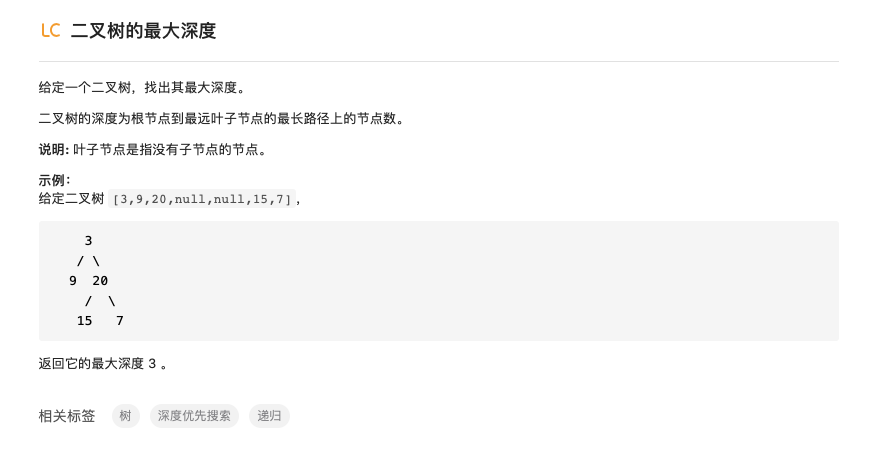


其实上面层序遍历的过程后就可以直接输出二叉树的最大深度，如果只求深度的话反而更简单。这个题主要想到两种思路，第一种是递归，第二种就是广度优先搜索。

- 方法1：递归

再次不厌其烦的回顾使用递归的模板：终止条件+递归调用。求深度的时候终止条件就是遇到None节点时候此时返回的深度应该是0，其他情况下返回其左节点和右节点的最大深度+1。

```python
def maxDepth(self, root: TreeNode):
    if root == None:
        return 0
    return max(self.maxDepth(root.left)+1,self.maxDepth(root.right)+1)
```

模仿之前层序遍历的过程有这种嵌套函数的递归写法：

```python
def maxDepth(self, root: TreeNode) :
    cur_depth = 0
    max_depth = 0
    def count_cur_depth(root, cur_depth):
        nonlocal max_depth
        if cur_depth > max_depth:
            max_depth = cur_depth
        if root.left:
            count_cur_depth(root.left,cur_depth+1)
        if root.right:
            count_cur_depth(root.right,cur_depth+1)
        return max_depth
    if root == None:
        return cur_depth
    return count_cur_depth(root,1)
```


- 方法2：广度优先搜索

可以对依次每一行进行遍历，当该行所有节点不存在子节点的时候就返回深度的值，因为只需要记录深度这一个值所以使用栈队列的数据结构都可以。

```python
#方法2：栈
def maxDepth(self, root: TreeNode):
    if root == None:
        return 0
    stack = list()
    temp_stack = list()
    stack.append(root)
    depth = 0
    while stack or temp_stack:
        node = stack.pop()
        if node.left:
            temp_stack.append(node.left)
        if node.right:
            temp_stack.append(node.right)
        if not stack:
            depth = depth + 1
            stack = temp_stack
            temp_stack = list()
    return depth
```

## 3.验证有序二叉树的有效性

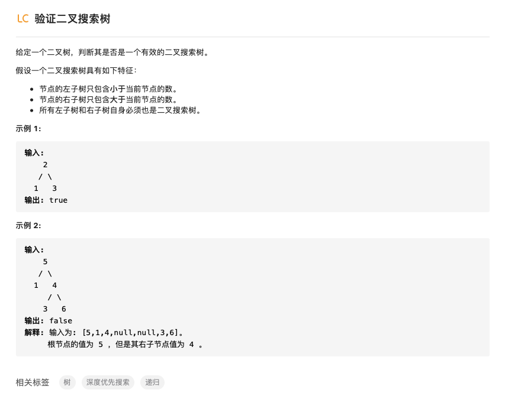


注意题目中要求的有序二叉树必须是左子树中的值小于根节点，右子树中的值大于根节点，而并非是单个节点。按照有序二叉树的规律，实际对其进行中序遍历就是从小到大遍历元素的过程，所以实际上可以首先中序遍历元素然后对元素大小进行比较，后一个元素总是大于前一个元素那就是一个有序二叉树。

- 方法1：中序遍历

1.1 递归

首先通过递归的到中序遍历后的列表，然后对其中的数值进行判断，如果后面的数总是比前面的大那么就表示原二叉树为有序二叉树。

```python
#方法1.递归中序遍历判断
def isValidBST(self, root: TreeNode) :
    def inorder(root):
        if root == None:
            return []
        return inorder(root.left) + [root.val] + inorder(root.right)
    inorder_list = inorder(root)
    for i in range(len(inorder_list)-1):
        if inorder_list[i+1] < inorder_list[i]:
            return False
    return True
```

1.2 栈

用栈实现中序遍历，每一次得到新的值都和前面的值进行比较确保后一个值总是比前一个大。

```python
#方法2.栈中序遍历判断
def isValidBST(self, root: TreeNode):
    if root == None:
        return True
    stack = list()
    node = root
    temp = None
    while stack or node:
        while node:
            stack.append(node)
            node = node.left
        cur = stack.pop()
        if temp != None and cur.val <= temp:
            return False
        temp = cur.val
        node = cur.right
```

- 方法2：直接递归实现

由于判断有序二叉树的时候我们需要保证左子树中的所有值都比根节点要小，所以在遍历到左子树的时候必须要有关于根节点的信息，换一种思路我们可以设置一个当前节点的可行范围。这个范围的数值是由父节点决定的。

```python
#方法3 直接递归判断
def isValidBST(self,root):
    def isvalid(root,min=float('-inf'),max=float('inf')):
        if root == None:
            return True
        if root.val <= min or root.val >= max:
            return False
        return isvalid(root.left,min=min,max=root.val) and isvalid(root.right,min=root.val,max=max)
    return  isvalid(root)
```


## 4. 验证二叉树是否为对称二叉树

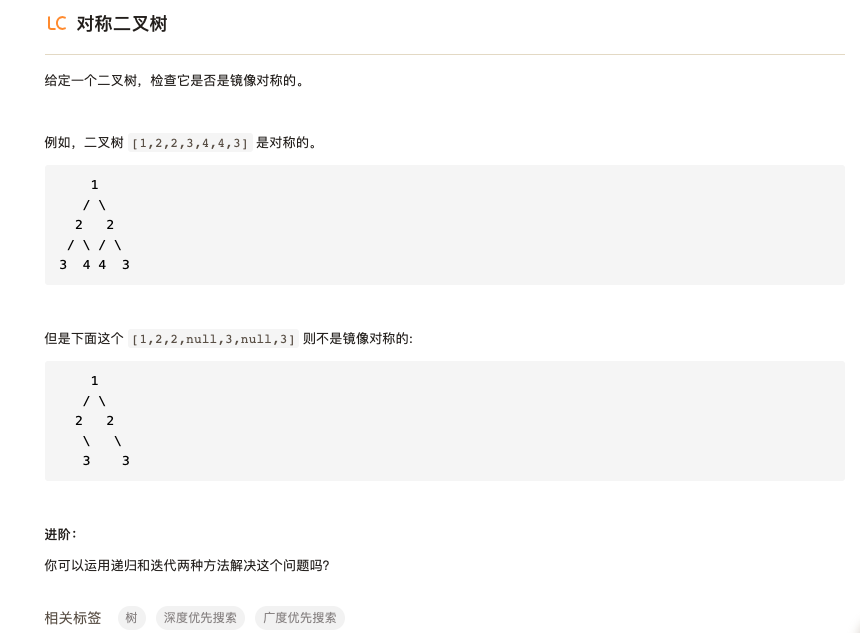

这个题可以从层序遍历入手，依次遍历每一层，然后判断遍历后的得到列表是否是回文列表即可。另外也可以用深度优先的方式分别对根节点的左子树和右子树进行遍历然后比较，不同的是遍历左子树的时候顺序为左-根-右，而右子树的时候为右-根-左。

- 方法1：递归遍历后比较

运用递归的方式对左子树和右子树分别进行遍历然后比较两个列表是否相同即可。

```python
#方法1：递归遍历后比较
def isSymmetric(self, root: TreeNode) :
    if root == None:
        return True
    if not root.left and not root.right:
        return True
    def preorder(root):
        if root == None:
            return ['None']
        return [root.val] + preorder(root.left) + preorder(root.right)
    def reverse_order(root):
        if root == None:
            return ['None']
        return [root.val] + reverse_order(root.right) + reverse_order(root.left)
    left_node_list = preorder(root.left)
    right_node_list = reverse_order(root.right)
    if left_node_list == right_node_list:
        return True
    return False
```


- 方法2：直接递归

也可以直接通过递归的方式对左右子树中的对应节点进行比较，如果所有对应的节点都相等那么就是一个对称二叉树。

```python
#方法2：直接递归
def isSymmetric(self, root: TreeNode):
    if root == None:
        return True
    def symmetric(left,right):
        if left == None and right == None:
            return True
        if left and right:
            if left.val == right.val:
                return symmetric(left.left,right.right) and symmetric(left.right,right.left)
        return False
    return symmetric(root.left,root.right)
```


## 5.将有序数组转换为二叉搜索树

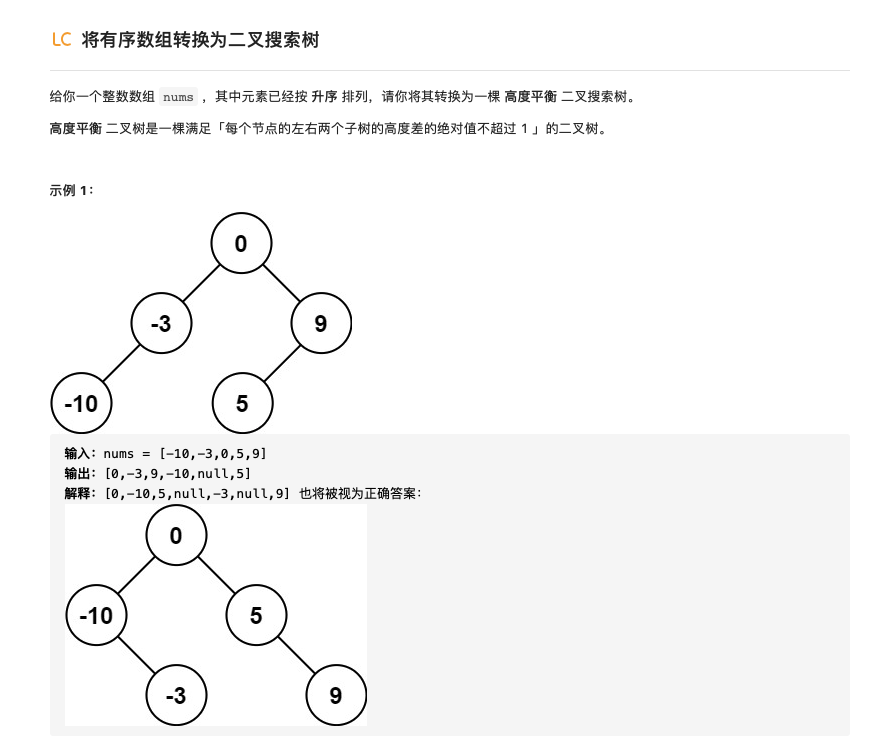

转换后二叉搜索树应该满足左子树小于根节点，右子树大于根节点，并且任意节点的两个子树的高度差不超过1。

如何在有序列表中选取节点是这个题的关键，为了尽可能的平衡左右子树，根节点的值应该选择为有序列表的中位数，同样在选择完根节点之后列表被分为左右两个部分，这两个部分就是根节点的左右子树的取值，左右子树的取值同样应该是列表的中间元素，如此重复直到列表为空。这种想法可以通过递归实现。

```python
#方法1：递归，每次将列表中间的值作为根节点
def sortedArrayToBST(self,nums):
    if nums == []:
        return None
    length = len(nums)
    mid = length // 2  #得到中间数对应的序号
    root = TreeNode(nums[mid])
    if nums[:mid] != []:
        root.left = self.sortedArrayToBST(nums[:mid])
    if nums[mid+1:] != []:
        root.right = self.sortedArrayToBST(nums[mid+1:])
    return root
```

递归的终止条件就是列表为空，当不为空的时候我们都需要对当前节点指定他的左右子树，这个时候就使用到递归调用，最后返回建立的节点即可。

初级算法中树的内容到这里就结束了，总结一下，树中用的最多的方法是递归，递归的思想如果有思路就非常简单，这种类型的题以后要多加练习。其次最为重要的就是二叉树的各种遍历方法，最基础的就是前中后序遍历，这三种遍历每一种都用到三种方法，分别是迭代、递归和Morris遍历，这些都需要能够当场手写出来，目前虽然写了三遍但还是不够熟练，之后会出一些类似于算法回顾练习或者每周回顾练习的东西帮助进行回顾和记忆。


