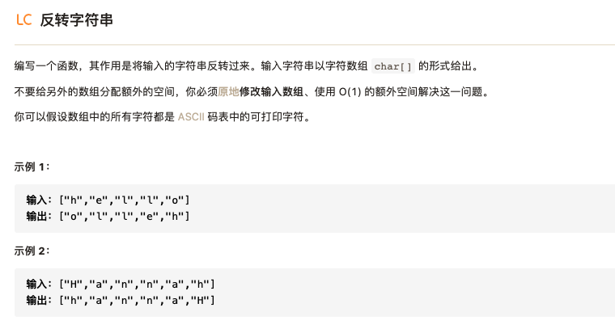
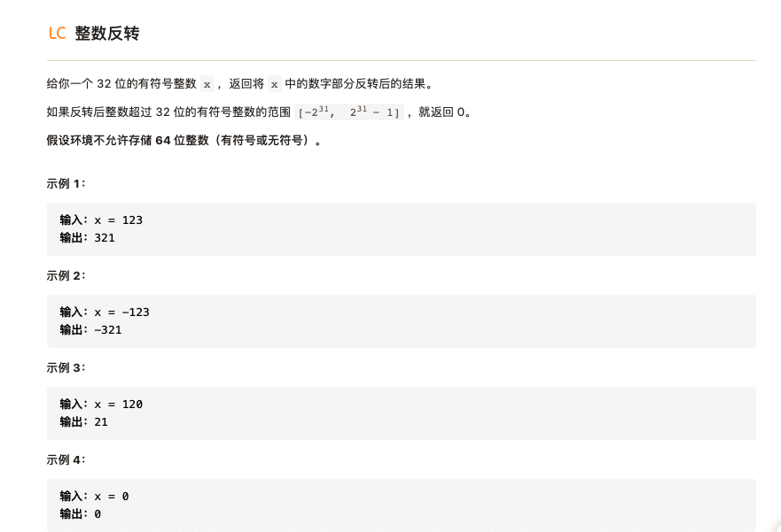
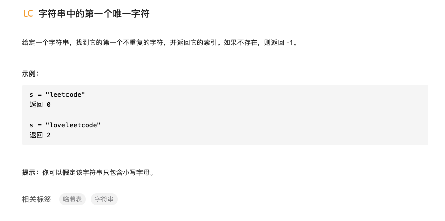
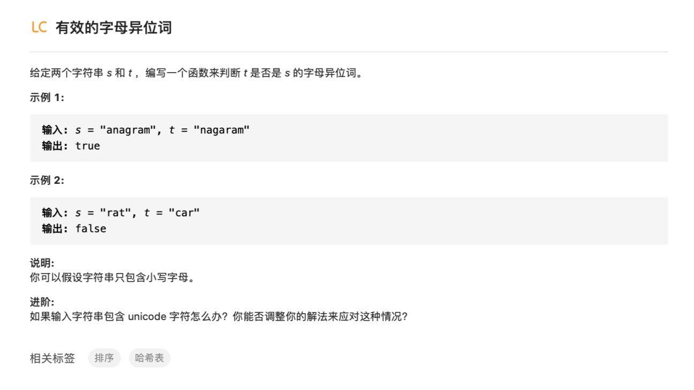

# 字符串


## 1.反转字符串



反转字符串的操作其实就相当于沿着中心对字符串进行对折，所以只要首尾两边元素交换就行，代码也很简单：

```python
def reverseString(self,string):
    n = len(string)
    for i in range(n//2):
        string[i],string[n-i-1] = string[n-i-1],string[i]
```

## 2.整数反转




看到这个题的直接想法就是首先将整数转换为数组进行翻转然后再将其转换回来：

- 方法1：整数->list->整数

```python
def reverse_int(self,x):
    sign = 1
    y=0
    if x<0:
        sign =-1
        x=-x
    a = x
    list_x = []
    while a != 0:
        num = a % 10
        list_x.append(num)
        a = int(a/10)
    # self.reverseString(list_x)
    for i in range(len(list_x)):
        y = y+list_x[i] *10**(len( list_x)-i-1)
    y = sign*y
    if y <-2**31 or y >2 **31-1:
        return 0
    return y
```

- 方法2：第二种想法就是直接对整数进行操作，利用取余以及除法操作取每一位数，然后将相应位的数字进行转换：

```python
def reverse_int(self ,x):
    num =0  # 记录位数 y=0  #  记  数
    sign = 1
    # 记录符号
    if x<0:
        sign = -1
        x = -x
    # 获取位数
    x_1 = x
    while True:
        if int(x_1/10)!=0:
            num = num+1
            x_1 = int(x_1/10)
        else:
            num = num+1
            break
    # 得到反转后数
    for i in range(num,0,-1):
        y = y+(x%10)* ( 10 * *(i - 1))
        x = int(x/10)
    y = sign*y
    if y <-2**31 or y > 2**31-1:
        return 0
    return y
```

在我自己的解答中涉及要计算位数，这个过程其实完全没有必要，下面是简化版的代码：

```python
def reverse_int(self ,x):
    y=abs(x)
    num = 0
    boundry = (1<<31)-1 if x>0 else 1<<31
    while y !=0:
        num = y%10 +num*10
        if num>boundry:
            return 0
        y = y//10
    return num if x>0 else -num
```


## 3.字符串中的第一个唯一字符



第一次看到这题想到想先把字符串转换为数字然后统计数组中第一个不重复元素，但转念一想这样没啥好处啊，不如直接将字符串转换为数组。直接对数组从前到后进行遍历的话时间复杂度有点高$O(n^2)$，看到底下有个哈希表的标签，emm，用哈希表存储每一个元素出现的次数！然后返回第一个次数是1的元素对应其在数组中的序号就好，废话少说，直接上代码：

```python
		def firstUniqChar(self,s):
        s_list = list(s)
        hashtable = dict()
        for i in s_list:
            if i in hashtable:
                hashtable[i] = hashtable[i] + 1
                continue
            hashtable[i] = 1

        for i in range(len(s_list)):
            if hashtable[s_list[i]] == 1:
                return i
        return -1
```

一共遍历两次，时间复杂度$O(n)$，比上面的方法好得多。

## 4.有效的字母异位词



第一次看还理解错了题意，我还以为是指相同位置有不一样的字母就是字母异位词。实际题意是单词中的字母种类和次数都相同就是次序不同则是字母异位词。

看到这个题底下的标签了，所以两种解法呼之欲出。

- 方法一：排序，先将字符串转换为列表，然后对列表排序，对比两个列表是否相等即可。

```python
#方法一：排序后判断是否相等
    def isAnagram(self,s,t):
        s_list = list(s)
        t_list = list(t)
        s_list.sort()
        t_list.sort()
        if s_list == t_list:
            return True
        return False
```

- 方法二：哈希表，哈希表存储第一个字符串每个字母出现的次数，然后再进行遍历第二个字符串，如果不存在相应字母或者字母次数不一致就False。

```python
#方法二：利用哈希表判断字符次数
    def isAnagram(self,s,t):
        hashtable = dict()
        if len(s) != len(t):
            return False
        for i in range(len(s)):
            if s[i] in hashtable:
                hashtable[s[i]] += 1
                continue
            hashtable[s[i]] = 1
        for j in range(len(t)):
            if (t[j] not in hashtable) or (hashtable[t[j]]==0):
                return False
            hashtable[t[j]] -= 1
        return True
```

- 方法三：利用set集合存储所有不同的字母，然后对字母进行遍历，如果字母出现次数相同则True，反之False。

```python
#方法三：利用set集合
    def isAnagram(self,s,t):
        if len(s) != len(t):
            return False
        for i in set(s):
            if s.count(i) != t.count(i):
                return False
        return True
```


