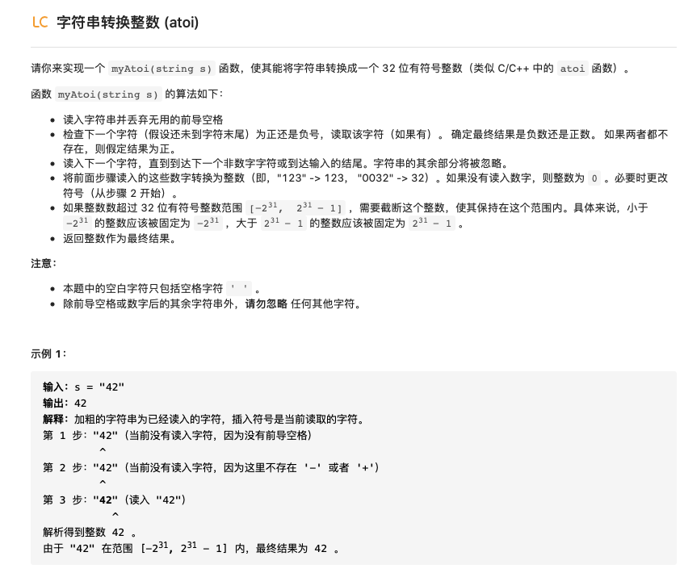
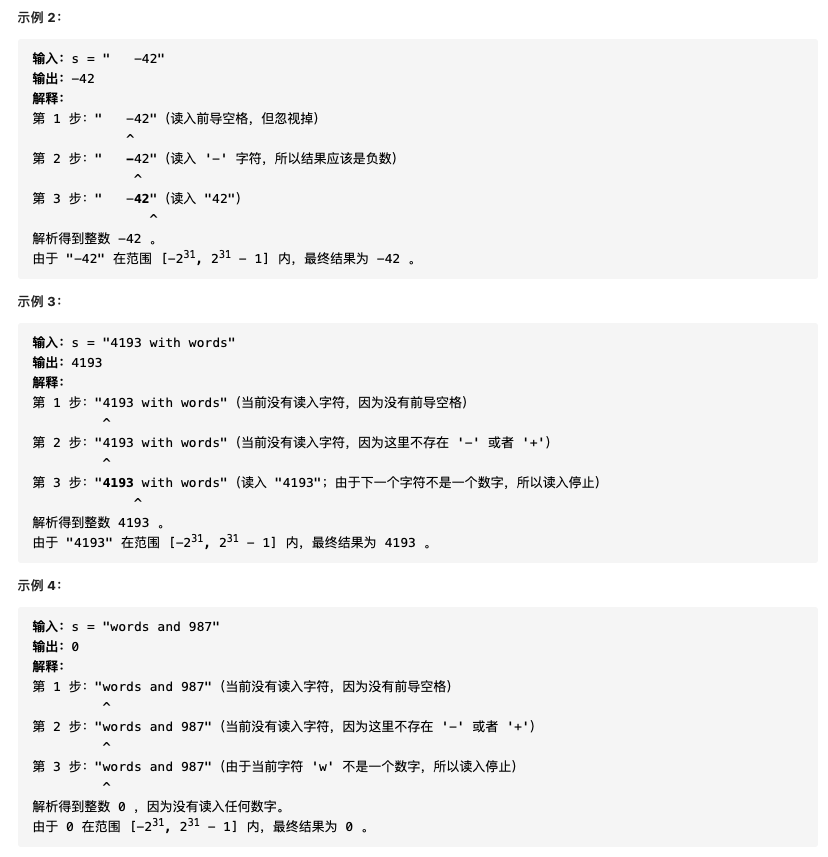
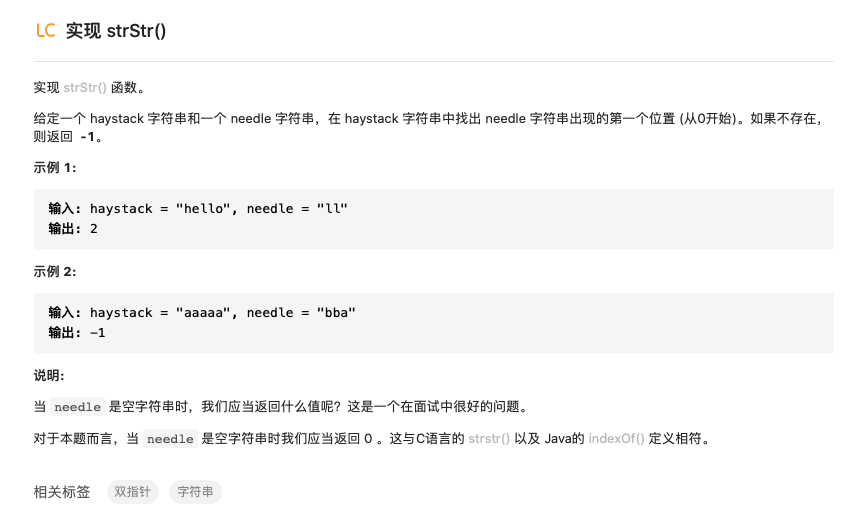
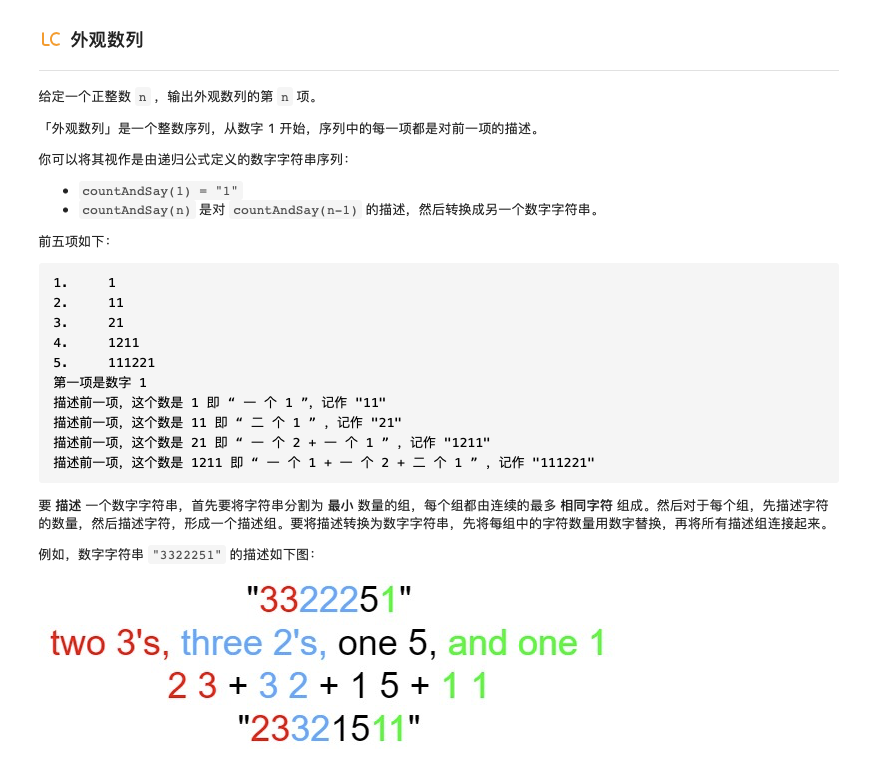
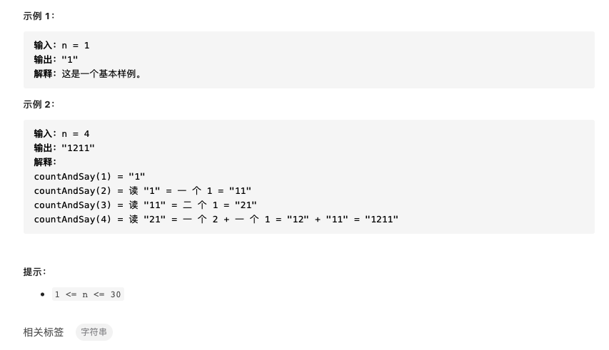
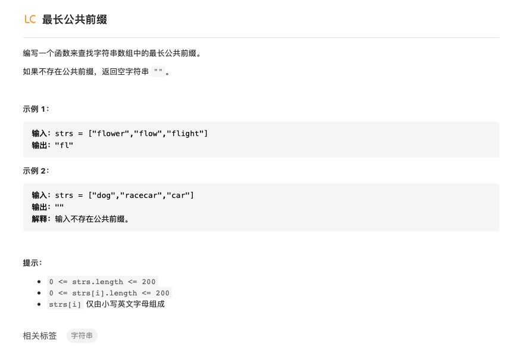

# 字符串


## 1.反转字符串


反转字符串的操作其实就相当于沿着中心对字符串进行对折，所以只要首尾两边元素交换就行，代码也很简单：

```python
def reverseString(self,string):
    n = len(string)
    for i in range(n//2):
        string[i],string[n-i-1] = string[n-i-1],string[i]
```

## 2.整数反转


看到这个题的直接想法就是首先将整数转换为数组进行翻转然后再将其转换回来：

- 方法1：整数->list->整数

```python
def reverse_int(self,x):
    sign = 1
    y=0
    if x<0:
        sign =-1
        x=-x
    a = x
    list_x = []
    while a != 0:
        num = a % 10
        list_x.append(num)
        a = int(a/10)
    # self.reverseString(list_x)
    for i in range(len(list_x)):
        y = y+list_x[i] *10**(len( list_x)-i-1)
    y = sign*y
    if y <-2**31 or y >2 **31-1:
        return 0
    return y
```

- 方法2：第二种想法就是直接对整数进行操作，利用取余以及除法操作取每一位数，然后将相应位的数字进行转换：

```python
def reverse_int(self ,x):
    num =0  # 记录位数 y=0  #  记  数
    sign = 1
    # 记录符号
    if x<0:
        sign = -1
        x = -x
    # 获取位数
    x_1 = x
    while True:
        if int(x_1/10)!=0:
            num = num+1
            x_1 = int(x_1/10)
        else:
            num = num+1
            break
    # 得到反转后数
    for i in range(num,0,-1):
        y = y+(x%10)* ( 10 * *(i - 1))
        x = int(x/10)
    y = sign*y
    if y <-2**31 or y > 2**31-1:
        return 0
    return y
```

在我自己的解答中涉及要计算位数，这个过程其实完全没有必要，下面是简化版的代码：

```python
def reverse_int(self ,x):
    y=abs(x)
    num = 0
    boundry = (1<<31)-1 if x>0 else 1<<31
    while y !=0:
        num = y%10 +num*10
        if num>boundry:
            return 0
        y = y//10
    return num if x>0 else -num
```


## 3.字符串中的第一个唯一字符


第一次看到这题想到想先把字符串转换为数字然后统计数组中第一个不重复元素，但转念一想这样没啥好处啊，不如直接将字符串转换为数组。直接对数组从前到后进行遍历的话时间复杂度有点高$O(n^2)$，看到底下有个哈希表的标签，emm，用哈希表存储每一个元素出现的次数！然后返回第一个次数是1的元素对应其在数组中的序号就好，废话少说，直接上代码：

```python
		def firstUniqChar(self,s):
        s_list = list(s)
        hashtable = dict()
        for i in s_list:
            if i in hashtable:
                hashtable[i] = hashtable[i] + 1
                continue
            hashtable[i] = 1

        for i in range(len(s_list)):
            if hashtable[s_list[i]] == 1:
                return i
        return -1
```

一共遍历两次，时间复杂度$O(n)$，比上面的方法好得多。

## 4.有效的字母异位词


第一次看还理解错了题意，我还以为是指相同位置有不一样的字母就是字母异位词。实际题意是单词中的字母种类和次数都相同就是次序不同则是字母异位词。

看到这个题底下的标签了，所以两种解法呼之欲出。

- 方法一：排序，先将字符串转换为列表，然后对列表排序，对比两个列表是否相等即可。

```python
#方法一：排序后判断是否相等
    def isAnagram(self,s,t):
        s_list = list(s)
        t_list = list(t)
        s_list.sort()
        t_list.sort()
        if s_list == t_list:
            return True
        return False
```

- 方法二：哈希表，哈希表存储第一个字符串每个字母出现的次数，然后再进行遍历第二个字符串，如果不存在相应字母或者字母次数不一致就False。

```python
#方法二：利用哈希表判断字符次数
    def isAnagram(self,s,t):
        hashtable = dict()
        if len(s) != len(t):
            return False
        for i in range(len(s)):
            if s[i] in hashtable:
                hashtable[s[i]] += 1
                continue
            hashtable[s[i]] = 1
        for j in range(len(t)):
            if (t[j] not in hashtable) or (hashtable[t[j]]==0):
                return False
            hashtable[t[j]] -= 1
        return True
```

- 方法三：利用set集合存储所有不同的字母，然后对字母进行遍历，如果字母出现次数相同则True，反之False。

```python
#方法三：利用set集合
    def isAnagram(self,s,t):
        if len(s) != len(t):
            return False
        for i in set(s):
            if s.count(i) != t.count(i):
                return False
        return True
```

## 5.验证回文串


回文这个字一出现就想到双指针的思想，头尾两个指针比较，相等就向中间移动知道左面指针大于或等于右面指针结束，因为这个题目中还含有其他字符，所以判断当当前指针不是字母数字的时候就移动即可。另外还想到一种思想就是在开辟一个字符串存储之前字符串中所有的数字和字母，然后与其倒序的字符串进行比较即可。

- 方法1：双指针，头尾指针，相等则像中间移动，不等返回False

```python
#方法1：双指针，开始一个，最后一个，比较字母和数字是否相同，不同则False，若相同当左面指针等于或者大于右面的时候结束
    def isPalindrome(self,s):
        if len(s) <= 1:
            return True
        n = len(s)
        first = 0
        last = n-1
        while True:
            while not s[first].isalnum() and first<n-1:
                first = first + 1
            while not s[last].isalnum() and last>0:
                last = last - 1
            if (not s[first].isalnum()) and (not s[last].isalnum()):
                return True
            if s[first].lower() == s[last].lower():
                first = first + 1
                last = last - 1
                if first >= last:
                    break
                continue
            return False
        return True
    #简化版双指针，思想一样就是简化了一些行
    def isPalindrome(self, s: str) -> bool:
        n = len(s)
        left, right = 0, n-1
        while left < right:
            while left < right and not s[left].isalnum():
                left += 1
            while left < right and not s[right].isalnum():
                right -= 1
            if s[left].lower() != s[right].lower():
                return False
            left += 1
            right -= 1
        return True

```

- 方法2：使用另一数组存储字母数组然后与其倒序进行比较。

```python
#方法2：将字符串中所有字符和数字存在另一个变量temp中，判断temp和其倒序字符串temp[::-1]是否相同
def isPalindrome(self,s):
    temp=''
    for i in range(len(s)):
        if s[i].isalnum():
            temp = temp+s[i]
    if temp == temp[::-1]:
        return True
    return False
```

- 方法3：正则表达式，从网友那学的，将所有的非字母数字替换掉然后与其自身倒序进行比较。

```python
#方法3：使用正则表达式将所有非数字和字母全都替换掉，换成小写后与其倒序字符串比较
import re
def isPalindrome(self,s):
    temp = re.sub("[^a-zA-Z0-9]","",s) 
    temp = temp.lower()
    return temp == temp[::-1]
```

## 6.字符串转换整数(atoi)





这个题将基本思路都已经给出来，可以直接按照它说的步骤写就行，最后一顿if-else操作就可以了；另外一种思想就是利用正则表达式，我知道可以用，但是不会用￣□￣｜｜，最后还是看网友的答案了；看到官方题解还有一种自动机的方法，没仔细看，有时间再学习一下。

- 方法1：按照题解思路直接编写

```python
#方法1：根据题意直接编写
    def myAtoi(self, s) :
        i = 0
        num = ''
        sign = 1
        while i <= len(s)-1 and s[i] == " ":
            i = i + 1
        if i > len(s)-1 or s == '':
            return 0
        if s[i] == "-":
            sign = -1
            i = i + 1
        elif s[i] == "+":
            i = i + 1
        boundry = (1<<31)-1 if sign>0 else 1<<31
        while i <= len(s)-1:
            if s[i].isdigit():
                num = num + s[i]
                i = i + 1
                continue
            break
        if num == "":
            return 0
        num = sign * int(num)
        if abs(num) > boundry:
            return sign * boundry
        return num
```

有一说一，被测试案例锤着虐了，还是太菜，改了挺久的。

- 方法2：使用正则表达式

```python
#方法2：使用正则表达式
def myAtoi(self,s):
    INT_MAX = 2**31 - 1
    INT_MIN = -2**31
    s = s.strip()
    num = re.findall('^[\+\-]?\d+',s)
    num = int(*num)
    return max(min(INT_MAX,num),INT_MIN)
```

这种方法就比较简单，核心就是会不会写正则表达式了，以后多练习一下，还有个解包的知识点，今天会抽空学习一下。

## 7.实现strStr()



- 方法1：双指针，看到这个题第一眼那必是双指针，快慢两个指针间距为待查找字符串长度，然后对字符串依次查找直到快指针到最后。

```python
    def strStr(self,haystack,needle):
        if len(needle) == 0 :
            return 0
        num = len(needle)
        fast = num
        slow = 0
        while fast <= len(haystack):
            if haystack[slow:fast] == needle:
                return slow
            slow = slow+1
            fast = fast+1
        return -1
```

- 方法2：正则表达式。使用正则表达式的`re.search()`函数对满足条件的字符串进行匹配并返回其目标字符串中的起始和结束位置。

```python
#方法2：使用正则表达式
    def strStr(self,haystack,needle):
        if len(needle) == 0 :
            return 0
        temp = re.search(needle,haystack)
        if temp != None:
            return temp.span()[0]
        return -1
```

- 方法3：API，直接使用字符串内建方法`find()`

```python
#方法3：使用python自带API find()
def strStr(self,haystack,needle):
    return haystack.find(needle)
```

- ·方法4：使用KMP算法。没看懂，懂了再整理，很可能吃灰了。


##8.外观数列






简答的暴力解法就是建立一个n次的循环，每次都按照要求进行描述即可。

- 方法1：循环n次直接描述

建立一个列表用来存储对每一个不相同数字的描述，最后将这个列表中的数相加得到对这个序列的描述。

```python
    def countAndSay(self,n):
        for count in range(1,n+1):
            if count == 1:
                s = '1'
                continue
            list_a = []
            for i in range(len(s)):
                if i == 0:
                    list_a.append('1'+s[0])
                    idx = 0
                    nums = 1
                    continue
                if i<len(s) and s[i] == s[i-1]:
                    nums = nums +1
                    list_a[idx] = str(nums)+s[i]
                elif i < len(s) and s[i] != s[i - 1]:
                    list_a.append('1'+s[i])
                    nums = 1
                    idx = idx+1
            for i in range(len(list_a)):
                if i == 0:
                    s = list_a[0]
                    continue
                s = s + list_a[i]
        return s

```

- 方法2：递归，递归的思想是当为1的时候就返回对于1的描述，当为n的时候就是对n-1的时候的序列进行描述。

```python
def countAndSay(self,n):
    if n == 1:
        return "1"
    num_str = self.countAndSay(n-1)
    slow = 0
    fast = 0
    num = 0
    str_target = ''
    while slow < len(num_str):
        while fast < len(num_str) and num_str[slow] == num_str[fast]:
            fast = fast + 1
            num = num + 1

        str_target = str_target+str(num)+str(num_str[slow])
        str_target = str_target.strip()
        slow = fast
        num = 0
    return str_target
```


## 9.最长公共前缀



看到这个题最简单的思想就是按照位数进行遍历，两个循环，外循环是数组长度，内循环是字母在字符串的位置，当遇到不相等或者长度超限的时候就跳出。

- 方法1：纵向比较，所有字符串中的字母依次比较

```python
    def longestCommonPrefix(self,strs):
        if len(strs) == 0:
            return ""
        common = ""
        for i in range(len(strs[0])):
            for j in range(1,len(strs)):
                if len(strs[j])-1 < i or  strs[j][i] != strs[j-1][i]:
                    return common
            common = strs[0][:(i+1)]
        return common
```

- 方法2：横向比较，每两个字符串依次比较

```python
#方法2：横向比较，比较两个字符串找最长公共前缀，一直比到最后
    def longestCommonPrefix(self,strs):
        def CommonPrefix(a,b):
            common = ''
            for i in range(min(len(a),len(b))):
                if a[i] == b[i]:
                    common = a[:(i+1)]
                    continue
                return common
            return common
        if len(strs) == 0:
            return ''
        a = strs[0]
        for i in range(1,len(strs)):
            a = CommonPrefix(a,strs[i])
        return a

```

- 方法3：分治法，将原来的问题分解为小的子问题一一求解

```python
 #方法3：分治 将原来的问题转换为很多子问题一一求解，这里最小的子问题就是求两个字符串的最小公共前缀
    def longestCommonPrefix(self,strs):
        def lcp(start,end):
            if start == end:
                return strs[start]
            mid = (start+end) // 2
            lcpLeft,lcpRight = lcp(start,mid),lcp(mid+1,end)
            minLength = min(len(lcpLeft),len(lcpRight))
            for i in range(minLength):
                if lcpLeft[i] != lcpRight[i]:
                    return lcpLeft[:i]
            return lcpLeft[:minLength]
        return "" if not strs else lcp(0,len(strs)-1)
```


到此为止字符串的部分就结束了，字符串这部分算法中也会用到双指针、哈希表等思想，更多的就是根据题意直接写就好，当然对于字符串的处理有很巧妙的方法就是正则表达式，强大的正则表达式会让问题处理变得十分简单高效。


