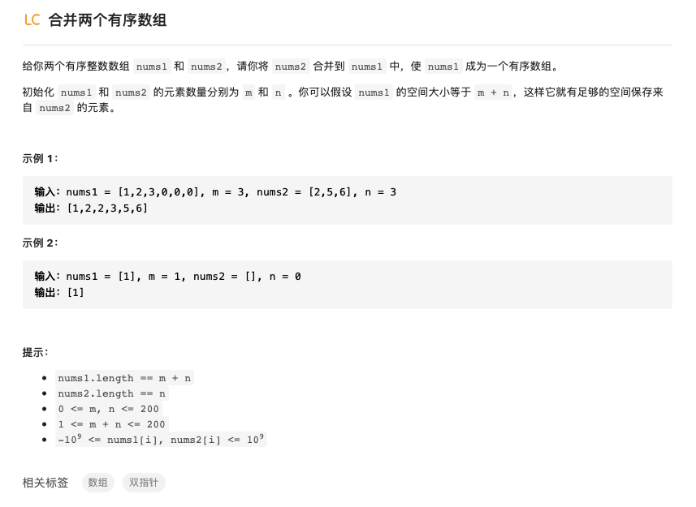

# 排序算法及相关习题

## 1 排序的需求与划分方式

排序的过程需要将一个无序数组按照一定的顺序进行排列。其中划分方式主要有：

- **稳定性**：如果排序之前a在b之前，且有a=b，则稳定的排序方式有排序之后也有a在b之前。
- **内外排序**：排序的过程在内存中进行称为内排序，如果需要将数据转移到硬盘中，排序过程需要通过内存和硬盘之间的数据传输则称为外排序。
- **时空复杂度**：时间复杂度是指运行时间，空间复杂度运行完一个程序所需内存的大小。

## 2 排序方式

一下以python代码的形式介绍10种常见的排序方式：

### 2.1 选择排序（Selection Sort）

选择排序的方式符合人类排序的直觉，从头开始遍历，首先从无序数组中选择最小（最大）的放在最前面，然后再依次从余下的无序数组中选择最小（最大）的放在前面，重复这个过程就完成了排序。


排序算法分析：

- 稳定性：数组实现不稳定，链表实现稳定
- 内外排序：内排序方式
- 时空复杂度：时间复杂度 $O(n^2)$，总共进行了 $\frac{n(n-1)}{2}$ 次比较过程；空间复杂度 $O(1)$ ，没有占用额外的内存空间，整个过程是in-place操作

```python
#选择排序方式
def seclection_sort(nums):
    n = len(nums)
    for i in range(n):
        for j in range(i,n):
            if nums[i] > nums[j]:
                nums[i],nums[j] = nums[j],nums[i]
    return nums
```

```c++
int r[]  = {0,5,6,8,4,9,6,74,65,123,94};
int n = sizeof(r)/sizeof(r[0]);
void selectSort(int r[],int n){
    int i,j,temp;
    for(i=0; i<n; i++)
    {
        for(j=i+1; j<n; j++)
        {
            if(r[i] > r[j])
            {
                temp = r[i];
                r[i] = r[j];
                r[j] = temp;
            }
        }
    }
    
}
```

### 2.2 冒泡排序

 冒泡排序每一次是相邻两个元素进行比较，小的元素放在前面，大的元素放在后面。重复这个过程一次那么最大的元素就会像水底冒出的气泡一样浮出来排在数组的最后面。


```python
def bubble_sort(nums):
	n = len(nums)
	for i in range(n):
		for j in range(n-i):
			if nums[j] > nums[j+1]:
				num[j],num[j+1] = num[j+1],num[i]
	return nums		
```

```c++
int r[]  = {0,5,6,8,4,9,6,74,65,123,94};
int n = sizeof(r)/sizeof(r[0]);
void bubble_sort(int r[],int n){
    int i,j,temp;
    for ( i = 0; i < n; i++)
    {
        for(j=1; j<n-i; j++)
        {
            if (r[j-1] > r[j])
            {
                temp = r[j-1];
                r[j-1] = r[j];
                r[j] = temp;
            }
        }
    }
    
}
```

- 稳定性：稳定排序
- 内外排序：内排序
- 时空复杂度：时间复杂度为 $O(n^2)$ ，空间复杂度为 $O(1)$

### 2.3 插入排序(Insertion Sort)

插入排序是从数组的第一个元素开始作为一个已经排列好的数组，然后第二个元素在第一个元素构成的数组中找个合适的位置进行插入，第三个元素在前两个元素组成的排列好的数组中找位置插入，之后重复这个过程。


```python
def insertion_sort(nums):
	n = len(nums)
  for i in range(1,n):
		while i > 0 and nums[i-1] > nums[i]:
      nums[i-1],nums[i] = nums[i],nums[i-1]
      i- = 1
  return nums
```

```c++
void insertion_sort(int r[],int n){
    int i,temp;
    for(i=1; i<n; i++){
        while(i>0&&(r[i]<r[i-1]))
        {
            temp = r[i-1];
            r[i-1] = r[i];
            r[i] = temp;
            i -= 1;
        }
        
    }
}
```

- 稳定性：稳定排序
- 内外排序：内排序
- 时空复杂度：时间复杂度为 $O(n^2)$ ，空间复杂度为 $O(1)$

### 2.4 希尔排序(Shell Sort)

希尔排序的过程包括若干插入排序，每次插入排序的过程包含的元素不同。

1. 首先选择一个增量序列（这个增量序列用来指示进行插入排序的元素组成），通常增量序列的选择为 $\{\frac{n}{2},\frac{n}{4},...1\}$
2. 按照序列中值找到相应将原数组中的值进行插入排序

例如若数组 $[1,4,3,5,2,56,32,12,7,0]$ 的个数为10，则增量序列选为 $\{\ 5，2，1\}$ ，首先按照5为增量，选择子数组 $[1,56],[4,32],[3,12],[5,7],[2,0]$ 进行插入排序，在进行插入排序后的数组为 $[1,4,3,5,0,56,32,12,7,2]$，再次选择增量为2，得到子数组 $[1,3,0,32,7],[4,5,56,12,2]$ 分别进行插入排序，得到排序后的数组为 $[0,2,1,4,3,5,7,12,32,56]$，再次选择增量为1，则数组为 $[0,2,1,4,3,5,7,12,32,56]$，进行插入排序后得到最终结果 $[0,1,2,3,4,5,7,12,32,56] $ 。

> 原来插入排序的方式实际上类似于希尔排序增量为1的时候的排序，两者的的主要区别在于在之前不同增量的排序过程中数组的大小顺序已经得到初步排列，这就使得最后增量为1的时候元素比较的次数减小


```python
def shell_sort(nums):
    n = len(nums)
    gap = n//2
    while gap:
        for i in range(gap,n):
            while (i-gap >= 0) and nums[i-gap] > nums[i]:
                nums[i-gap],nums[i] = nums[i],nums[i-gap]
                i = i-gap
        gap //= 2
    return nums

```

```c++
void shell_sort(int r[],int n ){
    int i,temp,gap;
    gap = n/2;
    while (gap)
    {
        for(i=gap;i<n;i++)
        {
            while ((i-gap >=0)&&(r[i] < r[i-gap]))
            {
                temp = r[i];
                r[i] = r[i-gap];
                r[i-gap] = temp;
                i = i-gap;
            }
            
        }
        gap = gap/2;

    }
}
```

- 稳定性：不稳定排序

- 内外排序：内排序

- 时空复杂度：时间复杂度跟增量序列的选择有关

  $\{1,2,4,8,...\}$ 这种序列需要的时间复杂度（最坏情况）是 $O(n^2)$

  $\{1,3,7,...,2^k-1\}$ 这种序列需要的时间复杂度（最坏情况）是 $O(n^{1.5})$

  

### 2.5 归并排序(Merge Sort)

 归并排序使用分治的方式，分治是指将一个问题分为若干子问题，然后解决子问题后再进行合并从而实现解决原来的问题的方式。具体到对数组进行排序上：

1. 将长度为 $n$ 的数组分成两个长度为 $\frac{n}{2}$ 的子数组；
2. 对两个子数组进行归并排序(再次分解直到仅有两个元素)；
3. 合并所有子数组。


  ```python
def merge_sort(nums):
    n = len(nums)
    if n == 1:
        return nums
    mid = n//2
    left = merge_sort(nums[:mid])
    right = merge_sort(nums[mid:])
    return merge(left,right)
def merge(left,right):
    i = 0
    j = 0
    res = []
    if i<=len(left) and j<=len(right):
        if left[i] <= right[j]:
            res.append(left[i])
            i += 1
        else:
            res.append(right[j])
            j += 1
    res += left[i:]
    res += right[j:]
    return res
  ```

```c++
void merge(int *A,int *L,int *R,int L_nums,int R_nums){
    int i,j,k;
    i=0;j=0;k=0;
    while((i<L_nums)&&(j<R_nums))
    {
        if(L[i]<R[j]) A[k++] = L[i++];
        else A[k++] = R[j++];
    }
    while(i<L_nums) A[k++] = L[i++];
    while(j<R_nums) A[k++] = R[j++];
    
}
void merge_sort(int *r,int n){
    

    int mid,i, *L, *R;
	if(n < 2) return; // base condition. If the array has less than two element, do nothing.
 
	mid = n/2;  // find the mid index.
 
	// create left and right subarrays
	// mid elements (from index 0 till mid-1) should be part of left sub-array
	// and (n-mid) elements (from mid to n-1) will be part of right sub-array
	L = new int[mid];
	R = new int [n - mid];
 
	for(i = 0;i<mid;i++) L[i] = r[i]; // creating left subarray
	for(i = mid;i<n;i++) R[i-mid] = r[i]; // creating right subarray

    merge_sort(L,mid);
    merge_sort(R,n-mid);
    merge(r,L,R,mid,n-mid);

    delete [] R;
	delete [] L;
}
```

- 稳定性：稳定排序

- 内外排序：外排序

- 时空复杂度：

  时间复杂度 $O(nlogn)$，总时间等于分解时间+解决问题时间+合并时间，假设一个具有 $n$ 个数的数组时间复杂度为 $T(n)$ ,则将其分解为两个规模为 $\frac{n}{2}$ 的子问题需要的时间为 $O(1)$，解决两个规模为为 $\frac{n}{2}$ 的子问题需要的时间为 $2T(\frac{n}{2})$，合并时间为 $O(n)$，则有递归式 $T(n)=2T(\frac{n}{2})+O(n)$，求解该式得到 $T(n)=O(nlogn)$

  空间复杂度 $O(n)$

  ### 快速排序(Quick Sort)

  快速排序首先需要确定一个基准元素(pivot)，在这个基准元素之外的其他元素开始的边缘开始形成两个标记，分别向内选择数字与基准元素比较，如果左面元素比基准元素大而右面的比基准元素小则调换位置，当两个标记相遇的时候将该元素与基准元素调换，再次对基准元素左边部分和右面部分进行快速排序，重复这个过程。

  

  ```python
  def quick_sort(nums):
      n = len(nums)
      def quick(left, right):
          if left >= right:
              return nums
          pivot = left
          i = left
          j = right
          while i < j:
              while i < j and nums[j] > nums[pivot]:
                  j -= 1
              while i < j and nums[i] <= nums[pivot]:
                  i += 1
              nums[i], nums[j] = nums[j], nums[i]
          nums[i], nums[pivot] = nums[pivot], nums[i]
          quick(left, i - 1)
          quick(i + 1, right)
          return nums
      return quick(0,n-1)
  ```

```c++
void quick_sort(int r[],int n,int left,int right){
    int temp,pivot;
    if (left>=right){
        return;
    }
    pivot = left;
    int i = left;
    int j = right;
    while (i<j) {
        while ((i<j)&&(r[j]>r[pivot])) j--;
        while ((i<j)&&(r[i]<=r[pivot])) i++;
        temp=r[i];r[i]=r[j];r[j]=temp;
    temp=r[i];r[i]=r[pivot];r[pivot]=temp;
    quick_sort(r, n, left, i-1);
    quick_sort(r, n, i+1, right);
    return;
    
    }
        
}
```

- 稳定性：不稳定排序，当相邻两个元素值相等的时候有可能发生位置调换
- 内外排序：内排序
- 时空复杂度：时间复杂度 $O(nlogn)$；空间复杂度 $O(1)$


## 3.排序相关算法题

### 3.1 合并两个有序数组



这个题有一些预设条件一定要看清楚，有序数组`num1`的空间大小已经是`m+n`，其中前m个元素是`num1`的数值，后面n个元素默认为0。一种很简单的想法就是先将两个数组合并然后直接进行排序，这种方法的时间复杂度取决于排序算法，并且没用到额外的空间。另外一种想法是由于两个数组都是有序的，我们可以在开头分别设置两个指针，然后对指针指向的元素进行比较，将较小者放入一个新的列表，这样做的时间复杂度只有$O(m+n)$，但是需要额外的空间去存储新的数组。最后一种思想是看的答案，采用逆序双指针，直接对`num1`后面为0的空间进行应用，同样设置两个指针分别指向末尾，然后比较较大的放入`num1`最后。

- 方法1：合并后排序

首先将两个数组合并，然后用排序算法对合并后的数组进行排序。

```python
#方法1：选择排序
def merge(self, nums1, m, nums2,n) :
    """
    Do not return anything, modify nums1 in-place instead.
    """
    for i in range(n):
        nums1[i+len(nums1)-n] = (nums2[i])
    for i in range(len(nums1)):
        for j in range(i+1,len(nums1)):
            if nums1[i] > nums1[j]:
                nums1[i],nums1[j] = nums1[j],nums1[i]
```

时间复杂度：$O(n^2)$

空间复杂度：$O(1)$

- 方法2：双指针

在两个有序数组的开头分别设置一个指针，然后对指针指向的元素进行比较，将较小者放入一个新的列表，这样做的时间复杂度只有$O(m+n)$，但是需要额外的空间去存储新的数组。

```python
#方法2：双指针
def merge(self, nums1, m, nums2,n) :
    result = []
    i,j = 0,0
    while i<m and j<n:
        if nums1[i] < nums2[j]:
            result.append(nums1[i])
            i += 1
        elif nums1[i] > nums2[j]:
            result.append(nums2[j])
            j += 1
        else:
            result.append(nums1[i])
            result.append(nums2[j])
            i += 1
            j += 1
    if i == m and j<n:
        while j != n:
            result.append(nums2[j])
            j += 1
    if j == n and i<m:
        while i != m:
            result.append(nums1[i])
            i += 1
    nums1[:] = result[:]
```

时间复杂度：由于对每一个元素都进行了一遍遍历，所以时间复杂度$O(m+n)$

空间复杂度：使用一个辅助列表存储所有元素，空间复杂度$O(m+n)$

- 方法3：逆序双指针

两个指针分别指向`num1`中第m个元素以及`num2`的末尾，然后从后往前对元素进行比较，将较大的元素放在`num1`的末尾，直到遍历完。

```python
#方法3：逆向双指针
def merge(self, nums1, m, nums2,n) :
    i = m-1
    j = n-1
    index = len(nums1)-1
    while i>=0 and j>=0:
        if nums1[i] >= nums2[j]:
            nums1[index] = nums1[i]
            i = i-1
            index = index-1
        elif nums1[i] < nums2[j]:
            nums1[index] = nums2[j]
            j = j-1
            index = index-1
    if i<0 and j>=0:
        while j>=0:
            nums1[index] = nums2[j]
            index = index - 1
            j = j-1
    return nums1
```

时间复杂度：最坏的情况下对每个元素进行遍历，时间复杂度$O(m+n)$

空间复杂度：没有使用额外的存储空间，空间复杂度$O(1)$


