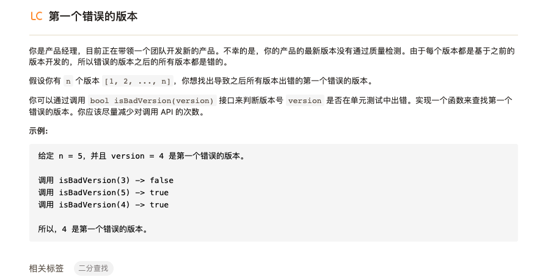

# 搜索算法

本文主要介绍常用的搜索算法及相关的算法题：

- [ ] 二分搜索
- [ ] 枚举算法
- [ ] 深度优先
- [ ] 广度优先
- [ ] A*搜索
- [ ] 蒙特卡洛数搜索
- [ ] ...

## 一.常用的搜索算法

### 1.1二分搜索

二分搜索每一次都取搜索序列的中点进行检查，在每一次搜索之后都会将搜索空间减少一半，所以使用二分搜索的时间复杂度是 $O(logn)$。一种常见使用二分搜索的例子是查询一个定义域内凹或者凸函数的最小或者最大值。


## 二.相关算法题

### 2.1 [第一个错误的版本](https://leetcode-cn.com/leetbook/read/top-interview-questions-easy/xnto1s/)



简单来说就是在一个版本迭代的序列中有一个错误版本导致之后所有版本都出错，需要找出第一个错误版本的位置。

这个题典型使用二分查找的方法，每一次都遍历序列中间版本的状态，根据其状态将序列区间减少一半，重复这个过程直到两个区间重合。

```python
def firstBadVersion(self, n):
    left = 1
    right = n
    while left<right:
        mid = (right - left) // 2
        if isBadVersion(mid) == True:
            right = mid
        else:
            left = mid+1
    return left
```


