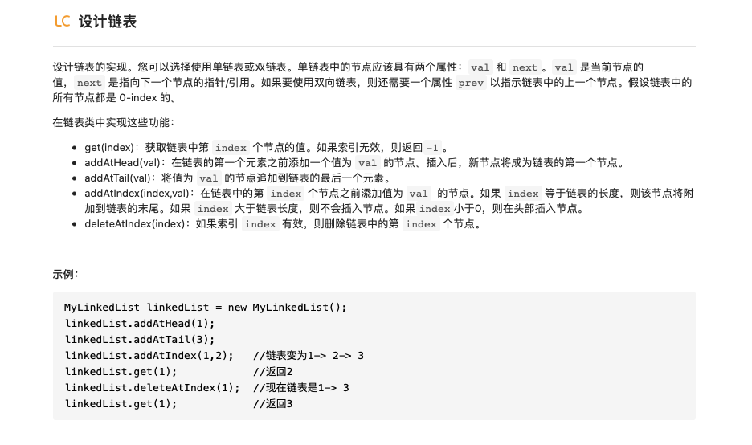

# 链表

链表这种数据结构中的每一个元素都有两个属性，分别是指向下一个节点的指针和当前节点的值（双向链表还有指向前一个节点的指针）。


与数组这一数据结构不同，链表不能通过索引直接访问，而只能从头开始找到需要访问的节点，所以其访问时间是 $O(N)$，而数组可以通过索引直接访问所以其访问时间是 $O(1)$；但是对于链表来说其插入和删除操作非常方便，在已经知道前一节点的情况下插入与删除操作的时间复杂度为 $O(1)$，相比之下，数组在执行插入和删除操作后后面所有元素的索引值都需要改变，所以时间复杂度为 $O(N)$

下面是插入操作的示意：


下面是删除操作的示意图：


## 0 设计一个链表

### 0-1 设计一个单向链表



```python
class ListNode:
    def __init__(self,x):
        self.val = x
        self.next = None

class MyLinkedList:

    def __init__(self):
        """
        Initialize your data structure here.
        """
        self.size = 0
        self.head = ListNode(0)


    def get(self, index: int) -> int:
        """
        Get the value of the index-th node in the linked list. If the index is invalid, return -1.
        """
        if index<0 or index>=self.size:
            return -1
        cur = self.head
        for _ in range(index+1):
            cur = cur.next
        return cur.val

    def addAtIndex(self, index: int, val: int) -> None:
        """
        Add a node of value val before the index-th node in the linked list. If index equals to the length of linked list, the node will be appended to the end of linked list. If index is greater than the length, the node will not be inserted.
        """
        if index < 0:
            index = 0
        if index > self.size:
            return
        pred = self.head
        for _ in range(index):
            pred = pred.next
        to_add = ListNode(val)
        to_add.next = pred.next
        pred.next = to_add
        self.size += 1

    def addAtHead(self, val: int) -> None:
        """
        Add a node of value val before the first element of the linked list. After the insertion, the new node will be the first node of the linked list.
        """
        self.addAtIndex(0,val)

    def addAtTail(self, val: int) -> None:
        """
        Append a node of value val to the last element of the linked list.
        """
        self.addAtIndex(self.size,val)

    def deleteAtIndex(self, index: int) -> None:
        """
        Delete the index-th node in the linked list, if the index is valid.
        """
        if index<0 or index>=self.size:
            return
        if index==self.size-1:
            pred_to_del = self.head
            for _ in range(index):
                pred_to_del = pred_to_del.next
            pred_to_del.next = None
        else:
            to_del = self.head
            for _ in range(index+1):
                to_del = to_del.next
            to_del.val = to_del.next.val
            to_del.next = to_del.next.next
        self.size -= 1
```

上面的设计中删除操作有一些麻烦，删除操作也可以这样写：

```python
    def deleteAtIndex(self,index):
        if index < 0 or index >= self.size:
            return
        pred = self.head
        for _ in range(index):
            pred = pred.next
        pred.next = pred.next.next
        self.size -= 1
```


##1 删除链表的倒数第N个节点

### 

- 假设已经定义了MyLinkedList类

在有了MyLinkedList定义的基础上这个题就变得非常简单，首先需要得到链表长度，然后通过其长度以及倒数的位数确定需要删除的节点索引进行删除即可。

```python
#解法1：如果传入的是自定义的mylistnode，可以直接调用其中size属性和deleteAtIndex方法
def removeNthFromEnd(self,head,n):
    index = head.size - n
    head.deleteAtIndex(index)
    return head
```

- 直接传入listnode的形式，没有那些定义好的方法可以调用

**方法1：**当然这个题默认没有MyLinkedList的定义，这个时候就需要首先手动计算出链表的长度，然后根据长度以及倒数位数索引，就是把上面的函数方法展开：

```python
#解法2：传入的是listnode的形式，需要获取其数量以及索引位置
def removeNthFromEnd(self,head,n):
    last = head
    num = 0
    while last:
        num += 1
        last = last.next
    temp = ListNode(0,next=head)
    index = num - n
    pred = temp
    for _ in range(index):
        pred = pred.next
    pred.next = pred.next.next
    return temp.next
```

**方法2：**使用双指针的思想，快指针比慢指针时钟快n个位置（n为倒数删除的位数），这个时候实际上慢指针指向的就是待删除节点的前驱节点，只要改变该前驱节点的指向就能实现对下一个节点的删除操作。

```python
#解法3：双指针
    def removeNthFromEnd(self,head,n):

        temp = ListNode(0,head)
        fast,slow = temp,temp
        num = 0
        while num != n and fast.next:
            fast = fast.next
            num += 1#解法4：栈，先依次进栈，然后再出栈
    def removeNthFromEnd(self,head,n):
        temp = ListNode(0,head)
        stack = list()
        cur = temp
        while cur:
            stack.append(cur)
            cur = cur.next
        for i in range(n):
            stack.pop()
        prev = stack[-1]
        prev.next = prev.next.next
        return temp.next
        while fast.next:
            fast = fast.next
            slow = slow.next
        slow.next = slow.next.next
        return temp.next
```

**方法3：**栈的思想，首先将各个节点存储到列表中，然后再从后面删除n个元素，这个时候列表中最后一个节点就是待删除节点的前驱节点，修改它的指向就完成了删除操作。

```python
#解法4：栈，先依次进栈，然后再出栈
def removeNthFromEnd(self,head,n):
    temp = ListNode(0,head)
    stack = list()
    cur = temp
    while cur:
        stack.append(cur)
        cur = cur.next
    for i in range(n):
        stack.pop()
    prev = stack[-1]
    prev.next = prev.next.next
    return temp.next
```