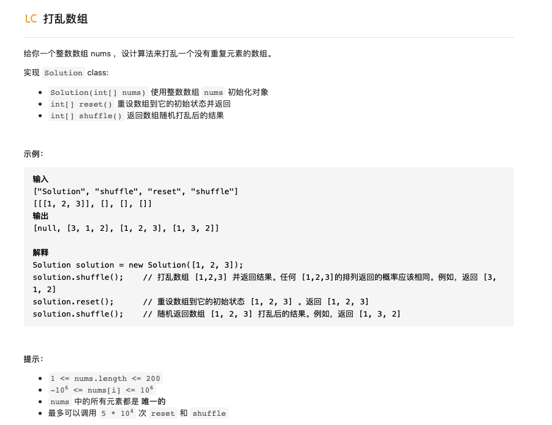

# 问题设计

这类问题通常要求你实现一个给定的类的接口，并可能涉及使用一种或多种数据结构。 这些问题对于提高数据结构是很好的练习。

## 1.打乱数组



题目意思很简单，就是将数组中的元素打乱后返回，其中`shuffle`方法用于打乱数组，`reset`方法 用于返回打乱前的数组。如果想要随机打乱数组，一个很简单的方法就是随机选取数组中的元素然后将其组成一个新的数组。

- 方法1：暴力求解

随机选取数组中的元素然后组成一个新的数组，这里随机选取序号时用到`random.randint()`方法，在每一次取出元素后都进行删除操作防止下次取出同样的值。

```python
class Solution:
    def __init__(self, nums):
        self.nums = nums
    def reset(self):
        """
        Resets the array to its original configuration and return it.
        """
        return self.nums
    def shuffle(self):
        """
        Returns a random shuffling of the array.
        """
        import random
        shuffle_nums = self.nums[:]
        sample_nums = self.nums[:]
        length = len(shuffle_nums)
        for i in range(length):
            random_idx = random.randint(0,length-1-i)
            sample_num = sample_nums[random_idx]
            del sample_nums[random_idx]
            shuffle_nums[i] = sample_num
        return shuffle_nums
```

**时间复杂度：**数组的删除操作的时间复杂度是$O(n)$，随着数组长度不断变化也重复了n次，所以总的时间复杂度是$O(n^2)$

**空间复杂度：**使用到两个额外的数组以及一个辅助索引，空间复杂度为$O(n)$

- 方法2：Fisher-Yates 洗牌算法

名字花里胡哨，其实思想很简单，不同于上面的从数组中进行采样然后组成一个新的数组，这种方法通过交换数组中的元素直接原地实现打乱数组的功能。具体方法是从头开始遍历，然后随机选取一个从当前元素到末尾元素之间的数与当前值进行交换。

```python
class Shuffle_Array:
    def __init__(self, nums):
        self.nums = nums
    def reset(self):
        """
        Resets the array to its original configuration and return it.
        """
        return self.nums
    def shuffle(self):
        """
        Returns a random shuffling of the array.
        """
        shuffle_nums = self.nums[:]
        for i in range(len(shuffle_nums)):
            idx = random.randrange(i,len(shuffle_nums))
            shuffle_nums[i],shuffle_nums[idx] = shuffle_nums[idx],shuffle_nums[i]
        return shuffle_nums
```

**时间复杂度：**只有一个循环为$O(n)$

**空间复杂度：**用到一个辅助存储数组`shuffle_nums`所以为$O(n)$

> python中可以直接调用`random.shuffle()`方法实现对于打乱数组


