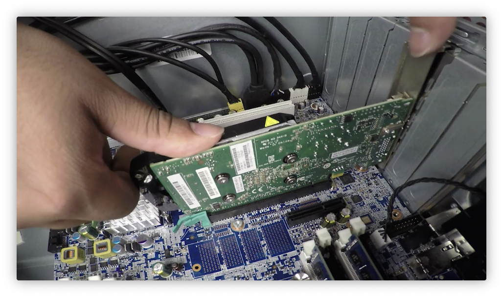

# 计算机硬件

计算机硬件主要包括CPU、内存、硬盘、GPU、电源模块等

在计算机处理进程的过程中，首先需要对数据进行读取，一般数据都会被存储在硬盘中，首先需要从硬盘中读取数据到内存中，内存中暂存数据， 然后CPU通过地址线(Address Bus)从内存中索引相关数据，内存通过数据总线传输数据到CPU中对数据进行运算，为了加快运算进程，在CPU中也会有缓存来存储一些必要数据，CPU缓存(cache)一般是三级L1、L2和L3，其中L1存储最小也是最快的缓存，L3存储最大但也是最慢的缓存，在缓存中读取数据要比在从内存中获取快得多。 

> cache
>
> 当CPU需要从内存中获取数据的时候，首先它会从cache中查看是否有相关数据，如果有的话就直接从cache中获取。CPU一般有三个独立的caches，一个用于存储常用的指令，一个用于存储常用的数据，一个用于加速虚拟和物理地址之间的转换。
>
> [虚拟内存与物理内存之间的关系](https://juejin.cn/post/6844903970981281800)

如何告知CPU何时进行运算的？通过时钟线来解决这个问题，时钟线通过电压高低来传输信号，没传输一个信号就代表一个时钟周期，一个CPU可以在1s中内处理的时钟周期数量称为时钟频率，当这个值越大的时候就代表CPU计算的速度越快。CPU是可以进行超频操作的，但是这种操作往往会导致发热增加、减少CPU的寿命。

## CPU

CPU是中央处理器(Centre Process Unit)的缩写，它主要用来处理各种计算，是计算机的核心所在，计算机运行的本质就是进行底层的01运算，这些运算都在CPU中进行。

- **指令集：**计算机中的所有运行程序都能转变为CPU中最简单的运算，这些运算构成的集合称为指令集，不同架构的CPU具有不同的指令集。
- **CPU物理结构：**选用CPU的时候需要要和主板相匹配，两种不同CPU结构，LGA(针脚在主板上)和PGA(针脚在CPU上)
- **散热：**由于CPU进行各种运算，所以其散热也很重要，一般CPU周围都会有散热设备。
- **CPU位数：**32位和64位的CPU的主要区别在于其能够一次性处理数据的位数以及寻址的宽度，64位的通用寄存器的位宽增加一倍可以一次性处理64bit的数据，同时其可以查询内存的地址宽度也增加一倍，所以当内存较大的时候需要选用64位CPU否则32位CPU无法查询到内存所有地址会导致存储空间的浪费。
- **操作系统位数：**对于32位和64位操作系统而言，一般来说，当实际内存只有4G的时候安装32位操作系统和64位操作系统区别不大，当内存大于4G的时候安装64位操作系统会更好发挥内存的性能，当然实际上32位CPU的地址总线也可能大于32位，64位CPU的寻址空间也可能不到64位，但一般来说64位CPU支持更大内存访问。
- **超线程技术：** 在超线程技术发明之前一个CPU只能执行一个线程的任务，所以如果想要提高CPU在同等时间执行的任务数量就必须增加CPU的核心数量，Intel提出的超线程技术允许一个核心同时执行两个线程的任务从而提升CPU的性能，现在用的CPU大都是具有超线程技术。
- **Cache：** 相比于RAM是DRAM，cache是SRAM，内部信息不会断电消失；cache中的数据和指令是从RAM中复制过来
- 

## RAM

RAM是随机存取存储器(Random Access Memory)的缩写，它用来存储短期数据，它存储数据的基础是电压的高低，当断电的时候由于电压消失其存储的信息也会消失。现在的RAM大多被安装在双列直插式存储模块DIMM(Dual Inline Memory Module)中，早期的RAM则多使用SIMM(single inline memory module)的结构，由于SIMM仅支持32位数据传输通道，而DIMM支持64位所以DIMM被广泛使用。(DIMM中64位数据线意味着其能在一个时钟频率内传输64位数据，而传统的SIMM只有32位数据传输。由于8个比特等于一个字节，所以64位数据传输也就是意味着8Byte宽的数据线)

- DRAM(Dynamic)。通过电容大小来存储信息，电容中电量的改变需要外部电源，所以其需要外接电源才能正常存取信息，当端点的时候信息也会消失。
- SDRAM(Sychronous) 与DRAM的主要区别是速度快，DRAM与系统时钟异步，而SDRAM与时钟频率同步。

计算SDRAM的传输速率

其中PC-100代表其工作频率为100MHz，由于为8byte线宽，所以传输速率为：
$$
\rm 100MHz \times 8 byte=800MB/s
$$

- DDR SDRAM DDR1-DDR2-DDR3-DDR4 存取数据速率增加，其能够在每个时钟信号传输两倍的数据，使用高低电平来传输数据。

其中333代表传输频率，而2700则是传输速率，通过下面的式子计算得到：
$$
\rm 333MHz \times 8 Byte=2700MB/s
$$

DDR2比DDR更快因为其允许使用更高的传输速度，其针脚数量240个大于DDR(184)，DDR3大约是DDR2速度的2倍，注意即便针脚数量相同其也不能混用因为防呆口的位置不同。DDR4有288个针脚，能够提供更高的传输速度。

CPU必须从RAM中读取数据，而RAM的数据从硬盘中读取

> Tips
>
> 一些重要的服务器不允许输出数据传输错误，所以会使用带有ECC(Error Correcting Code)的内存，这中内存比普通的内存条多一个芯片用于纠正方式传输过程中可能出现的错误。

## Motherboard

主板上可以安装各种功能接口：

- 芯片组(chipset)：主板上主要有两个芯片：北桥和南桥芯片。北桥芯片用来管理RAM和显卡，南桥芯片用来对输入输出设备进行管理，现在很多北桥被集成在CPU中去。芯片组用来管理CPU、RAM之间的通信。
- 扩展插槽中可以接入其他设备，现在扩展插槽的主要标准是PCIE(Peripheral Component Interconnect Express)。
- 主板也有很多标准，最常用的标准是ATX(Advance Technology eXtended)，他也有很多不同尺寸，还有标准为ITX(Information Technology eXtended)，他的尺寸很小。在组装电脑的时候根据实际需求选择不同大小的主板。

## Storge

- HDD通过机械装置读取和存储数据，由于其在工作的时候需要频繁移动磁头导致其容易受到损坏。HDD的价格较为便宜，同等价位的存储容量要比SDD大很多，但其速度也慢很多。SDD通过芯片存储数据并且速度要比HDD快得多。SDD读取速度快，但是同等容量下其价格较贵。现在很多计算机也使用混合存储方式，系统数据存储的SDD中，而一些不常用的数据文件存储在HDD中。

- 硬盘通过接口接入系统，常用的接口有ATA，其中最流行的是SATA(serial ATA)，其只有一根线用于数据传输。但是SATA能够实现的最大传输速率不高，于是就有了新的接口标准为NVMe(NVM Express)，NVMe不是通过数据线和主板相连，其通过扩展插槽与主板连接

## Power 

计算机运行时使用直流电DC，电源模块的主要作用就是将交流点(AC)转换为直流电(DC)。

Woltage代表供电瓦数，需要选择合适的瓦数的电源。

## 外设

### USB

USB 2.0 黑色 1.5Mbit/s--480Mbit/s

USB3.0 蓝色 5Gbit/s

USB3.1 蓝绿色 10Gbit/s

USB具有不同的接口类型：

Type-c connector现在使用最为广泛 

### 视频输出线

- VGA(Vedia Graphic Array)，VGA的接口现在使用不多，传输速度较低

- DVI 只能输出视频

单连接的DVI输出视频的最大分别率可以达到 $1920\times 1200$，双连接的DVI输出的最大分辨率可以达到 $2560\times 1600$

- HDMI 可以输出视频和音频，如今最为常用的视频输出线：

- DisplayPort 

  可以带动多个屏幕

- Thunderbolt

## BIOS

外设不能直接向CPU发送指令，而是通过BIOS(Basic Input Output Service)进行控制，BIOS存储在主板的一块ROM上，如今的系统使用UEFI(Unified Extensible Firmware Interface) ，作用和BIOS相同

在开机的时候之前会有哔哔的声音，这个过程是计算机在进行开机自检(POST)，开机自检的过程就是在运行BIOS中的程序，其用来检查计算机中的硬件设备，如果存在硬件设备加载失败就会通过哔哔声进行提示

## 装机

将CPU安装在插槽内，在上面涂上散热硅脂，然后安装散热风扇

安装散热风扇电源

安装内存条

安装SSD

安装电源，给主板、CPU和SATA供电

安装显卡

