# 操作系统

## Remote Connection 

### telnet

最早使用的远程连接协议，但是其以明文方式传输数据不能加密，因此如今使用不多

### SSH

远程连接协议，通过SSH(Secure Shell)可以实现电脑的远程连接，SSH在数据传输的过程中对数据进行加密

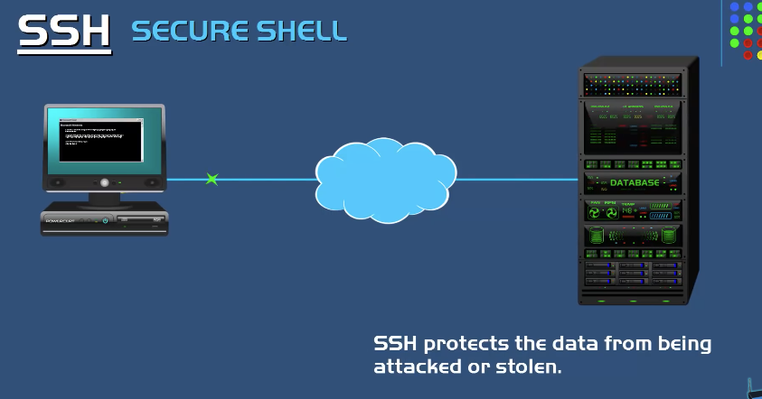

SSH是客户机，SSHD是服务器，服务器需要安装SSHD

#### 认证方式

- 通过密码验证  `ssh lianxing@192.168.22.31`
- 公钥/私钥对  
- Host Based 

生成秘钥 `>ssh-keygen`

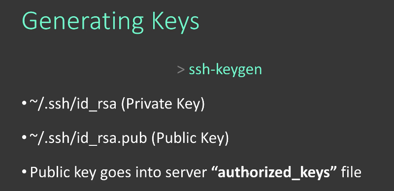 

### 使用SSH进行远程连接

- 使用密码验证的方式

首先需要确定带连接主机上的用户名，以mac os系统为例，在共享-远程登录中查看自己的用户名，我的用户名为 `lianxing` ，在后面还有当前电脑在局域网中的地址 `192.168.31.63`

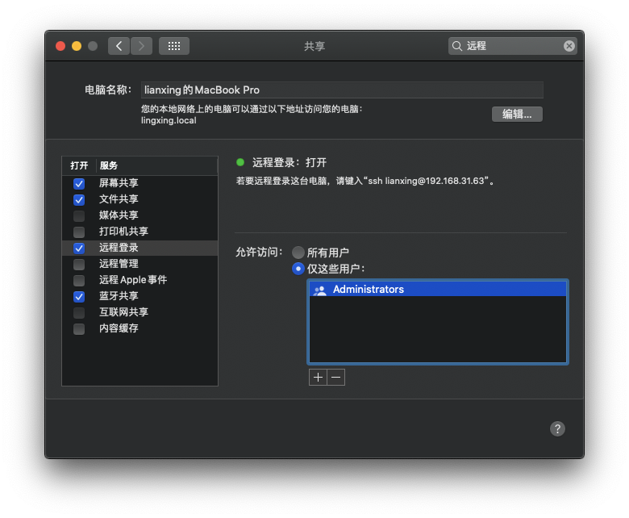

要想和主机进行SSH连接，首先确定客户机client和主机在用一个局域网之下，然后使用支持SSH的用户程序建立一个主机Host的连接，这里使用Termius：

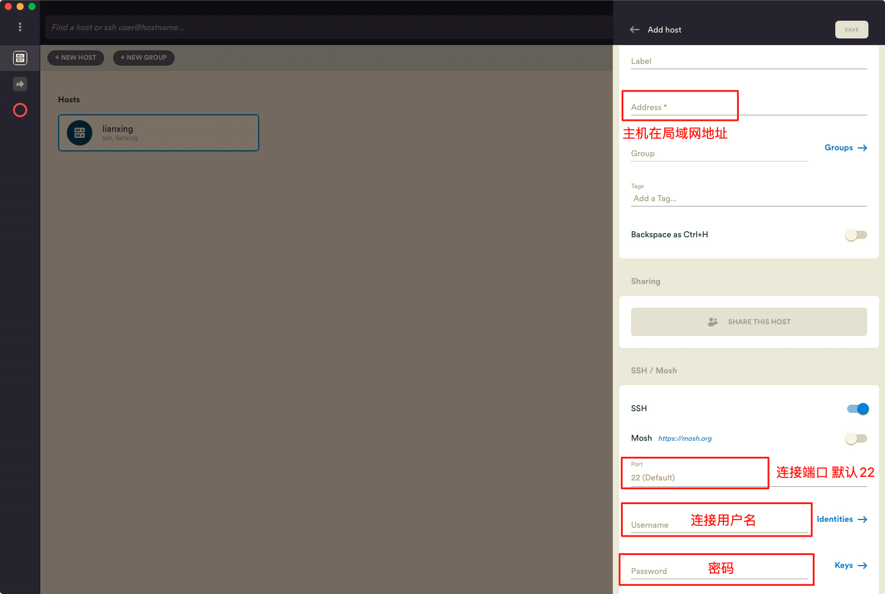这里密码是登录该用户名的，在完成这些操作后：

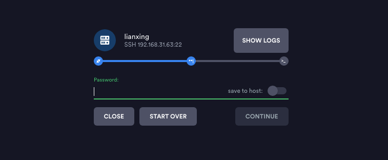

还需要输入一次密码，这里的密码是进入主机的开机密码，之后就能顺利建立连接

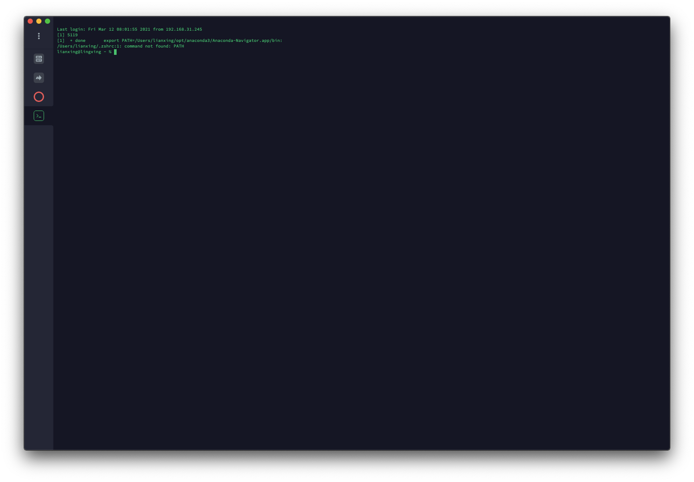

### Windows 上的远程连接

使用putty进行远程连接

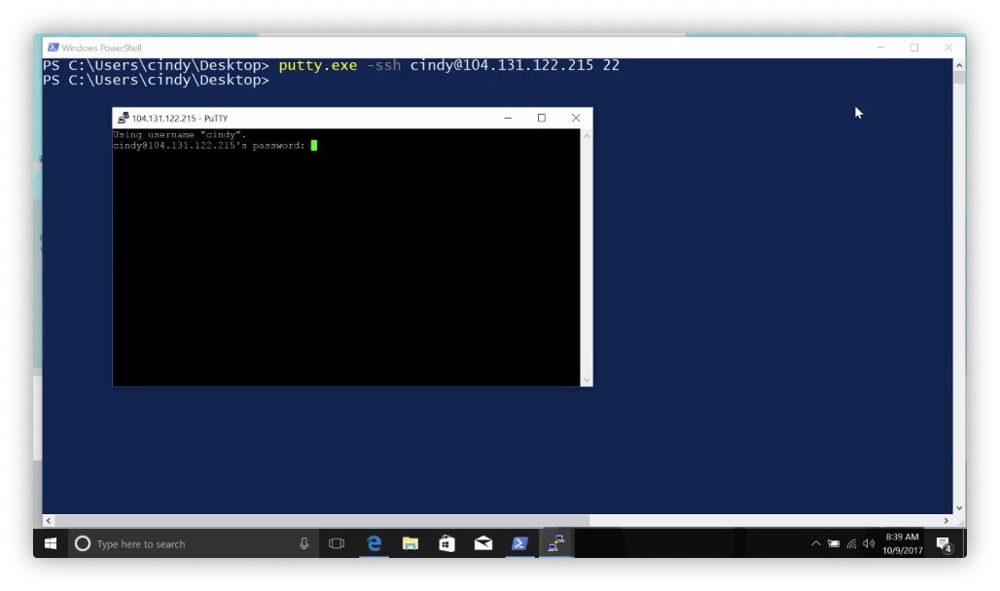

## 操作系统的组成

操作系统主要由两部分组成：

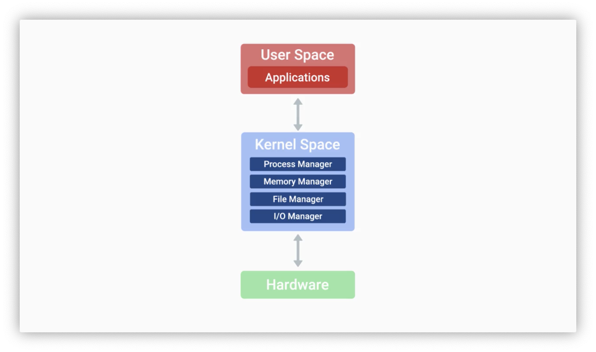

### File Managar

win常用的文件系统NTFS，macos默认使用APFS，linux不同的distribution使用不同文件系统

- FAT文件系统，依旧在初始化USB等外设的时候广泛使用。支持不同系统读写

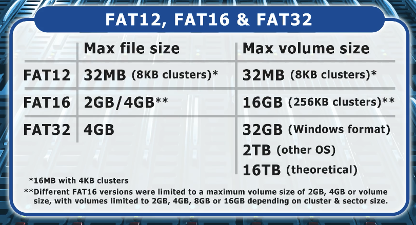

- NTFS(NEW TEC) 使用最为广泛，最大容量16EB，是一个日志式文件系统(可以有效防止崩溃)，支持文件的权限修改以及加密，windows系统必须被安装在NTFS的硬盘上，对于其他操作系统只读
- exFAT 适用于大容量USB和内存卡，文件最大16EB，SDXC卡的默认文件系统，其他系统也可以读写
- ext(extended file system) 主要用于linux系统，文件最大16TB容量1EB，win和macos系统不支持读写
- HFS(hierarchical file system) 专门为macos使用 HFS+ 最大到8EB，2017年APFS
- ZFS(zed) ，支持数据保护

文件的元数据提供关于文件的基本信息：

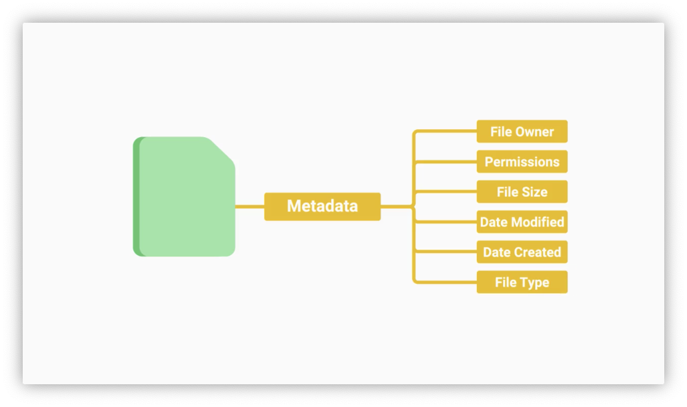

### 进程管理

对不同的进程分配资源

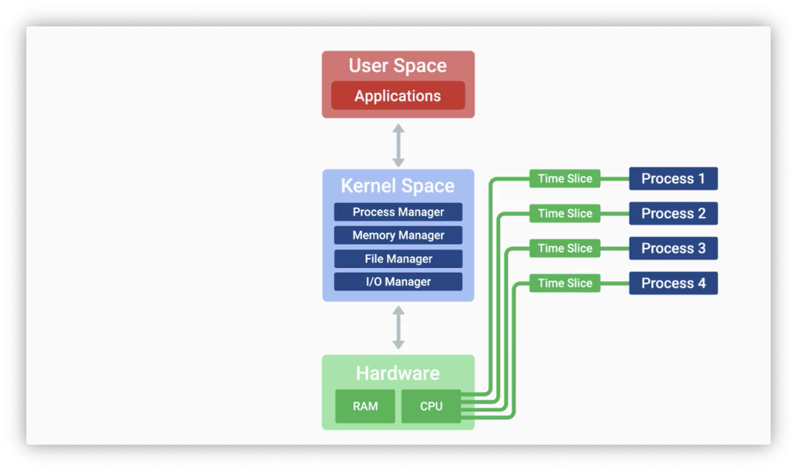

kernel创建进程，进程的运行需要CPU，同一个CPU为不同的进程分配时间

### 内存管理

进程运行的过程中需要分配内存，由于进程可能需要比实际内存多，需要分配虚拟内存，通过虚拟内存映射到实际内存

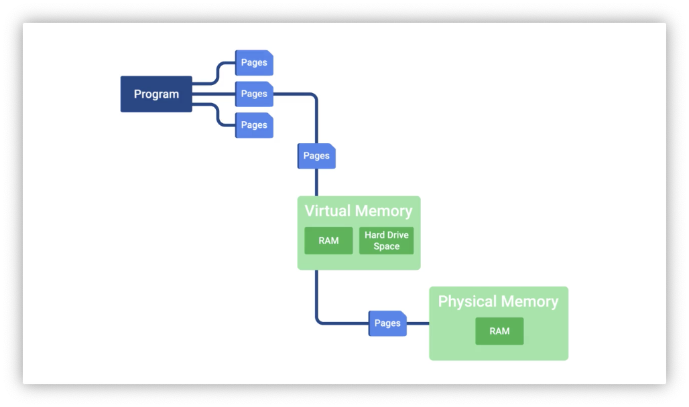

