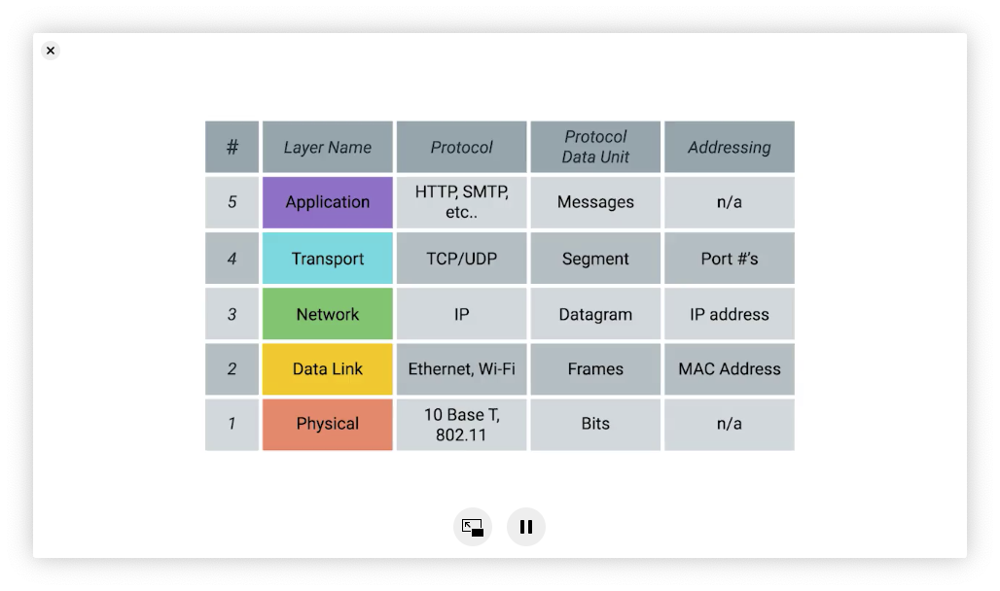
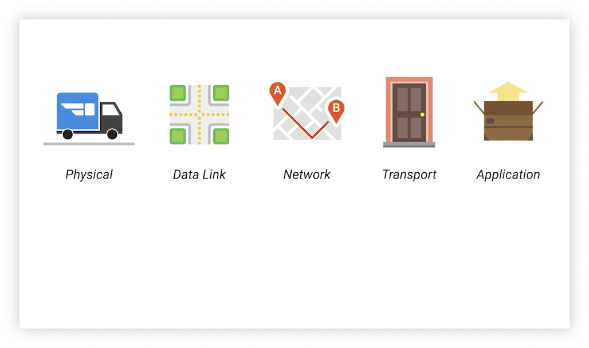

# 计算机网络

## 五层网络模型

- 物理层就是各种硬件设备，例如光纤、调制解调器、路由器等等；

- 数据链路层用来定义一些传输信号的规范使得数据能在互联网上进行传播；

- 网络层使得不同的网络之间能够通过路由器进行数据通信，使得数据能够从一个节点传输到另一个节点，最大的内网就是互联网；

- 传输层用来分配数据到不同的程序，也就是将数据分配到节点上运行的应用；应用层，这里的规则使得能你

- 应用层的协议使得你能够对接收到数据进行解读

将五层网路模型比喻成送快递，那么物理层完成的就是在对于货物传输的工具，也就是小货车，数据链路层告诉你数据如何传输，也就相当于道路，而网络层用来连接网络上不同的节点，相当于对目标位置进行定位，传输层负责对于数据的传输，这里就相当于货物到门，在拿到货物之后需要打开，这里就是应用层用来对数据进行解读。

