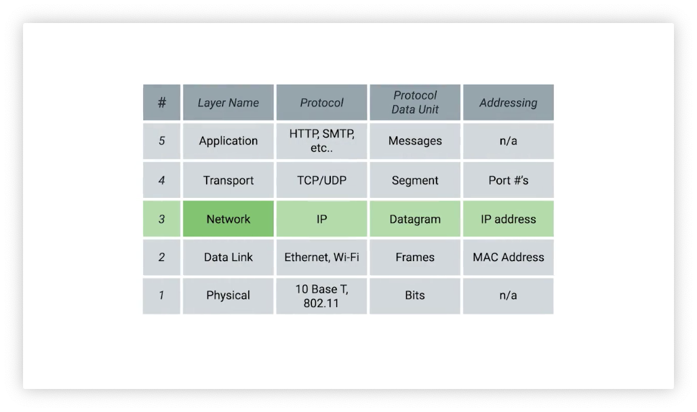
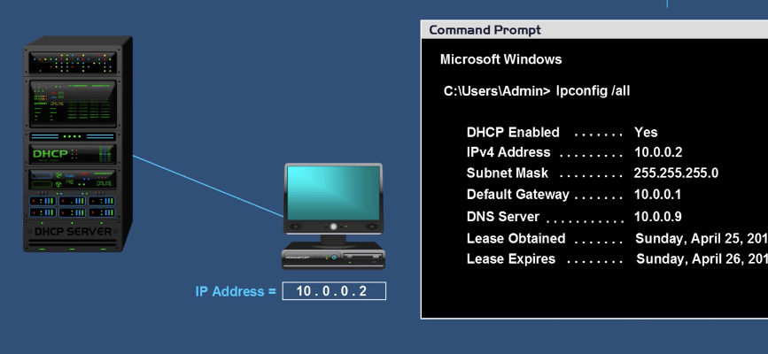
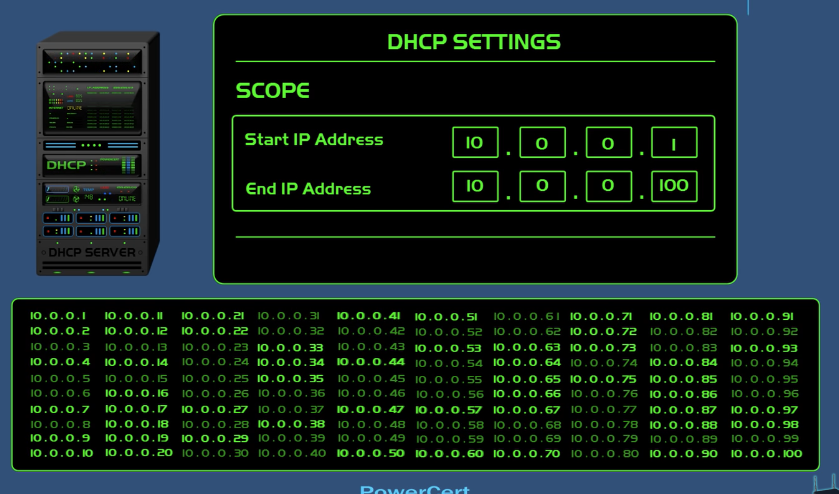
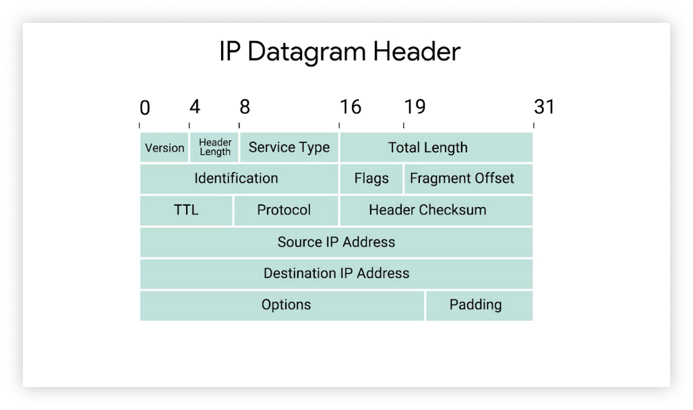
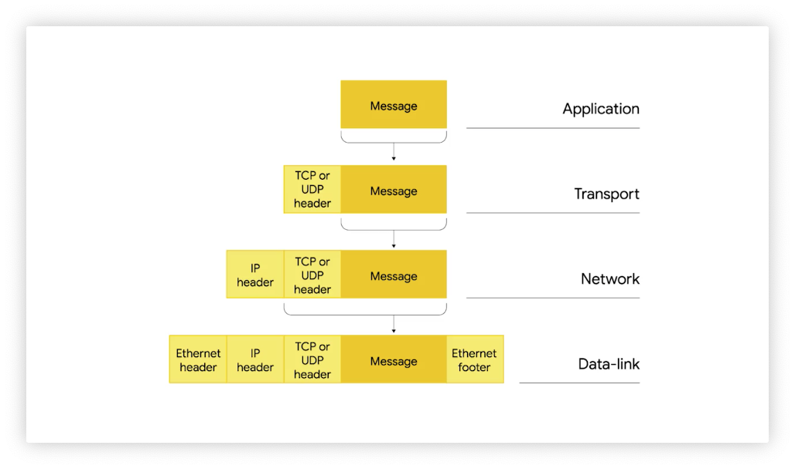
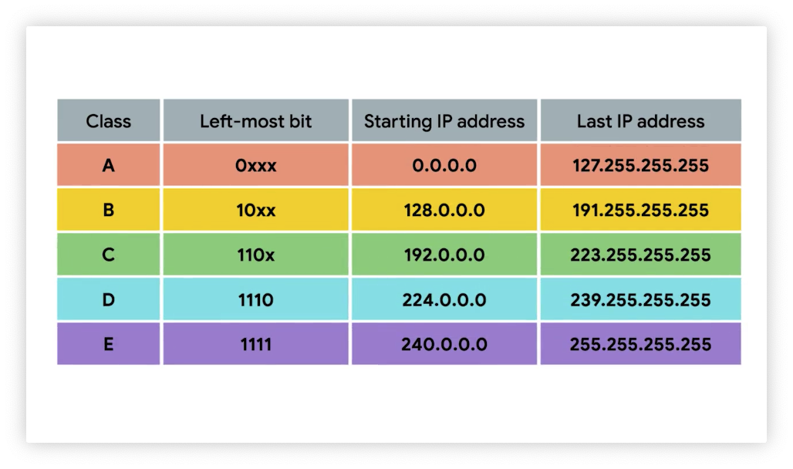

# 计算机网络

## 五层网络模型

- 物理层就是各种硬件设备，例如光纤、调制解调器、路由器等等；

- 数据链路层用来定义一些传输信号的规范使得数据能在互联网上进行传播；

- 网络层使得不同的网络之间能够通过路由器进行数据通信，使得数据能够从一个节点传输到另一个节点，最大的内网就是互联网；

- 传输层用来分配数据到不同的程序，也就是将数据分配到节点上运行的应用；应用层，这里的规则使得能你

- 应用层的协议使得你能够对接收到数据进行解读

将五层网路模型比喻成送快递，那么物理层完成的就是在对于货物传输的工具，也就是小货车，数据链路层告诉你数据如何传输，也就相当于道路，而网络层用来连接网络上不同的节点，相当于对目标位置进行定位，传输层负责对于数据的传输，这里就相当于货物到门，在拿到货物之后需要打开，这里就是应用层用来对数据进行解读。

<<<<<<< HEAD

在使用集线器的时候使用CSMA/CD技术避免通讯之间的冲突

为了使得数据能够在两台电脑之间传输，需要用MAC指定网络的唯一地址，MAC地址用十六进制表示，前面的6位用来表示唯一的用来表示组织的身份信息，后面是服务商指定的

## Unicast、Multicast、Broadcast

单播从一个设备向另一个设备传输信息，多播可以向多个设备传输信息，广播向网络内所有设备传输

一个以太网的帧数据构成如上，前面的8byte是前缀，SFD用来表示数据传输的开始，紧接着的就是目的MAC地址以及发送源的MAC地址，VLAN header是在使用VLAN技术的时候标记地址，Ether-type表示数据帧使用的传输协议，再往后就是payload就是传输的信息，这里的信息包括各个层的信息；最后FCS是校验码，使用循环冗余校验

=======
## 电缆 Cabels

现在最后最常用的是铜线和

CA5，6，5E 

光纤

光缆用光来传播信息，一般用于电磁干扰比较多的地方

## 网络层

对于LAN局部网络节点可以通过MAC地址进行通信，但是对于大型网络而言，由于MAC地址是唯一的而且并没有规范性，所以通过他来通讯会十分困难。于是人们开始使用网络层中IP地址进行通讯。

IP地址由32bit长的数字组成，一共有四个部分，每一个部分由8bit构成，IP地址是分配得到的并不是唯一的，一般用户通过DHCP（Dynamic Host Configuration Protocol）方式动态获取IP地址，服务器或者网络设备一般使用静态IP地址

> DHCP（Dynamic Host Configuration Protocol）/static IP
>
> 静态IP是用户自己设置的IP地址，每一次都需要手动设置IP地址、子网掩码、DNS等
>
> DHCP是动态主机配置协议的简称，在这种方式下IP地址/DNS/子网掩码等通过DHCP服务器进行自动分配
>
> 
>
> DHCP在分配地址的时候会有一个范围：
>
> 
>
> 在进行动态分配IP地址的过程实际是租赁地址的过程，在一定时间时候就会进行收回，这样做的目的是防止DHCP将IP地址分配完，在设备离线后当过了租借期限IP地址就被收回然后就可以被分配给其他设备。在租借的用户为了防止IP地址被收回隔一段时间就会向DHCP服务器发出续借。
>
> 如果想要某个特定设备具有固定的IP地址，可以在DHCP服务器上设置address reservation记录其MAC地址和对应IP地址，DHCP服务在路由器上都可以进行配置。

IP数据报header

- Version：用来指定使用IPv4还是IPv6
- Header Length：用来说明整个header的长度，一般是20字节也就是没有可选项以及padding部分
- Service Type：指明QoS技术，用于说明那一个IP包具有更高的优先级
- Total Length：指明整个IP报的长度
- Identification：用于对进行分片后的不同数据包进行身份验证，指明其属于同一个数据报
- Flags：说明数据是否被分片
- Fragment Offset：每一个分组在原数据中的位置
- TTL：time to live，数据经过TTL数量路由器次数传播后就会自动销毁，此举为了方式陷入死循环
- Protocol：指定使用TCP还是UDP传输协议
- Header Checksum：用来进行校验
- Source IP Address：源IP地址
- Destination IP Address：目的IP地址
- Options：一般用来传送用于测试的信息
- Padding：用于进行补全

IP地址的分类

D类地址用来进行广播，E类地址用来进行测试

Address Resolution Protocol 地址解析协议

