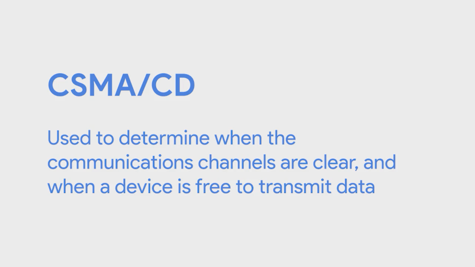
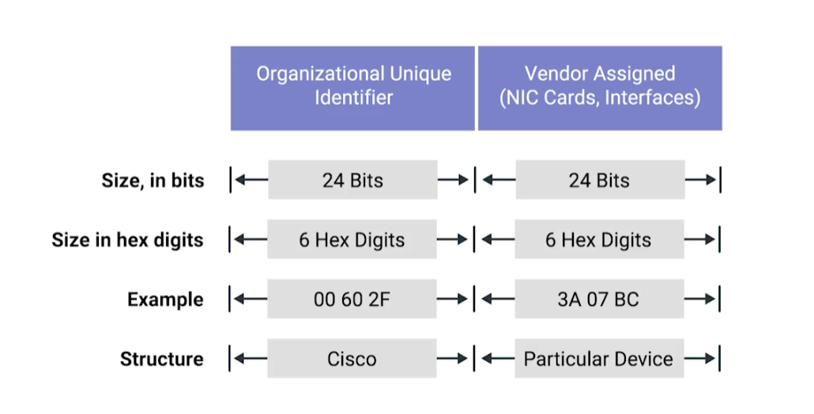
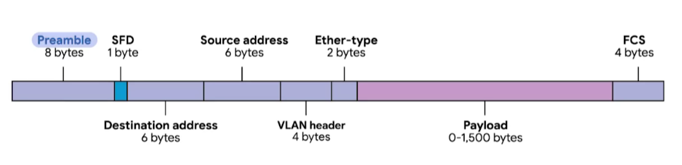
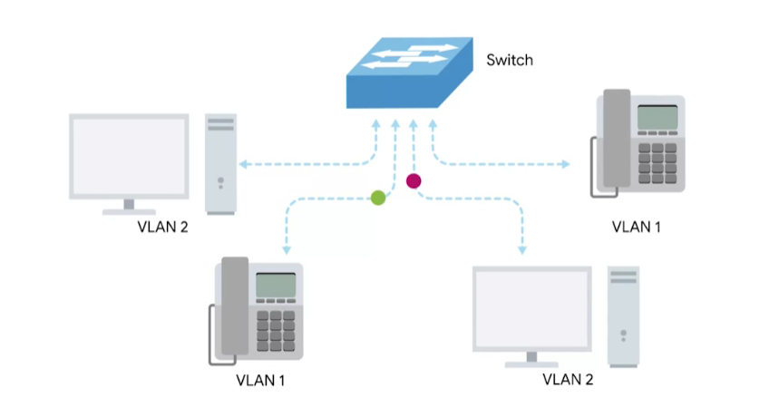
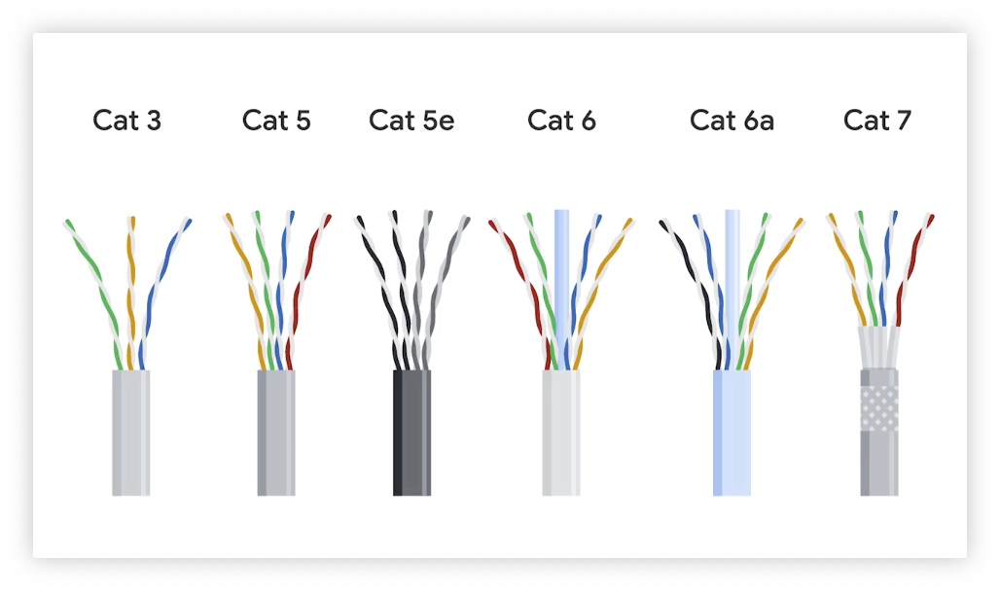
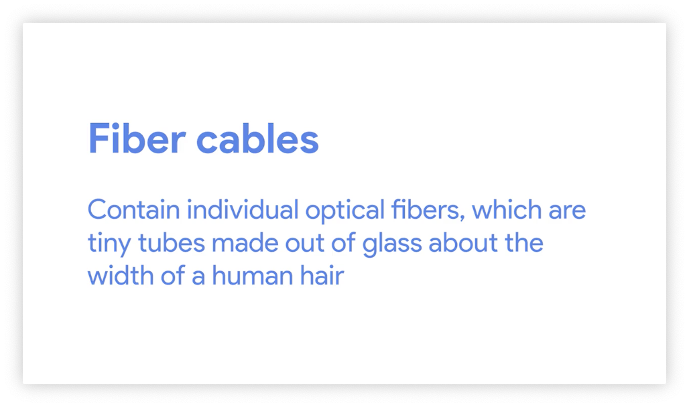
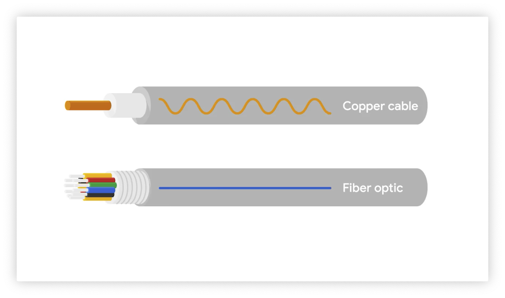

# 计算机网络

## 五层网络模型

- 物理层就是各种硬件设备，例如光纤、调制解调器、路由器等等；

- 数据链路层用来定义一些传输信号的规范使得数据能在互联网上进行传播；

- 网络层使得不同的网络之间能够通过路由器进行数据通信，使得数据能够从一个节点传输到另一个节点，最大的内网就是互联网；

- 传输层用来分配数据到不同的程序，也就是将数据分配到节点上运行的应用；应用层，这里的规则使得能你

- 应用层的协议使得你能够对接收到数据进行解读

将五层网路模型比喻成送快递，那么物理层完成的就是在对于货物传输的工具，也就是小货车，数据链路层告诉你数据如何传输，也就相当于道路，而网络层用来连接网络上不同的节点，相当于对目标位置进行定位，传输层负责对于数据的传输，这里就相当于货物到门，在拿到货物之后需要打开，这里就是应用层用来对数据进行解读。

<<<<<<< HEAD

在使用集线器的时候使用CSMA/CD技术避免通讯之间的冲突

为了使得数据能够在两台电脑之间传输，需要用MAC指定网络的唯一地址，MAC地址用十六进制表示，前面的6位用来表示唯一的用来表示组织的身份信息，后面是服务商指定的

## Unicast、Multicast、Broadcast

单播从一个设备向另一个设备传输信息，多播可以向多个设备传输信息，广播向网络内所有设备传输

一个以太网的帧数据构成如上，前面的8byte是前缀，SFD用来表示数据传输的开始，紧接着的就是目的MAC地址以及发送源的MAC地址，VLAN header是在使用VLAN技术的时候标记地址，Ether-type表示数据帧使用的传输协议，再往后就是payload就是传输的信息，这里的信息包括各个层的信息；最后FCS是校验码，使用循环冗余校验

=======
## 电缆 Cabels

现在最后最常用的是铜线和

CA5，6，5E 

光纤

光缆用光来传播信息，一般用于电磁干扰比较多的地方

>>>>>>> 69e90b80f8ad943f857263df5591fe40e5448d0d
