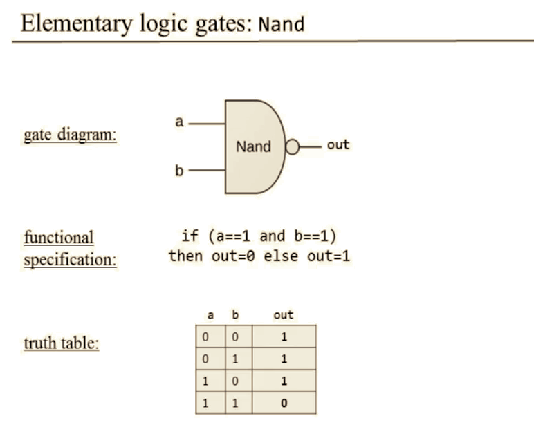
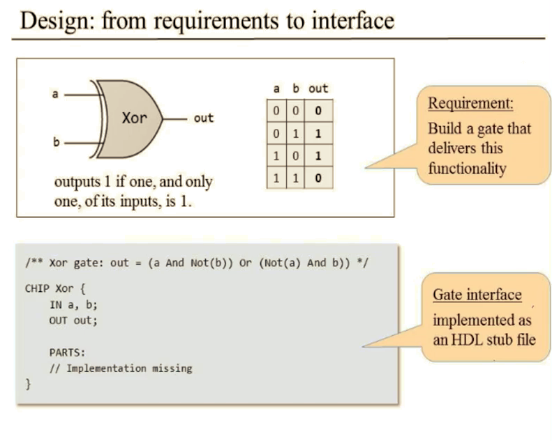
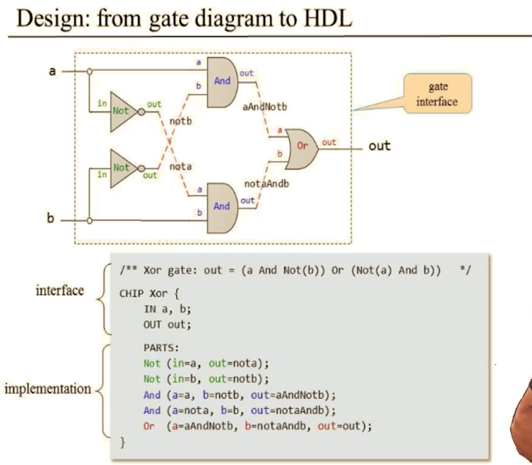

## 真值表与布尔运算

真值表可以和布尔运算互相转换

所有布尔函数都可以用“与或非"去表示，也可以只用“与”和“非”去表示，也可以只用“NAND(not a and b )”去表示

> 证明所有布尔函数都可以用NAND表示(可以表示“与”和“非”)：
>
> Not a = a NAND a  
>
> a and b = not(a NAND b)

## 硬件描述语言(Hardware Description Language)

使用HDL去构建芯片：

-  HDL is a functional/ declarative language
-  The order of HDL statements is insignificant 
-  Before using a chip part, you must know its interface. 

